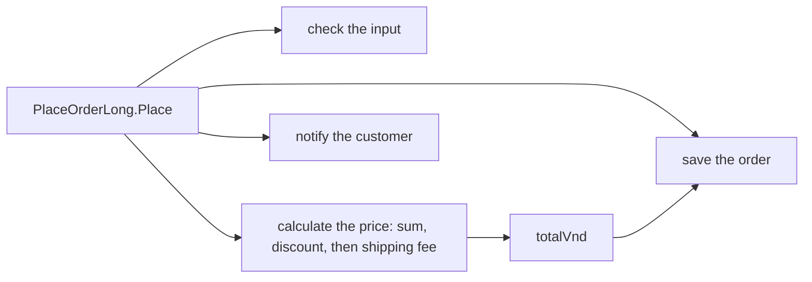

## Bạn cần biết trước

- [[foundation.l1.small-functions]] — bạn biết một hàm chỉ làm một việc thì đặt được cái tên trung thực, và `PlaceOrderLong.Place` làm tới mấy việc.
- [[foundation.l1.code-smells-basic]] — bạn biết một code smell chỉ ra một vấn đề thiết kế mà không gọi tên nó, và refactoring đổi cấu trúc mà không đổi hành vi.

## Tình huống

Cửa hàng muốn khách thân thiết được giảm 5% thay vì 10%. Bạn mở `PlaceOrderLong.Place`, tìm dòng trừ 10%, rồi đổi `10` thành `5`. Chỉ là một chỗ sửa nhỏ ở phần giảm giá, và không có gì khác trông như bị đụng tới. Một tuần sau, một khách thân thiết đặt hai món, mỗi món 1.100.000 VND, hỏi vì sao phí giao hàng của họ biến mất. Không ai đổi phí giao hàng, và cũng không ai quyết định nó phải đổi. Làm sao một thay đổi ở giảm giá lại kéo theo thay đổi phí?

## Khái niệm cốt lõi

- lý do để thay đổi — một quy tắc mà phía kinh doanh có thể yêu cầu bạn đổi riêng lẻ, như cách kiểm tra đơn hàng, cách tính giá, cách lưu đơn hàng, hay cách báo cho khách.
- chi phí thay đổi — bạn phải đọc, sửa và kiểm tra lại bao nhiêu để làm một thay đổi như vậy cho an toàn; càng nhiều việc không liên quan nằm chung một chỗ với nó, chi phí càng cao.
- thiết kế — các lựa chọn về việc mỗi phần công việc nằm ở đâu và chạm tới được những gì, gộp lại quyết định các thay đổi sau này đắt tới mức nào.

## Cơ chế hoạt động



`PlaceOrderLong.Place` làm bốn việc trong một thân method: kiểm tra đầu vào, tính giá, lưu đơn hàng và báo cho khách. Mỗi việc là một lý do để thay đổi riêng — quy tắc kiểm tra, quy tắc tính giá, cách lưu và cách gửi thông báo đều có thể đổi độc lập với nhau. Không việc nào trong bốn việc có tên: chúng chỉ là những đoạn dòng nằm trong `Place`.

Vì chung một thân method, chúng cũng dùng chung biến của nó. Bản thân việc tính giá gồm ba quy tắc — cộng các dòng, trừ giảm giá, cộng phí giao hàng — và cả ba cùng dồn vào một biến `totalVnd`. Quy tắc phí đọc bất cứ thứ gì quy tắc giảm giá để lại ở đó: nó chỉ cộng 30.000 VND khi tổng dưới 2.000.000 VND. Trong tình huống trên, đơn hàng là 2.200.000 VND. Giảm 10% thì còn 1.980.000, dưới ngưỡng, nên phí được cộng; giảm 5% thì chỉ còn 2.090.000, nên phí biến mất. Và việc lưu cũng đọc `totalVnd`, nên mọi thay đổi về giá đều chạm tới thứ được lưu.

Phí nên theo tổng đã giảm hay tổng gốc? Đó là một quyết định kinh doanh, và code không hề nói ra. Lần sửa đã đổi câu trả lời mà không ai quyết định — không phải vì code sai, mà vì không có gì tách các quy tắc cùng đọc `totalVnd` ra khỏi nhau.

Thiết kế là về chuyện đó. Code chạy đúng như được viết cả trước lẫn sau lần sửa; vấn đề là bạn phải biết bao nhiêu mới sửa được nó an toàn. Nếu mỗi quy tắc nhận giá trị nó cần như một đầu vào có tên, một lần sửa giảm giá không thể vô tình chạm tới phí — các bài tiếp theo chỉ ra những cách để đi tới đó.

## Trong hệ thống Đơn Hàng

Nửa đầu của `Place` kiểm tra đầu vào và cộng các dòng:

```csharp file=samples/DonHang.Samples/Samples/Clean/PlaceOrderLong.cs tag=stage-0 lines=8-22
    public static string Place(int customerId, List<OrderLine> lines, bool customerIsLoyal)
    {
        if (customerId <= 0) return "the customer id is not valid";
        if (lines.Count == 0) return "an order needs at least one line";
        foreach (var line in lines)
        {
            if (line.Quantity <= 0) return "a line needs a quantity";
            if (line.UnitPriceVnd <= 0) return "a line needs a price";
        }

        var totalVnd = 0;
        foreach (var line in lines)
        {
            totalVnd += line.Quantity * line.UnitPriceVnd;
        }
```

Nửa sau trừ giảm giá, cộng phí giao hàng, rồi "lưu" và "báo" — ở đây bằng cách in ra một dòng cho mỗi việc:

```csharp file=samples/DonHang.Samples/Samples/Clean/PlaceOrderLong.cs tag=stage-0 lines=24-34
        if (customerIsLoyal)
        {
            totalVnd -= totalVnd * 10 / 100;
        }

        totalVnd += totalVnd >= 2_000_000 ? 0 : 30_000;

        Console.WriteLine($"saving order for customer {customerId}, total {totalVnd}");
        Console.WriteLine($"sending an email to customer {customerId}");

        return $"order placed, total {totalVnd}";
```

Dòng giảm giá sửa `totalVnd` tại chỗ, và ngay câu lệnh kế tiếp quyết định phí giao hàng từ chính `totalVnd` đó. Không có gì trong code nói rằng phí phải phụ thuộc vào tổng đã giảm thay vì tổng gốc — nó cứ thế phụ thuộc, chỉ vì vị trí các dòng. Dòng lưu cũng in `totalVnd`, nên một thay đổi về giá cũng chạm tới nó; dòng email chỉ dùng `customerId`, vậy mà nó vẫn nằm trong cùng thân method mà bạn phải đọc. Chính comment của file, ngay trên class, gọi tên vấn đề: "Four reasons to change one place, and no name for any of the four." (Bốn lý do để thay đổi một chỗ, và không cái nào trong bốn cái có tên.)

## Người mới hay nghĩ rằng…

- **"Code đã chạy và qua test thì không cần nghĩ thêm về thiết kế."** → Thực ra code chạy được vẫn có thể đắt khi thay đổi: `Place` chạy đúng như được viết cả trước lẫn sau lần sửa giảm giá, vậy mà thay đổi phí mà nó gây ra vẫn là một bất ngờ. Test kiểm tra code làm gì hôm nay; thiết kế quyết định bạn phải hiểu bao nhiêu để sửa nó ngày mai. Bạn sẽ nhận ra khi một chỗ sửa nhỏ, trông có vẻ đúng, làm đổi một kết quả mà không ai bảo bạn đụng tới.
- **"Thiết kế là để code trông đẹp, không phải để sau này dễ sửa."** → Thực ra mục đích của thiết kế là chi phí của lần thay đổi tới, không phải vẻ ngoài của code hiện tại. `Place` dễ đọc, vậy mà một lần sửa một con số trong phần tính giá lại chạm tới phí giao hàng. Bạn sẽ nhận ra khi phải lần theo cả một method mới chắc được một thay đổi một dòng là an toàn.

## Thử ngay (3 phút)

Lần tay qua `Place` cho một khách thân thiết với một dòng: số lượng `2`, đơn giá `1_100_000`.

1. Tính tổng được trả về theo code như đang viết, với `10` ở dòng giảm giá.
2. Tính lại với `10` đổi thành `5`.

Kết quả mong đợi: bước 1 ra `order placed, total 2010000` — 2.200.000, trừ 220.000, cộng phí 30.000. Bước 2 ra `order placed, total 2090000` — 2.200.000, trừ 110.000, và không có phí.

Dòng nào đã quyết định phí trong mỗi trường hợp, và bạn sẽ phải đọc những gì trước khi đổi giảm giá lần nữa?

<details><summary>Gợi ý đáp án</summary>

Dòng phí, `totalVnd += totalVnd >= 2_000_000 ? 0 : 30_000;`, quyết định cả hai lần, bằng cách đọc `totalVnd` đã được giảm. Trước khi đổi giảm giá lần nữa, bạn sẽ phải đọc mọi thứ phía sau nó trong `Place` có dùng `totalVnd` — dòng phí, dòng lưu và lệnh return — vì tất cả cùng đọc một biến đó. Việc phải đọc ấy chính là chi phí thay đổi mà bài này nói tới.

</details>

## Liên hệ

- [[foundation.l1.small-functions]] — vẫn là `PlaceOrderLong`, lần đầu được đọc vì độ dài, giờ được đọc vì những gì một thay đổi trong nó có thể chạm tới.
- [[foundation.l1.code-smells-basic]] — một smell chỉ ra một vấn đề thiết kế; bài này gọi tên vấn đề đó: nhiều lý do để thay đổi nằm ở một chỗ.
- [[design.l1.coupling-and-cohesion]] — bài tiếp theo, đặt tên cho cách các phần code phụ thuộc vào nhau.

## Tóm tắt 5 dòng

1. `PlaceOrderLong.Place` kiểm tra, tính giá, lưu và báo trong một method: bốn lý do để thay đổi, không cái nào có tên.
2. Chung một thân method nghĩa là chung biến, nên sửa một quy tắc có thể chạm tới các quy tắc khác cùng đọc biến đó.
3. Đổi giảm giá làm đổi phí giao hàng, vì phí được quyết định từ tổng đã giảm.
4. Code chạy được vẫn có thể đắt khi sửa; test mô tả hành vi hôm nay, thiết kế quyết định chi phí thay đổi ngày mai.
5. Thiết kế là tập các lựa chọn về việc mỗi phần công việc nằm ở đâu, và nó chiếm phần lớn chi phí của các thay đổi sau này.
