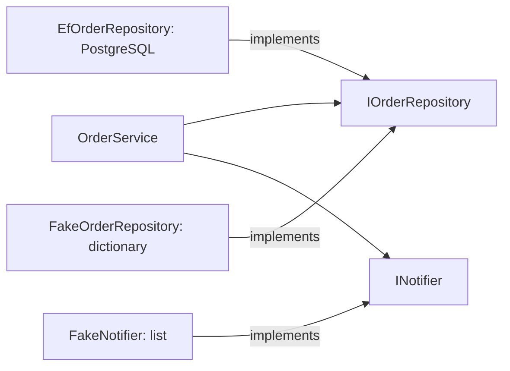

## Before you start

- [[design.l1.writing-a-unit-test]] — you can write a `[Fact]` with `Assert.Equal` and run it with `dotnet test`.
- [[design.l1.why-di-helps-testing]] — you know `OrderService` receives `IOrderRepository` and `INotifier` through its constructor, so a check can pass in simple stand-ins.

## The situation

The last module ended with a plan: to check `OrderService` without PostgreSQL, the database Đơn Hàng uses, pass it a repository that keeps orders in memory and a notifier that only records what it was asked to send. `DonHang.Tests` has exactly two such classes, `FakeOrderRepository` and `FakeNotifier`. They look nothing like the real implementations the API uses, `EfOrderRepository` and the log-writing `LoggingNotifier`. One of them even hands out order ids itself, a job the database does in the real system. What are these classes, what do they have to do, and what can they safely leave out?

## Core concepts

- **test double** — a stand-in object used in a test instead of a class's real dependency, handed to the class the same way dependency injection hands it the real one.
- **fake** — a test double with a real, simplified implementation of its own, such as a repository that stores orders in memory instead of in a database.
- in-memory — kept only in the program's own objects, such as a dictionary, and gone when the test ends.

## How it works



`OrderService` depends on two interfaces. In the running API, `EfOrderRepository` implements the first; in a test, `FakeOrderRepository` implements it instead, and `FakeNotifier` implements the second. A **test double** stands where a real dependency would. It implements the same interface, so the class under test needs no change to accept it. Think of a stunt double, who takes an actor's place for a scene the actor should not do. Here, the scene is a test, and what the real dependency should not do is reach a database or send a message.

There are several kinds of test double, and this course uses one, which it calls a **fake**; other sources, including the .NET docs, use that word more loosely. A fake in this sense really does its job, only in a simpler way. `FakeOrderRepository.AddAsync` really keeps the order, and `FindAsync` really finds it again, but in a dictionary rather than in PostgreSQL. `FakeNotifier`'s simpler way of sending is to write the call down. Because the fakes behave predictably, the class under test can run its normal steps against them.

A fake does not need everything the real class has. It needs just enough for the class under test to do its job: store what is added, return what is asked for, and behave predictably. It shares no code with the real class; the interface is the only thing they have in common.

## In the Đơn Hàng system

The repository fake, in `DonHang.Tests`:

```csharp file=DonHang.Tests/FakeOrderRepository.cs tag=stage-1 lines=8-29
public sealed class FakeOrderRepository : IOrderRepository
{
    private readonly Dictionary<int, Order> orders = [];
    private int nextId = 1;

    public Task<Order?> FindAsync(int id) =>
        Task.FromResult(orders.GetValueOrDefault(id));

    public Task<List<Order>> ListByCustomerAsync(int customerId) =>
        Task.FromResult(orders.Values.Where(o => o.CustomerId == customerId).OrderBy(o => o.Id).ToList());

    public Task AddAsync(Order order)
    {
        order.Id = nextId++;
        orders[order.Id] = order;
        return Task.CompletedTask;
    }

    public Task SaveChangesAsync() => Task.CompletedTask;

    public void Seed(Order order) => orders[order.Id] = order;
}
```

It implements all four methods of `IOrderRepository`, and the orders live in a `Dictionary<int, Order>` keyed by id. In the real system, PostgreSQL assigns an order's id when `SaveChangesAsync` inserts the row. The fake has no database, so `AddAsync` hands out the next id from its own counter. It has to: `OrderService` uses `order.Id` right after saving, to send the notification.

`SaveChangesAsync` does nothing, because there is nothing to write. `Task.FromResult` and `Task.CompletedTask` hand back tasks that are already finished, since nothing here waits on anything. `Seed` is not part of the interface; it lets a test put an order in place before acting, which a test of cancelling an order needs.

The notifier fake is even smaller:

```csharp file=DonHang.Tests/FakeNotifier.cs tag=stage-1 lines=6-11
public sealed class FakeNotifier : INotifier
{
    public List<(int OrderId, string Subject)> Sent { get; } = [];

    public void Send(int orderId, string subject) => Sent.Add((orderId, subject));
}
```

`Send` records each call in a public list, `Sent`. Nothing is logged or delivered; the test reads `Sent` afterwards to see what `OrderService` asked for.

## Beginners often think…

- **"A test double is a copy of the real class, with the same code, just renamed."** → Actually a test double shares only the interface with the real class. `EfOrderRepository` works through EF Core, Đơn Hàng's ORM, and its `DonHangDbContext`; `FakeOrderRepository` has neither, and its `FindAsync` is one dictionary lookup. You notice this when you compare the two files: they share the interface's method signatures and nothing about storage — one goes through `DonHangDbContext`, the other through a dictionary.
- **"Any class taking a constructor parameter can already be tested without a test double."** → Actually the constructor parameter only makes room for a double; something still has to fill it. Passed an `EfOrderRepository`, `OrderService` needs a running PostgreSQL, because that is the only database the repository is set up for. Faking one level lower does not help either: `EfOrderRepository(DonHangDbContext db)` asks for the concrete `DonHangDbContext`, the class that talks to the database, not an interface a fake could implement. You notice this when you try to build the class in a test and every argument you can pass drags in a database.

## Try it (3 minutes)

Open `PlaceOrderAsync` in `DonHang.Domain/OrderService.cs` next to `FakeOrderRepository` above, and answer:

1. Which methods of the repository does `PlaceOrderAsync` call?
2. Suppose `AddAsync` did not set `order.Id`. A test places two orders for the same customer, then calls `ListByCustomerAsync` for that customer. How many orders come back?

Expected result: 1 — `AddAsync`, then `SaveChangesAsync`. 2 — one: both orders keep id `0`, so the second is stored under the same dictionary key and replaces the first.

What does that tell you about which details a fake must copy from the real thing?

<details><summary>Suggested answer</summary>

A fake must copy whatever the class under test, or the test, relies on. Unique ids look like a database detail, but `OrderService` uses `order.Id` after saving, and the fake itself stores orders by id, so a fake without them gives wrong answers. Details nothing relies on, like the real database queries, can be left out.

</details>

## Connections

- [[design.l1.why-di-helps-testing]] — why `OrderService` can take a fake at all.
- [[design.l1.testing-with-a-fake-repository]] — the tests in `OrderServiceTests` that use these two fakes.

## Five-line summary

1. A test double stands in for a real dependency in a test, implementing the same interface.
2. A fake is a test double that really does its job, in a simpler way: `FakeOrderRepository` keeps orders in a dictionary.
3. The fake's `AddAsync` hands out ids itself, because there is no database to do it and `OrderService` uses `order.Id`.
4. `FakeNotifier` records each `Send` in a public `Sent` list for the test to read.
5. A fake shares only the interface with the real class and copies only the behaviour the test relies on.
