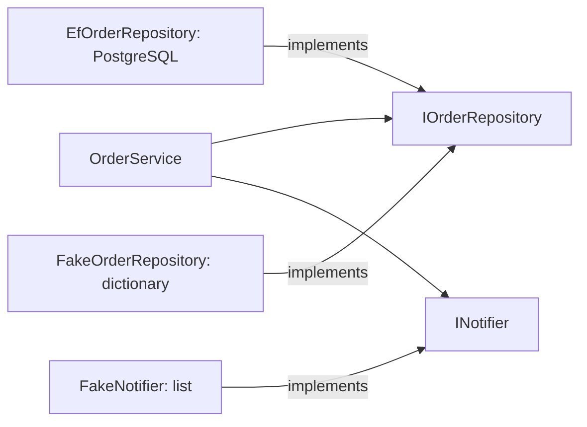

## Bạn cần biết trước

- [[design.l1.writing-a-unit-test]] — bạn viết được một `[Fact]` có `Assert.Equal` và chạy nó bằng `dotnet test`.
- [[design.l1.why-di-helps-testing]] — bạn biết `OrderService` nhận `IOrderRepository` và `INotifier` qua constructor, nên phép kiểm tra có thể truyền vào những bản thay thế đơn giản.

## Tình huống

Module trước kết thúc bằng một kế hoạch: để kiểm tra `OrderService` mà không cần PostgreSQL, database mà Đơn Hàng dùng, hãy truyền cho nó một repository giữ order trong bộ nhớ và một notifier chỉ ghi lại những gì nó được nhờ gửi. `DonHang.Tests` có đúng hai class như vậy, `FakeOrderRepository` và `FakeNotifier`. Chúng trông chẳng giống gì các cài đặt thật mà API dùng, `EfOrderRepository` và `LoggingNotifier` ghi log. Một trong hai còn tự cấp id cho order, việc mà trong hệ thống thật là do database làm. Những class này là gì, chúng phải làm gì, và chúng có thể yên tâm bỏ qua những gì?

## Khái niệm cốt lõi

- **test double** — một object thay thế được dùng trong test thay cho phụ thuộc thật của một class, được trao cho class theo đúng cách dependency injection trao bản thật.
- **fake** — một test double có cài đặt thật, đơn giản hóa, của riêng nó, như một repository lưu order trong bộ nhớ thay vì trong database.
- trong bộ nhớ (in-memory) — chỉ được giữ trong các object của chính chương trình, như một dictionary, và mất đi khi test kết thúc.

## Cơ chế hoạt động



`OrderService` phụ thuộc vào hai interface. Trong API đang chạy, `EfOrderRepository` cài đặt interface thứ nhất; trong test, `FakeOrderRepository` cài đặt nó thay vào đó, và `FakeNotifier` cài đặt interface thứ hai, ở chỗ API dùng `LoggingNotifier`. Một **test double** đứng vào chỗ của phụ thuộc thật. Nó cài đặt cùng interface, nên class đang được kiểm tra không cần thay đổi gì để nhận nó. Hãy nghĩ tới diễn viên đóng thế, người thay diễn viên chính trong cảnh mà diễn viên chính không nên đóng. Ở đây, cảnh đó là một test, và điều phụ thuộc thật không nên làm là chạm tới database hay tạo ra output mà test không đọc lại được.

Có nhiều loại test double, và khóa học này dùng một loại, gọi là **fake**; các nguồn khác, kể cả tài liệu .NET, dùng chữ này rộng hơn. Fake theo nghĩa này thật sự làm việc của nó, chỉ theo cách đơn giản hơn. `FakeOrderRepository.AddAsync` thật sự giữ order, và `FindAsync` thật sự tìm lại được nó, nhưng trong một dictionary chứ không phải trong PostgreSQL. Cách gửi đơn giản hơn của `FakeNotifier` là ghi lời gọi lại. Vì các fake hoạt động dễ đoán, class đang được kiểm tra có thể chạy các bước bình thường của nó với chúng.

Fake không cần mọi thứ mà class thật có. Nó chỉ cần vừa đủ để class đang được kiểm tra làm được việc: lưu thứ được thêm vào, trả thứ được hỏi, và hoạt động dễ đoán. Nó không dùng chung code nào với class thật; interface là thứ duy nhất chúng có chung.

## Trong hệ thống Đơn Hàng

Fake của repository, trong `DonHang.Tests`:

```csharp file=DonHang.Tests/FakeOrderRepository.cs tag=stage-1 lines=8-29
public sealed class FakeOrderRepository : IOrderRepository
{
    private readonly Dictionary<int, Order> orders = [];
    private int nextId = 1;

    public Task<Order?> FindAsync(int id) =>
        Task.FromResult(orders.GetValueOrDefault(id));

    public Task<List<Order>> ListByCustomerAsync(int customerId) =>
        Task.FromResult(orders.Values.Where(o => o.CustomerId == customerId).OrderBy(o => o.Id).ToList());

    public Task AddAsync(Order order)
    {
        order.Id = nextId++;
        orders[order.Id] = order;
        return Task.CompletedTask;
    }

    public Task SaveChangesAsync() => Task.CompletedTask;

    public void Seed(Order order) => orders[order.Id] = order;
}
```

Nó cài đặt đủ bốn method của `IOrderRepository`, và các order nằm trong một `Dictionary<int, Order>` dùng id làm khóa. Trong hệ thống thật, PostgreSQL cấp id cho order khi `SaveChangesAsync` insert dòng dữ liệu. Fake không có database, nên `AddAsync` cấp id tiếp theo từ bộ đếm của riêng nó. Nó buộc phải làm vậy: `OrderService` dùng `order.Id` ngay sau khi lưu, để gửi thông báo.

`SaveChangesAsync` không làm gì, vì không có gì để ghi. `Task.FromResult` và `Task.CompletedTask` trả về những task đã xong sẵn, vì ở đây không có gì phải chờ. `Seed` không thuộc interface; nó cho test đặt sẵn một order trước khi act, điều mà một test về hủy order cần tới.

Fake của notifier còn nhỏ hơn:

```csharp file=DonHang.Tests/FakeNotifier.cs tag=stage-1 lines=6-11
public sealed class FakeNotifier : INotifier
{
    public List<(int OrderId, string Subject)> Sent { get; } = [];

    public void Send(int orderId, string subject) => Sent.Add((orderId, subject));
}
```

`Send` ghi lại mỗi lời gọi vào một danh sách public, `Sent`. Không có gì được ghi log hay gửi đi; test đọc `Sent` sau đó để xem `OrderService` đã nhờ gửi gì.

## Người mới hay nghĩ rằng…

- **"Test double là bản sao của class thật, cùng code, chỉ đổi tên."** → Thực ra test double chỉ dùng chung interface với class thật. `EfOrderRepository` làm việc qua EF Core, ORM của Đơn Hàng, và `DonHangDbContext` của nó; `FakeOrderRepository` không có cả hai, và `FindAsync` của nó chỉ là một lần tra dictionary. Bạn sẽ nhận ra khi so hai file: chúng chung chữ ký method mà interface đòi hỏi và không chung gì về chuyện lưu trữ — một cái đi qua `DonHangDbContext`, cái kia qua một dictionary.
- **"Class nào nhận tham số constructor thì đã test được mà không cần test double."** → Thực ra tham số constructor chỉ tạo chỗ cho một double; vẫn phải có thứ lấp vào chỗ đó. Được truyền một `EfOrderRepository`, `OrderService` cần một PostgreSQL đang chạy, vì đó là database duy nhất repository được thiết lập để dùng. Fake ở tầng thấp hơn cũng không giúp gì: `EfOrderRepository(DonHangDbContext db)` xin class cụ thể `DonHangDbContext`, class làm việc với database, chứ không phải một interface để fake cài đặt. Bạn sẽ nhận ra khi thử dựng class trong test và mọi tham số bạn truyền được đều kéo theo một database.

## Thử ngay (3 phút)

Mở `PlaceOrderAsync` trong `DonHang.Domain/OrderService.cs` đặt cạnh `FakeOrderRepository` ở trên, rồi trả lời:

1. `PlaceOrderAsync` gọi những method nào của repository?
2. Giả sử `AddAsync` không gán `order.Id`. Một test đặt hai order cho cùng một khách, rồi gọi `ListByCustomerAsync` cho khách đó. Bao nhiêu order được trả về?

Kết quả mong đợi: 1 — `AddAsync`, rồi `SaveChangesAsync`. 2 — một: cả hai order giữ id `0`, nên order thứ hai được lưu dưới cùng khóa dictionary và thay thế order thứ nhất.

Điều đó cho bạn biết gì về những chi tiết mà fake phải sao chép từ bản thật?

<details><summary>Gợi ý đáp án</summary>

Fake phải sao chép bất cứ điều gì mà class đang được kiểm tra, hoặc test, dựa vào. Id duy nhất trông như một chi tiết của database, nhưng `OrderService` dùng `order.Id` sau khi lưu, và chính fake lưu order theo id, nên fake thiếu id sẽ cho kết quả sai. Những chi tiết không ai dựa vào, như các truy vấn database thật, có thể bỏ qua.

</details>

## Liên hệ

- [[design.l1.why-di-helps-testing]] — vì sao `OrderService` nhận được fake ngay từ đầu.
- [[design.l1.testing-with-a-fake-repository]] — các test trong `OrderServiceTests` dùng hai fake này.

## Tóm tắt 5 dòng

1. Test double đứng thay một phụ thuộc thật trong test, cài đặt cùng interface.
2. Fake là test double thật sự làm việc của nó, theo cách đơn giản hơn: `FakeOrderRepository` giữ order trong một dictionary.
3. `AddAsync` của fake tự cấp id, vì không có database làm việc đó và `OrderService` dùng `order.Id`.
4. `FakeNotifier` ghi mỗi lần `Send` vào danh sách public `Sent` để test đọc.
5. Fake chỉ dùng chung interface với class thật và chỉ sao chép hành vi mà test dựa vào.
