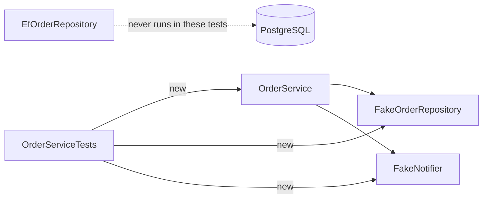

## Before you start

- [[design.l1.test-doubles]] — you know `FakeOrderRepository` keeps orders in a dictionary and `FakeNotifier` records each `Send`.
- [[design.l1.the-repository-layer]] — you know `OrderService` depends on `IOrderRepository`, and `EfOrderRepository` implements it with EF Core.

## The situation

`OrderServiceTests` has five tests for `OrderService`. `dotnet test` builds the projects and then runs all five in well under a second, with the lab switched off: no PostgreSQL, no database server, no database address to connect to. A teammate reads them and is unsure what to make of it. On one hand: "If these pass, the database side must work too, right?" On the other: "These use a fake repository, so they aren't testing anything real." Both reactions come from the same tests. Which, if either, is right, and what exactly do these tests prove?

## Core concepts

- class under test — the one class a unit test is about; here, `OrderService`.
- test project — a separate project that holds tests and references only the code they need; here, `DonHang.Tests`.
- what a test proves — only the behaviour of the code that actually ran during the test, against the inputs the test gave it.

## How it works



Each test builds `OrderService` itself with `new`, passing a `FakeOrderRepository` and a `FakeNotifier`. That works because `OrderService` asks for `IOrderRepository` and `INotifier`, not for `EfOrderRepository` or any EF Core class. The DI container is not involved: tests create exactly the objects they want.

So when a test calls `PlaceOrderAsync`, every line of that method runs for real: the empty-items check, building the `Order`, the calls to add and save, the notification. What runs underneath is the fake. Nothing opens a connection or sends SQL. The test project references only `DonHang.Domain`, which has no EF Core in it, and not `DonHang.Infrastructure`, so EF Core is not even part of the build. That is why the tests take milliseconds and can run on every change.

The same fact limits what the tests prove. They prove only what they assert, about `OrderService` and a repository that behaves as the interface promises: the status, the customer, the one notification, the refusals. No test here asserts that the order was actually added to the repository, so deleting the add and save calls from `PlaceOrderAsync` would leave all five green — a gap a test could close by reading the order back with `FindAsync`. They say nothing about whether `EfOrderRepository` really stores an order in PostgreSQL, because that code never ran. Checking that needs a different kind of test, one that runs against a real database.

## In the Đơn Hàng system

The first two tests in `OrderServiceTests`:

```csharp file=DonHang.Tests/Services/OrderServiceTests.cs tag=stage-1 lines=11-35
    [Fact]
    public async Task PlaceOrderAsync_ValidItems_SetsStatusNew()
    {
        var repository = new FakeOrderRepository();
        var notifier = new FakeNotifier();
        var service = new OrderService(repository, notifier);

        var order = await service.PlaceOrderAsync(customerId: 1, items: [OneItem]);

        Assert.Equal("new", order.Status);
        Assert.Equal(1, order.CustomerId);
    }

    [Fact]
    public async Task PlaceOrderAsync_ValidItems_SendsOneNotification()
    {
        var repository = new FakeOrderRepository();
        var notifier = new FakeNotifier();
        var service = new OrderService(repository, notifier);

        var order = await service.PlaceOrderAsync(customerId: 1, items: [OneItem]);

        var sent = Assert.Single(notifier.Sent);
        Assert.Equal(order.Id, sent.OrderId);
    }
```

`[Fact]` marks each method as a test that `dotnet test` runs through xUnit, and `Assert` holds xUnit's checks. Each test arranges with three `new`s, acts with one `await service.PlaceOrderAsync(...)`, and asserts. `OneItem` is a small helper at the top of the class that returns one `OrderItem`. The methods are `async Task`, because `PlaceOrderAsync` is awaited. The second test reads the fake notifier afterwards: `Assert.Single(notifier.Sent)` passes only if exactly one notification was recorded, and returns it so the test can compare its order id with the new order's.

The other three tests follow the same pattern. `PlaceOrderAsync_NoItems_Throws` expects an `ArgumentException` for an empty list. The two `CancelOrderAsync` tests first put an order in place with the fake's `Seed`, or leave it out on purpose, then check either the `"cancelled"` status or the `KeyNotFoundException` for an unknown id.

Why no database is possible at all is in the test project file:

```xml file=DonHang.Tests/DonHang.Tests.csproj tag=stage-1 lines=17-19
  <ItemGroup>
    <ProjectReference Include="..\DonHang.Domain\DonHang.Domain.csproj" />
  </ItemGroup>
```

`DonHang.Tests` references only `DonHang.Domain`. `EfOrderRepository` and `DonHangDbContext` live in `DonHang.Infrastructure`, which this project cannot even see.

## Beginners often think…

- **"A test using a fake repository proves the real, EF Core-backed repository works too."** → Actually a test proves only the code that ran, and `EfOrderRepository` never runs in `OrderServiceTests`. A forgotten save in it, or a wrong mapping in `DonHangDbContext` underneath it, would leave all five tests green. You notice this when the tests pass and placing an order through the API, the Đơn Hàng endpoints, still fails to store it.
- **"Since the fake repository isn't 'real', tests using it aren't really testing anything important."** → Actually the fake stands in for the repository only; `OrderService` is the real code, and its rules are what the tests check. `PlaceOrderAsync_NoItems_Throws` would catch anyone who removed the empty-items check, in milliseconds. You notice this when a change to `OrderService` breaks a rule and a test fails before the change ever reaches the API.

## Try it (3 minutes)

From the root of the example repository, with the lab stopped:

1. Run `dotnet test DonHang.Tests`.
2. In `DonHang.Infrastructure/EfOrderRepository.cs`, replace the `AddAsync` line with `public Task AddAsync(Order order) => Task.CompletedTask;`, so it no longer calls `db.Orders.AddAsync`. Run the tests again.
3. Undo that change. In `DonHang.Domain/OrderService.cs`, inside `PlaceOrderAsync`, delete the line that throws on an empty items list. Run the tests again, then undo.

Expected result: step 1 — five tests pass without any database. Step 2 — the same five still pass. Step 3 — `PlaceOrderAsync_NoItems_Throws` fails.

Step 2 broke order saving for the real API, yet no test noticed. Why, and what kind of test would?

<details><summary>Suggested answer</summary>

`OrderServiceTests` never runs `EfOrderRepository`; the test project does not even reference it, so the broken line is not part of what was tested. Only a test that runs `EfOrderRepository` against a real PostgreSQL would catch it — a different kind of test from these unit tests.

</details>

## Connections

- [[design.l1.test-doubles]] — the two fakes these tests pass in.
- [[design.l1.what-makes-a-good-unit-test]] — what keeps tests like these fast, focused and reliable.

## Five-line summary

1. `OrderServiceTests` builds `OrderService` with a `FakeOrderRepository` and a `FakeNotifier`, possible only because it depends on interfaces.
2. The code of `OrderService` runs for real; only the repository and notifier underneath are fakes.
3. `DonHang.Tests` references only `DonHang.Domain`, so the tests need no database and run in milliseconds.
4. These tests prove only what they assert about `OrderService`, not that `EfOrderRepository` stores data correctly.
5. Checking the real repository against PostgreSQL is a different kind of test.
