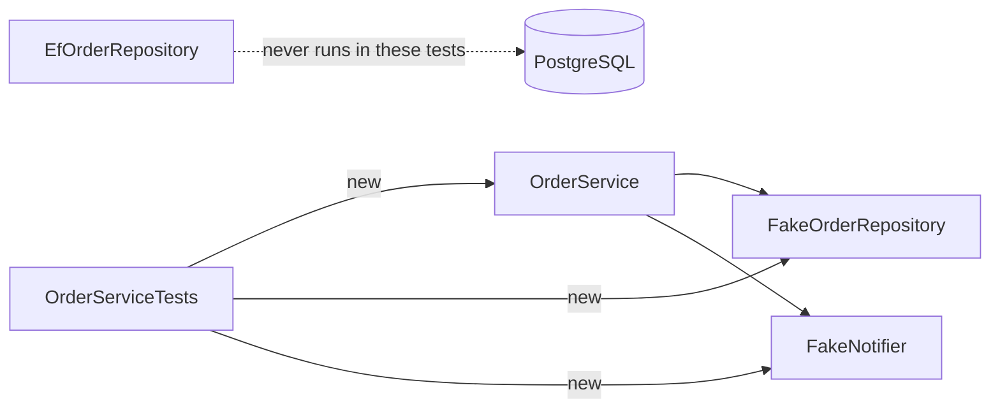

## Bạn cần biết trước

- [[design.l1.test-doubles]] — bạn biết `FakeOrderRepository` giữ order trong một dictionary và `FakeNotifier` ghi lại mỗi lần `Send`.
- [[design.l1.the-repository-layer]] — bạn biết `OrderService` phụ thuộc vào `IOrderRepository`, và `EfOrderRepository` cài đặt nó bằng EF Core.

## Tình huống

`OrderServiceTests` có năm test cho `OrderService`. `dotnet test` build các project rồi chạy cả năm test trong chưa tới một giây, khi lab đang tắt: không PostgreSQL, không database server, không địa chỉ database nào để kết nối. Một đồng nghiệp đọc chúng và không biết nên hiểu thế nào. Một mặt: "Nếu chúng pass thì phía database hẳn cũng chạy đúng, phải không?" Mặt khác: "Chúng dùng fake repository, nên chẳng kiểm tra được gì thật." Cả hai phản ứng đều đến từ cùng những test đó. Phản ứng nào đúng, nếu có, và chính xác thì các test này chứng minh được gì?

## Khái niệm cốt lõi

- class đang được kiểm tra (class under test) — class duy nhất mà một unit test nói tới; ở đây là `OrderService`.
- project test — một project riêng chứa các test và chỉ tham chiếu code mà chúng cần; ở đây là `DonHang.Tests`.
- điều một test chứng minh — chỉ hành vi của phần code thực sự đã chạy trong test, với những đầu vào mà test đưa cho nó.

## Cơ chế hoạt động



Mỗi test tự dựng `OrderService` bằng `new`, truyền vào một `FakeOrderRepository` và một `FakeNotifier`. Làm được vậy là vì `OrderService` xin `IOrderRepository` và `INotifier`, chứ không xin `EfOrderRepository` hay bất kỳ class EF Core nào. DI container không tham gia: test tạo đúng những object nó muốn.

Vì vậy khi một test gọi `PlaceOrderAsync`, method thật chạy: phép kiểm tra danh sách rỗng, việc dựng `Order`, các lời gọi thêm và lưu, thông báo. Thứ chạy bên dưới là fake. Không có gì mở kết nối hay gửi SQL. Project test chỉ tham chiếu `DonHang.Domain`, vốn không có EF Core bên trong, chứ không tham chiếu `DonHang.Infrastructure`, nên EF Core thậm chí không có mặt trong bản build. Đó là lý do các test chạy trong vài mili giây và có thể chạy sau mọi thay đổi.

Cũng chính điều đó giới hạn những gì test chứng minh được. Chúng chỉ chứng minh những gì chúng assert về `OrderService`, với một repository hoạt động đúng như interface hứa. Các assertion đó bao gồm trạng thái, khách hàng, một thông báo duy nhất, và các lần từ chối. Không test nào ở đây assert rằng order thực sự đã được thêm vào repository, nên xóa các lời gọi thêm và lưu khỏi `PlaceOrderAsync` vẫn để cả năm test xanh — kể cả test thông báo, vì id của order và id được ghi lại đều vẫn là `0`. Một test có thể lấp lỗ hổng đó bằng cách đọc lại order qua `FindAsync` của repository.

Và các test không nói gì về việc `EfOrderRepository` có thực sự lưu order vào PostgreSQL hay không, vì code đó chưa hề chạy. Muốn kiểm tra điều đó cần một loại test khác, loại chạy với database thật.

## Trong hệ thống Đơn Hàng

Hai test đầu tiên trong `OrderServiceTests`:

```csharp file=DonHang.Tests/Services/OrderServiceTests.cs tag=stage-1 lines=11-35
    [Fact]
    public async Task PlaceOrderAsync_ValidItems_SetsStatusNew()
    {
        var repository = new FakeOrderRepository();
        var notifier = new FakeNotifier();
        var service = new OrderService(repository, notifier);

        var order = await service.PlaceOrderAsync(customerId: 1, items: [OneItem]);

        Assert.Equal("new", order.Status);
        Assert.Equal(1, order.CustomerId);
    }

    [Fact]
    public async Task PlaceOrderAsync_ValidItems_SendsOneNotification()
    {
        var repository = new FakeOrderRepository();
        var notifier = new FakeNotifier();
        var service = new OrderService(repository, notifier);

        var order = await service.PlaceOrderAsync(customerId: 1, items: [OneItem]);

        var sent = Assert.Single(notifier.Sent);
        Assert.Equal(order.Id, sent.OrderId);
    }
```

`[Fact]` đánh dấu mỗi method là một test mà `dotnet test` chạy qua xUnit, thư viện test mà `DonHang.Tests` dùng, còn `Assert` chứa các phép kiểm tra của xUnit. Mỗi test arrange bằng ba lần `new`, act bằng một `await service.PlaceOrderAsync(...)`, rồi assert. `OneItem` là một helper nhỏ ở đầu class, trả về một `OrderItem`. Các method là `async Task`, vì `PlaceOrderAsync` được await. Test thứ hai đọc fake notifier sau đó: `Assert.Single(notifier.Sent)` chỉ pass nếu có đúng một thông báo được ghi lại, và trả thông báo đó về để test so id order của nó với id của order mới.

Ba test còn lại theo cùng khuôn. `PlaceOrderAsync_NoItems_Throws` mong nhận `ArgumentException` với danh sách rỗng. Hai test `CancelOrderAsync` trước tiên đặt sẵn một order bằng `Seed` của fake, hoặc cố tình không đặt, rồi kiểm tra hoặc trạng thái `"cancelled"`, hoặc `KeyNotFoundException` với một id không tồn tại.

Lý do không thể có database nào nằm ngay trong file project test:

```xml file=DonHang.Tests/DonHang.Tests.csproj tag=stage-1 lines=17-19
  <ItemGroup>
    <ProjectReference Include="..\DonHang.Domain\DonHang.Domain.csproj" />
  </ItemGroup>
```

`DonHang.Tests` chỉ tham chiếu `DonHang.Domain`. `EfOrderRepository` và `DonHangDbContext` nằm trong `DonHang.Infrastructure`, project mà project test này thậm chí không nhìn thấy.

## Người mới hay nghĩ rằng…

- **"Test dùng fake repository chứng minh luôn rằng repository thật, chạy bằng EF Core, cũng đúng."** → Thực ra test chỉ chứng minh được code đã chạy, mà `EfOrderRepository` không bao giờ chạy trong `OrderServiceTests`. Một lần quên lưu trong nó, hay một ánh xạ sai trong `DonHangDbContext` bên dưới nó, vẫn để cả năm test xanh. Bạn sẽ nhận ra khi các test pass mà đặt order qua API, tức các endpoint của Đơn Hàng, vẫn không lưu được.
- **"Vì fake repository không 'thật', các test dùng nó chẳng kiểm tra được gì quan trọng."** → Thực ra fake chỉ đứng thay repository; `OrderService` là code thật, và các quy tắc của nó là thứ test kiểm tra. `PlaceOrderAsync_NoItems_Throws` sẽ bắt được bất kỳ ai xóa phép kiểm tra danh sách rỗng, trong vài mili giây. Bạn sẽ nhận ra khi một thay đổi ở `OrderService` làm vỡ một quy tắc và có test lỗi trước khi thay đổi đó kịp tới API.

## Thử ngay (3 phút)

Từ thư mục gốc của repo ví dụ, khi lab — và do đó PostgreSQL — đang tắt:

1. Chạy `dotnet test DonHang.Tests`.
2. Trong `DonHang.Infrastructure/EfOrderRepository.cs`, thay dòng `AddAsync` bằng `public Task AddAsync(Order order) => Task.CompletedTask;`, để nó không còn gọi `db.Orders.AddAsync`. Chạy lại các test.
3. Hoàn tác thay đổi đó. Trong `DonHang.Domain/OrderService.cs`, bên trong `PlaceOrderAsync`, xóa dòng throw khi danh sách món rỗng. Chạy lại các test, rồi hoàn tác.

Kết quả mong đợi: bước 1 — năm test pass mà không cần database nào. Bước 2 — vẫn năm test đó pass. Bước 3 — `PlaceOrderAsync_NoItems_Throws` lỗi.

Bước 2 đã làm hỏng việc lưu order của API thật, vậy mà không test nào nhận ra. Vì sao, và loại test nào sẽ nhận ra?

<details><summary>Gợi ý đáp án</summary>

`OrderServiceTests` không bao giờ chạy `EfOrderRepository`; project test thậm chí không tham chiếu tới nó, nên dòng bị hỏng không nằm trong phần được kiểm tra. Chỉ một test chạy `EfOrderRepository` với PostgreSQL thật mới bắt được — một loại test khác với các unit test này.

</details>

## Liên hệ

- [[design.l1.test-doubles]] — hai fake mà các test này truyền vào.
- [[design.l1.what-makes-a-good-unit-test]] — điều giữ cho những test như thế này nhanh, tập trung và đáng tin.

## Tóm tắt 5 dòng

1. `OrderServiceTests` dựng `OrderService` với một `FakeOrderRepository` và một `FakeNotifier`, điều chỉ làm được vì nó phụ thuộc vào interface.
2. Code của `OrderService` chạy thật; chỉ repository và notifier bên dưới là fake.
3. `DonHang.Tests` chỉ tham chiếu `DonHang.Domain`, nên các test không cần database và chạy trong vài mili giây.
4. Các test này chỉ chứng minh những gì chúng assert về `OrderService`, không chứng minh `EfOrderRepository` lưu dữ liệu đúng.
5. Kiểm tra repository thật với PostgreSQL là một loại test khác.
