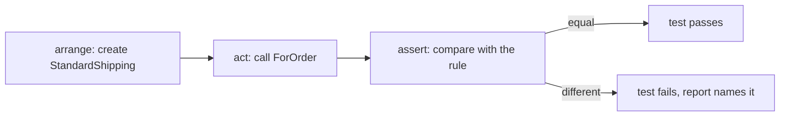

## Before you start

- [[design.l1.why-di-helps-testing]] — you know a class can be checked on its own, without starting the whole app.
- [[foundation.l1.code-smells-basic]] — you know a change meant to tidy code must not change what it does.
- [[management.l1.user-story-and-ac]] — you know acceptance criteria are checkable statements agreed before coding.

## The situation

The shop's rule says standard shipping costs 30,000 VND and is free for orders from 2,000,000 VND. A teammate is about to tidy `StandardShipping`, the sample class that computes that fee, and asks you to confirm afterwards that the rule still holds. You could read the new code and nod. You could open the app and place two orders, one just under and one at the limit. Or you could run one command and have the answer in seconds, today and after every future change. What does that third option look like, and what exactly does it check?

## Core concepts

- **unit test** — a small program that puts one piece of code into a specific state and automatically checks one claim about it, without a person reading the output.
- arrange, act, assert — the common pattern for the three steps of a unit test, in this order: set up the situation, do the one thing being tested, then check the result.
- assertion — the line that states the expected result; if the code gives anything else, the test fails and says so.

## How it works



A **unit test** turns a claim into code. The claim is something like "an order of 1,999,999 VND pays 30,000 for standard shipping". The test arranges what the claim is about, acts by calling the code — here `ForOrder`, the method that returns the fee for an order total — and asserts the claim by comparing the result with the value the rule demands. If the two are equal, the test passes; if not, it fails, and the report names the failing test and both values. Nobody has to look at the output and judge it: the comparison is the judgement.

That is also what separates it from checking by hand. Reading the code tells you what you think it does; the test runs it. Placing orders in the app runs it too, but only once, only when someone does it, and through everything else the app touches. A unit test runs only the piece it is about, usually finishes in milliseconds, and gives the same answer on every run as long as the code stays the same. So it can run after every change, including changes made months later by someone who never read the rule.

A unit test checks one small piece — one class or one method — in isolation. A check that goes through a database, files or the network may also be quick, but it is checking those too, and it can fail because of them. That is a different kind of test.

## In the Đơn Hàng system

The rule lives in one line of the samples:

```csharp file=samples/DonHang.Samples/Samples/Oop/ShippingFee.cs tag=stage-0 lines=10-13
public sealed class StandardShipping : ShippingFee
{
    public override int ForOrder(int totalVnd) => totalVnd >= 2_000_000 ? 0 : 30_000;
}
```

And the unit test that already checks it, in the `DonHang.Samples.Tests` project:

```csharp file=samples/DonHang.Samples.Tests/SamplesTests.cs tag=stage-0 lines=9-16
    [Fact]
    public void StandardShippingIsFreeFromTwoMillion()
    {
        ShippingFee fee = new StandardShipping();

        Assert.Equal(30_000, fee.ForOrder(1_999_999));
        Assert.Equal(0, fee.ForOrder(2_000_000));
    }
```

The first line of the body arranges: one `StandardShipping`. Each `Assert.Equal` line then acts and asserts at once: it calls `ForOrder` and compares the answer with the value the rule demands. The two totals sit on either side of the limit, 1 VND apart, so a mistake such as `>` in place of `>=` would fail the second line. `[Fact]` marks the method as a test; the next lesson covers it and `Assert.Equal` in detail. This method sits in a class called `ShippingFeeTests`, next to a second test, `EveryKindAnswersTheSameCall`, which calls `ForOrder(2_000_000)` on each shipping kind, `StandardShipping` included, and expects `0` from it.

Put the test next to the rule from the situation. "Standard shipping is free for orders from 2,000,000 VND" is the kind of statement an acceptance criterion already is: specific, checkable, agreed. The test is the same statement, checked by a program instead of a person.

## Beginners often think…

- **"A unit test is any test that runs quickly, no matter what it touches (a database, the file system, the network)."** → Actually a unit test checks one piece of code on its own; speed follows from that, not the other way round. A test that reads from the database may finish in under a second, but it now fails if the database is down or holds different rows. You notice the difference when a test fails and the bug turns out to be in the data, not in the code under test.
- **"Reading the code and confirming it looks right is basically the same as writing a unit test for it."** → Actually reading checks the code once, against your understanding, and leaves nothing behind. A unit test runs the code, against a stated expected value, every time anyone runs the tests. You notice the difference when a later change breaks the rule and nobody rereads that line, but the test fails.

## Try it (3 minutes)

Run these steps from the root of the example repository. `--filter ShippingFeeTests` tells `dotnet test` to run only the tests whose full name (which includes the class name) contains `ShippingFeeTests`, the class in `SamplesTests.cs` holding both shipping tests.

1. Run `dotnet test samples/DonHang.Samples.Tests --filter ShippingFeeTests`.
2. In `ShippingFee.cs`, change `2_000_000` to `2_500_000` in `StandardShipping`, and run the same command again.
3. Undo the change.

Expected result: step 1 reports two tests passed and none failed. Step 2 reports failures, and the report for `StandardShippingIsFreeFromTwoMillion` shows the expected value `0` and the actual value `30000`.

In step 2, how many tests fail, and why is it more than one?

<details><summary>Suggested answer</summary>

Two. `StandardShippingIsFreeFromTwoMillion` fails on its second assertion, and `EveryKindAnswersTheSameCall` also calls `ForOrder(2_000_000)` on a `StandardShipping` and expects `0`. Both tests make a claim that depends on the same rule.

</details>

## Connections

- [[design.l1.writing-a-unit-test]] — writing your own `[Fact]`, naming it, and using `Assert.Equal`.
- [[management.l1.user-story-and-ac]] — where checkable statements come from.

## Five-line summary

1. A unit test puts one piece of code into a known state and checks one claim about it automatically.
2. Its three steps are arrange, act and assert; in `StandardShippingIsFreeFromTwoMillion`, act and assert share each `Assert.Equal` line.
3. Unlike reading the code, a test runs it, against a stated value, every time the tests run.
4. A unit test touches only the piece it is about; a check through a database is a different kind of test.
5. A test's claim is like an acceptance criterion: a checkable statement, checked by a program instead of a person.
