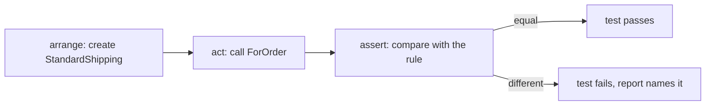

## Bạn cần biết trước

- [[design.l1.why-di-helps-testing]] — bạn biết một class có thể được kiểm tra riêng, không cần khởi động cả app.
- [[foundation.l1.code-smells-basic]] — bạn biết một thay đổi nhằm dọn code thì không được làm đổi những gì code đó làm.
- [[management.l1.user-story-and-ac]] — bạn biết acceptance criteria là những câu kiểm tra được, được thống nhất trước khi code.

## Tình huống

Quy tắc của cửa hàng: giao hàng tiêu chuẩn tốn 30.000 VND và miễn phí cho order từ 2.000.000 VND. Một đồng nghiệp sắp dọn lại `StandardShipping`, class mẫu tính khoản phí đó, và nhờ bạn xác nhận sau đó rằng quy tắc vẫn đúng. Bạn có thể đọc code mới rồi gật đầu. Bạn có thể mở app và đặt hai order, một order ngay dưới ngưỡng và một order đúng ngưỡng. Hoặc bạn có thể chạy một lệnh và có câu trả lời trong vài giây, hôm nay và sau mọi thay đổi về sau. Cách thứ ba đó trông thế nào, và chính xác thì nó kiểm tra điều gì?

## Khái niệm cốt lõi

- **unit test** — một chương trình nhỏ đặt một phần code vào một trạng thái cụ thể rồi tự động kiểm tra một khẳng định về nó, không cần người đọc output.
- arrange, act, assert — khuôn mẫu phổ biến cho ba bước của một unit test, theo đúng thứ tự: dựng tình huống, làm đúng một việc cần kiểm tra, rồi kiểm tra kết quả.
- assertion — dòng nêu kết quả mong đợi; nếu code cho ra thứ khác, test lỗi và báo ra.

## Cơ chế hoạt động



Một **unit test** biến một khẳng định thành code. Khẳng định là thứ như "order 1.999.999 VND phải trả 30.000 cho giao hàng tiêu chuẩn". Test arrange thứ mà khẳng định nói tới, act bằng cách gọi code — ở đây là `ForOrder`, method trả về phí cho một tổng tiền order — và assert khẳng định bằng cách so kết quả với giá trị mà quy tắc đòi hỏi. Nếu hai giá trị bằng nhau, test pass; nếu không, test lỗi, và báo cáo nêu tên test bị lỗi cùng cả hai giá trị. Không ai phải nhìn output rồi phán xét: phép so sánh chính là phán xét.

Đó cũng là điều phân biệt nó với kiểm tra bằng tay. Đọc code cho bạn biết bạn nghĩ nó làm gì; test thì chạy nó. Đặt order trong app cũng chạy code, nhưng chỉ một lần, chỉ khi có người làm, và qua mọi thứ khác mà app chạm tới. Unit test chỉ chạy đúng phần nó nói tới, thường xong trong vài mili giây, và cho cùng một câu trả lời ở mọi lần chạy chừng nào code còn giữ nguyên. Vì vậy nó có thể chạy sau mọi thay đổi, kể cả những thay đổi nhiều tháng sau bởi người chưa từng đọc quy tắc.

Unit test kiểm tra riêng một phần nhỏ — một class hay một method. Một phép kiểm tra đi qua database, file hay mạng có thể cũng nhanh, nhưng nó kiểm tra luôn cả những thứ đó, và có thể lỗi vì chúng. Đó là một loại test khác.

## Trong hệ thống Đơn Hàng

Quy tắc nằm trong một dòng của samples:

```csharp file=samples/DonHang.Samples/Samples/Oop/ShippingFee.cs tag=stage-0 lines=10-13
public sealed class StandardShipping : ShippingFee
{
    public override int ForOrder(int totalVnd) => totalVnd >= 2_000_000 ? 0 : 30_000;
}
```

Và unit test đã kiểm tra nó sẵn, trong project `DonHang.Samples.Tests`:

```csharp file=samples/DonHang.Samples.Tests/SamplesTests.cs tag=stage-0 lines=9-16
    [Fact]
    public void StandardShippingIsFreeFromTwoMillion()
    {
        ShippingFee fee = new StandardShipping();

        Assert.Equal(30_000, fee.ForOrder(1_999_999));
        Assert.Equal(0, fee.ForOrder(2_000_000));
    }
```

Dòng đầu tiên của thân method là arrange: một `StandardShipping`. Mỗi dòng `Assert.Equal` sau đó vừa act vừa assert: nó gọi `ForOrder` rồi so câu trả lời với giá trị mà quy tắc đòi hỏi. Hai tổng tiền nằm hai bên ngưỡng, cách nhau 1 VND, nên một lỗi như viết `>` thay cho `>=` sẽ làm dòng thứ hai lỗi. `[Fact]` đánh dấu method là một test; bài sau nói kỹ về nó và `Assert.Equal`. Method này nằm trong một class tên `ShippingFeeTests`, cạnh một test thứ hai, `EveryKindAnswersTheSameCall`, gọi `ForOrder(2_000_000)` trên từng loại giao hàng, trong đó có `StandardShipping`, và mong nhận `0` từ nó.

Đặt test cạnh quy tắc trong phần tình huống. "Giao hàng tiêu chuẩn miễn phí cho order từ 2.000.000 VND" chính là loại câu mà một acceptance criterion vốn là: cụ thể, kiểm tra được, đã thống nhất. Test là cùng câu đó, được một chương trình kiểm tra thay vì một người.

## Người mới hay nghĩ rằng…

- **"Unit test là bất kỳ test nào chạy nhanh, bất kể nó chạm tới gì (database, hệ thống file, mạng)."** → Thực ra unit test kiểm tra riêng một phần code; tốc độ là hệ quả của điều đó, không phải ngược lại. Một test đọc từ database có thể xong trong chưa tới một giây, nhưng giờ nó sẽ lỗi nếu database sập hoặc chứa những dòng khác. Bạn sẽ nhận ra khác biệt khi một test lỗi và bug hóa ra nằm ở dữ liệu, không nằm ở code đang được kiểm tra.
- **"Đọc code và xác nhận trông nó đúng về cơ bản cũng như viết unit test cho nó."** → Thực ra đọc là kiểm tra code một lần, dựa trên hiểu biết của bạn, và không để lại gì. Unit test chạy code, so với một giá trị mong đợi đã ghi rõ, mỗi lần có người chạy test. Bạn sẽ nhận ra khác biệt khi một thay đổi về sau làm hỏng quy tắc và không ai đọc lại dòng đó, nhưng test thì lỗi.

## Thử ngay (3 phút)

Chạy các bước sau từ thư mục gốc của repo ví dụ. `--filter ShippingFeeTests` bảo `dotnet test` chỉ chạy những test có tên đầy đủ (gồm cả tên class) chứa `ShippingFeeTests`, class trong `SamplesTests.cs` chứa cả hai test về phí giao hàng.

1. Chạy `dotnet test samples/DonHang.Samples.Tests --filter ShippingFeeTests`.
2. Trong `ShippingFee.cs`, đổi `2_000_000` thành `2_500_000` trong `StandardShipping`, rồi chạy lại cùng lệnh đó.
3. Hoàn tác thay đổi.

Kết quả mong đợi: bước 1 báo hai test pass và không test nào lỗi. Bước 2 báo có test lỗi, và báo cáo của `StandardShippingIsFreeFromTwoMillion` cho thấy giá trị mong đợi `0` và giá trị thực tế `30000`.

Ở bước 2, bao nhiêu test lỗi, và vì sao nhiều hơn một?

<details><summary>Gợi ý đáp án</summary>

Hai. `StandardShippingIsFreeFromTwoMillion` lỗi ở assertion thứ hai, và `EveryKindAnswersTheSameCall` cũng gọi `ForOrder(2_000_000)` trên một `StandardShipping` và mong nhận `0`. Cả hai test đều đưa ra khẳng định phụ thuộc vào cùng một quy tắc.

</details>

## Liên hệ

- [[design.l1.writing-a-unit-test]] — tự viết `[Fact]`, đặt tên cho nó, và dùng `Assert.Equal`.
- [[management.l1.user-story-and-ac]] — nơi những câu kiểm tra được bắt nguồn.

## Tóm tắt 5 dòng

1. Unit test đặt một phần code vào một trạng thái đã biết và tự động kiểm tra một khẳng định về nó.
2. Ba bước của nó là arrange, act và assert; trong `StandardShippingIsFreeFromTwoMillion`, act và assert dùng chung mỗi dòng `Assert.Equal`.
3. Khác với đọc code, test chạy code, so với một giá trị đã ghi rõ, mỗi lần chạy test.
4. Unit test chỉ chạm tới phần nó nói tới; phép kiểm tra đi qua database là một loại test khác.
5. Khẳng định của test giống một acceptance criterion: một câu kiểm tra được, do chương trình kiểm tra thay vì con người.
