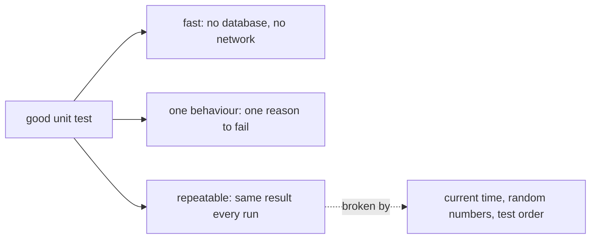

## Before you start

- [[design.l1.testing-with-a-fake-repository]] — you know `OrderServiceTests` builds `OrderService` with fakes, runs in milliseconds, and proves only what it asserts.

## The situation

A teammate wants to "save time" by merging the five tests in `OrderServiceTests` into one big test that places an order, checks the status, the customer, the notification and the placing time, then cancels it and checks again. They also want to assert that `PlacedAt` equals today's date. The merged test passes on their machine, all afternoon. Then, one night, it fails on a run where nobody changed any code, and the report names one test that checks eight things. What went wrong, and what should a good unit test look like instead?

## Core concepts

- **flaky test** — a test that sometimes passes and sometimes fails while the code stays the same, often because it depends on the time, a random number, or the order tests run in.
- one behaviour per test — each test checks one thing the code should do, so a failure points at one broken rule.
- repeatable — giving the same result every time it runs against unchanged code.

## How it works



A good unit test has three properties. It is fast, because it runs only the class under test with fakes underneath — no database, no network. It checks one behaviour, so its name says which rule broke. And it is repeatable: against the same code, it gives the same answer every time.

A test that breaks the third property is a **flaky test**. The usual causes are inputs the test does not control. The current time changes between runs, so a test that asserts "placed today" passes all day and fails for an order placed just before midnight UTC and checked just after. A random number changes on every run.

Shared state is the third cause. xUnit, the testing library that runs `OrderServiceTests`, does not promise to run tests in the order they are written. If the tests shared one repository — something the test code would have to set up on purpose — the id a test gets would depend on how many orders the tests before it had added, because the fake gives each new order the next id. The order xUnit picks for the tests in one class stays the same between identical runs, but running one test on its own changes which tests ran before it, so the same test can pass alone and fail in the full run. xUnit creates a new instance of the test class for every test, so values stored in each instance's fields are not shared, and each test in `OrderServiceTests` creates its own fakes.

A flaky test can do more harm than having no test at all. When it fails, nobody knows whether the code or the clock is at fault, so people rerun it until it passes and ignore it even when it catches a real bug.

## In the Đơn Hàng system

`PlaceOrderAsync` stamps each new order with the current time:

```csharp file=DonHang.Domain/OrderService.cs tag=stage-1 lines=12-18
        var order = new Order
        {
            CustomerId = customerId,
            PlacedAt = DateTimeOffset.UtcNow,
            Status = "new",
            Items = items,
        };
```

`Status` and `CustomerId` depend only on the inputs, so a test can assert them exactly, and `PlaceOrderAsync_ValidItems_SetsStatusNew` does: for an order placed for customer 1, it checks status `"new"` and customer `1`. `PlacedAt` depends on the clock, so no test in `OrderServiceTests` asserts its value. The tests are repeatable because they check only what the code decides, not what the clock says.

The cancel test shows the same care in the lines that set it up, before it calls `CancelOrderAsync`:

```csharp file=DonHang.Tests/Services/OrderServiceTests.cs tag=stage-1 lines=45-55
    [Fact]
    public async Task CancelOrderAsync_NewOrder_SetsStatusCancelled()
    {
        var repository = new FakeOrderRepository();
        repository.Seed(new Order { Id = 1, CustomerId = 1, PlacedAt = DateTimeOffset.UtcNow, Status = "new" });
        var service = new OrderService(repository, new FakeNotifier());

        var order = await service.CancelOrderAsync(1);

        Assert.Equal("cancelled", order.Status);
    }
```

`Seed`, the fake's method for putting an order in place, gets an order whose `PlacedAt` is the current time, which nothing checks. The test then asserts the one behaviour its name promises: a new order becomes `"cancelled"`. Each test in the class checks one behaviour, sometimes with more than one assertion about it, as `SetsStatusNew` does with status and customer. Placing and notifying are separate tests, so a notification sent twice, or with the wrong order id, fails `PlaceOrderAsync_ValidItems_SendsOneNotification` and leaves `PlaceOrderAsync_ValidItems_SetsStatusNew` passing. The two names together tell you which part broke.

## Beginners often think…

- **"More assertions in one test method means better coverage, so a test should check as much as possible at once."** → Actually, in xUnit a failing assertion normally ends the test, so one big test reports only the first problem and hides the rest, and its name cannot describe eight behaviours. Separate tests, one per behaviour, report every broken behaviour in one run, each under its own name. You notice this when a merged test fails and you have to read it line by line, fix one thing, rerun, and find the next.
- **"A flaky test is still useful, since it catches the bug most of the time."** → Actually a test that sometimes fails for no reason teaches everyone to ignore its failures, including the real ones. The fix is to remove what it does not control, such as asserting on the current time, or to delete the test. You notice this when "just rerun it" becomes the team's answer to a failing test.

## Try it (3 minutes)

A test places an order for customer 1 with `PlaceOrderAsync`. For each assertion it could make, say whether it keeps the test repeatable:

1. `Assert.Equal("new", order.Status)`
2. `Assert.Equal(DateTimeOffset.UtcNow.Date, order.PlacedAt.Date)`
3. `Assert.Equal(1, order.CustomerId)`

Expected result: 1 and 3 are repeatable: the code sets them from fixed values and inputs. 2 depends on the clock: the date can change between the moment `PlaceOrderAsync` stamps the order and the moment the assertion reads `UtcNow` again.

If the business really needed a rule about `PlacedAt`, how could a test check it without becoming flaky?

<details><summary>Suggested answer</summary>

Check something the code decides rather than what the clock says, for example that `PlacedAt` is not later than a time the test reads just after calling `PlaceOrderAsync`. Or give `OrderService` the current time as a dependency, so a test can pass in a fixed time — the same idea as the fakes, applied to the clock.

</details>

## Connections

- [[design.l1.testing-with-a-fake-repository]] — the tests this lesson judges.
- [[design.l1.unit-test-first-look]] — why a unit test is a checkable claim in the first place.

## Five-line summary

1. A good unit test is fast, checks one behaviour, and gives the same result every time against unchanged code.
2. A flaky test passes and fails without any code change, usually because of time, randomness or test order.
3. `OrderServiceTests` never asserts `PlacedAt`, which `PlaceOrderAsync` sets from the clock, and creates fresh fakes in every test.
4. One behaviour per test means one failure names one broken rule; a merged test hides every failure after its first.
5. A flaky test teaches people to ignore failures, so fix it or remove it rather than rerunning it.
