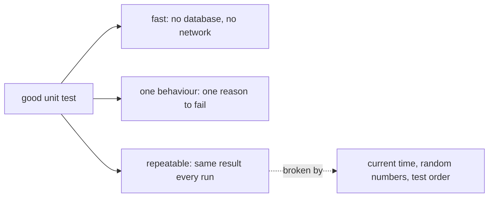

## Bạn cần biết trước

- [[design.l1.testing-with-a-fake-repository]] — bạn biết `OrderServiceTests` dựng `OrderService` với các fake, chạy trong vài mili giây, và chỉ chứng minh những gì nó assert.

## Tình huống

Một đồng nghiệp muốn "tiết kiệm thời gian" bằng cách gộp năm test trong `OrderServiceTests` thành một test lớn: đặt một order, kiểm tra trạng thái, khách hàng, thông báo và thời điểm đặt, rồi hủy nó và kiểm tra lại. Họ còn muốn assert rằng `PlacedAt` bằng ngày hôm nay. Test gộp pass trên máy họ, suốt cả buổi chiều. Rồi một đêm, nó lỗi ở một lần chạy mà không ai sửa dòng code nào, và báo cáo nêu tên một test kiểm tra tám thứ. Chuyện gì đã sai, và một unit test tốt nên trông như thế nào?

## Khái niệm cốt lõi

- **flaky test** — test lúc pass lúc lỗi dù code giữ nguyên, thường vì nó phụ thuộc vào thời gian, một số ngẫu nhiên, hay thứ tự chạy test.
- một hành vi cho mỗi test — mỗi test kiểm tra một điều code phải làm, để khi lỗi nó chỉ về đúng một quy tắc bị vỡ.
- lặp lại được (repeatable) — cho cùng một kết quả mỗi lần chạy với code không đổi.

## Cơ chế hoạt động



Một unit test tốt có ba tính chất. Nó nhanh, vì chỉ chạy class đang được kiểm tra với các fake bên dưới — không database, không mạng. Nó kiểm tra một hành vi, nên tên của nó nói quy tắc nào bị vỡ. Và nó lặp lại được: với cùng code, nó cho cùng một câu trả lời mọi lần.

Test vi phạm tính chất thứ ba là một **flaky test**. Nguyên nhân thường gặp là những đầu vào mà test không kiểm soát. Thời gian hiện tại thay đổi giữa các lần chạy, nên một test assert "đặt hôm nay" pass cả ngày và lỗi với order đặt ngay trước nửa đêm UTC rồi được kiểm tra ngay sau đó. Một số ngẫu nhiên thay đổi ở mỗi lần chạy.

Thứ tự test là nguyên nhân thứ ba, thông qua trạng thái dùng chung. xUnit, thư viện test chạy `OrderServiceTests`, không hứa chạy các test theo thứ tự chúng được viết. Nếu các test dùng chung một repository, được cố ý thiết lập như vậy, thì id mà một test nhận sẽ phụ thuộc vào số order mà các test chạy trước nó đã thêm, vì fake cấp cho mỗi order mới id tiếp theo. Thứ tự xUnit chọn cho các test trong một class giữ nguyên giữa những lần chạy giống hệt nhau, nhưng chạy riêng một test sẽ làm đổi những test đã chạy trước nó, nên cùng một test có thể pass khi chạy riêng và lỗi khi chạy cả bộ. xUnit tạo một instance mới của class test cho mỗi test, nên giá trị lưu trong field của mỗi instance không bị dùng chung; mỗi test ở đây cũng tự tạo các fake của mình.

Một flaky test có thể gây hại nhiều hơn cả việc không có test nào. Khi nó lỗi, không ai biết lỗi do code hay do đồng hồ, nên mọi người chạy lại tới khi nó pass và bỏ qua nó kể cả khi nó bắt được bug thật.

## Trong hệ thống Đơn Hàng

`PlaceOrderAsync` đóng dấu thời gian hiện tại lên mỗi order mới:

```csharp file=DonHang.Domain/OrderService.cs tag=stage-1 lines=12-18
        var order = new Order
        {
            CustomerId = customerId,
            PlacedAt = DateTimeOffset.UtcNow,
            Status = "new",
            Items = items,
        };
```

`Status` và `CustomerId` chỉ phụ thuộc vào đầu vào, nên test có thể assert chính xác chúng, và `PlaceOrderAsync_ValidItems_SetsStatusNew` làm vậy: với order đặt cho khách 1, nó kiểm tra trạng thái `"new"` và khách `1`. `PlacedAt` phụ thuộc đồng hồ, nên không test nào trong `OrderServiceTests` assert giá trị của nó. Các test lặp lại được vì chúng chỉ kiểm tra những gì code quyết định, không kiểm tra những gì đồng hồ nói.

Test hủy order cũng cẩn thận như vậy ở những dòng thiết lập, trước khi nó gọi `CancelOrderAsync`:

```csharp file=DonHang.Tests/Services/OrderServiceTests.cs tag=stage-1 lines=45-55
    [Fact]
    public async Task CancelOrderAsync_NewOrder_SetsStatusCancelled()
    {
        var repository = new FakeOrderRepository();
        repository.Seed(new Order { Id = 1, CustomerId = 1, PlacedAt = DateTimeOffset.UtcNow, Status = "new" });
        var service = new OrderService(repository, new FakeNotifier());

        var order = await service.CancelOrderAsync(1);

        Assert.Equal("cancelled", order.Status);
    }
```

`Seed`, method của fake để đặt sẵn một order, nhận một order có `PlacedAt` là thời gian hiện tại, thứ không ai kiểm tra. Rồi test assert đúng một hành vi mà tên nó hứa: một order mới trở thành `"cancelled"`. Mỗi test trong class kiểm tra một hành vi, đôi khi bằng hơn một assertion về hành vi đó, như `SetsStatusNew` làm với trạng thái và khách hàng. Đặt order và gửi thông báo là hai test riêng, nên một thông báo gửi hai lần, hay gửi với id order sai, làm `PlaceOrderAsync_ValidItems_SendsOneNotification` lỗi mà để `PlaceOrderAsync_ValidItems_SetsStatusNew` vẫn pass. Hai cái tên cùng nhau cho bạn biết phần nào bị hỏng.

## Người mới hay nghĩ rằng…

- **"Càng nhiều assertion trong một method test thì coverage càng tốt, nên một test nên kiểm tra càng nhiều thứ cùng lúc càng tốt."** → Thực ra, trong xUnit một assertion lỗi thường kết thúc test, nên một test lớn chỉ báo vấn đề đầu tiên và che mất phần còn lại, và tên của nó không thể mô tả tám hành vi. Các test riêng, mỗi test một hành vi, báo mọi hành vi bị hỏng trong một lần chạy, mỗi cái dưới tên riêng. Bạn sẽ nhận ra khi một test gộp lỗi và bạn phải đọc từng dòng, sửa một thứ, chạy lại, rồi gặp thứ tiếp theo.
- **"Flaky test vẫn có ích, vì phần lớn thời gian nó vẫn bắt được bug."** → Thực ra một test thỉnh thoảng lỗi không lý do sẽ dạy mọi người bỏ qua lỗi của nó, kể cả lỗi thật. Cách sửa là bỏ đi thứ nó không kiểm soát, như assert trên thời gian hiện tại, hoặc xóa test đó. Bạn sẽ nhận ra khi "chạy lại đi" trở thành câu trả lời của cả nhóm cho một test lỗi.

## Thử ngay (3 phút)

Một test đặt order cho khách 1 bằng `PlaceOrderAsync`. Với mỗi assertion nó có thể viết, cho biết nó có giữ test lặp lại được không:

1. `Assert.Equal("new", order.Status)`
2. `Assert.Equal(DateTimeOffset.UtcNow.Date, order.PlacedAt.Date)`
3. `Assert.Equal(1, order.CustomerId)`

Kết quả mong đợi: 1 và 3 lặp lại được: code gán chúng từ giá trị cố định và từ đầu vào. 2 phụ thuộc đồng hồ: ngày có thể đổi giữa lúc `PlaceOrderAsync` đóng dấu order và lúc assertion đọc lại `UtcNow`.

Nếu nghiệp vụ thật sự cần một quy tắc về `PlacedAt`, test có thể kiểm tra nó thế nào mà không thành flaky?

<details><summary>Gợi ý đáp án</summary>

Kiểm tra một quy tắc luôn đúng bất kể test chạy lúc nào, ví dụ `PlacedAt` không muộn hơn một thời điểm mà test đọc ngay sau khi gọi `PlaceOrderAsync`. Hoặc cho `OrderService` nhận thời gian hiện tại như một phụ thuộc, để test truyền vào một thời điểm cố định — cùng ý tưởng với các fake, áp dụng cho đồng hồ.

</details>

## Liên hệ

- [[design.l1.testing-with-a-fake-repository]] — những test mà bài này đánh giá.
- [[design.l1.unit-test-first-look]] — vì sao ngay từ đầu unit test là một khẳng định kiểm tra được.

## Tóm tắt 5 dòng

1. Một unit test tốt thì nhanh, kiểm tra một hành vi, và cho cùng một kết quả mọi lần với code không đổi.
2. Flaky test pass rồi lỗi mà code không đổi gì, thường vì thời gian, số ngẫu nhiên hay thứ tự test.
3. `OrderServiceTests` không bao giờ assert `PlacedAt`, thứ `PlaceOrderAsync` lấy từ đồng hồ, và tạo fake mới trong mọi test.
4. Một hành vi cho mỗi test nghĩa là mỗi lần lỗi chỉ về một quy tắc bị vỡ; test gộp che mọi lỗi sau lỗi đầu tiên.
5. Flaky test dạy mọi người bỏ qua lỗi, nên hãy sửa hoặc xóa nó thay vì chạy lại.
