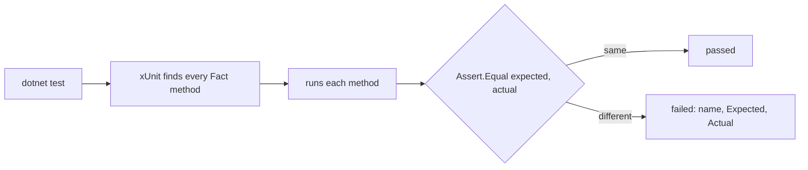

## Before you start

- [[design.l1.unit-test-first-look]] — you know a unit test arranges, acts and asserts, and you have run `ShippingFeeTests` with `dotnet test`.

## The situation

You want to add a test for `ExpressShipping`, which always charges 60,000 VND. You copy the shape of `StandardShippingIsFreeFromTwoMillion`, but three questions stop you. The test might pass whichever way you answer them; what changes is what you see on the day it fails. What makes xUnit treat your new method as a test at all? What should you call it — `TestForOrder`, `Test1`, something longer? And in `Assert.Equal`, which value goes first, the one you expect or the one the code returns?

## Core concepts

- xUnit — the testing library `DonHang.Samples.Tests` uses; it finds the test methods, runs them, and reports each result.
- `[Fact]` — the attribute that marks a method as one test for xUnit to run.
- test name — the method's name, written as the behaviour being checked, so a failure report reads as a sentence about what broke.
- `Assert.Equal(expected, actual)` — the assertion that compares two values and, if they differ, fails the test with a message showing both.

## How it works



When you run `dotnet test`, xUnit looks through the test project for public classes and, in them, for methods marked `[Fact]`. It runs each one on its own. A `[Fact]` method takes no parameters, because nobody is there to pass them, and returns `void`; a test that awaits something is written as `public async Task` instead. There is no list of tests to keep up to date: adding a method with `[Fact]` is enough for xUnit to find it on the next run.

The method's name is what the report shows when the test fails, so it should say what is supposed to happen. `AnEmptyOrderCannotBePaid` states a rule; if it fails, the report tells you which rule broke without opening the file. `TestMarkPaid` only says which method was called, and `Test1` says nothing. The name is for the person reading the failure, possibly months later.

`Assert.Equal` takes the expected value first and the actual value second. When the two are equal, the order makes no difference. When they differ, xUnit prints the first as "Expected" and the second as "Actual". Swap them, and the report on a real bug says the code should return what it wrongly returned — sending the reader to fix the wrong side.

## In the Đơn Hàng system

Two tests from `DonHang.Samples.Tests` for `OrderEncapsulated`, the order class from the encapsulation lesson:

```csharp file=samples/DonHang.Samples.Tests/SamplesTests.cs tag=stage-0 lines=27-46
public class OrderEncapsulatedTests
{
    [Fact]
    public void TotalFollowsTheLines()
    {
        var order = new OrderEncapsulated(1);
        order.AddLine(productId: 1, quantity: 1, unitPriceVnd: 1_250_000);
        order.AddLine(productId: 2, quantity: 2, unitPriceVnd: 450_000);

        Assert.Equal(2_150_000, order.TotalVnd);
    }

    [Fact]
    public void AnEmptyOrderCannotBePaid()
    {
        var order = new OrderEncapsulated(2);

        Assert.Throws<InvalidOperationException>(order.MarkPaid);
    }
}
```

The class is `public`, and each method is `public void`, takes no parameters, and has `[Fact]`. `TotalFollowsTheLines` arranges an order with two lines, and its one `Assert.Equal` puts the value worked out by hand first: 1 × 1,250,000 + 2 × 450,000 = 2,150,000. `order.TotalVnd` comes second, because that is what the code actually produced.

`AnEmptyOrderCannotBePaid` checks a different kind of result: not a value, but that an exception is thrown. `Assert.Throws<InvalidOperationException>` receives `order.MarkPaid` — the method itself, not a call to it — calls it, and passes only if that exact exception comes out. Both names read as rules: the total follows the lines; an empty order cannot be paid.

A new test for `ExpressShipping` fits the same shape. In the `ShippingFeeTests` class, a `[Fact]` method named `ExpressShippingAlwaysCostsSixtyThousand` would create `new ExpressShipping()` and assert `Assert.Equal(60_000, fee.ForOrder(500_000))`: expected first, then what the code returns.

## Beginners often think…

- **"Test method names don't matter, as long as the test passes."** → Actually the name matters most when the test fails, because that is the line the reader sees first. `AnEmptyOrderCannotBePaid` failing tells you a rule is broken; `TestMarkPaid` failing tells you only to go and read the test. You notice this when a run reports several failures and you have to open each test to learn what it was checking.
- **"`Assert.Equal(actual, expected)` and `Assert.Equal(expected, actual)` behave identically, since both just check equality."** → Actually they pass and fail on the same values, but they report differently. xUnit labels the first argument "Expected", so swapping them makes a failure claim the wrong value is the right one. You notice this when you "fix" code to match what the report says was expected, and the test still fails.

## Try it (3 minutes)

In `samples/DonHang.Samples.Tests/SamplesTests.cs`, inside `ShippingFeeTests`:

1. Add a public `[Fact]` method named `ExpressShippingAlwaysCostsSixtyThousand` that creates an `ExpressShipping` and asserts that `ForOrder(500_000)` equals `60_000`, expected value first.
2. Run `dotnet test samples/DonHang.Samples.Tests --filter ShippingFeeTests`.
3. Change the expected value to `50_000`, run again, read the report, then undo both changes.

Expected result: step 2 reports three tests passed. Step 3 reports one failure, for `ExpressShippingAlwaysCostsSixtyThousand`, with Expected `50000` and Actual `60000`.

If you had written `Assert.Equal(fee.ForOrder(500_000), 50_000)` instead, what would the report in step 3 have said?

<details><summary>Suggested answer</summary>

Expected `60000` and Actual `50000` — the labels swap, because xUnit calls the first argument "Expected". The report would claim the code should return 60,000 and returned 50,000, which is the opposite of what happened.

</details>

## Connections

- [[design.l1.unit-test-first-look]] — what a unit test is and how arrange, act, assert fit together.
- [[design.l1.test-doubles]] — testing a class whose dependency you do not want to use for real.

## Five-line summary

1. xUnit runs every public `[Fact]` method it finds; there is no list of tests to register them in.
2. A `[Fact]` method takes no parameters and returns `void`, or `Task` when it awaits something.
3. Name a test after the behaviour it checks, like `AnEmptyOrderCannotBePaid`, so a failure reads as the broken rule.
4. `Assert.Equal` takes the expected value first and the actual value second; the report labels them that way.
5. Swapped arguments still pass and fail correctly, but a failure then tells the reader the wrong value is right.
