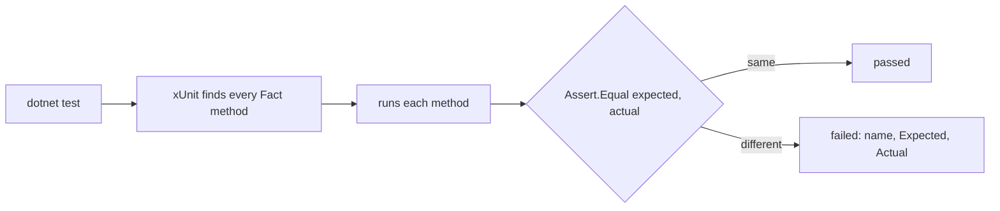

## Bạn cần biết trước

- [[design.l1.unit-test-first-look]] — bạn biết một unit test arrange, act và assert, và bạn đã chạy `ShippingFeeTests` bằng `dotnet test`.

## Tình huống

Bạn muốn thêm một test cho `ExpressShipping`, loại giao hàng luôn tính 60.000 VND. Bạn chép khuôn của `StandardShippingIsFreeFromTwoMillion`, nhưng ba câu hỏi làm bạn khựng lại. Với hai câu sau, test có thể pass dù bạn trả lời thế nào; thứ thay đổi là những gì bạn thấy vào ngày nó lỗi. Điều gì khiến xUnit coi method mới của bạn là một test? Nên đặt tên nó là gì — `TestForOrder`, `Test1`, hay một cái tên dài hơn? Và trong `Assert.Equal`, giá trị nào đứng trước, giá trị bạn mong đợi hay giá trị code trả về?

## Khái niệm cốt lõi

- xUnit — thư viện test mà `DonHang.Samples.Tests` dùng; nó tìm các method test, chạy chúng, và báo kết quả của từng cái.
- `[Fact]` — attribute đánh dấu một method là một test để xUnit chạy.
- tên test — tên của method, được viết như hành vi đang được kiểm tra, để báo cáo lỗi đọc lên thành một câu về thứ bị hỏng.
- `Assert.Equal(expected, actual)` — assertion so hai giá trị và, nếu chúng khác nhau, làm test lỗi kèm thông báo cho thấy cả hai.

## Cơ chế hoạt động



Khi bạn chạy `dotnet test`, xUnit tìm trong project test các class public và, trong đó, các method được đánh dấu `[Fact]`. Class phải là public; xUnit cũng tìm được method không public, nhưng thói quen thường gặp, và được theo ở đây, là để method test cũng public. Nó chạy riêng từng method. Method `[Fact]` không nhận tham số, vì không có ai ở đó để truyền, và trả về `void`; test nào cần await thì được viết là `public async Task`. Không có danh sách test nào phải cập nhật: thêm một method có `[Fact]` là đủ để xUnit tìm thấy nó ở lần chạy sau.

Tên method là thứ báo cáo hiển thị khi test lỗi, nên nó phải nói điều gì lẽ ra phải xảy ra. `AnEmptyOrderCannotBePaid` nêu một quy tắc; nếu nó lỗi, báo cáo cho bạn biết quy tắc nào bị vỡ mà không cần mở file. `TestMarkPaid` chỉ nói method nào được gọi, còn `Test1` chẳng nói gì. Cái tên là dành cho người đọc báo cáo lỗi, có thể là nhiều tháng sau.

`Assert.Equal` nhận giá trị mong đợi trước và giá trị thực tế sau. Khi hai giá trị bằng nhau, thứ tự không quan trọng. Khi chúng khác nhau, xUnit in cái đầu là "Expected" và cái sau là "Actual". Đảo chúng lại, và báo cáo về một bug thật sẽ nói code lẽ ra phải trả về đúng cái giá trị sai mà nó đã trả — khiến người đọc đi sửa nhầm phía.

## Trong hệ thống Đơn Hàng

Hai test trong `DonHang.Samples.Tests` cho `OrderEncapsulated`, class order trong bài encapsulation:

```csharp file=samples/DonHang.Samples.Tests/SamplesTests.cs tag=stage-0 lines=27-46
public class OrderEncapsulatedTests
{
    [Fact]
    public void TotalFollowsTheLines()
    {
        var order = new OrderEncapsulated(1);
        order.AddLine(productId: 1, quantity: 1, unitPriceVnd: 1_250_000);
        order.AddLine(productId: 2, quantity: 2, unitPriceVnd: 450_000);

        Assert.Equal(2_150_000, order.TotalVnd);
    }

    [Fact]
    public void AnEmptyOrderCannotBePaid()
    {
        var order = new OrderEncapsulated(2);

        Assert.Throws<InvalidOperationException>(order.MarkPaid);
    }
}
```

Class là `public`, và mỗi method là `public void`, không nhận tham số, và có `[Fact]`. `TotalFollowsTheLines` arrange một order có hai dòng, và `Assert.Equal` duy nhất của nó đặt giá trị tính tay lên trước: 1 × 1.250.000 + 2 × 450.000 = 2.150.000. `order.TotalVnd` đứng sau, vì đó là thứ code thực sự tạo ra.

`AnEmptyOrderCannotBePaid` kiểm tra một loại kết quả khác: không phải một giá trị, mà là việc có exception được throw. `Assert.Throws<InvalidOperationException>` nhận `order.MarkPaid` — chính method đó, không phải một lời gọi nó — rồi gọi nó, và chỉ pass nếu đúng exception đó được throw ra. Cả hai tên đều đọc lên như quy tắc: tổng tiền đi theo các dòng; order rỗng không thể thanh toán.

Một test mới cho `ExpressShipping` cũng theo đúng khuôn đó. Trong class `ShippingFeeTests`, một method `[Fact]` tên `ExpressShippingAlwaysCostsSixtyThousand` sẽ lưu `new ExpressShipping()` vào một `ShippingFee fee`, giống test có sẵn, rồi assert `Assert.Equal(60_000, fee.ForOrder(500_000))`: giá trị mong đợi trước, rồi tới thứ code trả về. Tổng tiền order nào cũng được, vì phí giao nhanh là cố định.

## Người mới hay nghĩ rằng…

- **"Tên method test không quan trọng, miễn là test pass."** → Thực ra cái tên quan trọng nhất đúng lúc test lỗi, vì đó là dòng người đọc thấy đầu tiên. `AnEmptyOrderCannotBePaid` lỗi cho bạn biết một quy tắc bị vỡ; `TestMarkPaid` lỗi chỉ bảo bạn đi đọc test. Bạn sẽ nhận ra khi một lần chạy báo nhiều test lỗi và bạn phải mở từng test để biết nó kiểm tra gì.
- **"`Assert.Equal(actual, expected)` và `Assert.Equal(expected, actual)` hoạt động y hệt nhau, vì cả hai chỉ kiểm tra bằng nhau."** → Thực ra chúng pass và lỗi với cùng các giá trị, nhưng báo cáo khác nhau. xUnit gắn nhãn "Expected" cho tham số đầu, nên đảo chúng khiến báo cáo lỗi khẳng định giá trị sai là giá trị đúng. Bạn sẽ nhận ra khi "sửa" code cho khớp với thứ báo cáo nói là mong đợi, và test vẫn lỗi.

## Thử ngay (3 phút)

Trong `samples/DonHang.Samples.Tests/SamplesTests.cs`, bên trong `ShippingFeeTests`:

1. Thêm một method public có `[Fact]` tên `ExpressShippingAlwaysCostsSixtyThousand`, tạo một `ExpressShipping` và assert rằng `ForOrder(500_000)` bằng `60_000`, giá trị mong đợi đứng trước.
2. Chạy `dotnet test samples/DonHang.Samples.Tests --filter ShippingFeeTests`.
3. Đổi giá trị mong đợi thành `50_000`, chạy lại, đọc báo cáo, rồi hoàn tác cả hai thay đổi.

Kết quả mong đợi: bước 2 báo ba test pass — hai test đã có trong `ShippingFeeTests` và test của bạn, vì filter chỉ giữ các test của class đó. Bước 3 báo một test lỗi, `ExpressShippingAlwaysCostsSixtyThousand`, với Expected `50000` và Actual `60000`.

Nếu bạn viết `Assert.Equal(fee.ForOrder(500_000), 50_000)` thì báo cáo ở bước 3 sẽ ghi gì?

<details><summary>Gợi ý đáp án</summary>

Expected `60000` và Actual `50000` — hai nhãn đổi chỗ, vì xUnit gọi tham số đầu là "Expected". Báo cáo sẽ khẳng định code lẽ ra phải trả 60.000 nhưng lại trả 50.000, ngược hẳn với những gì đã xảy ra.

</details>

## Liên hệ

- [[design.l1.unit-test-first-look]] — unit test là gì và arrange, act, assert khớp với nhau thế nào.
- [[design.l1.test-doubles]] — kiểm tra một class có phụ thuộc mà bạn không muốn dùng bản thật.

## Tóm tắt 5 dòng

1. xUnit chạy mọi method `[Fact]` trong các class public của project; không có danh sách test nào phải đăng ký.
2. Method `[Fact]` không nhận tham số và trả về `void`, hoặc `Task` khi nó await gì đó.
3. Đặt tên test theo hành vi nó kiểm tra, như `AnEmptyOrderCannotBePaid`, để báo cáo lỗi đọc lên thành quy tắc bị vỡ.
4. `Assert.Equal` nhận giá trị mong đợi trước và giá trị thực tế sau; báo cáo gắn nhãn chúng đúng như vậy.
5. Tham số bị đảo vẫn pass và lỗi đúng lúc, nhưng khi lỗi, báo cáo sẽ bảo người đọc rằng giá trị sai là đúng.
