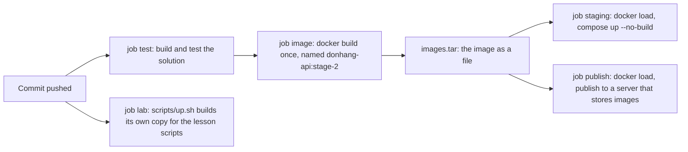

## Before you start

- [[devops.l2.quality-gate]] — you know the `test` job builds and tests the solution, and that a red job turns the run red.
- [[devops.l1.multi-stage-builds]] — you know how `DonHang.Api/Dockerfile` builds with the SDK and copies the result into a runtime image.
- [[devops.l1.twelve-factor-config]] — you know the idea of building the code once and changing only the configuration around it.

## The situation

Your pull request moves the order DTOs out of `DonHang.Api` into a new project, `DonHang.Contracts`. You add it to `DonHang.slnx` and make `DonHang.Api` reference it and use its types. On your laptop `dotnet build` and `dotnet test` pass, and so does CI's `test` job, though you never touched `DonHang.Api/Dockerfile`. A teammate says the image only matters on the day someone deploys. Another asks why the `staging` job does not just build the image itself, since it has the Dockerfile right there. Where should Đơn Hàng's API image be built, how many times per run, and what should the jobs after it run?

## Core concepts

- Image build — running `docker build` on a Dockerfile and a context, the folder whose files the Dockerfile may copy; for the API it compiles the code again inside the SDK stage.
- Docker Compose — the tool that starts the services listed in `docker-compose.yml`; a service with `build:` can be built from a Dockerfile, and `image:` names its image.
- Image name — the name `docker build --tag` gives the result; `docker-compose.yml` names the `api` service's image `donhang-api:stage-2`.
- Build once — one job builds the image, and every later job that needs it runs that same image instead of building again.
- Image ID — the `sha256:` identifier Docker gives each image; two images with different IDs are different images, whatever their names.

## How it works



In the situation above, the `test` job stays green because `DonHang.slnx` includes the new project. But `DonHang.Api/Dockerfile` copies only the projects it names, so inside `docker build` the compiler cannot find the moved types and `dotnet publish` fails. Since stage-2, CI runs that build in its own job, `image`, after `test` passes. Your pull request turns red there, not on the day someone deploys.

The `image` job builds from the same `DonHang.Api/Dockerfile` that Compose uses for the lab. It names the result `donhang-api:stage-2`, exactly the `image:` that `docker-compose.yml` gives the `api` service, and that shared name lets later jobs skip building.

Each job runs on its own new runner, so an image built in one job is not on any other job's runner. The image leaves `image` as one file, `images.tar`, written with `docker save` and read back with `docker load`; the next lesson covers that handover.

Two later jobs load it, only for pushes to `master` and only when `image` passed. `staging` runs `docker compose up --no-build`, so Compose starts the loaded image under that name, then asks it for the product list and turns red without a successful answer. `publish` puts the same image on a server that stores images, so machines outside the run can fetch it. One more job, `lab`, builds its own copy with `scripts/up.sh` to run the lesson scripts; nothing from it reaches `staging` or `publish`.

Building once is the twelve-factor idea you met with Config, applied to the image: one build, combined with each place's configuration. Rebuilding for each place makes a separate image, and nothing guarantees it is the one that was checked.

## In the Đơn Hàng system

The `image` job in `ci.yml`:

```yaml file=.github/workflows/ci.yml tag=stage-2 lines=59-72
  # lesson: devops.l2.building-images-in-ci
  # Built once per run, from the Dockerfile the lab uses, under the names
  # docker-compose.yml gives the migrate and api services. Later jobs run
  # these exact images; none of them builds again.
  image:
    needs: test
    runs-on: ubuntu-24.04
    steps:
      - uses: actions/checkout@v4

      - name: Build the api and migrate images
        run: |
          docker build --file DonHang.Api/Dockerfile --tag donhang-api:stage-2 .
          docker build --file DonHang.Api/Dockerfile --target migrate --tag donhang-migrate:stage-2 .
```

`needs: test` makes the job wait for the tests and skip when they fail. The first `docker build` uses the repository root (the `.` at the end) as its context and no `--target`, so it builds the Dockerfile's last stage, the API's runtime image. The second builds the `migrate` service's image from another stage of the same file; a later lesson covers it. The names after `--tag` are the ones Compose expects:

```yaml file=docker-compose.yml tag=stage-2 lines=101-106
  # lesson: devops.l1.compose-for-the-api
  api:
    build:
      context: .
      dockerfile: DonHang.Api/Dockerfile
    image: donhang-api:stage-2
```

Compose would build `api` from the same context and Dockerfile, and it names the image `donhang-api:stage-2`. In the `staging` job, `--no-build` makes Compose run the loaded image under that name instead. The log of the `stage-2` run shows it: `staging` prints `Loaded image: donhang-api:stage-2` and builds only one other image, the Linux box the lab's scripts run in, which is not one of the images the `image` job builds; it never builds `api`.

That run also shows that a rebuild is not the same image. The `image` job's `donhang-api:stage-2` got the ID `sha256:f8aefb3c…`. The `lab` job's own copy, built by `scripts/up.sh` from the same commit, got `sha256:9ac7d7d0…`. Same commit, same Dockerfile, two IDs: Docker treats them as two images, and the request `staging` sent says nothing about the second.

## Beginners often think…

- **"CI only needs to compile and test the code; the Dockerfile gets checked when someone deploys."** → Actually the image is its own build: the Dockerfile decides which files go in, and `dotnet publish` compiles again inside it. A change can pass `dotnet build` and still break the image, as in the situation. You notice this when the `image` job is red on a pull request whose `test` job is green.
- **"Each environment can build its own image from the same commit, and the result is the same image anyway."** → Actually a rebuild makes a separate image, and nothing guarantees it is the one that was checked; only that one is known to work. In the `stage-2` run, two builds of one commit got two IDs. You notice this when the image that passed staging and the one running elsewhere show different IDs.

## Try it (3 minutes)

At the root of your Đơn Hàng folder at stage-2, in Git Bash:

1. Run `grep -n "donhang-api:stage-2" docker-compose.yml .github/workflows/ci.yml`.
2. Look at which jobs of `ci.yml` the matching lines belong to.
3. Think: if `staging` ran `docker compose up --build` instead of `--no-build`, which image would it start?

Expected result: four lines. `docker-compose.yml:106` is the `image:` of `api`. In `ci.yml`, line 71 is the `docker build` of the `image` job, line 78 its `docker save`, and line 163 a `docker tag` in the `publish` job, which gives the image a second name before it goes to the server. No line in the `staging` job builds `api`.

<details><summary>Suggested answer</summary>

With `--build`, Compose would build `api` again on the `staging` runner and start that new build under the same name. Like the copy the `lab` job builds, which got a different ID, it would be a separate image, so staging would no longer check the image the `image` job built and `publish` publishes.

</details>

## Connections

- [[devops.l2.quality-gate]] — prerequisite: the `test` job that `image` waits for; the image build is one more check after it.
- [[devops.l1.multi-stage-builds]] — the same Dockerfile, now built by a runner instead of by `scripts/up.sh`.
- [[devops.l1.twelve-factor-config]] — the same build-once idea, applied to the image instead of the settings.
- [[devops.l2.workflow-artifacts]] — next: how `images.tar` travels from the `image` job to the jobs that need it.
- [[devops.l2.pushing-images-from-ci]] — what `publish` does with the image, so machines outside the run can use it.

## Five-line summary

1. CI builds Đơn Hàng's API image once per run for delivery, in the `image` job; the jobs after it run that image, not a rebuild.
2. The build uses the same `DonHang.Api/Dockerfile` as the lab, so a change that breaks the image fails the run.
3. The image is named `donhang-api:stage-2`, as `docker-compose.yml` names it, so `staging` starts it with `--no-build`.
4. Nothing guarantees a rebuild of one commit is the image that was checked; running that one is the twelve-factor build-once idea.
5. Each job has its own runner: later jobs need the image as a file, other machines need it from a server.
