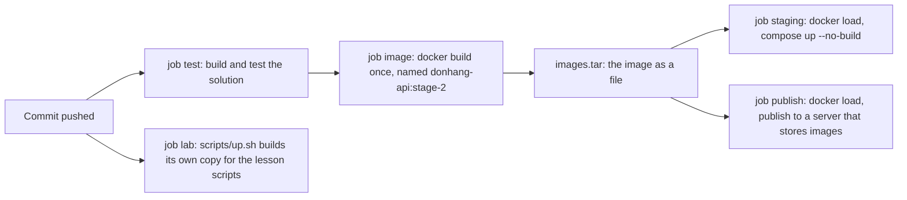

## Bạn cần biết trước

- [[devops.l2.quality-gate]] — bạn biết job `test` build và test solution, và một job đỏ làm cả lần chạy đỏ.
- [[devops.l1.multi-stage-builds]] — bạn biết `DonHang.Api/Dockerfile` build bằng SDK rồi chép kết quả sang một image runtime thế nào.
- [[devops.l1.twelve-factor-config]] — bạn biết ý tưởng build code một lần và chỉ đổi phần cấu hình bao quanh nó.

## Tình huống

Pull request của bạn chuyển các DTO của đơn hàng ra khỏi `DonHang.Api`, sang một project mới là `DonHang.Contracts`. Bạn thêm nó vào `DonHang.slnx`, cho `DonHang.Api` tham chiếu và dùng các kiểu trong đó. Trên laptop, `dotnet build` và `dotnet test` đều qua, job `test` của CI cũng vậy, dù bạn không hề đụng vào `DonHang.Api/Dockerfile`. Một đồng nghiệp bảo image chỉ quan trọng vào ngày có người deploy. Người khác hỏi sao job `staging` không tự build image luôn, Dockerfile nằm ngay đó rồi. Image API của Đơn Hàng nên được build ở đâu, mỗi lần chạy build mấy lần, và các job phía sau nên chạy cái gì?

## Khái niệm cốt lõi

- Build image — chạy `docker build` trên một Dockerfile và một context, tức thư mục mà Dockerfile được phép chép file từ đó. Với API, bước này biên dịch lại code bên trong stage SDK.
- Docker Compose — công cụ khởi động các service liệt kê trong `docker-compose.yml`. Service có `build:` có thể được build từ một Dockerfile, còn `image:` đặt tên cho image của nó.
- Tên image — cái tên mà `docker build --tag` gán cho kết quả. `docker-compose.yml` đặt tên image của service `api` là `donhang-api:stage-2`.
- Build một lần — một job build image, và mọi job sau cần đến nó đều chạy đúng image đó thay vì build lại.
- Image ID — mã `sha256:` mà Docker gán cho mỗi image. Hai image có ID khác nhau là hai image khác nhau, dù mang tên gì.

## Cơ chế hoạt động



Trong tình huống trên, job `test` vẫn xanh vì `DonHang.slnx` có project mới. Nhưng `DonHang.Api/Dockerfile` chỉ chép những project nó nêu tên, nên bên trong `docker build` trình biên dịch không tìm thấy các kiểu đã chuyển đi và `dotnet publish` fail. Từ stage-2, CI chạy lần build đó trong một job riêng là `image`, sau khi `test` qua. Pull request của bạn đỏ ngay ở đó, chứ không phải vào ngày có người deploy.

Job `image` build từ chính `DonHang.Api/Dockerfile` mà Compose dùng cho lab. Nó đặt tên kết quả là `donhang-api:stage-2`, đúng với `image:` mà `docker-compose.yml` gán cho service `api`, và nhờ dùng chung cái tên đó mà các job sau khỏi phải build.

Mỗi job chạy trên một runner mới của riêng nó, nên image build trong job này không có trên runner của job khác. Image rời job `image` dưới dạng một file, `images.tar`, ghi ra bằng `docker save` và đọc lại bằng `docker load`. Bài sau sẽ nói về bước trao tay này.

Hai job phía sau load image đó, chỉ khi push lên `master` và chỉ khi `image` đã qua. `staging` chạy `docker compose up --no-build`, nên Compose khởi động image vừa load dưới đúng tên đó, rồi hỏi nó danh sách sản phẩm và chuyển đỏ nếu không nhận được câu trả lời thành công. `publish` đưa chính image đó lên một server lưu image, để các máy nằm ngoài lần chạy lấy về được. Còn một job nữa, `lab`, tự build bản riêng bằng `scripts/up.sh` để chạy các script của bài học, và không thứ gì từ nó đi tới `staging` hay `publish`.

Build một lần là ý tưởng twelve-factor bạn đã gặp ở Config, giờ áp dụng cho image: một lần build, ghép với cấu hình của từng nơi. Build lại cho mỗi nơi sẽ tạo ra một image riêng, và không gì bảo đảm đó là image đã được kiểm.

## Trong hệ thống Đơn Hàng

Job `image` trong `ci.yml`:

```yaml file=.github/workflows/ci.yml tag=stage-2 lines=59-72
  # lesson: devops.l2.building-images-in-ci
  # Built once per run, from the Dockerfile the lab uses, under the names
  # docker-compose.yml gives the migrate and api services. Later jobs run
  # these exact images; none of them builds again.
  image:
    needs: test
    runs-on: ubuntu-24.04
    steps:
      - uses: actions/checkout@v4

      - name: Build the api and migrate images
        run: |
          docker build --file DonHang.Api/Dockerfile --tag donhang-api:stage-2 .
          docker build --file DonHang.Api/Dockerfile --target migrate --tag donhang-migrate:stage-2 .
```

`needs: test` bắt job này chờ test và bỏ qua khi test fail. Lệnh `docker build` đầu tiên lấy thư mục gốc của repository (dấu `.` ở cuối) làm context và không có `--target`, nên nó build stage cuối của Dockerfile, tức image runtime của API. Lệnh thứ hai build image của service `migrate` từ một stage khác trong cùng file, bài sau sẽ nói tới. Các tên sau `--tag` chính là tên Compose đang chờ:

```yaml file=docker-compose.yml tag=stage-2 lines=101-106
  # lesson: devops.l1.compose-for-the-api
  api:
    build:
      context: .
      dockerfile: DonHang.Api/Dockerfile
    image: donhang-api:stage-2
```

Nếu tự build, Compose cũng build `api` từ đúng context và Dockerfile đó, và đặt tên image là `donhang-api:stage-2`. Trong job `staging`, `--no-build` khiến Compose chạy image đã load dưới tên đó thay vì build. Log của lần chạy `stage-2` cho thấy điều này: `staging` in `Loaded image: donhang-api:stage-2` và chỉ build thêm một image khác, cái máy Linux mà các script của lab chạy bên trong, vốn không thuộc các image job `image` build. Nó không bao giờ build `api`.

Lần chạy đó cũng cho thấy build lại không ra cùng một image. `donhang-api:stage-2` của job `image` có ID `sha256:f8aefb3c…`. Bản riêng của job `lab`, do `scripts/up.sh` build từ cùng commit, có ID `sha256:9ac7d7d0…`. Cùng commit, cùng Dockerfile, hai ID: Docker coi đó là hai image, và request mà `staging` đã gửi không nói được gì về image thứ hai.

## Người mới hay nghĩ rằng…

- **"CI chỉ cần biên dịch và test code, Dockerfile để lúc có người deploy hẵng kiểm."** → Thực ra image là một lần build riêng: Dockerfile quyết định file nào được đưa vào, và `dotnet publish` biên dịch lại bên trong nó. Một thay đổi có thể qua `dotnet build` mà vẫn làm hỏng image, như trong tình huống. Bạn sẽ nhận ra khi job `image` đỏ trên một pull request có job `test` xanh.
- **"Mỗi môi trường cứ tự build image từ cùng một commit, đằng nào cũng ra cùng một image."** → Thực ra build lại tạo ra một image riêng, và không gì bảo đảm đó là image đã được kiểm, chỉ image đã được kiểm mới chắc chạy được. Trong lần chạy `stage-2`, hai lần build cùng một commit cho ra hai ID. Bạn sẽ nhận ra khi image đã qua staging và image đang chạy ở nơi khác có ID khác nhau.

## Thử ngay (3 phút)

Ở thư mục gốc Đơn Hàng tại stage-2, trong Git Bash:

1. Chạy `grep -n "donhang-api:stage-2" docker-compose.yml .github/workflows/ci.yml`.
2. Xem mỗi dòng khớp thuộc job nào của `ci.yml`.
3. Nghĩ xem: nếu `staging` chạy `docker compose up --build` thay vì `--no-build`, nó sẽ khởi động image nào?

Kết quả mong đợi: bốn dòng. `docker-compose.yml:106` là `image:` của `api`. Trong `ci.yml`, dòng 71 là `docker build` của job `image`, dòng 78 là `docker save` của job đó, và dòng 163 là một lệnh `docker tag` trong job `publish`, lệnh này gán thêm cho image một tên thứ hai trước khi đưa lên server. Không dòng nào trong job `staging` build `api`.

<details><summary>Gợi ý đáp án</summary>

Với `--build`, Compose sẽ build lại `api` trên runner của `staging` và khởi động bản build mới đó dưới cùng tên. Giống bản job `lab` build, vốn có ID khác, nó sẽ là một image riêng, nên staging không còn kiểm image mà job `image` đã build và `publish` đưa lên server.

</details>

## Liên hệ

- [[devops.l2.quality-gate]] — bài cần học trước: job `test` mà `image` chờ, còn build image là thêm một bước kiểm tra sau nó.
- [[devops.l1.multi-stage-builds]] — vẫn Dockerfile đó, giờ do runner build thay vì `scripts/up.sh`.
- [[devops.l1.twelve-factor-config]] — cùng ý tưởng build một lần, áp cho image thay vì cho các thiết lập.
- [[devops.l2.workflow-artifacts]] — bài tiếp theo: `images.tar` đi từ job `image` tới các job cần nó bằng cách nào.
- [[devops.l2.pushing-images-from-ci]] — `publish` làm gì với image để các máy nằm ngoài lần chạy dùng được.

## Tóm tắt 5 dòng

1. CI build image API của Đơn Hàng một lần mỗi lần chạy để giao đi, trong job `image`, và các job sau chạy đúng image đó, không build lại.
2. Lần build dùng chính `DonHang.Api/Dockerfile` của lab, nên thay đổi nào làm hỏng image cũng làm lần chạy fail.
3. Image mang tên `donhang-api:stage-2` như `docker-compose.yml` đặt, nên `staging` khởi động nó với `--no-build`.
4. Không gì bảo đảm build lại một commit sẽ ra image đã được kiểm. Chạy đúng image đó là ý build một lần của twelve-factor.
5. Mỗi job có runner riêng: job sau cần image dưới dạng file, máy khác cần lấy nó từ một server.
