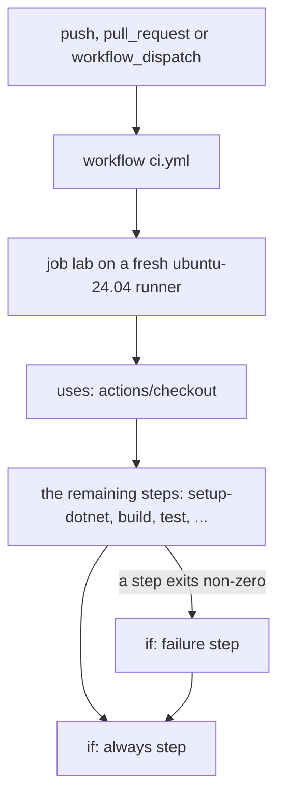

## Before you start

- [[devops.l2.continuous-integration]] — you know that `ci.yml` starts a CI run on every push and pull request, on a clean machine.
- [[foundation.l1.shell-scripts]] — you know that every command ends with an exit code, and that `0` means success.

## The situation

You open the CI run for the commit tagged `stage-1` on the repository's GitHub page. It is red, although "Build the solution" and "Test the solution" passed. The red cross sits at "Fail if any captured output changed": the step that compares what Đơn Hàng's scripts printed in this run with the copies committed under `outputs/` found a difference. Yet the two steps after it in `ci.yml`, "Say what went wrong" and "Stop the lab", have green ticks: they ran after the failure. You expected a failure to stop everything. What does GitHub do with `ci.yml`, from top to bottom, and why did those two steps run?

## Core concepts

- **GitHub Actions** — GitHub's service for CI, which runs the files a repository keeps in `.github/workflows/`.
- **workflow** — one YAML file (a config format like JSON, written as indented `key: value` lines) in `.github/workflows/` that says which events start it and which jobs it runs; `ci.yml` is Đơn Hàng's.
- Job — a named list of steps inside a workflow; `ci.yml` at stage-1 has one job, `lab`.
- **runner** — the machine that runs one job; a runner provided by GitHub is a fresh machine started for that job.
- Step — one entry in a job: either an action, a ready-made program someone published, to run (`uses:`), or shell commands to run (`run:`).

## How it works



In the situation above, the event was a push of the tag `stage-1`; a tag is a fixed name for one commit, and pushing it counts as a `push` too. GitHub Actions read the workflow `.github/workflows/ci.yml`, found that its `on:` block lists `push`, and started a run. The same file also starts on `pull_request` and on `workflow_dispatch`, which lets a person start a run by hand from the repository's Actions tab.

The workflow holds jobs. `ci.yml` at stage-1 has one, `lab`, and its `runs-on: ubuntu-24.04` asks for a runner running Ubuntu 24.04, a Linux system. GitHub starts a fresh machine for the job. It has tools installed, but not your code: the job's first step, `actions/checkout`, fetches the commit's files onto it.

Then the steps run in order, one at a time, on that same runner, so a later step sees the files an earlier one left on the machine, including the tools an action such as `actions/setup-dotnet` installed. A step with `uses:` runs a published action, a ready-made program named by its repository and version, such as `actions/setup-dotnet@v4`; `with:` gives it inputs. A step with `run:` runs shell commands, as a script would.

A step fails when its command exits with a non-zero code. From then on, a step with no `if:` is skipped. A step with `if: failure()` runs only because something before it failed, and one with `if: always()` runs whatever happened. That is why "Say what went wrong" and "Stop the lab" ran. The run, and the job, still end red: those steps do not undo the failure.

## In the Đơn Hàng system

The top of `ci.yml` at stage-1:

```yaml file=.github/workflows/ci.yml tag=stage-1 lines=1-16
name: ci

on:
  push:
  pull_request:
  workflow_dispatch:

jobs:
  lab:
    runs-on: ubuntu-24.04
    steps:
      - uses: actions/checkout@v4

      - uses: actions/setup-dotnet@v4
        with:
          global-json-file: global.json
```

Read it as the diagram. `on:` lists the three events. Under `jobs:`, `lab` is the job's id, `runs-on:` picks the runner, and `steps:` is the ordered list. The first two steps are actions. Without `actions/checkout@v4` the runner's working folder would hold none of Đơn Hàng's files: not the `global.json` that `actions/setup-dotnet@v4` is told to read, nor the `DonHang.slnx` that `dotnet build` needs.

The end of the same job:

```yaml file=.github/workflows/ci.yml tag=stage-1 lines=46-60
      - name: Fail if any captured output changed
        shell: bash
        run: git diff -- outputs/ | tee "$RUNNER_TEMP/drift.log"; git diff --exit-code -- outputs/

      - name: Say what went wrong
        if: failure()
        shell: bash
        run: |
          detail=$(tail -n 40 "$RUNNER_TEMP"/*.log 2>/dev/null | sed 's/%/%25/g; s/\r//g')
          echo "::error title=ci failed::${detail//$'\n'/%0A}"
          docker compose logs --tail 100

      - name: Stop the lab
        if: always()
        run: ./scripts/down.sh
```

`name:` is the label you saw in the list of steps. The lab is Đơn Hàng's set of containers, which an earlier step, "Start the lab", starts with `./scripts/up.sh`. The last command of "Fail if any captured output changed", `git diff --exit-code`, exits with `1` when a file under `outputs/` differs, and that code failed the step in the situation. Its `shell: bash` runs the commands with bash's stop-at-first-failure options, as `set -eo pipefail` would in a script, so a failure inside the pipe into `tee` would fail the step too.

"Say what went wrong" uses `if: failure()` to put the end of the logs on the run's page, with the last 100 lines of each lab container's log (`docker compose logs`); you do not need to read its other `run:` lines. `if: always()` makes sure `./scripts/down.sh` stops and removes the lab's containers even after a failure.

## Beginners often think…

- **"The runner already has the repository's code, so `actions/checkout` is just a formality."** → Actually the runner is a fresh machine with tools installed but none of your repository's files; `actions/checkout` is what copies the commit onto it. You notice this when a new workflow without the checkout step fails at its first `run:` with a message that a file or project cannot be found.
- **"If one step fails, GitHub still runs the remaining steps and reports how many of them failed."** → Actually a failing step stops the normal path: every later step without an `if:` is skipped, and only steps whose `if:` asks for it, such as `failure()` or `always()`, still run. You notice this when "Build the solution" fails and "Test the solution" shows as skipped instead of failed.
- **"`uses:` and `run:` are two spellings of the same thing."** → Actually `uses:` runs an action, a program someone published and you call by name and version, configured with `with:`; `run:` runs shell commands you write in the file. You notice this when you write `run: actions/checkout@v4` and the step fails, because bash looks for a program at that path and finds none, instead of fetching the code.

## Try it (3 minutes)

Open `.github/workflows/ci.yml` at tag `stage-1` with `git show stage-1:.github/workflows/ci.yml` in your Đơn Hàng folder; the lesson shows only its start and end. Suppose `dotnet test` reports a failing test, so "Test the solution" exits with `1`.

1. Write down the names of the steps that come after "Test the solution" in the file, in order.
2. Mark each as "runs" or "skipped".

Expected result: only "Say what went wrong" and "Stop the lab" are marked "runs"; every step between them and the failure is skipped, and the run ends red.

<details><summary>Suggested answer</summary>

After "Test the solution" come "Analyze and test DonHang.App", "Start the lab", "Run every lesson script and capture its output", "Fail if any captured output changed", "Say what went wrong" and "Stop the lab". The first four have no `if:`, so they are skipped. "Say what went wrong" runs because of `if: failure()`, and "Stop the lab" runs because of `if: always()`.

</details>

## Connections

- [[devops.l2.continuous-integration]] — the practice; this lesson is the machinery that runs it in Đơn Hàng.
- [[foundation.l1.shell-scripts]] — the same rule one layer up: a `run:` step is judged by its exit code, as a script is.
- [[devops.l2.quality-gate]] — next: the checks in this job as a gate a change must pass, and what a red run does not stop.
- [[devops.l2.workflow-artifacts]] — later: a workflow with several jobs, each on its own runner, and how they share files.

## Five-line summary

1. A GitHub Actions workflow is a YAML file in `.github/workflows/` whose `on:` block names the events that start it.
2. A workflow holds jobs; each job runs on a runner, a fresh machine named by `runs-on`, with no code until `actions/checkout`.
3. A job's steps run in order on the same runner: `uses:` runs a published action, `run:` runs shell commands.
4. A step fails when its command exits non-zero; later steps are then skipped unless their `if:` says otherwise.
5. `if: failure()` runs a step only after a failure, `if: always()` runs it regardless, and the run still ends red.
