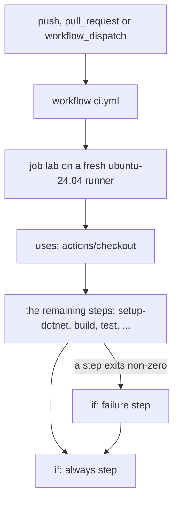

## Bạn cần biết trước

- [[devops.l2.continuous-integration]] — bạn biết `ci.yml` khởi động một lần chạy CI với mọi push và pull request, trên một máy sạch.
- [[foundation.l1.shell-scripts]] — bạn biết mọi lệnh đều kết thúc bằng một exit code, và `0` nghĩa là thành công.

## Tình huống

Bạn mở lần chạy CI của commit được gắn tag `stage-1` trên trang GitHub của repository. Nó đỏ, dù "Build the solution" và "Test the solution" đều qua. Dấu chéo đỏ nằm ở "Fail if any captured output changed": step so sánh những gì các script của Đơn Hàng in ra trong lần chạy này với bản đã commit dưới `outputs/` đã thấy khác biệt. Vậy mà hai step đứng sau nó trong `ci.yml`, "Say what went wrong" và "Stop the lab", lại có dấu tích xanh: chúng đã chạy sau khi có lỗi. Bạn tưởng một lỗi sẽ dừng tất cả. GitHub làm gì với `ci.yml`, từ trên xuống dưới, và vì sao hai step đó vẫn chạy?

## Khái niệm cốt lõi

- **GitHub Actions** (dịch vụ CI/CD của GitHub, chạy các workflow khai báo trong repository) — dịch vụ CI của GitHub, chạy các file mà repository đặt trong `.github/workflows/`.
- **workflow** (tệp YAML trong `.github/workflows/` nói khi nào GitHub Actions chạy và chạy những job nào) — một file YAML (định dạng cấu hình giống JSON, viết thành các dòng `key: value` thụt lề) trong `.github/workflows/`, nói những sự kiện nào khởi động nó và nó chạy những job nào; `ci.yml` là workflow của Đơn Hàng.
- Job — một danh sách step có tên bên trong workflow; `ci.yml` ở stage-1 có đúng một job, `lab`.
- **runner** (máy chạy một job của workflow; runner do GitHub cấp là máy mới cho mỗi job) — máy chạy một job; runner do GitHub cấp là một máy mới được khởi động riêng cho job đó.
- Step — một mục trong job: hoặc một action, tức chương trình làm sẵn do người khác publish, để chạy (`uses:`), hoặc các lệnh shell để chạy (`run:`).

## Cơ chế hoạt động



Trong tình huống trên, sự kiện là lần push tag `stage-1`. Tag là một cái tên cố định gắn với một commit, và push tag cũng được tính là `push`. GitHub Actions đọc workflow `.github/workflows/ci.yml`, thấy khối `on:` có `push`, và khởi động một lần chạy. Cùng file đó còn khởi động với `pull_request` và `workflow_dispatch`, sự kiện cho phép một người tự bấm chạy từ tab Actions của repository.

Workflow chứa các job. `ci.yml` ở stage-1 có một job, `lab`, và `runs-on: ubuntu-24.04` của nó xin một runner chạy Ubuntu 24.04, một hệ điều hành Linux. GitHub khởi động một máy mới cho job. Máy có sẵn công cụ, nhưng không có code của bạn: step đầu tiên của job, `actions/checkout`, mới lấy các file của commit về máy.

Sau đó các step chạy theo thứ tự, lần lượt từng step, trên cùng runner đó. Vì vậy step sau thấy được các file mà step trước để lại trên máy, kể cả công cụ mà một action như `actions/setup-dotnet` đã cài. Step có `uses:` chạy một action đã được publish, một chương trình làm sẵn được gọi theo tên repository và phiên bản, như `actions/setup-dotnet@v4`; `with:` truyền input cho nó. Step có `run:` chạy lệnh shell, như một script.

Một step fail khi lệnh của nó thoát với mã khác 0. Từ đó trở đi, step không có `if:` bị bỏ qua. Step có `if: failure()` chạy chính vì đã có gì đó fail trước nó, còn step có `if: always()` thì chạy bất kể chuyện gì xảy ra. Đó là lý do "Say what went wrong" và "Stop the lab" đã chạy. Lần chạy, và cả job, vẫn kết thúc màu đỏ: những step đó không xóa được lỗi.

## Trong hệ thống Đơn Hàng

Phần đầu của `ci.yml` ở stage-1:

```yaml file=.github/workflows/ci.yml tag=stage-1 lines=1-16
name: ci

on:
  push:
  pull_request:
  workflow_dispatch:

jobs:
  lab:
    runs-on: ubuntu-24.04
    steps:
      - uses: actions/checkout@v4

      - uses: actions/setup-dotnet@v4
        with:
          global-json-file: global.json
```

Đọc nó theo sơ đồ. `on:` liệt kê ba sự kiện. Dưới `jobs:`, `lab` là id của job, `runs-on:` chọn runner, còn `steps:` là danh sách có thứ tự. Hai step đầu là action. Không có `actions/checkout@v4` thì thư mục làm việc của runner sẽ không có file nào của Đơn Hàng: không có `global.json` mà `actions/setup-dotnet@v4` được bảo đọc, cũng không có `DonHang.slnx` mà `dotnet build` cần.

Phần cuối của cùng job đó:

```yaml file=.github/workflows/ci.yml tag=stage-1 lines=46-60
      - name: Fail if any captured output changed
        shell: bash
        run: git diff -- outputs/ | tee "$RUNNER_TEMP/drift.log"; git diff --exit-code -- outputs/

      - name: Say what went wrong
        if: failure()
        shell: bash
        run: |
          detail=$(tail -n 40 "$RUNNER_TEMP"/*.log 2>/dev/null | sed 's/%/%25/g; s/\r//g')
          echo "::error title=ci failed::${detail//$'\n'/%0A}"
          docker compose logs --tail 100

      - name: Stop the lab
        if: always()
        run: ./scripts/down.sh
```

`name:` là nhãn bạn thấy trong danh sách step. Lab là bộ container của Đơn Hàng, do một step trước đó, "Start the lab", khởi động bằng `./scripts/up.sh`. Lệnh cuối của "Fail if any captured output changed", `git diff --exit-code`, thoát với mã `1` khi một file dưới `outputs/` khác đi, và chính mã đó làm step fail trong tình huống. `shell: bash` của step chạy các lệnh với tùy chọn dừng-ở-lỗi-đầu-tiên của bash, giống `set -eo pipefail` trong một script, nên một lỗi bên trong pipe vào `tee` cũng làm step fail.

"Say what went wrong" dùng `if: failure()` để đưa phần cuối của log lên trang của lần chạy, kèm 100 dòng cuối trong log của từng container lab (`docker compose logs`). Bạn không cần đọc các dòng `run:` còn lại của nó. `if: always()` bảo đảm `./scripts/down.sh` dừng và xóa các container của lab, kể cả sau khi có lỗi.

## Người mới hay nghĩ rằng…

- **"Runner đã có sẵn code của repository, nên `actions/checkout` chỉ là thủ tục."** → Thực ra runner là một máy mới, có sẵn công cụ nhưng không có file nào của repository. `actions/checkout` mới là thứ chép commit lên máy. Bạn sẽ nhận ra khi một workflow mới thiếu bước checkout fail ngay ở `run:` đầu tiên, với thông báo không tìm thấy file hay project.
- **"Nếu một step fail, GitHub vẫn chạy các step còn lại rồi báo có bao nhiêu step fail."** → Thực ra step fail chặn đường chạy bình thường: mọi step sau đó không có `if:` đều bị bỏ qua, chỉ những step có `if:` yêu cầu, như `failure()` hay `always()`, là vẫn chạy. Bạn sẽ nhận ra khi "Build the solution" fail và "Test the solution" hiện là skipped chứ không phải failed.
- **"`uses:` và `run:` là hai cách viết của cùng một thứ."** → Thực ra `uses:` chạy một action, chương trình người khác publish mà bạn gọi theo tên và phiên bản, cấu hình bằng `with:`. Còn `run:` chạy các lệnh shell bạn viết ngay trong file. Bạn sẽ nhận ra khi viết `run: actions/checkout@v4` và step fail, vì bash đi tìm một chương trình ở đường dẫn đó mà không thấy, thay vì lấy code về.

## Thử ngay (3 phút)

Mở `.github/workflows/ci.yml` ở tag `stage-1` bằng `git show stage-1:.github/workflows/ci.yml` trong thư mục Đơn Hàng của bạn, vì bài chỉ trích phần đầu và phần cuối. Giả sử `dotnet test` báo một test fail, nên "Test the solution" thoát với mã `1`.

1. Ghi lại tên các step đứng sau "Test the solution" trong file, theo thứ tự.
2. Đánh dấu từng step là "chạy" hay "bỏ qua".

Kết quả mong đợi: chỉ "Say what went wrong" và "Stop the lab" được đánh dấu "chạy"; mọi step nằm giữa chúng và chỗ lỗi đều bị bỏ qua, và lần chạy kết thúc màu đỏ.

<details><summary>Gợi ý đáp án</summary>

Sau "Test the solution" là "Analyze and test DonHang.App", "Start the lab", "Run every lesson script and capture its output", "Fail if any captured output changed", "Say what went wrong" và "Stop the lab". Bốn step đầu không có `if:`, nên bị bỏ qua. "Say what went wrong" chạy nhờ `if: failure()`, còn "Stop the lab" chạy nhờ `if: always()`.

</details>

## Liên hệ

- [[devops.l2.continuous-integration]] — cách làm, còn bài này là bộ máy chạy cách làm đó trong Đơn Hàng.
- [[foundation.l1.shell-scripts]] — cùng quy tắc ở tầng cao hơn: một step `run:` được đánh giá bằng exit code, như một script.
- [[devops.l2.quality-gate]] — bài kế: các bước kiểm tra trong job này như một cổng mà thay đổi phải qua, và những gì một lần chạy đỏ không chặn được.
- [[devops.l2.workflow-artifacts]] — về sau: một workflow có nhiều job, mỗi job trên runner riêng, và cách chúng chia sẻ file.

## Tóm tắt 5 dòng

1. Workflow của GitHub Actions là một file YAML trong `.github/workflows/`, có khối `on:` nêu các sự kiện khởi động nó.
2. Workflow chứa các job; mỗi job chạy trên một runner, một máy mới do `runs-on` chỉ định, chưa có code cho tới `actions/checkout`.
3. Các step của job chạy theo thứ tự trên cùng runner: `uses:` chạy một action đã publish, `run:` chạy lệnh shell.
4. Step fail khi lệnh của nó thoát với mã khác 0; các step sau bị bỏ qua, trừ khi `if:` của chúng nói khác.
5. `if: failure()` chỉ chạy step sau khi có lỗi, `if: always()` chạy bất kể thế nào, và lần chạy vẫn đỏ.
