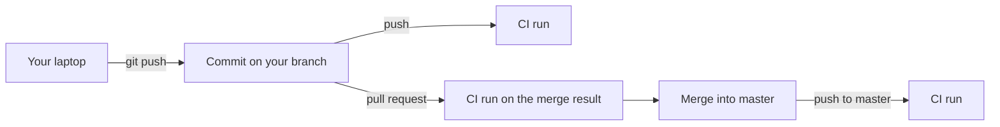

## Before you start

- [[foundation.l2.git-merge-vs-rebase]] — you know what a merge joins and that two branches can each be fine while their combination is not.
- [[management.l1.code-review-basics]] — you know that a pull request holds a change open before it is merged into `master`.
- [[devops.l1.twelve-factor-config]] — you know the lab keeps its secrets in `.env`, a file that exists on your laptop but is never committed.

## The situation

On Monday you rename a method in `DonHang.Domain` and fix every caller on your branch. A teammate's branch, started last week, adds a new call to the old name. Each branch builds on its owner's laptop, and both are merged into `master` the same afternoon. Now `master` does not build, and nobody notices until Thursday, when someone pulls and spends an hour finding out whose change broke it. The same week, another branch built only because a new file sat on its author's laptop and was never committed. How does the team learn that `master` is broken within minutes, on the commit that broke it, instead of days later?

## Core concepts

- **continuous integration** — merging small changes into the shared main branch often, with every change built and tested automatically by a machine rather than by whoever remembers to.
- Main branch — the branch everybody merges into and starts from; in Đơn Hàng it is `master`.
- CI run — one automatic build and test of one commit, started by an event such as a push.
- Clean machine — a machine started fresh for each run, which receives only the files committed in that commit.

## How it works



Integration is the moment two people's changes meet. In the situation above, they met once, late, and the breakage waited days for a person to find it. Continuous integration answers with two habits: merge small changes often, so each meeting is small, and let a machine build and test every change, so a broken combination is found minutes after it is made.

Đơn Hàng's repository lives on GitHub. GitHub's CI service, GitHub Actions, reads `.github/workflows/ci.yml` and runs each CI run on machines of its own. The file starts a run on every push to any branch, and whenever a pull request is opened or updated, unless it has a merge conflict.

Follow the diagram. Your push starts a run on your branch's commit. Opening the pull request starts another run. That run builds the commit that merging your branch into `master` would produce, so it meets the old call if your teammate's change is already in `master`. If that change arrives later, the run on the push to `master` catches it, on the commit that broke it.

Each run starts on a clean machine. It gets the commit's files, and the setup steps make sure the tools the repository asks for are there. One is a .NET SDK (the `dotnet` command and the compiler behind it) of a version that `global.json`, a committed file, accepts. The file that was never committed does not exist there, so the build fails on that commit, not on a teammate's laptop next week.

A CI result belongs to one commit. Green says that this commit built and passed its checks, and nothing about the next commit, which gets its own run.

## In the Đơn Hàng system

The start of `ci.yml` at stage-1:

```yaml file=.github/workflows/ci.yml tag=stage-1 lines=1-16
name: ci

on:
  push:
  pull_request:
  workflow_dispatch:

jobs:
  lab:
    runs-on: ubuntu-24.04
    steps:
      - uses: actions/checkout@v4

      - uses: actions/setup-dotnet@v4
        with:
          global-json-file: global.json
```

Look at `on:` first. `push:` and `pull_request:` have no branch list under them, so pushes to every branch and pull requests all start a run; `workflow_dispatch:` waits for the next lesson. The lines under `jobs:` fetch the commit's files and set up the SDK; the next lesson reads them line by line. Here, notice that nothing comes from your laptop.

Further down, the same file runs the checks:

```yaml file=.github/workflows/ci.yml tag=stage-1 lines=25-29
      - name: Build the solution
        run: dotnet build DonHang.slnx --warnaserror

      - name: Test the solution
        run: dotnet test DonHang.slnx --no-build
```

These are the commands you could run yourself: `--warnaserror` turns compiler warnings into errors, and `--no-build` makes the test step reuse the build of the step before. The difference is that here they always run, on every change, on a machine that holds only what was committed.

## Beginners often think…

- **"CI is the name of a tool like GitHub Actions; a team that uses GitHub Actions is doing CI by definition."** → Actually continuous integration is a practice: merge small changes often and have each one checked automatically. A service only runs the checks. A team that keeps branches open for a month and merges them all at the end gets a green run on every branch and still meets the breakage late, at the merge. You notice this when every branch is green and the week of big merges still turns `master` red.
- **"If I run the tests on my own machine before pushing, a CI run adds nothing."** → Actually your laptop is not the commit. It holds files you never committed, tools you installed once, and your branch without your teammates' newest changes. A CI run builds exactly the committed files on a clean machine, and for a pull request the merge result too. You notice this when the tests pass on your laptop and the CI run of the same commit fails on a missing file.

## Try it (3 minutes)

In Git Bash, in your Đơn Hàng folder:

1. Create an empty file: `touch DonHang.Domain/Scratch.cs`.
2. Run `git status --short`.
3. Delete the file again: `rm DonHang.Domain/Scratch.cs`.
4. Think: if `DonHang.Domain/OrderService.cs` used a class defined only in `Scratch.cs`, where would the build pass, and where would it fail?

Expected result: step 2 prints `?? DonHang.Domain/Scratch.cs`. The `??` marks a file Git does not track, so it is in no commit and a CI run would never see it.

<details><summary>Suggested answer</summary>

`dotnet build` would pass on your laptop, because it compiles every `.cs` file in the project folder, tracked or not. The CI run of your commit would fail at "Build the solution", because the clean machine has no `Scratch.cs`. The run is red on your commit, before anyone else pulls it.

</details>

## Connections

- [[devops.l2.ci-pipeline-anatomy]] — the next step: what each line of `ci.yml` means and the order in which it runs.
- [[devops.l2.quality-gate]] — what a red run should stop, and why stopping a merge is a setting, not a line in `ci.yml`.
- [[foundation.l2.git-merge-vs-rebase]] — the merge whose result a pull request's CI run builds.
- [[devops.l1.twelve-factor-config]] — the same idea at deploy time: one build from the committed code, nothing from one person's machine.

## Five-line summary

1. Continuous integration means merging small changes often, with a machine building and testing every change automatically.
2. Đơn Hàng's `ci.yml` starts a run on every push to any branch and on every pull request without a merge conflict.
3. A pull request's run builds the merge result, so a broken combination shows up before the merge.
4. Each run starts on a clean machine with only the committed files, so an uncommitted file or a laptop-only tool fails there.
5. A CI result belongs to one commit: green says that commit passed its checks, nothing about later commits.
