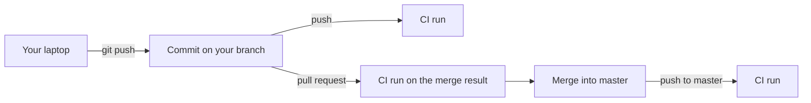

## Bạn cần biết trước

- [[foundation.l2.git-merge-vs-rebase]] — bạn biết merge nối những gì, và hai branch có thể đều ổn trong khi kết quả gộp của chúng thì không.
- [[management.l1.code-review-basics]] — bạn biết pull request giữ một thay đổi chờ đó trước khi nó được merge vào `master`.
- [[devops.l1.twelve-factor-config]] — bạn biết lab giữ secret trong `.env`, một file có trên laptop của bạn nhưng không bao giờ được commit.

## Tình huống

Thứ Hai, bạn đổi tên một method trong `DonHang.Domain` và sửa mọi chỗ gọi nó trên branch của mình. Branch của một đồng nghiệp, bắt đầu từ tuần trước, thêm một lời gọi mới tới tên cũ. Branch nào cũng build được trên laptop của người làm, và cả hai được merge vào `master` trong cùng một buổi chiều. Giờ `master` không build được nữa, và không ai để ý cho tới thứ Năm, khi có người pull về rồi mất cả tiếng để tìm xem thay đổi của ai làm hỏng. Cũng tuần đó, một branch khác build được chỉ vì có một file mới nằm trên laptop của tác giả mà chưa bao giờ được commit. Làm sao để cả team biết `master` hỏng chỉ sau vài phút, ngay trên commit gây hỏng, thay vì vài ngày sau?

## Khái niệm cốt lõi

- **tích hợp liên tục** (continuous integration) — thường xuyên merge các thay đổi nhỏ vào branch chính dùng chung, mỗi thay đổi được máy build và test tự động thay vì trông vào ai nhớ thì làm.
- Branch chính — branch mà mọi người merge vào và tách ra từ đó; trong Đơn Hàng là `master`.
- Lần chạy CI — một lần build và test tự động cho một commit, được khởi động bởi một sự kiện như push.
- Máy sạch — máy được khởi động mới cho mỗi lần chạy, chỉ nhận những file đã commit trong commit đó.

## Cơ chế hoạt động



Tích hợp là lúc thay đổi của hai người gặp nhau. Trong tình huống trên, chúng gặp nhau đúng một lần, lại muộn, và chỗ hỏng phải chờ vài ngày mới có người tìm ra. Tích hợp liên tục trả lời bằng hai thói quen đi cùng nhau: merge thay đổi nhỏ thường xuyên, để mỗi lần gặp đều nhỏ, và để máy build và test mọi thay đổi, để một tổ hợp hỏng lộ ra chỉ vài phút sau khi nó xuất hiện.

Repository của Đơn Hàng nằm trên GitHub. Dịch vụ CI của GitHub, GitHub Actions, đọc `.github/workflows/ci.yml` và chạy mỗi lần chạy CI trên máy riêng của nó. File này khởi động một lần chạy mỗi khi có push lên bất kỳ branch nào, và mỗi khi một pull request được mở hoặc cập nhật, trừ khi pull request đó đang có conflict khi merge.

Hãy đi theo sơ đồ. Lần push của bạn khởi động một lần chạy trên commit của branch bạn. Mở pull request khởi động thêm một lần chạy nữa. Lần chạy đó build commit mà việc merge branch của bạn vào `master` sẽ tạo ra, nên nó gặp lời gọi tên cũ nếu thay đổi của đồng nghiệp đã nằm trong `master`. Nếu thay đổi đó vào sau, lần chạy khi push lên `master` sẽ bắt được, ngay trên commit gây hỏng.

Mỗi lần chạy bắt đầu trên một máy sạch. Máy nhận các file của commit, và các bước chuẩn bị bảo đảm có sẵn những công cụ repository yêu cầu. Một trong số đó là .NET SDK (lệnh `dotnet` và trình biên dịch đứng sau nó) ở phiên bản mà `global.json`, một file đã commit, chấp nhận. File chưa từng được commit thì không có ở đó, nên build fail ngay trên commit ấy, chứ không phải trên laptop của đồng nghiệp tuần sau.

Kết quả CI thuộc về một commit. Xanh nghĩa là commit này đã build và qua các bước kiểm tra, và không nói gì về commit tiếp theo, vốn có lần chạy riêng của nó.

## Trong hệ thống Đơn Hàng

Phần đầu của `ci.yml` ở stage-1:

```yaml file=.github/workflows/ci.yml tag=stage-1 lines=1-16
name: ci

on:
  push:
  pull_request:
  workflow_dispatch:

jobs:
  lab:
    runs-on: ubuntu-24.04
    steps:
      - uses: actions/checkout@v4

      - uses: actions/setup-dotnet@v4
        with:
          global-json-file: global.json
```

Nhìn `on:` trước. Dưới `push:` và `pull_request:` không có danh sách branch nào, nên push lên mọi branch và mọi pull request đều khởi động một lần chạy, còn `workflow_dispatch:` để dành cho bài sau. Các dòng dưới `jobs:` lấy file của commit về và chuẩn bị SDK, bài sau sẽ đọc từng dòng. Ở đây, hãy để ý rằng không có gì đến từ laptop của bạn.

Xuống dưới, cùng file đó chạy các bước kiểm tra:

```yaml file=.github/workflows/ci.yml tag=stage-1 lines=25-29
      - name: Build the solution
        run: dotnet build DonHang.slnx --warnaserror

      - name: Test the solution
        run: dotnet test DonHang.slnx --no-build
```

Đây là những lệnh bạn tự chạy được: `--warnaserror` biến cảnh báo của trình biên dịch thành lỗi, còn `--no-build` cho bước test dùng lại bản build của bước trước. Khác biệt là ở đây chúng luôn chạy, với mọi thay đổi, trên một máy chỉ có những gì đã commit.

## Người mới hay nghĩ rằng…

- **"CI là tên của một công cụ như GitHub Actions; team nào dùng GitHub Actions thì đương nhiên đang làm CI."** → Thực ra tích hợp liên tục là một thói quen làm việc: merge thay đổi nhỏ thường xuyên và để mỗi thay đổi được kiểm tra tự động. Dịch vụ chỉ chạy các bước kiểm tra. Một team giữ branch mở cả tháng rồi merge tất cả vào cuối kỳ vẫn có lần chạy xanh trên từng branch, mà vẫn gặp chỗ hỏng muộn, đúng lúc merge. Bạn sẽ nhận ra khi branch nào cũng xanh mà tuần merge lớn vẫn làm `master` đỏ.
- **"Nếu tôi đã chạy test trên máy mình trước khi push thì lần chạy CI chẳng thêm được gì."** → Thực ra laptop của bạn không phải là commit. Nó chứa file bạn chưa commit, công cụ bạn cài một lần, và branch của bạn khi chưa có thay đổi mới nhất của đồng nghiệp. Lần chạy CI build đúng những file đã commit trên một máy sạch, và với pull request thì build cả kết quả merge. Bạn sẽ nhận ra khi test qua trên laptop mà lần chạy CI của cùng commit lại fail vì thiếu một file.

## Thử ngay (3 phút)

Trong Git Bash, ở thư mục Đơn Hàng của bạn:

1. Tạo một file rỗng: `touch DonHang.Domain/Scratch.cs`.
2. Chạy `git status --short`.
3. Xóa file đó đi: `rm DonHang.Domain/Scratch.cs`.
4. Nghĩ thử: nếu `DonHang.Domain/OrderService.cs` dùng một class chỉ được định nghĩa trong `Scratch.cs`, build sẽ qua ở đâu và fail ở đâu?

Kết quả mong đợi: bước 2 in ra `?? DonHang.Domain/Scratch.cs`. Dấu `??` đánh dấu file mà Git không theo dõi, nên nó không nằm trong commit nào và lần chạy CI sẽ không bao giờ thấy nó.

<details><summary>Gợi ý đáp án</summary>

`dotnet build` sẽ qua trên laptop của bạn, vì nó biên dịch mọi file `.cs` trong thư mục project, dù Git có theo dõi hay không. Lần chạy CI của commit sẽ fail ở bước "Build the solution", vì máy sạch không có `Scratch.cs`. Lần chạy đỏ ngay trên commit của bạn, trước khi bất kỳ ai khác pull về.

</details>

## Liên hệ

- [[devops.l2.ci-pipeline-anatomy]] — bước tiếp theo: từng dòng của `ci.yml` nghĩa là gì và chạy theo thứ tự nào.
- [[devops.l2.quality-gate]] — một lần chạy đỏ nên chặn điều gì, và vì sao chặn merge là một thiết lập chứ không phải một dòng trong `ci.yml`.
- [[foundation.l2.git-merge-vs-rebase]] — phép merge mà lần chạy CI của pull request build kết quả.
- [[devops.l1.twelve-factor-config]] — cùng ý tưởng đó ở lúc deploy: một bản build từ code đã commit, không có gì từ máy của riêng ai.

## Tóm tắt 5 dòng

1. Tích hợp liên tục là merge thay đổi nhỏ thường xuyên, với máy tự build và test mọi thay đổi.
2. `ci.yml` của Đơn Hàng khởi động một lần chạy với mọi push lên bất kỳ branch nào và mọi pull request không có conflict khi merge.
3. Lần chạy của pull request build kết quả merge, nên một tổ hợp hỏng lộ ra trước khi merge.
4. Mỗi lần chạy bắt đầu trên máy sạch chỉ có file đã commit, nên file chưa commit hay công cụ chỉ có trên laptop sẽ fail ở đó.
5. Kết quả CI thuộc về một commit: xanh nói commit đó đã qua các bước kiểm tra, không nói gì về các commit sau.
