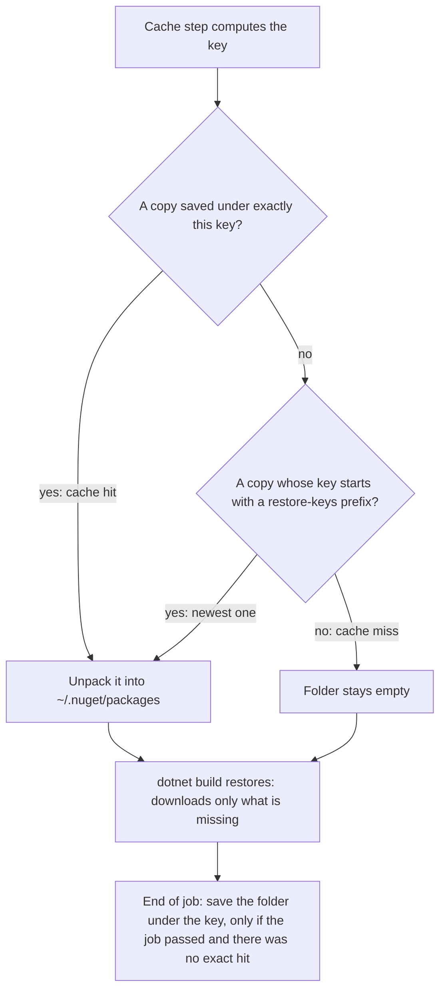

## Before you start

- [[devops.l2.quality-gate]] — you know the `test` job that builds and tests Đơn Hàng on every push.
- [[devops.l1.dockerfile-for-dotnet]] — you know that `dotnet restore` downloads the NuGet packages a project declares, and that it is the slow part worth reusing.
- [[foundation.l1.http-caching]] — you know a cache keeps a copy so the next request can skip the slow trip, and what a cache hit and a cache miss are.

## The situation

You compare two logs of Đơn Hàng's `test` job at stage-2. In the first run with the new workflow, one step printed `Cache not found for input keys`, then `dotnet build` restored all six projects, downloading every NuGet package they need from the internet. The job still passed. The next run, for a later commit, printed `Cache hit for:` followed by a long name starting with `Linux-nuget-`, and every project's restore finished in under a second. Each run had a fresh runner with nothing left from earlier runs. Where did the packages come from the second time, what is that long name, and what happens when nothing is found?

## Core concepts

- **cache key** — the name a saved copy is stored and looked up under; a different key means a different copy.
- `actions/cache` — a ready-made step published on GitHub, pulled into a job with `uses:`, that, given a folder and a cache key, restores a saved copy of the folder before later steps run and saves the folder at the end of the job.
- `restore-keys` — prefixes the action tries, in order, when no saved copy has exactly the cache key.
- NuGet package folder — NuGet is .NET's package system, and a package is a library a project declares; `~/.nuget/packages` is the folder where `dotnet restore` stores every package it downloads and looks first before downloading.

## How it works



In the situation above, the cache step runs before `dotnet build`. It computes the cache key, `Linux-nuget-` followed by a long hash, and asks GitHub for a copy saved under exactly that key. If one exists, that is a cache hit: the step unpacks it into `~/.nuget/packages`. If not, the step tries each `restore-keys` prefix and restores the newest copy whose key starts with it. If nothing matches either, the folder stays empty, as in the first run.

Either way, the next step is still `dotnet build`, which restores first. It finds the packages already in the folder and downloads only those that are missing: all of them after a miss, none after an exact hit, only the new ones after a prefix match.

Saving happens at the very end of the job, in a step GitHub adds after your last step. It saves only if the job succeeded, and only if there was no exact hit. After an exact hit the log says `Cache hit occurred on the primary key`, followed by the key and `not saving cache.` Primary key here means the `key:` value itself, not a database key. After a prefix match it saves the completed folder under the new key, so the next run with the same packages gets an exact hit.

Nothing in the job depends on a hit. A cache is a shortcut: when it is missing, the job does the slow work and ends the same way. GitHub can also remove saved caches on its own, so the workflow must never need one.

## In the Đơn Hàng system

The cache step sits between installing the SDK and building, in the `test` job of `ci.yml`:

```yaml file=.github/workflows/ci.yml tag=stage-2 lines=22-38
      # lesson: devops.l2.dependency-cache
      # The key changes exactly when a declared package changes. With no exact
      # match, the newest cache whose key starts with the restore-keys prefix
      # is restored, and dotnet restore downloads only what is still missing.
      - name: Cache NuGet packages
        uses: actions/cache@v4
        with:
          path: ~/.nuget/packages
          key: ${{ runner.os }}-nuget-${{ hashFiles('Directory.Packages.props', '**/*.csproj') }}
          restore-keys: |
            ${{ runner.os }}-nuget-

      - name: Build the solution
        run: dotnet build DonHang.slnx --warnaserror

      - name: Test the solution
        run: dotnet test DonHang.slnx --no-build
```

`runner.os` is `Linux` on this runner. `hashFiles` turns the contents of every matching file into one hash; `**/*.csproj` matches the project files in every folder. There is no `dotnet restore` step: `dotnet build` restores first. Each `${{ … }}` is replaced by its value, so the key becomes `Linux-nuget-` plus the hash. The `|` lets `restore-keys` list several prefixes, one per line; here there is one. The prefix `Linux-nuget-` matches the key of every NuGet cache saved on a Linux runner, whatever its hash.

Why those files? Đơn Hàng keeps package versions in one place:

```xml file=Directory.Packages.props tag=stage-2 lines=1-18
<Project>
  <PropertyGroup>
    <ManagePackageVersionsCentrally>true</ManagePackageVersionsCentrally>
  </PropertyGroup>
  <ItemGroup>
    <PackageVersion Include="MailKit" Version="4.18.0" />
    <PackageVersion Include="Microsoft.AspNetCore.Authentication.JwtBearer" Version="10.0.12" />
    <PackageVersion Include="Microsoft.AspNetCore.OpenApi" Version="10.0.12" />
    <PackageVersion Include="Microsoft.EntityFrameworkCore.Design" Version="10.0.4">
      <IncludeAssets>runtime; build; native; contentfiles; analyzers; buildtransitive</IncludeAssets>
      <PrivateAssets>all</PrivateAssets>
    </PackageVersion>
    <PackageVersion Include="Microsoft.Extensions.Diagnostics.HealthChecks.EntityFrameworkCore" Version="10.0.4" />
    <PackageVersion Include="StackExchange.Redis" Version="3.3.1" />
    <PackageVersion Include="Npgsql" Version="9.0.4" />
    <PackageVersion Include="Npgsql.EntityFrameworkCore.PostgreSQL" Version="10.0.3" />
    <PackageVersion Include="prometheus-net.AspNetCore" Version="8.2.1" />
  </ItemGroup>
```

With `ManagePackageVersionsCentrally`, each `.csproj` names the packages it uses with a `PackageReference` line and this file sets their versions. Together they declare every package, so changing a version here or adding a package to a project changes the key. Any other edit to these files changes it too, which only costs one extra save of the folder at the end of the next run. Raise `StackExchange.Redis` to a newer version, and the next run finds no exact match, restores the previous copy through the prefix, downloads only what is new, and saves under the new key.

## Beginners often think…

- **"A cache hit means the build step itself is skipped."** → Actually the cache step only fills `~/.nuget/packages`; `dotnet build` and `dotnet test` run in full every time, because no step in `ci.yml` looks at whether the cache hit. You notice this when a run that printed `Cache hit for:` still shows the whole build and the `Passed!` line of every test project.
- **"The cache key should never change, so that the cache is always hit."** → Actually, with a fixed key every run hits the copy saved on the very first run, and an exact hit saves nothing. Every package added later is then downloaded on every run and never saved. You notice this when the log says `not saving cache.` while the restore keeps downloading the packages added since the first run.

## Try it (3 minutes)

On your machine, where you built Đơn Hàng at stage-2:

1. Run `dotnet nuget locals global-packages --list` to see where `dotnet restore` keeps packages.
2. Open that folder and list the subfolder `stackexchange.redis` (the folder uses the package name in lower case).
3. Think: which of these changes gives the `test` job a new cache key? (a) editing `DonHang.Domain/OrderService.cs`; (b) changing `Npgsql`'s `Version` in `Directory.Packages.props`; (c) adding a `PackageReference` to `DonHang.Api/DonHang.Api.csproj`.

Expected result: step 1 prints one line starting with `global-packages:` and ending in `.nuget` and `packages`, under your user folder: the same folder the runner caches as `~/.nuget/packages`. Step 2 lists a folder named `3.3.1`, the version from `Directory.Packages.props`, possibly next to other versions that other projects on your machine restored.

<details><summary>Suggested answer</summary>

(b) and (c). Both edit a file that `hashFiles` reads, so the hash and the key change; the next run restores the older copy through `restore-keys` and downloads only what is new. (a) changes no file in the key, so the next run gets an exact hit, and `dotnet build` still compiles the changed code.

</details>

## Connections

- [[devops.l2.quality-gate]] — prerequisite: the `test` job this cache makes faster without changing what it checks.
- [[devops.l1.dockerfile-for-dotnet]] — the same idea inside a `Dockerfile`: restore from the project files alone, so the restore is reused until a project file changes.
- [[foundation.l1.http-caching]] — the same trade one layer up: a saved copy found by its key, reused instead of fetching again.
- [[devops.l2.workflow-artifacts]] — next: handing files from one job to another within a run, which a cache is not built for.

## Five-line summary

1. `actions/cache` saves a folder under a cache key and restores it in later runs, so `dotnet restore` downloads only missing packages.
2. Every job starts on a fresh runner, so without a cache the restore downloads every NuGet package again.
3. Đơn Hàng's key hashes `Directory.Packages.props` and every `.csproj`, so it changes whenever the declared packages change.
4. With no exact match, `restore-keys` restores the newest copy whose key has the prefix; if the job passes, it saves under the new key.
5. A cache only saves time: the build and tests always run, and the job must pass with nothing restored.
