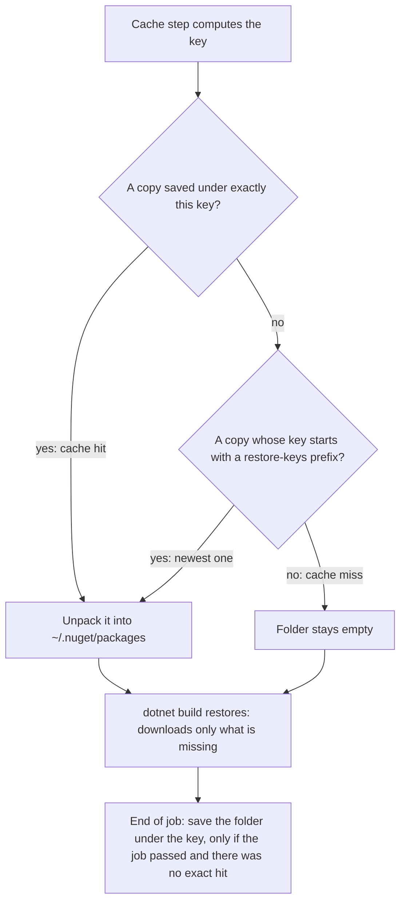

## Bạn cần biết trước

- [[devops.l2.quality-gate]] — bạn biết job `test` build và test Đơn Hàng ở mỗi lần push.
- [[devops.l1.dockerfile-for-dotnet]] — bạn biết `dotnet restore` tải các gói NuGet mà project khai báo, và đó là phần chậm đáng được dùng lại.
- [[foundation.l1.http-caching]] — bạn biết cache giữ một bản sao để request sau khỏi phải đi đường xa, và thế nào là cache hit, cache miss.

## Tình huống

Bạn so hai log của job `test` của Đơn Hàng ở stage-2. Ở lần chạy đầu tiên với workflow mới, một step in ra `Cache not found for input keys`, rồi `dotnet build` restore cả sáu project, tải từ internet mọi gói NuGet chúng cần. Job vẫn qua. Lần chạy sau, cho một commit mới hơn, in ra `Cache hit for:` kèm một cái tên dài bắt đầu bằng `Linux-nuget-`, và phần restore của project nào cũng xong trong chưa tới một giây. Mỗi lần chạy đều có runner mới, không còn gì từ các lần trước. Lần thứ hai, các gói đến từ đâu, cái tên dài kia là gì, và khi không tìm thấy gì thì chuyện gì xảy ra?

## Khái niệm cốt lõi

- **cache key** (tên dùng để lưu và tìm lại một bản cache; key khác là bản cache khác) — cái tên mà một bản sao được lưu dưới đó và được tìm lại theo đó, key khác nghĩa là bản sao khác.
- `actions/cache` — một step dựng sẵn, công bố trên GitHub, được kéo vào job bằng `uses:`. Nhận một thư mục và một cache key, nó restore bản sao đã lưu của thư mục trước khi các step sau chạy, và lưu thư mục ở cuối job.
- `restore-keys` — các tiền tố mà action thử lần lượt khi không có bản sao nào được lưu đúng dưới cache key.
- Thư mục gói NuGet — NuGet là hệ thống gói của .NET, mỗi gói là một thư viện mà project khai báo. `~/.nuget/packages` là thư mục nơi `dotnet restore` cất mọi gói nó tải về, và là chỗ nó tìm trước khi tải.

## Cơ chế hoạt động



Trong tình huống trên, step cache chạy trước `dotnet build`. Nó tính cache key, gồm `Linux-nuget-` và một hash dài, rồi hỏi GitHub xem có bản sao nào được lưu đúng dưới key đó không. Nếu có, đó là cache hit: step giải nén bản sao vào `~/.nuget/packages`. Nếu không, step thử từng tiền tố trong `restore-keys` và restore bản sao mới nhất có key bắt đầu bằng tiền tố đó. Nếu vẫn không khớp gì, thư mục để trống, như ở lần chạy đầu.

Dù thế nào, step kế tiếp vẫn là `dotnet build`, và nó restore trước. Nó thấy các gói đã có trong thư mục và chỉ tải những gói còn thiếu: tất cả sau một cache miss, không gói nào sau một hit đúng key, chỉ các gói mới sau một lần khớp tiền tố.

Lưu xảy ra ở tận cuối job, trong một step mà GitHub thêm vào sau step cuối của bạn. Nó chỉ lưu khi job thành công, và chỉ khi không có hit đúng key. Sau một hit đúng key, log ghi `Cache hit occurred on the primary key`, theo sau là key và `not saving cache.` Primary key ở đây chính là giá trị `key:`, không phải khóa chính của database. Sau một lần khớp tiền tố, nó lưu thư mục đã đủ gói dưới key mới, để lần chạy sau với cùng các gói được hit đúng key.

Không có gì trong job phụ thuộc vào một lần hit. Cache là lối tắt: khi không có nó, job làm phần việc chậm và kết thúc y như vậy. GitHub cũng có thể tự xóa các cache đã lưu, nên workflow không bao giờ được cần tới cache.

## Trong hệ thống Đơn Hàng

Step cache nằm giữa bước cài SDK và bước build, trong job `test` của `ci.yml`:

```yaml file=.github/workflows/ci.yml tag=stage-2 lines=22-38
      # lesson: devops.l2.dependency-cache
      # The key changes exactly when a declared package changes. With no exact
      # match, the newest cache whose key starts with the restore-keys prefix
      # is restored, and dotnet restore downloads only what is still missing.
      - name: Cache NuGet packages
        uses: actions/cache@v4
        with:
          path: ~/.nuget/packages
          key: ${{ runner.os }}-nuget-${{ hashFiles('Directory.Packages.props', '**/*.csproj') }}
          restore-keys: |
            ${{ runner.os }}-nuget-

      - name: Build the solution
        run: dotnet build DonHang.slnx --warnaserror

      - name: Test the solution
        run: dotnet test DonHang.slnx --no-build
```

Trên runner này, `runner.os` là `Linux`. `hashFiles` biến nội dung của mọi file khớp mẫu thành một hash, còn `**/*.csproj` khớp file project ở mọi thư mục. Không có step `dotnet restore` riêng: `dotnet build` tự restore trước. Mỗi `${{ … }}` được thay bằng giá trị của nó, nên key thành `Linux-nuget-` cộng hash. Dấu `|` cho phép `restore-keys` liệt kê nhiều tiền tố, mỗi dòng một tiền tố, ở đây chỉ có một. Tiền tố `Linux-nuget-` khớp key của mọi cache NuGet được lưu trên runner Linux, bất kể hash là gì.

Vì sao lại là các file đó? Đơn Hàng giữ version của các gói ở một chỗ:

```xml file=Directory.Packages.props tag=stage-2 lines=1-18
<Project>
  <PropertyGroup>
    <ManagePackageVersionsCentrally>true</ManagePackageVersionsCentrally>
  </PropertyGroup>
  <ItemGroup>
    <PackageVersion Include="MailKit" Version="4.18.0" />
    <PackageVersion Include="Microsoft.AspNetCore.Authentication.JwtBearer" Version="10.0.12" />
    <PackageVersion Include="Microsoft.AspNetCore.OpenApi" Version="10.0.12" />
    <PackageVersion Include="Microsoft.EntityFrameworkCore.Design" Version="10.0.4">
      <IncludeAssets>runtime; build; native; contentfiles; analyzers; buildtransitive</IncludeAssets>
      <PrivateAssets>all</PrivateAssets>
    </PackageVersion>
    <PackageVersion Include="Microsoft.Extensions.Diagnostics.HealthChecks.EntityFrameworkCore" Version="10.0.4" />
    <PackageVersion Include="StackExchange.Redis" Version="3.3.1" />
    <PackageVersion Include="Npgsql" Version="9.0.4" />
    <PackageVersion Include="Npgsql.EntityFrameworkCore.PostgreSQL" Version="10.0.3" />
    <PackageVersion Include="prometheus-net.AspNetCore" Version="8.2.1" />
  </ItemGroup>
```

Với `ManagePackageVersionsCentrally`, mỗi `.csproj` nêu các gói nó dùng bằng một dòng `PackageReference`, còn file này đặt version cho chúng. Gộp lại, hai loại file khai báo mọi gói, nên đổi một version ở đây hay thêm một gói vào project đều đổi key. Sửa gì khác trong các file này cũng đổi key, và cái giá chỉ là thêm một lần lưu thư mục ở cuối lần chạy kế. Nâng `StackExchange.Redis` lên version mới hơn, lần chạy sau sẽ không thấy bản khớp đúng key, restore bản sao trước đó qua tiền tố, chỉ tải phần mới, rồi lưu dưới key mới.

## Người mới hay nghĩ rằng…

- **"Cache hit nghĩa là bỏ qua luôn bước build."** → Thực ra step cache chỉ đổ dữ liệu vào `~/.nuget/packages`. `dotnet build` và `dotnet test` lần nào cũng chạy đầy đủ, vì không step nào trong `ci.yml` xem cache có hit hay không. Bạn sẽ nhận ra khi một lần chạy đã in `Cache hit for:` vẫn hiện toàn bộ quá trình build và dòng `Passed!` của từng project test.
- **"Cache key không bao giờ nên đổi, để cache lúc nào cũng hit."** → Thực ra với key cố định, lần chạy nào cũng hit vào bản sao lưu ở lần chạy đầu tiên, mà hit đúng key thì không lưu gì. Mọi gói thêm về sau bị tải lại ở mọi lần chạy và không bao giờ được lưu. Bạn sẽ nhận ra khi log ghi `not saving cache.` trong khi bước restore cứ tải lại các gói được thêm từ sau lần chạy đầu.

## Thử ngay (3 phút)

Trên máy bạn, nơi bạn đã build Đơn Hàng ở stage-2:

1. Chạy `dotnet nuget locals global-packages --list` để xem `dotnet restore` cất gói ở đâu.
2. Mở thư mục đó và liệt kê thư mục con `stackexchange.redis` (tên thư mục là tên gói viết thường).
3. Nghĩ xem: thay đổi nào dưới đây cho job `test` một cache key mới? (a) sửa `DonHang.Domain/OrderService.cs`. (b) đổi `Version` của `Npgsql` trong `Directory.Packages.props`. (c) thêm một `PackageReference` vào `DonHang.Api/DonHang.Api.csproj`.

Kết quả mong đợi: bước 1 in một dòng bắt đầu bằng `global-packages:` và kết thúc bằng `.nuget` rồi `packages`, nằm trong thư mục người dùng của bạn: chính là thư mục mà runner cache dưới tên `~/.nuget/packages`. Bước 2 liệt kê một thư mục tên `3.3.1`, version trong `Directory.Packages.props`, có thể nằm cạnh các version khác mà những project khác trên máy bạn đã restore.

<details><summary>Gợi ý đáp án</summary>

(b) và (c). Cả hai đều sửa một file mà `hashFiles` đọc, nên hash và key đổi. Lần chạy sau restore bản sao cũ qua `restore-keys` và chỉ tải phần mới. (a) không đổi file nào nằm trong key, nên lần chạy sau hit đúng key, và `dotnet build` vẫn biên dịch đoạn code đã sửa.

</details>

## Liên hệ

- [[devops.l2.quality-gate]] — bài nền: job `test` mà cache này làm nhanh hơn, không đổi những gì nó kiểm.
- [[devops.l1.dockerfile-for-dotnet]] — cùng ý tưởng bên trong một `Dockerfile`: restore chỉ từ các file project, nên phần restore được dùng lại cho tới khi một file project đổi.
- [[foundation.l1.http-caching]] — cùng một sự đánh đổi ở tầng trên: bản sao được tìm theo key, dùng lại thay vì lấy lại từ đầu.
- [[devops.l2.workflow-artifacts]] — bài tiếp theo: chuyển file từ job này sang job khác trong cùng một lần chạy, việc mà cache không được làm ra để lo.

## Tóm tắt 5 dòng

1. `actions/cache` lưu một thư mục dưới một cache key và restore nó ở các lần chạy sau, nên `dotnet restore` chỉ tải các gói còn thiếu.
2. Mỗi job bắt đầu trên một runner mới, nên không có cache thì bước restore tải lại mọi gói NuGet.
3. Key của Đơn Hàng băm `Directory.Packages.props` và mọi `.csproj`, nên nó đổi mỗi khi các gói được khai báo đổi.
4. Khi không có bản khớp đúng key, `restore-keys` restore bản mới nhất có key mang tiền tố đó, và nếu job qua thì lưu dưới key mới.
5. Cache chỉ tiết kiệm thời gian: build và test luôn chạy, và job phải qua được khi không có gì được restore.
