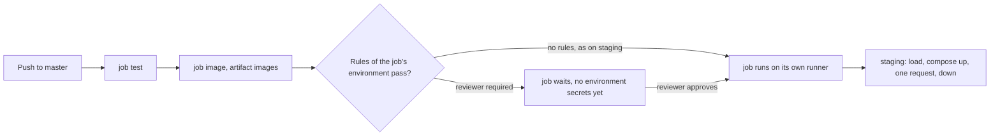

## Before you start

- [[devops.l2.workflow-artifacts]] — you know how the `staging` job gets the images the `image` job built, as the artifact `images`.
- [[devops.l1.secrets-vs-config]] — you know a secret is config that gives power to whoever reads it, and that `scripts/dev-secrets.sh` creates fake ones.
- [[devops.l1.compose-for-the-api]] — you know the `api` service in `docker-compose.yml` and how Compose waits for `db` before starting it.

## The situation

At stage-2, every push to `master` that passes `test` and `image` goes on, with nobody clicking anything, to a `staging` job, and so far each one has turned green. In a team meeting a teammate says Đơn Hàng now does continuous deployment. The team lead gets nervous: she wants a person to say yes before customers ever see a new version. Another teammate opens the repository on GitHub, finds an environment called `staging` with a list of deployments, and asks which server it is. Nobody remembers setting one up. What does `environment: staging` give the job, where does staging actually run, and how would a person get a say before a green build goes further?

## Core concepts

- **continuous delivery** — every change that passes CI is kept ready to deploy by automated steps, and a person still decides when it goes to production, the running copy customers use.
- **continuous deployment** — continuous delivery without that decision: every change that passes CI is deployed to production automatically. Some sources, GitHub's documentation among them, use this name for any automated deploy; this course keeps the two apart.
- **deployment environment** — a named target, such as `staging`, that a job declares with `environment:`; GitHub keeps its protection rules and secrets, and lists the job's runs as deployments.
- Protection rule — a condition set on an environment in the repository settings, such as required reviewers, that must pass before a job that references the environment starts.
- Environment secret — a secret stored on an environment and given only to jobs that reference that environment.

## How it works



In the situation above, the pipeline takes every green push to `master`, by automated steps, to a running copy of Đơn Hàng that answers a request. That is continuous delivery. It would be continuous deployment only if a last step put every such change in production with no person deciding. Đơn Hàng has no production at stage-2, so nothing goes that far.

`environment: staging` names a deployment environment; it does not create a server. When a job first referenced `staging`, GitHub created an environment with that name, and it records each run of that job as a deployment to it, listed on the repository's Deployments page. That list is what your teammate found.

The environment is where a gate goes. Protection rules set on it, such as required reviewers, are checked before any job that references it starts; after approval, the job runs. For the lead's wish, the gate belongs on the environment customers see: a later job with `environment: production` and a required reviewer. Green builds would still reach `staging` on their own, then wait for a person. That approval is what keeps delivery from being deployment.

Secrets stored on an environment go only to jobs that reference it, and, under a required approval, only after it. `publish` has the same `if:` and `needs:` as `staging` but no `environment:`, so it could read none of them.

Đơn Hàng sets no rule and no secret on `staging`, so the job starts once `test` and `image` pass. Its staging is a throwaway copy on the job's own runner, running the API from the image artifact. Running Đơn Hàng somewhere that stays up comes in a later track.

## In the Đơn Hàng system

The head of the `staging` job:

```yaml file=.github/workflows/ci.yml tag=stage-2 lines=85-93
  # lesson: devops.l2.deployment-environments
  # Every green push to master is delivered to staging: a throwaway copy of
  # Đơn Hàng's services, started on this job's own runner from the images
  # the image job built, checked with one request, then removed.
  staging:
    if: github.event_name == 'push' && github.ref == 'refs/heads/master'
    needs: [test, image]
    runs-on: ubuntu-24.04
    environment: staging
```

`if:` lets the job run only when the event is a push and the branch is `master`; pull requests and other branches skip it. `needs:` makes it wait for the tests and the image. `environment: staging` is the one line that makes this job a deployment to `staging`. The secrets it uses are the fake ones `scripts/dev-secrets.sh` writes on the runner, not environment secrets.

Its last steps:

```yaml file=.github/workflows/ci.yml tag=stage-2 lines=116-128
      - name: Start staging
        run: docker compose up --detach --no-build --wait web api

      - name: Ask for the products through Caddy
        run: curl --fail --silent --show-error --retry 30 --retry-delay 2 --retry-all-errors http://localhost:8080/api/v1/products

      - name: Show the logs if staging failed
        if: failure()
        run: docker compose logs --tail 100

      - name: Remove staging
        if: always()
        run: docker compose down --volumes --remove-orphans
```

`up` starts `web`, the Caddy reverse proxy in front of the API, and `api`, plus the services they depend on. `api`, and the `migrate` service it waits for, run the images just loaded. `db`, `redis` and `web` use ready-made images that Docker downloads; none of them needs building. `--detach` hands the terminal back, and `--wait` returns once the services are running and ready.

`curl --fail` asks for `/api/v1/products` through Caddy, retrying for a while, and fails the step when the answer is an HTTP error or never comes. On failure the logs are printed, and `if: always()` removes the containers and their data either way. When the `stage-2` commit was pushed to `master`, staging went from `up` to removed in under 20 seconds.

## Beginners often think…

- **"Continuous delivery and continuous deployment are the same thing: both mean every commit goes straight to production."** → Actually delivery keeps every green change ready and automates the steps, and a person decides on production; deployment removes that decision. You notice this when one person on the team expects a button to release and another expects every merge to reach customers.
- **"An environment in GitHub Actions is a server that GitHub creates and keeps running."** → Actually it is a name that holds rules, secrets and a list of deployments; the job's own steps decide what deploying means. You notice this when you look for the address of the `staging` server and find only that list.
- **"A staging environment has to be a permanent server, or it doesn't count as deploying."** → Actually what counts is that the images and steps that would run elsewhere run here first and get checked. Đơn Hàng's staging lives for seconds, yet it turns red when the API image cannot start or cannot reach its database. You notice this when `staging` fails on a change that passed `test`.

## Try it (3 minutes)

At the root of your Đơn Hàng folder at stage-2, in Git Bash:

1. Run `grep -n "environment:" .github/workflows/ci.yml`.
2. Think: the owner adds a required reviewer and a secret named `SMOKE_TOKEN` to the `staging` environment (possible because Đơn Hàng's repository is public; on a private one, required reviewers depend on the GitHub plan). On the next push to `master`, which of `image`, `staging` and `publish` wait for a person, and which can read `SMOKE_TOKEN`?

Expected result: one line, `93:    environment: staging`. The `staging` job is the only job in `ci.yml` that references an environment.

<details><summary>Suggested answer</summary>

`image` runs after `test` as before, and `publish` runs after `test` and `image` without waiting, because it references no environment. `staging` becomes ready at the same moment, then waits until a reviewer approves. Only `staging` can read `SMOKE_TOKEN`, and only after the approval.

</details>

## Connections

- [[devops.l2.workflow-artifacts]] — prerequisite: the `images` artifact that the `staging` job loads.
- [[devops.l1.secrets-vs-config]] — the same split between secret and config, now stored per environment on GitHub.
- [[devops.l1.compose-for-the-api]] — the Compose services that staging starts, here with the API image loaded from the artifact.
- [[devops.l2.migrations-in-the-pipeline]] — next: the `migrate` service that runs before `api` in the same `up`.

## Five-line summary

1. Continuous delivery keeps every green change ready to deploy through automated steps; continuous deployment also deploys each one to production, unasked.
2. `environment: staging` names a deployment environment: GitHub lists the job's runs as deployments there, but creates no server.
3. Protection rules, such as required reviewers, must pass before a job referencing the environment starts; on production, that approval is the delivery gate.
4. Secrets stored on an environment reach only jobs that reference it; Đơn Hàng sets neither rules nor secrets on `staging`.
5. Đơn Hàng's staging is a throwaway copy on the job's runner: the loaded API image, one request through Caddy, then removed.
