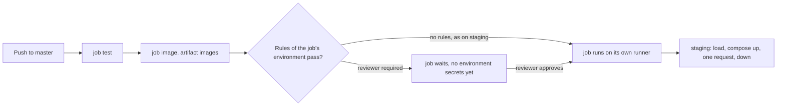

## Bạn cần biết trước

- [[devops.l2.workflow-artifacts]] — bạn biết job `staging` nhận các image mà job `image` đã build thế nào, dưới dạng artifact `images`.
- [[devops.l1.secrets-vs-config]] — bạn biết secret là config trao quyền cho bất kỳ ai đọc được nó, và `scripts/dev-secrets.sh` tạo ra các secret giả.
- [[devops.l1.compose-for-the-api]] — bạn biết service `api` trong `docker-compose.yml` và cách Compose chờ `db` trước khi khởi động nó.

## Tình huống

Ở stage-2, mọi lần push lên `master` qua được `test` và `image` đều đi tiếp tới job `staging` mà không ai phải bấm gì, và tới giờ lần nào cũng xanh. Trong buổi họp nhóm, một đồng nghiệp nói Đơn Hàng giờ đã làm continuous deployment. Trưởng nhóm thấy lo: chị muốn có một người nói "được" trước khi khách hàng thấy phiên bản mới. Một đồng nghiệp khác mở repository trên GitHub, thấy một môi trường tên `staging` kèm danh sách các lần deploy, và hỏi đó là server nào. Không ai nhớ đã dựng server nào cả. `environment: staging` cho job thứ gì, staging thật ra chạy ở đâu, và làm sao để một người được lên tiếng trước khi bản build xanh đi xa hơn?

## Khái niệm cốt lõi

- **continuous delivery** (mọi thay đổi qua CI đều sẵn sàng deploy bằng các bước tự động, lên production vẫn do người quyết) — mọi thay đổi qua CI được các bước tự động giữ ở trạng thái sẵn sàng deploy, còn đưa lên production, bản đang chạy mà khách hàng dùng, vẫn do một người quyết định.
- **continuous deployment** (mọi thay đổi qua CI được tự động deploy lên production, không ai phải duyệt) — continuous delivery bỏ đi quyết định đó: mọi thay đổi qua CI được deploy lên production tự động. Một số nguồn, trong đó có tài liệu của GitHub, dùng tên này cho mọi lần deploy tự động. Khóa học này tách riêng hai khái niệm.
- **môi trường deploy** (deployment environment) — một đích có tên, như `staging`, mà job khai báo bằng `environment:`. GitHub giữ quy tắc bảo vệ và secret của nó, và liệt kê các lần chạy của job như các lần deploy.
- Quy tắc bảo vệ — một điều kiện đặt trên môi trường trong phần cài đặt của repository, chẳng hạn bắt buộc có người duyệt, phải qua trước khi một job tham chiếu tới môi trường đó bắt đầu.
- Secret của môi trường — secret lưu trên một môi trường và chỉ được trao cho các job tham chiếu tới môi trường đó.

## Cơ chế hoạt động



Trong tình huống trên, pipeline đưa mọi lần push xanh lên `master`, bằng các bước tự động, tới một bản Đơn Hàng đang chạy và trả lời được request. Đó là continuous delivery. Nó chỉ thành continuous deployment nếu có thêm một bước cuối đưa mọi thay đổi như vậy lên production mà không người nào quyết định. Ở stage-2, Đơn Hàng chưa có production, nên không gì đi xa tới đó.

`environment: staging` đặt tên cho một môi trường deploy, chứ không tạo ra server nào. Lần đầu một job tham chiếu tới `staging`, GitHub tạo một môi trường mang tên đó, rồi ghi mỗi lần chạy của job như một lần deploy tới môi trường này, liệt kê ở trang Deployments của repository. Danh sách đồng nghiệp của bạn thấy chính là danh sách đó.

Môi trường là chỗ đặt cổng. Các quy tắc bảo vệ đặt trên nó, như bắt buộc có người duyệt, được kiểm tra trước khi bất kỳ job nào tham chiếu tới nó bắt đầu. Sau khi được duyệt, job chạy. Với mong muốn của trưởng nhóm, cổng nên nằm ở môi trường khách hàng nhìn thấy: một job sau có `environment: production` và bắt buộc có người duyệt. Bản build xanh vẫn tự tới `staging`, rồi chờ một người. Chính lần duyệt đó giữ cho delivery không biến thành deployment.

Secret lưu trên một môi trường chỉ tới các job tham chiếu tới môi trường đó, và nếu bắt buộc phải duyệt thì chỉ sau khi đã duyệt. `publish` có cùng `if:` và `needs:` như `staging` nhưng không có `environment:`, nên không đọc được secret nào trong số đó.

Đơn Hàng không đặt quy tắc hay secret nào trên `staging`, nên job bắt đầu ngay khi `test` và `image` qua. Staging của nó là một bản dùng xong bỏ, nằm trên chính runner của job, chạy API từ image trong artifact. Chạy Đơn Hàng ở một nơi luôn bật sẽ có ở một track sau.

## Trong hệ thống Đơn Hàng

Phần đầu của job `staging`:

```yaml file=.github/workflows/ci.yml tag=stage-2 lines=85-93
  # lesson: devops.l2.deployment-environments
  # Every green push to master is delivered to staging: a throwaway copy of
  # Đơn Hàng's services, started on this job's own runner from the images
  # the image job built, checked with one request, then removed.
  staging:
    if: github.event_name == 'push' && github.ref == 'refs/heads/master'
    needs: [test, image]
    runs-on: ubuntu-24.04
    environment: staging
```

`if:` chỉ cho job chạy khi sự kiện là push và nhánh là `master`. Pull request và các nhánh khác bỏ qua nó. `needs:` bắt job chờ phần test và image. `environment: staging` là dòng duy nhất biến job này thành một lần deploy tới `staging`. Các secret job dùng là secret giả do `scripts/dev-secrets.sh` ghi ra trên runner, không phải secret của môi trường.

Các bước cuối của job:

```yaml file=.github/workflows/ci.yml tag=stage-2 lines=116-128
      - name: Start staging
        run: docker compose up --detach --no-build --wait web api

      - name: Ask for the products through Caddy
        run: curl --fail --silent --show-error --retry 30 --retry-delay 2 --retry-all-errors http://localhost:8080/api/v1/products

      - name: Show the logs if staging failed
        if: failure()
        run: docker compose logs --tail 100

      - name: Remove staging
        if: always()
        run: docker compose down --volumes --remove-orphans
```

`up` khởi động `web`, tức reverse proxy Caddy đứng trước API, và `api`, cùng các service mà chúng phụ thuộc. `api`, và service `migrate` mà nó chờ, chạy các image vừa load. `db`, `redis` và `web` dùng image có sẵn mà Docker tải về, không cái nào cần build. `--detach` trả terminal lại cho bạn, còn `--wait` chỉ trả về khi các service đã chạy và sẵn sàng.

`curl --fail` hỏi `/api/v1/products` qua Caddy, thử lại trong một lúc, và làm bước đó fail khi câu trả lời là lỗi HTTP hoặc không bao giờ tới. Khi fail, log được in ra, và `if: always()` xóa các container cùng dữ liệu của chúng dù kết quả thế nào. Khi commit `stage-2` được push lên `master`, staging đi từ `up` tới lúc bị xóa trong chưa tới 20 giây.

## Người mới hay nghĩ rằng…

- **"Continuous delivery và continuous deployment là một: cả hai đều nghĩa là mọi commit đi thẳng lên production."** → Thực ra delivery giữ mọi thay đổi xanh ở trạng thái sẵn sàng và tự động hóa các bước, còn lên production thì một người quyết. Deployment bỏ đi quyết định đó. Bạn sẽ nhận ra khi một người trong nhóm chờ có nút bấm để release, còn người khác lại chờ mọi lần merge tới tay khách hàng.
- **"Environment trong GitHub Actions là một server GitHub tạo ra và giữ cho chạy."** → Thực ra đó là một cái tên giữ quy tắc, secret và danh sách các lần deploy. Chính các bước của job quyết định deploy nghĩa là gì. Bạn sẽ nhận ra khi đi tìm địa chỉ của server `staging` và chỉ thấy danh sách đó.
- **"Môi trường staging phải là một server cố định, không thì không tính là deploy."** → Thực ra điều quan trọng là các image và các bước sẽ chạy ở nơi khác được chạy ở đây trước và được kiểm tra. Staging của Đơn Hàng chỉ sống vài giây, vậy mà vẫn chuyển đỏ khi image API không khởi động được hoặc không kết nối được database. Bạn sẽ nhận ra khi `staging` fail với một thay đổi đã qua `test`.

## Thử ngay (3 phút)

Ở thư mục gốc Đơn Hàng tại stage-2, trong Git Bash:

1. Chạy `grep -n "environment:" .github/workflows/ci.yml`.
2. Nghĩ xem: chủ repository thêm một người duyệt bắt buộc và một secret tên `SMOKE_TOKEN` vào môi trường `staging` (làm được vì repository của Đơn Hàng là public, còn với repository private thì người duyệt bắt buộc tùy vào gói GitHub). Ở lần push tiếp theo lên `master`, trong `image`, `staging` và `publish`, job nào chờ một người, và job nào đọc được `SMOKE_TOKEN`?

Kết quả mong đợi: một dòng, `93:    environment: staging`. Job `staging` là job duy nhất trong `ci.yml` tham chiếu tới một môi trường.

<details><summary>Gợi ý đáp án</summary>

`image` chạy sau `test` như trước, và `publish` chạy sau `test` và `image` mà không phải chờ, vì nó không tham chiếu tới môi trường nào. `staging` sẵn sàng cùng lúc đó, rồi chờ tới khi một người duyệt đồng ý. Chỉ `staging` đọc được `SMOKE_TOKEN`, và chỉ sau khi đã được duyệt.

</details>

## Liên hệ

- [[devops.l2.workflow-artifacts]] — bài cần học trước: artifact `images` mà job `staging` load.
- [[devops.l1.secrets-vs-config]] — vẫn cách tách secret và config đó, giờ được lưu theo từng môi trường trên GitHub.
- [[devops.l1.compose-for-the-api]] — các service Compose mà staging khởi động, ở đây với image API được load từ artifact.
- [[devops.l2.migrations-in-the-pipeline]] — bài tiếp theo: service `migrate` chạy trước `api` trong cùng lệnh `up`.

## Tóm tắt 5 dòng

1. Continuous delivery giữ mọi thay đổi xanh sẵn sàng deploy bằng các bước tự động, còn continuous deployment deploy luôn từng thay đổi lên production mà không ai phải bảo.
2. `environment: staging` đặt tên cho một môi trường deploy: GitHub liệt kê các lần chạy của job ở đó như các lần deploy, nhưng không tạo server nào.
3. Quy tắc bảo vệ, như bắt buộc có người duyệt, phải qua trước khi một job tham chiếu tới môi trường bắt đầu. Đặt trên production, lần duyệt đó chính là cổng của delivery.
4. Secret lưu trên một môi trường chỉ tới các job tham chiếu tới nó. Đơn Hàng không đặt quy tắc hay secret nào trên `staging`.
5. Staging của Đơn Hàng là một bản dùng xong bỏ trên runner của job: image API vừa load, một request qua Caddy, rồi bị xóa.
