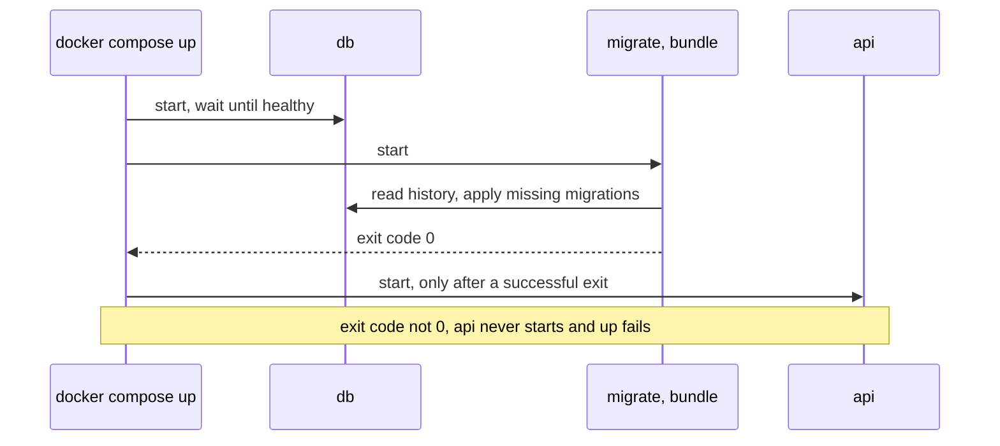

## Before you start

- [[devops.l2.deployment-environments]] — you know the `staging` job starts Đơn Hàng's services with `docker compose up` on its own runner and checks them with one request.
- [[backend.l1.migrations]] — you know a migration is a file for one schema change, and EF Core records the applied ones in `__EFMigrationsHistory`.
- [[devops.l1.compose-for-the-api]] — you know `depends_on` with a condition makes Compose wait for `db` before it starts `api`.

## The situation

Until stage-1, `DonHang.Api` migrated its own database: each time it started, `Program.cs` applied every migration the database had not recorded yet. Now the team plans to run three copies of the API behind Caddy, and `staging` deploys every green push to `master`. Someone asks which of the three copies should change the schema, and with what rights. Another asks what happens when a new migration fails: does the new API start anyway, on the old schema? Stage-2 took migrating out of the API. Where does it happen now, and what keeps the API from starting on a schema it does not expect?

## Core concepts

- Migrating at startup — the app applies pending migrations itself each time it starts, as `Program.cs` did until stage-1 with `Migrate()`.
- **migration bundle** — a single executable built by `dotnet ef migrations bundle`; run against a database, it applies the migrations that database has not recorded as applied yet.
- .NET SDK and .NET runtime — the SDK holds the tools that build code, and tools such as `dotnet ef` are installed on top of it; the runtime only runs programs that are already built.
- `migrate` service — the Compose service that runs Đơn Hàng's bundle once against `db`, then exits.
- `service_completed_successfully` — a `depends_on` condition: Compose starts the dependent service only after this one has exited with code `0`, the number a finished program returns to say it succeeded; any other code means it failed.

## How it works



In the situation above, the trouble with migrating at startup is that every copy of the app does it. EF Core's documentation on applying migrations lists the trade-offs. Each copy needs rights to change the schema. The SQL that EF Core generates from your reviewed C# migration runs without anyone reading it. And a copy still running old code may query a column another copy's migration just renamed, so its requests fail.

The EF Core version this course uses takes a database-wide lock while migrating, so two copies never apply one migration at once. The documentation still prefers a separate step when the SQL must be reviewed, rights must be limited, or you must control when each copy switches to the new version. It also says not to make every copy migrate when it starts.

Stage-2 makes that separate step. The schema now changes in one place, once per deploy, before any `api` starts, and a failure stops the deploy. The step does not show the SQL for review, and in Đơn Hàng `migrate` and `api` still use the same database user. `dotnet ef migrations bundle` turns the migrations into one executable that runs with only the .NET runtime. It reads the history table and applies only what is missing: eight migrations on a new lab database, and on a second run `No migrations were applied. The database is already up to date.`

`migrate` waits until `db` is healthy, runs the bundle and exits. `api` starts only after an exit code of `0`; if the bundle fails, `api` is created but never started, and `docker compose up` fails. The lab's `scripts/up.sh` and the `staging` job both run `docker compose up`, so a failing migration stops `staging` before any `api` runs on that database.

## In the Đơn Hàng system

The two stages that make the bundle, in `DonHang.Api/Dockerfile`:

```dockerfile file=DonHang.Api/Dockerfile tag=stage-2 lines=19-34
# lesson: devops.l2.migrations-in-the-pipeline
# `docker build --target migrate` stops here instead: an image holding only a
# migration bundle, one executable that applies the migrations a database has
# not recorded as applied yet. It is built from the same source as the api.
FROM build AS bundle
COPY .config/dotnet-tools.json .config/
RUN dotnet tool restore \
    && dotnet ef migrations bundle --project DonHang.Infrastructure --configuration Release --output /bundle/efbundle

FROM mcr.microsoft.com/dotnet/runtime:10.0 AS migrate
# The same Kerberos library as the api image below, for the same reason.
RUN apt-get update && apt-get install -y --no-install-recommends libgssapi-krb5-2 \
    && rm -rf /var/lib/apt/lists/*
WORKDIR /migrate
COPY --from=bundle /bundle/efbundle .
ENTRYPOINT ["./efbundle"]
```

`docker build` normally builds the last stage, the API's image; `--target migrate` stops at the `migrate` stage instead, which is what the comment means. `bundle` starts from the `build` stage, where the source and its packages are already present. `dotnet tool restore` installs the `dotnet-ef` tool at the version `.config/dotnet-tools.json` lists, and `--project DonHang.Infrastructure` points at the project that holds the migrations. The `migrate` stage starts from the .NET runtime image, adds a system library that the API image also installs (skip those lines here), and copies in only `efbundle`. `ENTRYPOINT` makes `./efbundle` the program the container runs.

The `image` job, the CI job that builds the images, builds this stage too, and `staging` loads it from the same artifact as the API image.

The service that runs it, in `docker-compose.yml`:

```yaml file=docker-compose.yml tag=stage-2 lines=83-96
  # lesson: devops.l2.migrations-in-the-pipeline
  # Runs the migration bundle against db once, then exits. Exit code 0 means
  # every migration is applied; anything else stops api from starting.
  migrate:
    build:
      context: .
      dockerfile: DonHang.Api/Dockerfile
      target: migrate
    image: donhang-migrate:stage-2
    container_name: donhang-migrate
    command: ["--connection", "Host=db;Database=donhang;Username=donhang;Password=${POSTGRES_PASSWORD}"]
    depends_on:
      db:
        condition: service_healthy
```

`command:` adds its list after the `ENTRYPOINT`, so the container runs `./efbundle --connection …` with the connection string: the database host, name, user and password. The other half sits in `api`, which has `migrate: condition: service_completed_successfully` under `depends_on`. `Program.cs` no longer calls `Migrate()`; a comment at the old spot says the `migrate` service does it now. In the `staging` job, when the `stage-2` commit was pushed to `master`, the log shows `donhang-migrate Exited`, and only then `donhang-api Starting`.

## Beginners often think…

- **"Migrating at startup is safe everywhere, since EF Core skips migrations that are already applied."** → Actually skipping applied migrations is not the problem. Every copy needs rights to change the schema, the SQL runs unreviewed, and copies serve requests while the schema changes. You notice this when the API's database user turns out to be allowed to drop tables, only so that it can migrate.
- **"The pipeline should run `dotnet ef database update` on the deploy machine, from a copy of the source code."** → Actually that needs the .NET SDK, the EF tools and the source wherever the database is updated. A bundle is built once, in CI, from the commit that was tested, and runs with only the .NET runtime. You notice this when a deploy machine needs an SDK and a checkout just to change a schema.
- **"If a migration fails, the new API version still starts and simply keeps using the old schema."** → Actually, with `service_completed_successfully`, Compose never starts `api` when `migrate` exits with an error, and `up` fails. You notice this when `staging` turns red at its `docker compose up` step and the logs show `migrate` failing.

## Try it (3 minutes)

With the lab running at stage-2 (`scripts/up.sh`), at the root of your Đơn Hàng folder in Git Bash:

1. Run `docker compose ps --all migrate` (`--all` also lists containers that have stopped) and read the `STATUS` column.
2. Run the bundle once more: `docker compose run --rm migrate` (`--rm` removes the one-off container afterwards).
3. Think: you add a migration whose SQL fails and run `scripts/up.sh`. What do `migrate` and `api` look like afterwards in `docker compose ps --all`?

Expected result: step 1 shows `donhang-migrate` with a status starting `Exited (0)`. Step 2 prints a line about taking a lock for migration, then `No migrations were applied. The database is already up to date.` and `Done.`

<details><summary>Suggested answer</summary>

`migrate` shows `Exited` with a code other than `0`, and `api` is listed as created but not running: Compose never started it. `scripts/up.sh` stops with an error, as the `staging` job would.

</details>

## Connections

- [[devops.l2.deployment-environments]] — prerequisite: the `staging` job whose `docker compose up` now migrates first.
- [[backend.l1.migrations]] — prerequisite: the migration files and the history table the bundle reads.
- [[devops.l1.compose-for-the-api]] — the same `depends_on` idea, with one more service in the chain.
- [[devops.l2.workflow-artifacts]] — how the `migrate` image travels from the `image` job to `staging`, next to `api`.

## Five-line summary

1. Đơn Hàng migrates in its own step: a `migrate` service runs a migration bundle before `api` starts.
2. `dotnet ef migrations bundle` builds one executable that applies only the migrations a database lacks, with no SDK or source.
3. `api` depends on `migrate` with `service_completed_successfully`, so a failed migration means `api` never starts.
4. `Program.cs` no longer migrates at startup; EF Core's documentation says not to make every copy of an app migrate.
5. The lab and the `staging` job start the same services, so both migrate the same way, and a failure turns `staging` red.
