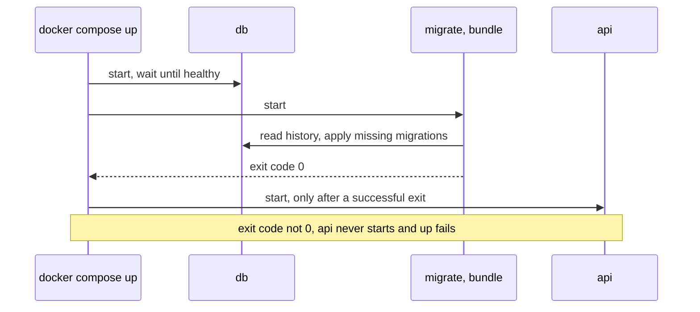

## Bạn cần biết trước

- [[devops.l2.deployment-environments]] — bạn biết job `staging` khởi động các service của Đơn Hàng bằng `docker compose up` trên runner của riêng nó và kiểm tra bằng một request.
- [[backend.l1.migrations]] — bạn biết migration là một file cho một thay đổi schema, và EF Core ghi lại các migration đã áp trong `__EFMigrationsHistory`.
- [[devops.l1.compose-for-the-api]] — bạn biết `depends_on` kèm điều kiện bắt Compose chờ `db` rồi mới khởi động `api`.

## Tình huống

Cho tới stage-1, `DonHang.Api` tự migrate database của mình: mỗi lần khởi động, `Program.cs` áp mọi migration mà database chưa ghi nhận. Giờ nhóm định chạy ba bản API sau Caddy, và `staging` deploy mọi lần push xanh lên `master`. Có người hỏi trong ba bản đó, bản nào nên đổi schema, và với quyền gì. Người khác hỏi chuyện gì xảy ra khi một migration mới fail: API mới vẫn khởi động, chạy trên schema cũ à? Stage-2 đã đưa việc migrate ra khỏi API. Giờ nó diễn ra ở đâu, và cái gì giữ cho API không khởi động trên một schema nó không ngờ tới?

## Khái niệm cốt lõi

- Migrate lúc khởi động — app tự áp các migration còn thiếu mỗi lần khởi động, như `Program.cs` đã làm tới stage-1 bằng `Migrate()`.
- **migration bundle** (một file chạy được do dotnet ef migrations bundle tạo, áp các migration còn thiếu vào database) — một file thực thi duy nhất do `dotnet ef migrations bundle` build ra. Chạy nó trên một database, nó áp những migration mà database đó chưa ghi nhận là đã áp.
- .NET SDK và .NET runtime — SDK chứa các công cụ để build code, và những công cụ như `dotnet ef` được cài thêm lên trên nó. Runtime chỉ chạy các chương trình đã build sẵn.
- Service `migrate` — service Compose chạy bundle của Đơn Hàng một lần trên `db`, rồi thoát.
- `service_completed_successfully` — một điều kiện của `depends_on`: Compose chỉ khởi động service phụ thuộc sau khi service này đã thoát với mã `0`, con số một chương trình trả về khi kết thúc để báo thành công. Mã khác nghĩa là nó đã fail.

## Cơ chế hoạt động



Trong tình huống trên, rắc rối của việc migrate lúc khởi động là bản nào của app cũng làm việc đó. Tài liệu EF Core về áp migration liệt kê các đánh đổi. Bản nào cũng cần quyền đổi schema. SQL mà EF Core sinh ra từ migration C# đã được review sẽ chạy mà không ai đọc qua. Và một bản còn chạy code cũ có thể truy vấn một cột mà migration của bản khác vừa đổi tên, khiến request của nó fail.

Phiên bản EF Core mà khóa học dùng giữ một lock trên cả database khi migrate, nên hai bản không bao giờ cùng áp một migration. Dù vậy, tài liệu vẫn ưu tiên một bước riêng khi SQL cần được xem lại, quyền cần được giới hạn, hoặc bạn cần kiểm soát lúc mỗi bản chuyển sang phiên bản mới. Tài liệu cũng dặn đừng để bản nào của app cũng migrate khi khởi động.

Stage-2 tạo ra bước riêng đó. Giờ schema đổi ở một chỗ, mỗi lần deploy một lần, trước khi bất kỳ `api` nào khởi động, và nếu fail thì việc deploy dừng lại. Bước này không cho xem SQL trước, và trong Đơn Hàng `migrate` với `api` vẫn dùng chung một database user. `dotnet ef migrations bundle` biến các migration thành một file thực thi chỉ cần .NET runtime để chạy. Nó đọc bảng lịch sử và chỉ áp phần còn thiếu: tám migration trên một database lab mới, còn lần chạy thứ hai thì in `No migrations were applied. The database is already up to date.`

`migrate` chờ `db` healthy, chạy bundle rồi thoát. `api` chỉ khởi động sau khi có mã thoát `0`. Nếu bundle fail, `api` được tạo nhưng không bao giờ được khởi động, và `docker compose up` fail. `scripts/up.sh` của lab và job `staging` đều chạy `docker compose up`, nên một migration fail sẽ chặn `staging` trước khi bất kỳ `api` nào chạy trên database đó.

## Trong hệ thống Đơn Hàng

Hai stage tạo ra bundle, trong `DonHang.Api/Dockerfile`:

```dockerfile file=DonHang.Api/Dockerfile tag=stage-2 lines=19-34
# lesson: devops.l2.migrations-in-the-pipeline
# `docker build --target migrate` stops here instead: an image holding only a
# migration bundle, one executable that applies the migrations a database has
# not recorded as applied yet. It is built from the same source as the api.
FROM build AS bundle
COPY .config/dotnet-tools.json .config/
RUN dotnet tool restore \
    && dotnet ef migrations bundle --project DonHang.Infrastructure --configuration Release --output /bundle/efbundle

FROM mcr.microsoft.com/dotnet/runtime:10.0 AS migrate
# The same Kerberos library as the api image below, for the same reason.
RUN apt-get update && apt-get install -y --no-install-recommends libgssapi-krb5-2 \
    && rm -rf /var/lib/apt/lists/*
WORKDIR /migrate
COPY --from=bundle /bundle/efbundle .
ENTRYPOINT ["./efbundle"]
```

Bình thường `docker build` build stage cuối, tức image của API. `--target migrate` thì dừng ở stage `migrate`, đó là ý của dòng comment. `bundle` bắt đầu từ stage `build`, nơi source và các gói của nó đã có sẵn. `dotnet tool restore` cài tool `dotnet-ef` đúng phiên bản mà `.config/dotnet-tools.json` ghi, còn `--project DonHang.Infrastructure` trỏ tới project chứa các migration. Stage `migrate` bắt đầu từ image .NET runtime, thêm một thư viện hệ thống mà image API cũng cài (ở bài này bạn bỏ qua mấy dòng đó), rồi chỉ chép `efbundle` vào. `ENTRYPOINT` khiến `./efbundle` là chương trình mà container chạy.

Job `image`, job CI build các image, cũng build stage này, và `staging` load nó từ cùng artifact với image API.

Service chạy bundle, trong `docker-compose.yml`:

```yaml file=docker-compose.yml tag=stage-2 lines=83-96
  # lesson: devops.l2.migrations-in-the-pipeline
  # Runs the migration bundle against db once, then exits. Exit code 0 means
  # every migration is applied; anything else stops api from starting.
  migrate:
    build:
      context: .
      dockerfile: DonHang.Api/Dockerfile
      target: migrate
    image: donhang-migrate:stage-2
    container_name: donhang-migrate
    command: ["--connection", "Host=db;Database=donhang;Username=donhang;Password=${POSTGRES_PASSWORD}"]
    depends_on:
      db:
        condition: service_healthy
```

`command:` thêm danh sách của nó vào sau `ENTRYPOINT`, nên container chạy `./efbundle --connection …` với chuỗi kết nối: host, tên database, user và mật khẩu. Nửa còn lại nằm ở `api`, nơi có `migrate: condition: service_completed_successfully` trong `depends_on`. `Program.cs` không còn gọi `Migrate()`. Một dòng comment ở chỗ cũ ghi rằng giờ service `migrate` làm việc đó. Trong job `staging`, khi commit `stage-2` được push lên `master`, log cho thấy `donhang-migrate Exited`, rồi mới tới `donhang-api Starting`.

## Người mới hay nghĩ rằng…

- **"Migrate lúc khởi động thì ở đâu cũng an toàn, vì EF Core bỏ qua các migration đã áp rồi."** → Thực ra chuyện bỏ qua migration đã áp không phải là vấn đề. Bản nào cũng cần quyền đổi schema, SQL chạy mà không ai xem lại, và các bản vẫn phục vụ request trong lúc schema đang đổi. Bạn sẽ nhận ra khi phát hiện database user của API được phép xóa bảng, chỉ để nó migrate được.
- **"Pipeline nên chạy `dotnet ef database update` trên máy deploy, từ một bản sao source code."** → Thực ra cách đó cần .NET SDK, công cụ EF và source ở bất cứ nơi nào database được cập nhật. Bundle được build một lần, trong CI, từ đúng commit đã được test, và chỉ cần .NET runtime để chạy. Bạn sẽ nhận ra khi một máy deploy phải cài SDK và checkout code chỉ để đổi schema.
- **"Nếu migration fail, API phiên bản mới vẫn khởi động và cứ thế dùng schema cũ."** → Thực ra, với `service_completed_successfully`, Compose không bao giờ khởi động `api` khi `migrate` thoát với lỗi, và `up` fail. Bạn sẽ nhận ra khi `staging` đỏ ở bước `docker compose up` và log cho thấy `migrate` fail.

## Thử ngay (3 phút)

Khi lab đang chạy ở stage-2 (`scripts/up.sh`), ở thư mục gốc Đơn Hàng, trong Git Bash:

1. Chạy `docker compose ps --all migrate` (`--all` liệt kê cả các container đã dừng) và đọc cột `STATUS`.
2. Chạy bundle thêm một lần: `docker compose run --rm migrate` (`--rm` xóa container chạy một lần đó sau khi xong).
3. Nghĩ xem: bạn thêm một migration có SQL bị lỗi rồi chạy `scripts/up.sh`. Sau đó `migrate` và `api` trông thế nào trong `docker compose ps --all`?

Kết quả mong đợi: bước 1 cho thấy `donhang-migrate` với trạng thái bắt đầu bằng `Exited (0)`. Bước 2 in một dòng về việc lấy lock để migrate, rồi `No migrations were applied. The database is already up to date.` và `Done.`

<details><summary>Gợi ý đáp án</summary>

`migrate` hiện `Exited` với mã khác `0`, còn `api` được liệt kê là đã tạo nhưng không chạy: Compose chưa từng khởi động nó. `scripts/up.sh` dừng với lỗi, đúng như job `staging` sẽ dừng.

</details>

## Liên hệ

- [[devops.l2.deployment-environments]] — bài cần học trước: job `staging` mà `docker compose up` của nó giờ migrate trước tiên.
- [[backend.l1.migrations]] — bài cần học trước: các file migration và bảng lịch sử mà bundle đọc.
- [[devops.l1.compose-for-the-api]] — cùng ý tưởng `depends_on`, thêm một service vào chuỗi.
- [[devops.l2.workflow-artifacts]] — image `migrate` đi từ job `image` tới `staging` thế nào, bên cạnh `api`.

## Tóm tắt 5 dòng

1. Đơn Hàng migrate trong một bước riêng: service `migrate` chạy một migration bundle trước khi `api` khởi động.
2. `dotnet ef migrations bundle` build một file thực thi chỉ áp các migration database còn thiếu, không cần SDK hay source.
3. `api` phụ thuộc `migrate` với `service_completed_successfully`, nên migration fail nghĩa là `api` không bao giờ khởi động.
4. `Program.cs` không còn migrate lúc khởi động, vì tài liệu EF Core dặn đừng để bản nào của app cũng migrate.
5. Lab và job `staging` khởi động cùng các service, nên cả hai migrate giống nhau, và một lần fail làm `staging` đỏ.
