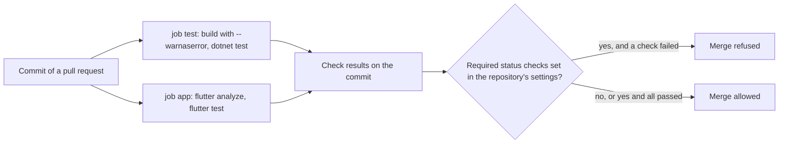

## Before you start

- [[devops.l2.ci-pipeline-anatomy]] — you know how a workflow's jobs and steps run, and that a step exiting non-zero turns the run red.
- [[design.l2.test-pyramid]] — you know which risks Đơn Hàng's unit tests check and which its integration tests check.
- [[design.l2.testcontainers-postgresql]] — you know that Testcontainers starts a real PostgreSQL container from test code, with only Docker needed.
- [[management.l1.reading-a-300-line-pr]] — you met the stage-1 change in which a `shipped` order could still be cancelled while every test passed.

## The situation

Your pull request changes how `Order` treats a `paid` order. Its CI run fails: `dotnet test` reports one red test. Yet the pull request page on GitHub still offers to merge it, and nothing stops you. A teammate shrugs: last month a pull request was green, got merged, and still shipped a bug. You remember the stage-1 review lesson, where every test passed while a `shipped` order could be cancelled. What does Đơn Hàng's CI actually check, what does a green result promise, and what would keep a red change out of `master`?

## Core concepts

- **quality gate** — a set of automated checks a change must pass before it may go further, such as being merged into `master`.
- Check — one job's result, reported on a commit as passed or failed.
- Required status check — a repository setting on GitHub that refuses to merge a pull request until named checks have passed.

## How it works



In Đơn Hàng at stage-2, the quality gate is four commands, in two jobs that each report one check. `dotnet build` with `--warnaserror` fails on any compiler warning. `dotnet test` runs every .NET test. `flutter analyze` checks the Dart code of `DonHang.App` without running it and fails on the problems it reports. `flutter test` runs the app's widget tests. The first two run in the job `test`, the other two in the job `app`.

At stage-2, `dotnet test` also runs the integration tests. They need PostgreSQL and Redis, but not the lab: Testcontainers starts both as containers on the Docker engine that the GitHub-hosted Ubuntu runner already has. The `test` job never starts the lab.

Each job reports its result on the commit, and that is all a workflow does. Nothing in `ci.yml` can stop a merge. Refusing to merge while a check is red is a separate setting on GitHub, a required status check, which an admin of the repository turns on for a branch such as `master`. With it, a pull request merges only once every required check has passed, unless an admin of the repository bypasses the rule, which GitHub allows by default. Without it, GitHub shows the red check and still lets you merge, as in the situation: Đơn Hàng's repository has no required status check on `master`.

A green gate proves only what its checks check. At stage-1 all four commands passed while `CancelOrderAsync` cancelled a `shipped` order, because no test tried that case. A gate is as strong as the tests and rules inside it, so a bug that no check covers passes straight through.

## In the Đơn Hàng system

The end of the `test` job and the whole `app` job in `ci.yml`:

```yaml file=.github/workflows/ci.yml tag=stage-2 lines=34-57
      - name: Build the solution
        run: dotnet build DonHang.slnx --warnaserror

      - name: Test the solution
        run: dotnet test DonHang.slnx --no-build

  app:
    runs-on: ubuntu-24.04
    defaults:
      run:
        working-directory: DonHang.App
    steps:
      - uses: actions/checkout@v4

      - uses: subosito/flutter-action@v2
        with:
          channel: stable
          flutter-version: 3.47.x

      - name: Analyze DonHang.App
        run: flutter analyze

      - name: Test DonHang.App
        run: flutter test
```

These four `run:` lines are the gate. `test` and `app` are separate jobs, each on its own runner, and both report on the same commit. Neither job starts the lab: no `./scripts/up.sh` appears in either. `ci.yml` has other jobs too, each reporting its own check; later lessons cover them. In the CI run for the commit tagged `stage-2`, the `test` job's `dotnet test` reported 24 passing tests in `DonHang.Tests`, integration tests included. Among them is the test that closes the stage-1 gap, `Cancel_ShippedOrder_Throws` in `DonHang.Tests/Domain/OrderTests.cs`, so that bug can no longer pass through the gate unnoticed.

What lets those integration tests run here sits in the test project:

```xml file=DonHang.Tests/DonHang.Tests.csproj tag=stage-2 lines=17-25
  <!-- lesson: design.l2.testcontainers-postgresql -->
  <!-- From stage-2 the integration tests in Integration/ start real PostgreSQL
       and Redis containers (Testcontainers) and the whole api in this process
       (Mvc.Testing). Running this project now needs Docker, not the lab. -->
  <ItemGroup>
    <PackageReference Include="Testcontainers.PostgreSql" />
    <PackageReference Include="Testcontainers.Redis" />
    <PackageReference Include="Microsoft.AspNetCore.Mvc.Testing" />
  </ItemGroup>
```

The comment says it plainly: from stage-2 this project needs Docker, not the lab. The third package starts the API inside the test process and needs nothing extra on the runner. On the runner, Docker is already installed, so `dotnet test` behaves there as it does on your laptop with Docker Desktop running.

## Beginners often think…

- **"A green CI run means the change has no bugs."** → Actually green means the checks that exist passed, nothing more. A behavior no test covers is not checked at all, as the stage-1 suite showed with the `shipped` order. You notice this when a bug report arrives for code whose every run was green.
- **"Putting `dotnet test` in the workflow is enough to stop a failing pull request from being merged."** → Actually a workflow only reports a result on the commit; refusing the merge is a required status check, a setting on the repository, not a line in `ci.yml`. You notice this when the pull request page shows a red check and still offers the merge button.
- **"Integration tests can't run in CI because they need Docker, so CI should run only unit tests."** → Actually the GitHub-hosted Ubuntu runner already has Docker, and Testcontainers starts PostgreSQL and Redis there, without the lab. You notice this when the `test` job's log shows `Passed: 24` for `DonHang.Tests.dll`, a count that includes the integration tests, although no step started any database.

## Try it (3 minutes)

With Docker Desktop running, at the root of your Đơn Hàng folder at stage-2:

1. Run the gate's first check: `dotnet build DonHang.slnx --warnaserror`.
2. Run the second: `dotnet test DonHang.slnx --no-build` (`--no-build` reuses the build from step 1, as the `test` job does).
3. Think: which of the four commands would have caught the stage-1 bug in which a `shipped` order could be cancelled?

Expected result: step 1 prints `Build succeeded.` with `0 Warning(s)`. Step 2 prints a `Passed!` line for `DonHang.Tests.dll` with 24 tests passed and none failed, the same count as in CI, and another for `DonHang.Samples.Tests.dll`, the solution's second test project, with 13, also as in CI.

<details><summary>Suggested answer</summary>

None of them, at stage-1. All four commands passed, because no test tried to cancel a `shipped` order. The gate caught that bug only once `Cancel_ShippedOrder_Throws` existed. A gate is as strong as the tests inside it.

</details>

## Connections

- [[devops.l2.ci-pipeline-anatomy]] — prerequisite: the jobs and steps this gate is made of.
- [[design.l2.testcontainers-postgresql]] — the same throwaway containers, now started on a runner instead of your laptop.
- [[management.l1.reading-a-300-line-pr]] — the other half of the gate: a person reading the change for what no test checks.
- [[devops.l2.dependency-cache]] — next: making the `test` job faster without changing what it checks.

## Five-line summary

1. A quality gate is the set of automated checks a change must pass before it may go further.
2. Đơn Hàng's gate is `dotnet build --warnaserror`, `dotnet test`, `flutter analyze` and `flutter test`, in the jobs `test` and `app`.
3. At stage-2 `dotnet test` runs the integration tests on the runner's own Docker, with Testcontainers and without the lab.
4. A workflow only reports pass or fail; refusing a red merge is a required status check, a repository setting.
5. A green gate proves only what its checks check: a case no test covers passes straight through.
