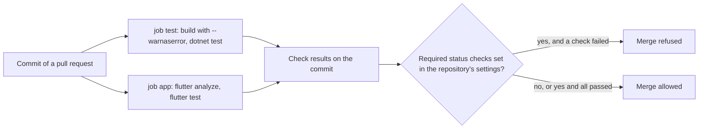

## Bạn cần biết trước

- [[devops.l2.ci-pipeline-anatomy]] — bạn biết các job và step của một workflow chạy thế nào, và một step thoát với mã khác 0 sẽ làm lần chạy đỏ.
- [[design.l2.test-pyramid]] — bạn biết unit test của Đơn Hàng kiểm những rủi ro nào và integration test kiểm những rủi ro nào.
- [[design.l2.testcontainers-postgresql]] — bạn biết Testcontainers khởi động một container PostgreSQL thật từ code test, chỉ cần có Docker.
- [[management.l1.reading-a-300-line-pr]] — bạn đã gặp thay đổi ở stage-1 khiến một đơn `shipped` vẫn hủy được trong khi mọi test đều qua.

## Tình huống

Pull request của bạn đổi cách `Order` xử lý một đơn `paid`. Lần chạy CI của nó fail: `dotnet test` báo một test đỏ. Vậy mà trang pull request trên GitHub vẫn cho merge, và không có gì ngăn bạn lại. Một đồng nghiệp nhún vai: tháng trước có một pull request xanh, được merge, mà vẫn mang theo lỗi. Bạn nhớ lại bài review ở stage-1, khi mọi test đều qua trong lúc một đơn `shipped` vẫn hủy được. CI của Đơn Hàng thật ra kiểm những gì, kết quả xanh hứa hẹn điều gì, và thứ gì mới giữ được một thay đổi đỏ khỏi `master`?

## Khái niệm cốt lõi

- **quality gate** (bộ kiểm tra tự động mà một thay đổi phải qua trước khi được đi tiếp) — tập các bước kiểm tra tự động mà một thay đổi phải qua trước khi được đi tiếp, chẳng hạn trước khi được merge vào `master`.
- Check — kết quả của một job, được báo trên một commit là qua hoặc fail.
- Required status check — một thiết lập của repository trên GitHub, từ chối merge pull request cho tới khi các check được chỉ định đã qua.

## Cơ chế hoạt động



Trong Đơn Hàng ở stage-2, quality gate là bốn lệnh, nằm trong hai job, mỗi job báo một check. `dotnet build` với `--warnaserror` fail khi có bất kỳ cảnh báo nào của trình biên dịch. `dotnet test` chạy mọi test .NET. `flutter analyze` kiểm code Dart của `DonHang.App` mà không chạy nó, và fail khi báo ra vấn đề. `flutter test` chạy các widget test của app. Hai lệnh đầu chạy trong job `test`, hai lệnh sau trong job `app`.

Ở stage-2, `dotnet test` chạy cả integration test. Chúng cần PostgreSQL và Redis, nhưng không cần lab: Testcontainers khởi động cả hai thành container trên Docker engine mà runner Ubuntu do GitHub cấp đã có sẵn. Job `test` không bao giờ khởi động lab.

Mỗi job báo kết quả lên commit, và workflow chỉ làm đến đó. Không có gì trong `ci.yml` chặn được merge. Từ chối merge khi một check đang đỏ là một thiết lập riêng trên GitHub, required status check, do admin của repository bật cho một branch như `master`. Khi có nó, pull request chỉ được merge khi mọi check bắt buộc đã qua, trừ khi admin của repository vượt qua quy tắc, điều GitHub mặc định cho phép. Khi không có nó, GitHub hiện check đỏ mà vẫn cho merge, như trong tình huống: repository của Đơn Hàng không đặt required status check nào cho `master`.

Gate xanh chỉ chứng minh những gì các check của nó kiểm. Ở stage-1, cả bốn lệnh đều qua trong khi `CancelOrderAsync` vẫn hủy một đơn `shipped`, vì không test nào thử trường hợp đó. Gate chỉ mạnh bằng các test và quy tắc bên trong nó, nên một lỗi không check nào bao thì đi thẳng qua.

## Trong hệ thống Đơn Hàng

Phần cuối của job `test` và toàn bộ job `app` trong `ci.yml`:

```yaml file=.github/workflows/ci.yml tag=stage-2 lines=34-57
      - name: Build the solution
        run: dotnet build DonHang.slnx --warnaserror

      - name: Test the solution
        run: dotnet test DonHang.slnx --no-build

  app:
    runs-on: ubuntu-24.04
    defaults:
      run:
        working-directory: DonHang.App
    steps:
      - uses: actions/checkout@v4

      - uses: subosito/flutter-action@v2
        with:
          channel: stable
          flutter-version: 3.47.x

      - name: Analyze DonHang.App
        run: flutter analyze

      - name: Test DonHang.App
        run: flutter test
```

Bốn dòng `run:` này chính là gate. `test` và `app` là hai job riêng, mỗi job trên runner của nó, và cả hai cùng báo lên một commit. Không job nào khởi động lab: không có `./scripts/up.sh` ở job nào. `ci.yml` còn có các job khác, mỗi job báo check riêng, các bài sau sẽ nói tới. Trong lần chạy CI của commit gắn tag `stage-2`, `dotnet test` của job `test` báo 24 test qua trong `DonHang.Tests`, tính cả integration test. Trong số đó có test lấp lỗ hổng của stage-1, `Cancel_ShippedOrder_Throws` trong `DonHang.Tests/Domain/OrderTests.cs`, nên lỗi đó không thể lọt qua gate mà không ai hay nữa.

Thứ giúp các integration test đó chạy được ở đây nằm trong project test:

```xml file=DonHang.Tests/DonHang.Tests.csproj tag=stage-2 lines=17-25
  <!-- lesson: design.l2.testcontainers-postgresql -->
  <!-- From stage-2 the integration tests in Integration/ start real PostgreSQL
       and Redis containers (Testcontainers) and the whole api in this process
       (Mvc.Testing). Running this project now needs Docker, not the lab. -->
  <ItemGroup>
    <PackageReference Include="Testcontainers.PostgreSql" />
    <PackageReference Include="Testcontainers.Redis" />
    <PackageReference Include="Microsoft.AspNetCore.Mvc.Testing" />
  </ItemGroup>
```

Comment nói thẳng: từ stage-2, project này cần Docker, không cần lab. Package thứ ba khởi động API ngay trong process của test và không cần thêm gì trên runner. Runner đã cài sẵn Docker, nên `dotnet test` ở đó chạy giống như trên laptop của bạn khi Docker Desktop đang chạy.

## Người mới hay nghĩ rằng…

- **"Lần chạy CI xanh nghĩa là thay đổi không có lỗi."** → Thực ra xanh chỉ nghĩa là các check hiện có đã qua, không hơn. Hành vi không test nào bao thì hoàn toàn không được kiểm, như bộ test ở stage-1 đã cho thấy với đơn `shipped`. Bạn sẽ nhận ra khi có bug report cho đoạn code mà lần chạy nào cũng xanh.
- **"Đưa `dotnet test` vào workflow là đủ để chặn merge một pull request đang fail."** → Thực ra workflow chỉ báo kết quả lên commit. Từ chối merge là việc của required status check, một thiết lập của repository, không phải một dòng trong `ci.yml`. Bạn sẽ nhận ra khi trang pull request hiện check đỏ mà vẫn có nút merge.
- **"Integration test không chạy được trên CI vì cần Docker, nên CI chỉ nên chạy unit test."** → Thực ra runner Ubuntu do GitHub cấp đã có sẵn Docker, và Testcontainers khởi động PostgreSQL và Redis ngay trên đó, không cần lab. Bạn sẽ nhận ra khi log của job `test` hiện `Passed: 24` cho `DonHang.Tests.dll`, con số đã tính cả integration test, dù không step nào khởi động database.

## Thử ngay (3 phút)

Khi Docker Desktop đang chạy, ở thư mục gốc của Đơn Hàng tại stage-2:

1. Chạy lệnh đầu tiên của gate: `dotnet build DonHang.slnx --warnaserror`.
2. Chạy lệnh thứ hai: `dotnet test DonHang.slnx --no-build` (`--no-build` dùng lại bản build ở bước 1, giống job `test`).
3. Nghĩ thử: lệnh nào trong bốn lệnh sẽ bắt được lỗi ở stage-1, lỗi cho phép hủy một đơn `shipped`?

Kết quả mong đợi: bước 1 in `Build succeeded.` kèm `0 Warning(s)`. Bước 2 in một dòng `Passed!` cho `DonHang.Tests.dll` với 24 test qua và không test nào fail, đúng con số trên CI, và một dòng nữa cho `DonHang.Samples.Tests.dll`, project test thứ hai của solution, với 13 test, cũng khớp CI.

<details><summary>Gợi ý đáp án</summary>

Không lệnh nào, ở stage-1. Cả bốn lệnh đều qua, vì không test nào thử hủy một đơn `shipped`. Gate chỉ bắt được lỗi đó khi đã có `Cancel_ShippedOrder_Throws`. Gate chỉ mạnh bằng các test bên trong nó.

</details>

## Liên hệ

- [[devops.l2.ci-pipeline-anatomy]] — kiến thức nền: các job và step tạo nên gate này.
- [[design.l2.testcontainers-postgresql]] — vẫn là các container dùng xong bỏ đó, giờ được khởi động trên runner thay vì laptop của bạn.
- [[management.l1.reading-a-300-line-pr]] — nửa còn lại của gate: một người đọc thay đổi để tìm những gì không test nào kiểm.
- [[devops.l2.dependency-cache]] — bài kế: làm job `test` nhanh hơn mà không đổi những gì nó kiểm.

## Tóm tắt 5 dòng

1. Quality gate là tập các bước kiểm tra tự động mà một thay đổi phải qua trước khi được đi tiếp.
2. Gate của Đơn Hàng là `dotnet build --warnaserror`, `dotnet test`, `flutter analyze` và `flutter test`, trong hai job `test` và `app`.
3. Ở stage-2, `dotnet test` chạy integration test trên Docker của chính runner, bằng Testcontainers và không cần lab.
4. Workflow chỉ báo qua hay fail; từ chối merge khi đỏ là việc của required status check, một thiết lập của repository.
5. Gate xanh chỉ chứng minh những gì các check của nó kiểm: trường hợp không test nào bao sẽ đi thẳng qua.
