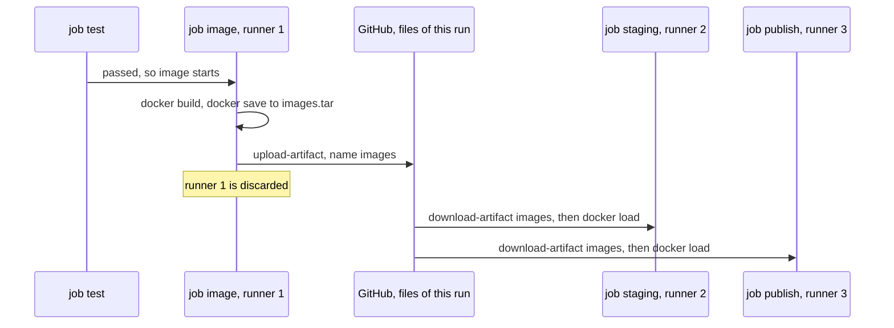

## Before you start

- [[devops.l2.building-images-in-ci]] — you know the `image` job builds `donhang-api:stage-2` once, and `staging` runs that image with `--no-build`.
- [[devops.l2.dependency-cache]] — you know how `actions/cache` saves a folder under a cache key and restores it in later runs.

## The situation

You review a pull request that tidies `ci.yml`. It deletes two steps from the `image` job: "Save both images to one file" and the `actions/upload-artifact` step after it. The author explains: "`staging` has `needs: [test, image]`, so it runs right after `image`, and the images are already built." A second reviewer suggests a middle way: keep the file, but store it with `actions/cache`, which the `test` job already uses. Before you approve either idea, you need to know what one job can see of another. How do the images built in the `image` job reach the `staging` job, and what kind of stored file must carry them?

## Core concepts

- Job — a named list of steps under `jobs:` in a workflow; it runs on a runner of its own.
- `needs:` — the key that makes a job wait until the jobs it names have passed, and skips it if one fails; it decides when a job starts, not where.
- **artifact** — a set of files a job uploads with `actions/upload-artifact`, kept with that workflow run, so a later job of the run can download it with `actions/download-artifact`.
- `docker save` and `docker load` — the commands that write images, names included, to one `.tar` file and read them back into Docker.
- Cache and artifact — a cache saves time across many runs and may be missing; an artifact is one run's output that a later job depends on.

## How it works



In the situation above, the author pictures one machine running the jobs in turn. GitHub Actions works differently. When a run starts, every job without `needs:` can start right away, in parallel, each on its own new runner. In the run for the `stage-2` commit on `master`, the four jobs with no `needs:` (`test`, `app`, `lab`, `manifests`) started within about a second of each other, on four different runners.

`needs:` changes when a job starts, not where. `image` waits for `test`; `staging` and `publish` wait for `test` and `image`. Each still gets a new runner, without the images the earlier job built. That runner is gone when its job ends.

So the images travel as a file. `image` writes both to `images.tar` with `docker save`, and `actions/upload-artifact` stores that file with the run under the name `images`. `staging` and `publish` each download it with `actions/download-artifact` and run `docker load`, which puts the images back under their names. The upload and both downloads log the same fingerprint of the stored file's bytes: one file, three jobs. The artifact stays listed on the run's page after the run, until it expires, so a person can download it too.

The cache idea fails for a different reason. A cache belongs to the repository, not to one run: it is found by key, and GitHub may remove it. On a miss the cache step passes, and `staging` would fail later, at `docker load`, with an error about a missing `images.tar` rather than at the step that missed. An artifact belongs to this run and is asked for by name: if `images` is missing, `actions/download-artifact` fails right there.

## In the Đơn Hàng system

The end of the `image` job:

```yaml file=.github/workflows/ci.yml tag=stage-2 lines=74-83
      # lesson: devops.l2.workflow-artifacts
      # This runner, and the images on it, are gone when the job ends. The
      # images leave as one file, an artifact of this run, for later jobs.
      - name: Save both images to one file
        run: docker save --output images.tar donhang-api:stage-2 donhang-migrate:stage-2

      - uses: actions/upload-artifact@v4
        with:
          name: images
          path: images.tar
```

`docker save` names both images, so one file carries both, each with its name. `name: images` is what later jobs ask for; `path:` says which files go in. In the `stage-2` run on `master`, this step logs that the artifact `images` was uploaded.

The start of the `staging` job:

```yaml file=.github/workflows/ci.yml tag=stage-2 lines=89-102
  staging:
    if: github.event_name == 'push' && github.ref == 'refs/heads/master'
    needs: [test, image]
    runs-on: ubuntu-24.04
    environment: staging
    steps:
      - uses: actions/checkout@v4

      - uses: actions/download-artifact@v4
        with:
          name: images

      - name: Load the images
        run: docker load --input images.tar
```

`needs: [test, image]` only means "after both passed". `actions/download-artifact` asks for `images` by name and writes `images.tar` into the job's working folder; `docker load` then logs `Loaded image: donhang-api:stage-2` and `Loaded image: donhang-migrate:stage-2`.

The `if:` and `environment:` lines belong to the next lesson; for now, the `if:` lets the job run only on a push to `master`. In the run for the `auto/stage-2` branch it skipped `staging`, and the same line in `publish` skipped that job, yet `image` still uploaded `images`: the artifact is kept with the run whether or not a job downloads it.

## Beginners often think…

- **"A job that `needs:` another runs on the same machine, so it can read the files the first job wrote."** → Actually `needs:` only orders jobs; each job gets its own new runner, and the first runner is gone with everything on it. You notice this when a later job fails because a file or image an earlier job clearly created is not there.
- **"Cache and artifact are two names for stored files, so either one can pass a build between jobs."** → Actually a cache is a shortcut that is allowed to miss, and the job must work without it. An artifact holds one run's output, and the job that needs it fails without it. You notice this when a job that took its input from a cache passes on one run and breaks on the next with no change to the code.

## Try it (3 minutes)

With Docker Desktop running and the lab started at stage-2 (`scripts/up.sh` builds both images), at the root of your Đơn Hàng folder in Git Bash:

1. Run the `image` job's save command: `docker save --output images.tar donhang-api:stage-2 donhang-migrate:stage-2`.
2. Run `ls -lh images.tar`, then `docker load --input images.tar`, then `rm images.tar`.
3. Think: if `staging` lost its `needs:` line but kept its download step, what would happen on a push to `master`?

Expected result: step 1 prints nothing and leaves one file, a few hundred megabytes in size. In step 2, `docker load` prints two lines starting with `Loaded image:`, one for `donhang-api:stage-2` and one for `donhang-migrate:stage-2`: the same lines the `staging` job logs.

<details><summary>Suggested answer</summary>

`staging` would start at the same time as `test`, on its own runner, while `image` still waits for `test`. Its download step would ask for `images` before the `image` job had uploaded it, so the step would fail and `staging` would turn red. It would also no longer be skipped when the tests fail.

</details>

## Connections

- [[devops.l2.building-images-in-ci]] — prerequisite: the build whose result this lesson carries from job to job.
- [[devops.l2.dependency-cache]] — the other kind of stored file: a cache saves time across runs, an artifact carries one run's output.
- [[devops.l2.deployment-environments]] — next: what the `staging` job does with the images it loaded.
- [[devops.l2.pushing-images-from-ci]] — how `publish` takes the same artifact to a server outside the run.

## Five-line summary

1. Jobs in one run share no files, so the `image` job hands its images to later jobs as an artifact.
2. Jobs without `needs:` start together, each on its own new runner; `needs:` only makes a job wait.
3. `docker save` writes both images to `images.tar`; `actions/upload-artifact` stores it with the run as `images`.
4. `staging` and `publish` download `images` with `actions/download-artifact`, then `docker load` restores the same images.
5. A cache saves time across runs and may miss; an artifact is this run's output, and a job needing it fails without it.
