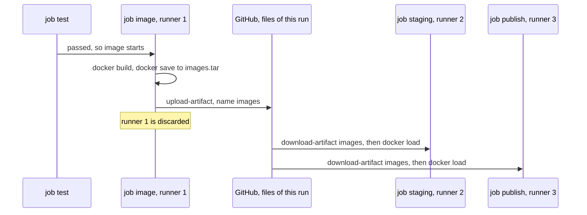

## Bạn cần biết trước

- [[devops.l2.building-images-in-ci]] — bạn biết job `image` build `donhang-api:stage-2` một lần, và `staging` chạy đúng image đó với `--no-build`.
- [[devops.l2.dependency-cache]] — bạn biết `actions/cache` lưu một thư mục dưới một cache key và khôi phục nó ở các lần chạy sau thế nào.

## Tình huống

Bạn review một pull request dọn dẹp `ci.yml`. Nó xóa hai bước khỏi job `image`: "Save both images to one file" và bước `actions/upload-artifact` ngay sau. Tác giả giải thích: "`staging` có `needs: [test, image]`, nên nó chạy ngay sau `image`, mà image thì build xong rồi." Một reviewer khác đề xuất cách dung hòa: vẫn giữ file, nhưng lưu bằng `actions/cache`, thứ job `test` đang dùng. Trước khi đồng ý với ý nào, bạn cần biết một job nhìn thấy được gì của job khác. Các image build trong job `image` tới được job `staging` bằng cách nào, và loại file lưu trữ nào phải chở chúng?

## Khái niệm cốt lõi

- Job — một danh sách bước có tên, nằm dưới `jobs:` trong một workflow. Nó chạy trên một runner của riêng nó.
- `needs:` — khóa bắt một job chờ tới khi các job nó nêu tên đã qua, và bỏ qua job đó nếu một trong số chúng fail. Nó quyết định khi nào job bắt đầu, không quyết định job chạy ở đâu.
- **artifact** (tập file một lần chạy pipeline lưu lại để job sau, hoặc người xem sau đó, tải về) — một tập file mà một job tải lên bằng `actions/upload-artifact`, được giữ cùng lần chạy workflow đó, để một job sau trong cùng lần chạy tải về bằng `actions/download-artifact`.
- `docker save` và `docker load` — hai lệnh ghi image, kèm cả tên, vào một file `.tar` rồi đọc chúng trở lại vào Docker.
- Cache và artifact — cache giúp đỡ tốn thời gian qua nhiều lần chạy và có thể không có, còn artifact là output của một lần chạy mà job sau phụ thuộc vào.

## Cơ chế hoạt động



Trong tình huống trên, tác giả hình dung một máy chạy lần lượt từng job. GitHub Actions không làm vậy. Khi một lần chạy bắt đầu, mọi job không có `needs:` đều có thể chạy ngay, song song, mỗi job trên một runner mới của riêng nó. Ở lần chạy cho commit `stage-2` trên `master`, bốn job không có `needs:` (`test`, `app`, `lab`, `manifests`) bắt đầu cách nhau chừng một giây, trên bốn runner khác nhau.

`needs:` đổi thời điểm job bắt đầu, không đổi nơi nó chạy. `image` chờ `test`, còn `staging` và `publish` chờ `test` và `image`. Mỗi job vẫn nhận một runner mới, không có các image mà job trước đã build. Runner đó mất đi khi job của nó kết thúc.

Vì vậy image phải đi dưới dạng một file. `image` ghi cả hai image vào `images.tar` bằng `docker save`, và `actions/upload-artifact` lưu file đó cùng lần chạy dưới tên `images`. `staging` và `publish` mỗi job tải nó về bằng `actions/download-artifact` rồi chạy `docker load`, lệnh này đưa các image trở lại dưới đúng tên của chúng. Lần tải lên và cả hai lần tải về đều ghi log cùng một dấu vân tay tính từ các byte của file được lưu: một file, ba job. Artifact vẫn nằm trong trang của lần chạy sau khi chạy xong, cho tới khi hết hạn, nên người cũng tải về được.

Ý dùng cache hỏng vì một lý do khác. Cache thuộc về repository, không thuộc một lần chạy: nó được tìm theo key, và GitHub có thể xóa nó. Khi miss, bước cache vẫn qua, và `staging` sẽ fail muộn hơn, ở `docker load`, với lỗi báo thiếu `images.tar` chứ không phải ở bước đã miss. Artifact thuộc về chính lần chạy này và được hỏi theo tên: nếu thiếu `images`, `actions/download-artifact` fail ngay tại đó.

## Trong hệ thống Đơn Hàng

Phần cuối của job `image`:

```yaml file=.github/workflows/ci.yml tag=stage-2 lines=74-83
      # lesson: devops.l2.workflow-artifacts
      # This runner, and the images on it, are gone when the job ends. The
      # images leave as one file, an artifact of this run, for later jobs.
      - name: Save both images to one file
        run: docker save --output images.tar donhang-api:stage-2 donhang-migrate:stage-2

      - uses: actions/upload-artifact@v4
        with:
          name: images
          path: images.tar
```

`docker save` nêu tên cả hai image, nên một file chở cả hai, mỗi image kèm tên của nó. `name: images` là cái tên các job sau sẽ hỏi tới, còn `path:` cho biết file nào được đưa vào. Ở lần chạy `stage-2` trên `master`, bước này ghi log rằng artifact `images` đã được tải lên.

Phần đầu của job `staging`:

```yaml file=.github/workflows/ci.yml tag=stage-2 lines=89-102
  staging:
    if: github.event_name == 'push' && github.ref == 'refs/heads/master'
    needs: [test, image]
    runs-on: ubuntu-24.04
    environment: staging
    steps:
      - uses: actions/checkout@v4

      - uses: actions/download-artifact@v4
        with:
          name: images

      - name: Load the images
        run: docker load --input images.tar
```

`needs: [test, image]` chỉ có nghĩa là "sau khi cả hai đã qua". `actions/download-artifact` hỏi `images` theo tên và ghi `images.tar` vào thư mục làm việc của job, rồi `docker load` ghi log `Loaded image: donhang-api:stage-2` và `Loaded image: donhang-migrate:stage-2`.

Dòng `if:` và `environment:` thuộc về bài sau. Tạm thời, `if:` chỉ cho job chạy khi có push lên `master`. Ở lần chạy cho nhánh `auto/stage-2`, nó bỏ qua `staging`, dòng giống hệt trong `publish` cũng bỏ qua job đó, vậy mà `image` vẫn tải `images` lên: artifact được giữ cùng lần chạy dù có job nào tải nó về hay không.

## Người mới hay nghĩ rằng…

- **"Job có `needs:` một job khác thì chạy trên cùng máy, nên đọc được các file job trước đã ghi."** → Thực ra `needs:` chỉ sắp thứ tự các job, mỗi job nhận một runner mới của riêng nó, và runner đầu tiên đã mất cùng mọi thứ trên đó. Bạn sẽ nhận ra khi một job sau fail vì một file hay image mà job trước rõ ràng đã tạo lại không có ở đó.
- **"Cache và artifact chỉ là hai tên gọi của file được lưu, nên dùng cái nào để trao bản build giữa các job cũng được."** → Thực ra cache là một lối tắt được phép miss, và job phải chạy được khi không có nó. Artifact giữ output của một lần chạy, và job cần nó sẽ fail khi thiếu nó. Bạn sẽ nhận ra khi một job lấy đầu vào từ cache qua ở lần chạy này rồi hỏng ở lần sau, dù code không đổi gì.

## Thử ngay (3 phút)

Khi Docker Desktop đang chạy và lab đã khởi động ở stage-2 (`scripts/up.sh` build cả hai image), ở thư mục gốc Đơn Hàng, trong Git Bash:

1. Chạy lệnh save của job `image`: `docker save --output images.tar donhang-api:stage-2 donhang-migrate:stage-2`.
2. Chạy `ls -lh images.tar`, rồi `docker load --input images.tar`, rồi `rm images.tar`.
3. Nghĩ xem: nếu `staging` mất dòng `needs:` nhưng vẫn giữ bước tải về, chuyện gì xảy ra khi push lên `master`?

Kết quả mong đợi: bước 1 không in gì và để lại một file, cỡ vài trăm megabyte. Ở bước 2, `docker load` in hai dòng bắt đầu bằng `Loaded image:`, một cho `donhang-api:stage-2` và một cho `donhang-migrate:stage-2`: đúng những dòng job `staging` ghi log.

<details><summary>Gợi ý đáp án</summary>

`staging` sẽ bắt đầu cùng lúc với `test`, trên runner riêng, trong khi `image` vẫn đang chờ `test`. Bước tải về của nó sẽ hỏi `images` trước khi job `image` kịp tải lên, nên bước đó fail và `staging` chuyển đỏ. Nó cũng không còn bị bỏ qua khi test fail.

</details>

## Liên hệ

- [[devops.l2.building-images-in-ci]] — bài cần học trước: lần build mà bài này chở kết quả từ job này sang job khác.
- [[devops.l2.dependency-cache]] — loại file lưu trữ còn lại: cache giúp đỡ tốn thời gian qua các lần chạy, artifact chở output của một lần chạy.
- [[devops.l2.deployment-environments]] — bài tiếp theo: job `staging` làm gì với các image nó đã load.
- [[devops.l2.pushing-images-from-ci]] — `publish` đưa chính artifact đó tới một server nằm ngoài lần chạy thế nào.

## Tóm tắt 5 dòng

1. Các job trong một lần chạy không dùng chung file nào, nên job `image` trao image cho các job sau dưới dạng một artifact.
2. Job không có `needs:` bắt đầu cùng lúc, mỗi job trên một runner mới của riêng nó. `needs:` chỉ bắt job chờ.
3. `docker save` ghi cả hai image vào `images.tar`, rồi `actions/upload-artifact` lưu nó cùng lần chạy dưới tên `images`.
4. `staging` và `publish` tải `images` về bằng `actions/download-artifact`, rồi `docker load` khôi phục đúng các image đó.
5. Cache giúp đỡ tốn thời gian qua các lần chạy và có thể miss, còn artifact là output của lần chạy này, job cần nó sẽ fail khi thiếu.
