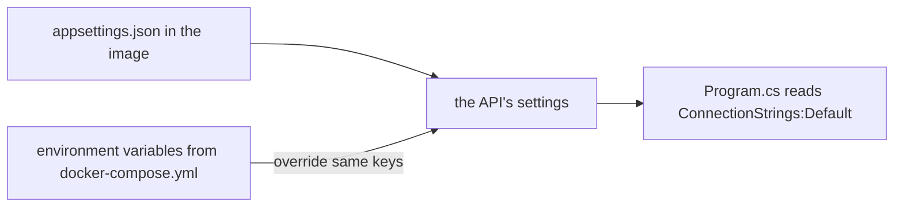

## Before you start

- [[foundation.l1.env-and-config]] — you know a process is handed a copy of name–value pairs, its environment variables, when it starts, and reads configuration from them.
- [[devops.l1.compose-for-the-api]] — you know the `api` service in `docker-compose.yml` builds the API's image and passes it a connection string with `Host=db`.

## The situation

The API's image is built once and runs unchanged in the lab. On your laptop the database is at `localhost:5432`, in the lab it is `db`, and on a real server it will be somewhere else again. If the address were written into the code, you would need a different build for every place the API runs, and the image you tested would not be the image you deploy. Yet `docker compose` hands the same image a connection string, and the API uses it. What decides which settings the API sees, and why is none of it inside the image?

## Core concepts

- **config** — everything about how an app behaves that varies by where it runs, such as a database address or a log level, kept separate from the code, which does not change between those places.
- configuration source — a place ASP.NET Core reads settings from, such as `appsettings.json` or environment variables; later sources override earlier ones for the same key.
- `__` in a variable name — a double underscore stands for the `:` in a settings key, so `ConnectionStrings__Default` sets `ConnectionStrings:Default`.

## How it works



Code is the same wherever the app runs: the same controllers, the same checks, the same compiled image. **Config** is the part that should differ: which database to talk to, how much to log, which key to sign tokens with. Keeping config out of the code means one build can run anywhere, with only the settings around it changing.

ASP.NET Core does not read settings from one place. It builds them from several configuration sources in a fixed order, and when two sources set the same key, the later one wins. `appsettings.json`, shipped inside the image with the code, comes early. Environment variables come later, so an environment variable overrides the same key from the file. A key written with `:` in the file, such as `Logging:LogLevel:Default`, is written with `__` in a variable name, because not every system allows `:` there: `Logging__LogLevel__Default`.

This is the same mechanism as in the environment variables lesson, now used by the app: the process gets its variables when it starts, and ASP.NET Core turns them into settings. So the file can hold sensible defaults that are the same everywhere, and each place the API runs can supply its own values without touching the image.

## In the Đơn Hàng system

The settings the `api` service gets in `docker-compose.yml`:

```yaml file=docker-compose.yml tag=stage-1 lines=89-93
    environment:
      # lesson: devops.l1.config-and-env
      ConnectionStrings__Default: "Host=db;Database=donhang;Username=donhang;Password=${POSTGRES_PASSWORD}"
      Jwt__SigningKey: "${JWT_SIGNING_KEY}"
      ASPNETCORE_ENVIRONMENT: "Development"
```

These three variables are the API's config in the lab. `ConnectionStrings__Default` becomes the key `ConnectionStrings:Default`, which `Program.cs` reads for the database, with `Host=db` and a password filled in by Compose. `Jwt__SigningKey` becomes `Jwt:SigningKey`, the key for signing tokens. `ASPNETCORE_ENVIRONMENT` tells ASP.NET Core it is running in `Development`.

`appsettings.json`, inside the image, holds only settings that are the same everywhere: log levels, `AllowedHosts`, and the JWT issuer and audience. It has no connection string and no signing key. So the image carries no database address and no password: the same `donhang-api:stage-1` could run against another database by changing only the lines above.

## Beginners often think…

- **"Config belongs in appsettings.json only; environment variables are just for the operating system, not the app."** → Actually ASP.NET Core reads environment variables as one of its configuration sources, and they override the file. The API's connection string comes only from an environment variable; the file does not have one. You notice this when the API works in the lab but, started with no variables, stops at once with "ConnectionStrings:Default is not set".
- **"The same config values should work unchanged in every environment, or something was set up wrong."** → Actually config exists precisely because the values differ: the database is `localhost:5432` from your laptop and `db` inside the lab. What stays the same is the code and the image. You notice this when a connection string that works from your editor makes the API fail inside Docker.

## Try it (3 minutes)

With the lab running, in a terminal on your own machine:

1. Run `docker exec donhang-api sh -c "printenv | grep -E 'ConnectionStrings|ASPNETCORE'"` to list some of the API container's environment variables.
2. Run `docker exec donhang-api sh -c "cat /app/appsettings.json"` to see the settings file inside the image.
3. Run `docker run --rm donhang-api:stage-1`, which starts the same image with none of Compose's settings.

Expected result: 1 — `ConnectionStrings__Default=Host=db;Database=donhang;...` (with the lab's fake password), `ASPNETCORE_ENVIRONMENT=Development` and a few more `ASPNETCORE_` lines. 2 — logging levels, `AllowedHosts` and `Jwt` with `Issuer` and `Audience`, but no connection string. 3 — the container stops at once with "Unhandled exception. System.InvalidOperationException: ConnectionStrings:Default is not set".

Step 3 ran exactly the image the lab runs. Why does the lab's container work and this one not?

<details><summary>Suggested answer</summary>

The connection string is config, and it is not in the image: `appsettings.json` has none. In the lab, Compose starts the container with the `environment` lines from `docker-compose.yml`, and ASP.NET Core reads `ConnectionStrings__Default` as `ConnectionStrings:Default`. The container in step 3 got no such variable, so `Program.cs` found no connection string and stopped.

</details>

## Connections

- [[foundation.l1.env-and-config]] — how a process gets its environment variables in the first place.
- [[devops.l1.secrets-vs-config]] — why the password and the signing key need more care than the log level.
- [[devops.l1.twelve-factor-config]] — the name for keeping config out of the code.

## Five-line summary

1. **Config** is what varies by where the app runs, such as the database address; code and image stay the same.
2. ASP.NET Core reads several configuration sources; environment variables override the same keys from `appsettings.json`.
3. A `__` in a variable name stands for `:` in a settings key, so `ConnectionStrings__Default` sets `ConnectionStrings:Default`.
4. The API's image holds no connection string or signing key; `docker-compose.yml` passes them as environment variables.
5. The same image started without those variables stops with "ConnectionStrings:Default is not set".
