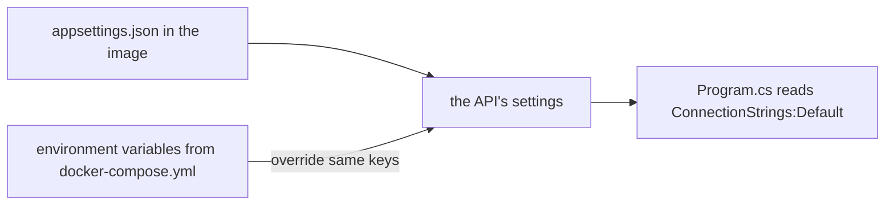

## Bạn cần biết trước

- [[foundation.l1.env-and-config]] — bạn biết một process được trao một bản sao các cặp tên–giá trị, tức biến môi trường, khi nó khởi động, và đọc cấu hình từ đó.
- [[devops.l1.compose-for-the-api]] — bạn biết service `api` trong `docker-compose.yml` dựng image của API và truyền cho nó một connection string với `Host=db`.

## Tình huống

Image của API chỉ được build một lần. Trên laptop, database ở `localhost:5432`, trong lab nó là `db`, và trên một server thật nó sẽ lại ở chỗ khác. Nếu địa chỉ được viết vào code, bạn sẽ cần một bản build khác cho mỗi nơi API chạy, và image bạn đã test sẽ không phải image bạn deploy. Trong lab, `docker compose` đưa cho chính image đó một connection string, thiết lập cho API biết database ở đâu và đăng nhập thế nào, và API dùng nó. Điều gì quyết định API thấy những thiết lập nào, và vì sao địa chỉ database và mật khẩu không nằm trong image?

## Khái niệm cốt lõi

- **config** — mọi thứ về cách app hoạt động mà thay đổi theo nơi nó chạy, như địa chỉ database hay mức log (app ghi log chi tiết tới đâu), được giữ tách khỏi code, thứ không đổi giữa các nơi đó.
- nguồn cấu hình — một nơi ASP.NET Core đọc thiết lập, như `appsettings.json` hay biến môi trường; nguồn sau ghi đè nguồn trước với cùng một key.
- `__` trong tên biến — hai dấu gạch dưới đại diện cho `:` trong key thiết lập, nên `ConnectionStrings__Default` đặt `ConnectionStrings:Default`.

## Cơ chế hoạt động



Code giống nhau ở mọi nơi app chạy: cùng các controller, cùng các phép kiểm tra, cùng image đã biên dịch. **Config** là phần nên khác nhau: nói chuyện với database nào, ghi log nhiều hay ít, ký token bằng key nào. Giữ config ngoài code nghĩa là một bản build chạy được ở mọi nơi, chỉ các thiết lập xung quanh nó thay đổi.

ASP.NET Core không đọc thiết lập từ một chỗ. Nó dựng thiết lập từ nhiều nguồn cấu hình theo một thứ tự mặc định định sẵn, và khi hai nguồn đặt cùng một key, nguồn sau thắng. `appsettings.json`, đi kèm code bên trong image, đứng sớm. Biến môi trường đứng sau, nên một biến môi trường ghi đè cùng key từ file. Một key viết bằng `:` trong file, như `Jwt:Issuer`, được viết bằng `__` trong tên biến, vì không phải hệ thống nào cũng cho phép `:` ở đó: `Jwt__Issuer`. `Program.cs` sau đó đọc bộ thiết lập đã gộp, như `ConnectionStrings:Default`, mà không cần biết mỗi giá trị đến từ nguồn nào.

Đây là cùng cơ chế trong bài biến môi trường, giờ được app dùng: process nhận các biến của nó khi khởi động, và ASP.NET Core biến chúng thành thiết lập. Vì vậy file có thể giữ những giá trị mặc định hợp lý giống nhau ở mọi nơi, còn mỗi nơi API chạy có thể cung cấp giá trị riêng mà không đụng tới image.

## Trong hệ thống Đơn Hàng

Các thiết lập mà service `api` nhận trong `docker-compose.yml`:

```yaml file=docker-compose.yml tag=stage-1 lines=89-93
    environment:
      # lesson: devops.l1.config-and-env
      ConnectionStrings__Default: "Host=db;Database=donhang;Username=donhang;Password=${POSTGRES_PASSWORD}"
      Jwt__SigningKey: "${JWT_SIGNING_KEY}"
      ASPNETCORE_ENVIRONMENT: "Development"
```

Ba biến này là config Compose đưa cho API trong lab. `ConnectionStrings__Default` trở thành key `ConnectionStrings:Default`, thứ `Program.cs` đọc để lấy database, với `Host=db` và một mật khẩu mà Compose điền vào chỗ `${POSTGRES_PASSWORD}` từ file `.env` do `scripts/dev-secrets.sh` ghi ra; bài sau sẽ xem xét file đó. `Jwt__SigningKey` trở thành `Jwt:SigningKey`, key dùng để ký token. `ASPNETCORE_ENVIRONMENT` cho ASP.NET Core biết tên của nơi nó đang chạy, ở đây là `Development`.

`appsettings.json`, bên trong image, chỉ giữ những thiết lập giống nhau ở mọi nơi: mức log, `AllowedHosts` (những tên host mà API trả lời), và JWT issuer cùng audience, những cái tên API ghi vào mọi token. Nó không có connection string và không có signing key. Vì vậy image không mang địa chỉ database hay mật khẩu nào: cùng `donhang-api:stage-1` có thể chạy với một database khác chỉ bằng cách đổi các dòng ở trên.

## Người mới hay nghĩ rằng…

- **"Config chỉ thuộc về appsettings.json; biến môi trường chỉ dành cho hệ điều hành, không phải cho app."** → Thực ra ASP.NET Core đọc biến môi trường như một trong các nguồn cấu hình, và chúng ghi đè file. Connection string của API chỉ đến từ một biến môi trường; file không có. Bạn sẽ nhận ra khi API chạy tốt trong lab nhưng, khởi động không kèm biến nào, lại dừng ngay với "ConnectionStrings:Default is not set".
- **"Cùng một bộ giá trị config phải chạy y nguyên ở mọi môi trường, không thì là thiết lập sai ở đâu đó."** → Thực ra config tồn tại chính vì các giá trị khác nhau giữa mọi nơi API chạy: database là `localhost:5432` từ laptop và `db` bên trong lab. Thứ giữ nguyên là code và image. Bạn sẽ nhận ra khi một connection string chạy tốt từ editor lại làm API hỏng bên trong Docker.

## Thử ngay (3 phút)

Khi lab đang chạy, trong một terminal trên chính máy bạn:

1. Chạy `docker exec donhang-api sh -c "printenv | grep -E 'ConnectionStrings|ASPNETCORE'"` để liệt kê vài biến môi trường của container API (`printenv` in chúng ra, còn `grep` chỉ giữ các dòng khớp).
2. Chạy `docker exec donhang-api sh -c "cat /app/appsettings.json"` để xem file thiết lập bên trong image.
3. Chạy `docker run --rm donhang-api:stage-1`, lệnh khởi động cùng image đó mà không có thiết lập nào của Compose.

Kết quả mong đợi: 1 — `ConnectionStrings__Default=Host=db;Database=donhang;...` (với mật khẩu từ file `.env` của lab), `ASPNETCORE_ENVIRONMENT=Development` và thêm vài dòng `ASPNETCORE_`. 2 — các mức log, `AllowedHosts` và `Jwt` với `Issuer` và `Audience`, nhưng không có connection string. 3 — container dừng ngay với "Unhandled exception. System.InvalidOperationException: ConnectionStrings:Default is not set".

Bước 3 chạy đúng image mà lab chạy. Vì sao container của lab chạy được còn container này thì không?

<details><summary>Gợi ý đáp án</summary>

Connection string là config, và nó không nằm trong image: `appsettings.json` không có. Trong lab, Compose khởi động container với các dòng `environment` từ `docker-compose.yml`, và ASP.NET Core đọc `ConnectionStrings__Default` thành `ConnectionStrings:Default`. Container ở bước 3 không nhận biến nào như vậy, nên `Program.cs` không tìm thấy connection string và dừng lại.

</details>

## Liên hệ

- [[foundation.l1.env-and-config]] — ngay từ đầu một process nhận biến môi trường ra sao.
- [[devops.l1.secrets-vs-config]] — vì sao mật khẩu và signing key cần được giữ cẩn thận hơn mức log.
- [[devops.l1.twelve-factor-config]] — tên gọi cho việc giữ config ngoài code.

## Tóm tắt 5 dòng

1. **Config** là thứ thay đổi theo nơi app chạy, như địa chỉ database; code và image thì giữ nguyên.
2. ASP.NET Core đọc nhiều nguồn cấu hình; biến môi trường ghi đè cùng key từ `appsettings.json`.
3. `__` trong tên biến đại diện cho `:` trong key thiết lập, nên `ConnectionStrings__Default` đặt `ConnectionStrings:Default`.
4. Image của API không chứa connection string hay signing key; `docker-compose.yml` truyền chúng dưới dạng biến môi trường.
5. Cùng image đó khởi động không kèm các biến ấy sẽ dừng với "ConnectionStrings:Default is not set".
