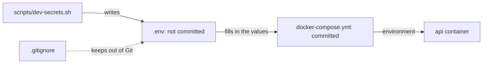

## Before you start

- [[devops.l1.config-and-env]] — you know the API's connection string and signing key reach it as environment variables from `docker-compose.yml`, and that Compose fills in `${POSTGRES_PASSWORD}` from a `.env` file.

## The situation

`docker-compose.yml` is committed to the repository, and everyone who clones it can read every line. Two of its values are different from the rest: the database password inside the connection string, and the key the API signs login tokens with. Anyone who has them can read every order in the database, or make tokens the API will accept as any customer. Yet the committed file contains neither: it says `${POSTGRES_PASSWORD}` and `${JWT_SIGNING_KEY}`. Where do the real values come from, and what keeps them out of the repository?

## Core concepts

- **secret** — config that must never be readable by anyone who should not have it, such as a database password or a signing key; a stricter kind than ordinary config like a log level.
- `.env` — a file next to `docker-compose.yml` whose `NAME=value` lines Compose uses to fill in `${NAME}` in the compose file.
- `.gitignore` — a file listing untracked paths, files Git has never been told to include in commits, that Git should ignore, so `git add` does not pick them up by accident.

## How it works



Every **secret** is config, but not all config is secret. A log level can be printed, shared in a chat and committed to the repository without harm. A database password or a signing key cannot: whoever reads it gets the power it protects. So secrets need stricter rules than ordinary config. They are kept out of the repository, shown to as few people and programs as possible, and replaced when they leak.

Keeping a secret out of the repository means the committed files hold only a placeholder, and the real value lives somewhere Git does not track. For a local lab, that is a file on your own machine that `.gitignore` excludes. In the lab, `scripts/dev-secrets.sh` writes that file, Compose reads it and fills its values into `docker-compose.yml`, and the API's container receives them as environment variables. So every developer gets a working value without anyone committing one.

Committing a secret is hard to undo. Git keeps every version of every file, so a secret committed once stays in the history even after a later commit deletes it, and anyone with a clone, a full copy of the repository with all its history, can find it. Deleting it from your files and committing the deletion is not enough; the secret has to be treated as leaked and replaced.

## In the Đơn Hàng system

The first two lines of `.gitignore`:

```text file=.gitignore tag=stage-1 lines=1-2
.env
secrets/
```

Git ignores `.env` and everything under `secrets/`, so `git add` does not pick them up. Both are filled by `scripts/dev-secrets.sh`, which `scripts/up.sh` runs first:

```bash file=scripts/dev-secrets.sh tag=stage-1 lines=8-23
if [ ! -f .env ]; then
  cat > .env <<'ENV'
# Development only. Fake password, committed nowhere, safe to read out loud.
POSTGRES_PASSWORD=donhang-dev-password
ENV
  echo "created .env"
fi

# lesson: devops.l1.secrets-vs-config
# lesson: devops.l1.the-jwt-secret-in-practice
# The key DonHang.Api signs and checks JWTs with — random, so every learner's
# lab has its own, and a token from one machine's api never verifies on another.
if ! grep -q '^JWT_SIGNING_KEY=' .env 2>/dev/null; then
  echo "JWT_SIGNING_KEY=$(openssl rand -base64 48)" >> .env
  echo "added JWT_SIGNING_KEY to .env"
fi
```

If `.env` does not exist yet, the script writes one with `POSTGRES_PASSWORD`. That value is fixed and deliberately fake, and the comment says so: it is safe only because it protects nothing but your local lab. Then, if `.env` has no `JWT_SIGNING_KEY`, the script adds one made of random bytes from `openssl`, so every learner's lab gets its own key. Further down, the script also creates the SSH key the lab box uses, in `secrets/`.

When Compose reads `docker-compose.yml`, it replaces `${POSTGRES_PASSWORD}` and `${JWT_SIGNING_KEY}` with the values from `.env` (unless your shell already sets a variable with the same name, which takes precedence). The committed file stays a template with no real value in it, whether it is on your machine or in anyone else's clone.

## Beginners often think…

- **"A secret that's gitignored locally is safe even if it was committed once, earlier in the repository's history."** → Actually `.gitignore` has no effect on a file Git already tracks, and it changes nothing in past commits: every commit that ever contained the file still does, and anyone who clones the repository can read the old version. You notice this when `git log -- .env` lists commits for a file you thought was ignored, and the password in them still works.
- **"Ordinary config and secrets can be treated the same way, since both are just environment variables."** → Actually they travel the same way, but a secret must not be printed, shared or committed like a log level can be. A command that prints the full filled-in config shows the secrets in it too. You notice this when a command that prints the full config, such as `docker compose config`, puts the database password and the signing key on the screen for anyone watching.

## Try it (3 minutes)

With the lab running, from the repository root, in a terminal on your own machine:

1. Run `git check-ignore -v .env secrets/lab_key`, which tells you which rule in `.gitignore` excludes each path.
2. Run `git log --oneline -- .env` to list every commit on this branch that added, changed or deleted `.env`.
3. Run `docker compose config` and find the `api` service's `environment`.

Expected result: 1 — `.gitignore:1:.env` for `.env` and `.gitignore:2:secrets/` for `secrets/lab_key`. 2 — nothing: `.env` has never been committed. 3 — the connection string with the real password in place of `${POSTGRES_PASSWORD}`, and `Jwt__SigningKey` with your lab's random key, filled in for `${JWT_SIGNING_KEY}`.

Step 3 printed real values that the repository does not contain. Where did Compose get them, and why is it fine that they appeared on your screen here but would not be fine in a log the whole team can read and that is kept for months?

<details><summary>Suggested answer</summary>

Compose read them from `.env`, the untracked file `scripts/dev-secrets.sh` wrote, and filled them into the template. On your screen they are the lab's own values: a fake password and a key that protects nothing outside your machine. A log like that is read by many people and kept for a long time, so a real secret printed there counts as leaked and would have to be replaced.

</details>

## Connections

- [[devops.l1.config-and-env]] — the environment variables that carry secrets the same way as other config.
- [[devops.l1.the-jwt-secret-in-practice]] — the signing key as a secret, and what happens when it changes.
- [[backend.l1.hashing-passwords]] — why the customers' own passwords are never stored at all, only their hashes.

## Five-line summary

1. A **secret** is config whose reader gains the power it protects, such as a database password or a signing key.
2. `docker-compose.yml` holds only `${POSTGRES_PASSWORD}` and `${JWT_SIGNING_KEY}`; Compose fills them in from `.env`.
3. `.gitignore` keeps `.env` and `secrets/` out of Git, and `scripts/dev-secrets.sh` creates them on each machine.
4. A secret committed once stays in the history, so it must be replaced, not just deleted.
5. Anything that prints the full config, such as `docker compose config`, prints the secrets too.
