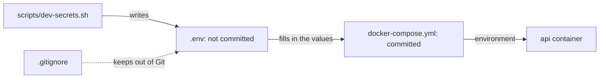

## Bạn cần biết trước

- [[devops.l1.config-and-env]] — bạn biết connection string và signing key của API tới nó dưới dạng biến môi trường từ `docker-compose.yml`, và Compose điền `${POSTGRES_PASSWORD}` từ một file `.env`.

## Tình huống

`docker-compose.yml` được commit vào repository, và ai clone nó cũng đọc được từng dòng. Hai giá trị trong đó khác với phần còn lại: mật khẩu database bên trong connection string, và key mà API dùng để ký token đăng nhập. Ai có chúng thì đọc được mọi đơn hàng trong database, hoặc tạo được token mà API chấp nhận như của bất kỳ khách hàng nào. Vậy mà file đã commit không chứa cái nào: nó ghi `${POSTGRES_PASSWORD}` và `${JWT_SIGNING_KEY}`. Giá trị thật đến từ đâu, và điều gì giữ chúng ngoài repository?

## Khái niệm cốt lõi

- **secret** — config không bao giờ được để người không có quyền đọc được, như mật khẩu database hay signing key; một loại nghiêm ngặt hơn config thường như mức log.
- `.env` — một file nằm cạnh `docker-compose.yml`, có các dòng `NAME=value` mà Compose dùng để điền vào `${NAME}` trong file compose.
- `.gitignore` — một file liệt kê các đường dẫn chưa được theo dõi, tức những file sẽ không nằm trong commit tiếp theo trừ khi bạn `git add` chúng, mà Git nên bỏ qua, để `git add` không vô tình nhặt chúng vào.

## Cơ chế hoạt động



Mọi **secret** đều là config, nhưng không phải config nào cũng là secret. Một mức log có thể được in ra, chia sẻ trong chat và commit vào repository mà chẳng hại gì. Mật khẩu database hay signing key thì không: ai đọc được nó sẽ có được quyền mà nó bảo vệ. Vì vậy secret cần quy tắc chặt hơn config thường. Chúng được giữ ngoài repository, cho càng ít người và chương trình thấy càng tốt, và được thay khi bị lộ.

Giữ secret ngoài repository nghĩa là các file đã commit chỉ chứa chỗ giữ chỗ, còn giá trị thật nằm ở nơi Git không theo dõi. Với lab chạy trên máy, đó là một file trên chính máy bạn mà `.gitignore` loại ra. Trong lab, `scripts/dev-secrets.sh` ghi `.env`, và Compose điền các giá trị từ `.env` vào các chỗ `${...}` trong lúc đọc `docker-compose.yml`, mà không sửa `docker-compose.yml`, và container của API nhận chúng dưới dạng biến môi trường. Nhờ vậy mọi lập trình viên đều có giá trị chạy được mà không ai phải commit giá trị nào.

Commit một secret là việc khó gỡ lại. Git giữ mọi phiên bản của mọi file, nên một secret đã commit một lần sẽ ở lại trong lịch sử kể cả khi một commit sau xóa nó, và ai có bản clone, tức một bản sao đầy đủ của repository kèm toàn bộ lịch sử, đều tìm được. Xóa nó khỏi các file của bạn rồi commit việc xóa là chưa đủ; secret đó phải được coi là đã lộ và phải được thay.

## Trong hệ thống Đơn Hàng

Hai dòng đầu của `.gitignore`:

```text file=.gitignore tag=stage-1 lines=1-2
.env
secrets/
```

Git bỏ qua `.env` và mọi thứ dưới `secrets/`, nên `git add` không nhặt chúng vào. Cả hai được tạo bởi `scripts/dev-secrets.sh`, script mà `scripts/up.sh` chạy đầu tiên:

```bash file=scripts/dev-secrets.sh tag=stage-1 lines=8-23
if [ ! -f .env ]; then
  cat > .env <<'ENV'
# Development only. Fake password, committed nowhere, safe to read out loud.
POSTGRES_PASSWORD=donhang-dev-password
ENV
  echo "created .env"
fi

# lesson: devops.l1.secrets-vs-config
# lesson: devops.l1.the-jwt-secret-in-practice
# The key DonHang.Api signs and checks JWTs with — random, so every learner's
# lab has its own, and a token from one machine's api never verifies on another.
if ! grep -q '^JWT_SIGNING_KEY=' .env 2>/dev/null; then
  echo "JWT_SIGNING_KEY=$(openssl rand -base64 48)" >> .env
  echo "added JWT_SIGNING_KEY to .env"
fi
```

Nếu `.env` chưa tồn tại, script ghi một file với `POSTGRES_PASSWORD`. Giá trị đó cố định và cố ý làm giả, và comment nói rõ điều đó: nó an toàn chỉ vì nó chẳng bảo vệ gì ngoài lab trên máy bạn. Sau đó, nếu `.env` chưa có `JWT_SIGNING_KEY`, script thêm một key làm từ các byte ngẫu nhiên do `openssl` tạo, nên lab của mỗi người học có key riêng. Phía dưới, script còn tạo SSH key mà lab box dùng, trong `secrets/`.

Khi Compose đọc `docker-compose.yml`, nó thay `${POSTGRES_PASSWORD}` và `${JWT_SIGNING_KEY}` bằng các giá trị từ `.env` (trừ khi shell của bạn đã đặt một biến cùng tên, biến đó được ưu tiên). File đã commit vẫn chỉ là một khuôn không chứa giá trị thật nào, dù nó nằm trên máy bạn hay trong bản clone của bất kỳ ai khác.

## Người mới hay nghĩ rằng…

- **"Một secret đã được gitignore trên máy thì an toàn, kể cả khi nó từng bị commit một lần trước đó trong lịch sử repository."** → Thực ra `.gitignore` không có tác dụng gì với file mà Git đã theo dõi, và nó không đổi gì trong các commit đã qua: mọi commit từng chứa file đó vẫn chứa nó, và ai clone repository cũng đọc được phiên bản cũ. Bạn sẽ nhận ra khi `git log -- .env` liệt kê các commit cho một file bạn tưởng đã bị bỏ qua, và mật khẩu trong đó vẫn còn dùng được.
- **"Config thường và secret có thể được đối xử như nhau, vì cả hai chỉ là biến môi trường."** → Thực ra chúng đi cùng một đường, nhưng secret không được in ra, chia sẻ hay commit như một mức log. Một lệnh in ra toàn bộ config đã điền cũng in luôn các secret trong đó. Bạn sẽ nhận ra khi một lệnh in toàn bộ config, như `docker compose config`, đưa mật khẩu database và signing key lên màn hình cho bất kỳ ai đang nhìn.

## Thử ngay (3 phút)

Khi lab đang chạy, từ thư mục gốc của repository, trong một terminal trên chính máy bạn:

1. Chạy `git check-ignore -v .env secrets/lab_key`, lệnh cho bạn biết quy tắc nào trong `.gitignore` loại từng đường dẫn ra.
2. Chạy `git log --oneline -- .env` để liệt kê mọi commit trên nhánh này đã thêm, sửa hay xóa `.env`.
3. Chạy `docker compose config` và tìm `environment` của service `api`.

Kết quả mong đợi: 1 — `.gitignore:1:.env` cho `.env` và `.gitignore:2:secrets/` cho `secrets/lab_key`. 2 — không có gì: `.env` chưa bao giờ được commit. 3 — connection string với mật khẩu thật thay cho `${POSTGRES_PASSWORD}`, và `Jwt__SigningKey` với key ngẫu nhiên của lab bạn, được điền vào chỗ `${JWT_SIGNING_KEY}`.

Bước 3 in ra các giá trị thật mà repository không chứa. Compose lấy chúng từ đâu, và vì sao chúng hiện trên màn hình bạn ở đây thì không sao nhưng sẽ là vấn đề trong một log cả team đọc được và được giữ nhiều tháng?

<details><summary>Gợi ý đáp án</summary>

Compose đọc chúng từ `.env`, file không được theo dõi mà `scripts/dev-secrets.sh` đã ghi, rồi điền chúng vào khuôn. Trên màn hình bạn, đó là các giá trị riêng của lab: một mật khẩu giả và một key chẳng bảo vệ gì ngoài máy bạn. Một log như vậy được nhiều người đọc và giữ lâu, nên một secret thật in ra ở đó coi như đã lộ và sẽ phải được thay.

</details>

## Liên hệ

- [[devops.l1.config-and-env]] — các biến môi trường mang secret đi theo cùng đường với config khác.
- [[devops.l1.the-jwt-secret-in-practice]] — signing key trong vai một secret, và chuyện gì xảy ra khi nó thay đổi.
- [[backend.l1.hashing-passwords]] — vì sao mật khẩu của khách hàng không bao giờ được lưu, chỉ lưu hash của chúng.

## Tóm tắt 5 dòng

1. Một **secret** là config mà ai đọc được sẽ có quyền nó bảo vệ, như mật khẩu database hay signing key.
2. `docker-compose.yml` chỉ chứa `${POSTGRES_PASSWORD}` và `${JWT_SIGNING_KEY}`; Compose điền chúng từ `.env`.
3. `.gitignore` giữ `.env` và `secrets/` ngoài Git, và `scripts/dev-secrets.sh` tạo chúng trên mỗi máy.
4. Một secret đã commit một lần sẽ ở lại trong lịch sử, nên nó phải được thay, không chỉ xóa đi.
5. Mọi thứ in ra toàn bộ config, như `docker compose config`, cũng in luôn các secret.
