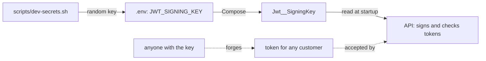

## Before you start

- [[devops.l1.secrets-vs-config]] — you know a secret must stay out of the repository, and that the lab keeps its secrets in the untracked `.env` file written by `scripts/dev-secrets.sh`.
- [[backend.l1.issuing-a-jwt]] — you know the API signs every token with HMAC-SHA256 and its signing key, and that only the holder of that key can make a matching signature.

## The situation

When you learned how the API issues tokens, one question was put off: where does the signing key live, and who may know it? Every token the API accepts is checked against that one key. A customer's password protects one account; the signing key protects all of them at once. So the key is at least as sensitive as the database password, and in the lab it travels the same way: from `.env`, through `docker-compose.yml`, into an environment variable. What exactly happens if it leaks, if it is too short, or if it changes?

## Core concepts

- signing key — the secret the API uses both to sign new tokens and to check the tokens it receives; here, `JWT_SIGNING_KEY` in `.env`, which the API reads as `Jwt:SigningKey`.
- forged token — a token someone made without logging in, with any claims they like, and a signature that matches because they have the key.
- key change — replacing the signing key; tokens signed with the old key no longer match and are rejected.

## How it works



The API checks a token by computing the signature again with its signing key and comparing. It never looks up who logged in. That makes the key all-powerful: anyone who has it can write a token with any `sub`, any expiry they like, sign it, and the API will accept it as if it had issued it. A leaked signing key is therefore not one leaked account but every account, and no password needs to be guessed.

The key must also be hard to guess. HMAC does nothing to hide a weak key: someone who has seen one real token can try candidate keys offline, as fast as their computer allows, until one produces the same signature. A short or memorable key falls quickly; a long random one does not.

Changing the key has an effect of its own. Every token already handed out was signed with the old key, so once the API runs with the new one, none of them match, and every customer has to sign in again. There is no gradual switch with a single key: the API accepts only tokens whose signature its current key reproduces (and that still pass the issuer, audience and expiry checks). The same rule works in reverse: put the old key back, and the old tokens match again.

## In the Đơn Hàng system

The part of `scripts/dev-secrets.sh` that creates the key:

```bash file=scripts/dev-secrets.sh tag=stage-1 lines=16-23
# lesson: devops.l1.secrets-vs-config
# lesson: devops.l1.the-jwt-secret-in-practice
# The key DonHang.Api signs and checks JWTs with — random, so every learner's
# lab has its own, and a token from one machine's api never verifies on another.
if ! grep -q '^JWT_SIGNING_KEY=' .env 2>/dev/null; then
  echo "JWT_SIGNING_KEY=$(openssl rand -base64 48)" >> .env
  echo "added JWT_SIGNING_KEY to .env"
fi
```

If `.env` has no `JWT_SIGNING_KEY` line yet, the script adds one: 48 random bytes from `openssl rand`, written as text with `-base64`. Every learner's lab therefore gets its own long, random key, and a token from one machine's API never verifies on another. The key is in `.env` next to `POSTGRES_PASSWORD`, and `.gitignore` keeps both out of the repository.

Compose passes it to the API as `Jwt__SigningKey`, and `Program.cs` reads it at startup:

```csharp file=DonHang.Api/Program.cs tag=stage-1 lines=22-41
// lesson: backend.l1.validating-a-jwt
var signingKey = builder.Configuration["Jwt:SigningKey"]
    ?? throw new InvalidOperationException("Jwt:SigningKey is not set");
builder.Services.AddAuthentication(JwtBearerDefaults.AuthenticationScheme)
    .AddJwtBearer(options =>
    {
        // Keep claim types exactly as issued ("sub", not the ClaimTypes.NameIdentifier
        // URI ASP.NET Core maps them to by default) so OrdersController reads the
        // same JwtRegisteredClaimNames.Sub that JwtTokenService wrote.
        options.MapInboundClaims = false;
        options.TokenValidationParameters = new TokenValidationParameters
        {
            ValidateIssuer = true,
            ValidIssuer = builder.Configuration["Jwt:Issuer"],
            ValidateAudience = true,
            ValidAudience = builder.Configuration["Jwt:Audience"],
            ValidateIssuerSigningKey = true,
            IssuerSigningKey = new SymmetricSecurityKey(Encoding.UTF8.GetBytes(signingKey)),
            ValidateLifetime = true,
        };
```

`builder.Configuration["Jwt:SigningKey"]` reads the key like any other setting, and the API throws at startup if the setting is missing altogether. `IssuerSigningKey` is the key every incoming token is checked against, the same key `JwtTokenService` signs new tokens with. Because `Program.cs` copies the key once, at startup, from an environment variable, a changed key takes effect only when the API starts again.

## Beginners often think…

- **"The JWT secret only matters if the API is publicly reachable; inside a private network it can be anything."** → Actually the key decides which tokens the API trusts, wherever the requests come from. Anyone who can send a request, including everyone on that private network, can use a known key to forge a token for any customer. You notice this when a key copied into a test script or a chat message turns out to be the one the real API uses, and anyone who saw it can act as any customer.
- **"A short, memorable JWT secret is fine, since the signature check is what matters, not the secret's own strength."** → Actually the signature check is only as strong as the key: from one real token, a short key can be found by trying candidates until a signature matches. The lab's key is 48 random bytes for that reason. You notice this when a token signed with a guessed key is accepted, because the check cannot tell it from a real one.

## Try it (3 minutes)

With the lab running, from the repository root, in a bash terminal on your own machine:

1. Run `grep -c '^JWT_SIGNING_KEY=' .env` to check the key exists, without printing it.
2. In the browser, sign in to the app at `http://localhost:8081` and leave the "Place an order" screen open.
3. Run `JWT_SIGNING_KEY=$(openssl rand -base64 48) docker compose up -d api`. A variable set in the shell takes precedence over `.env`, so this restarts the API with a different key.
4. After about ten seconds, tap "Order 1 keyboard" in the browser. If it shows `(502)`, the API is still starting; wait and tap again.
5. Run `docker compose up -d api` to put the lab's own key back, then tap "Order 1 keyboard" again.

Expected result: 1 — `1`. 3 — Compose recreates and starts `donhang-api`. 4 — "Failed: Exception: failed to create order (401)". 5 — "Order <n> placed, status new": the token you got in step 2 is accepted again.

Nothing in step 4 touched your browser or your token. Why was the order refused, and why did the same token work again in step 5?

<details><summary>Suggested answer</summary>

The token was signed with the lab's key when you signed in. In step 4 the API was checking with a different key, so the signature no longer matched and the request got `401`. In step 5 the API was back on the original key, and the signature check depends only on the key and the token, so the old signature matched again; the token was also still within its eight hours. With a real key change, the old key would never come back, so every customer would have to sign in again.

</details>

## Connections

- [[backend.l1.issuing-a-jwt]] — how the signature is made from the header, the payload and this key.
- [[backend.l1.validating-a-jwt]] — how the API checks each incoming token against the key.
- [[devops.l1.twelve-factor-config]] — the rule that keeps this key, and all other config, out of the code.

## Five-line summary

1. The JWT signing key is a secret: `scripts/dev-secrets.sh` writes 48 random bytes, as base64 text, into `.env`.
2. Compose passes it as `Jwt__SigningKey`; `Program.cs` reads it at startup and checks every token against it.
3. Anyone with the key can forge a token for any customer, so a leaked key exposes every account.
4. A short key can be guessed from one real token, which is why the lab's key is long and random.
5. After the API restarts with a new key, every token signed with the old one is rejected.
