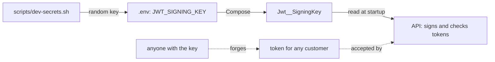

## Bạn cần biết trước

- [[devops.l1.secrets-vs-config]] — bạn biết một secret phải ở ngoài repository, và lab giữ các secret của nó trong file `.env` không được theo dõi, do `scripts/dev-secrets.sh` ghi ra.
- [[backend.l1.issuing-a-jwt]] — bạn biết API ký mọi token bằng HMAC-SHA256 và signing key của nó, và chỉ ai giữ key đó mới tạo được chữ ký khớp.

## Tình huống

Khi bạn học cách API cấp token, có một câu hỏi đã được gác lại: signing key nằm ở đâu, và ai được phép biết nó? Mọi token mà API chấp nhận đều được kiểm tra bằng đúng một key đó. Mật khẩu của một khách hàng bảo vệ một tài khoản; signing key bảo vệ tất cả cùng lúc. Vậy key này ít nhất cũng nhạy cảm như mật khẩu database, và trong lab nó đi theo cùng một đường: từ `.env`, qua `docker-compose.yml`, vào một biến môi trường. Chính xác thì chuyện gì xảy ra nếu nó bị lộ, nếu nó quá ngắn, hay nếu nó thay đổi?

## Khái niệm cốt lõi

- signing key — secret mà API dùng vừa để ký token mới vừa để kiểm tra token nhận được; ở đây là `JWT_SIGNING_KEY` trong `.env`, được API đọc thành `Jwt:SigningKey`.
- token giả — một token ai đó tạo ra mà không đăng nhập, với bất kỳ claim nào họ muốn, và một chữ ký khớp vì họ có key.
- đổi key — thay signing key; các token ký bằng key cũ không còn khớp và bị từ chối.

## Cơ chế hoạt động



Trong lab, key bắt đầu từ `scripts/dev-secrets.sh`, script ghi một key ngẫu nhiên vào `.env`; Compose đưa nó cho API dưới tên `Jwt__SigningKey`, và API đọc nó lúc khởi động. Từ đó trở đi, API kiểm tra một token bằng cách tính lại chữ ký với signing key của nó rồi so sánh. Nó không bao giờ tra xem ai đã đăng nhập. Điều đó khiến key có toàn quyền: ai có nó đều có thể viết một token với `sub` bất kỳ, thời hạn tùy ý, ký lại, và API sẽ chấp nhận như thể chính nó đã cấp. Vì vậy một signing key bị lộ không phải là một tài khoản bị lộ mà là mọi tài khoản, và chẳng cần đoán mật khẩu nào.

Key cũng phải khó đoán. HMAC không làm gì để che một key yếu: ai đã thấy một token thật có thể thử các key ứng viên ngay trên máy mình, nhanh hết mức máy cho phép, cho tới khi một key cho ra đúng chữ ký đó. Một key ngắn hay dễ nhớ sẽ sớm bị tìm ra; một key dài và ngẫu nhiên thì không.

Việc đổi key có tác động riêng. Mọi token đã phát ra đều được ký bằng key cũ, nên một khi API chạy với key mới, không token nào khớp nữa, và mọi khách hàng phải đăng nhập lại. Với một key duy nhất thì không có chuyển đổi từ từ: API chỉ chấp nhận những token mà key hiện tại của nó tái tạo được chữ ký (và vẫn qua được các phép kiểm tra issuer, audience và hạn dùng). Quy tắc đó cũng đúng theo chiều ngược lại: đặt lại key cũ, và các token cũ lại khớp.

## Trong hệ thống Đơn Hàng

Phần của `scripts/dev-secrets.sh` tạo ra key:

```bash file=scripts/dev-secrets.sh tag=stage-1 lines=16-23
# lesson: devops.l1.secrets-vs-config
# lesson: devops.l1.the-jwt-secret-in-practice
# The key DonHang.Api signs and checks JWTs with — random, so every learner's
# lab has its own, and a token from one machine's api never verifies on another.
if ! grep -q '^JWT_SIGNING_KEY=' .env 2>/dev/null; then
  echo "JWT_SIGNING_KEY=$(openssl rand -base64 48)" >> .env
  echo "added JWT_SIGNING_KEY to .env"
fi
```

Nếu `.env` chưa có dòng `JWT_SIGNING_KEY`, script thêm một dòng: 48 byte ngẫu nhiên từ `openssl rand`, viết thành chữ bằng `-base64`. Vì vậy lab của mỗi người học có key riêng, dài và ngẫu nhiên, và token từ API của máy này không bao giờ được xác minh trên máy khác. Key nằm trong `.env` cạnh `POSTGRES_PASSWORD`, và `.gitignore` giữ cả hai ngoài repository.

Compose truyền nó cho API dưới tên `Jwt__SigningKey`; hai dấu gạch dưới trong tên biến đại diện cho `:` trong tên thiết lập, nên API thấy nó là `Jwt:SigningKey`. `Program.cs` đọc nó lúc khởi động:

```csharp file=DonHang.Api/Program.cs tag=stage-1 lines=22-41
// lesson: backend.l1.validating-a-jwt
var signingKey = builder.Configuration["Jwt:SigningKey"]
    ?? throw new InvalidOperationException("Jwt:SigningKey is not set");
builder.Services.AddAuthentication(JwtBearerDefaults.AuthenticationScheme)
    .AddJwtBearer(options =>
    {
        // Keep claim types exactly as issued ("sub", not the ClaimTypes.NameIdentifier
        // URI ASP.NET Core maps them to by default) so OrdersController reads the
        // same JwtRegisteredClaimNames.Sub that JwtTokenService wrote.
        options.MapInboundClaims = false;
        options.TokenValidationParameters = new TokenValidationParameters
        {
            ValidateIssuer = true,
            ValidIssuer = builder.Configuration["Jwt:Issuer"],
            ValidateAudience = true,
            ValidAudience = builder.Configuration["Jwt:Audience"],
            ValidateIssuerSigningKey = true,
            IssuerSigningKey = new SymmetricSecurityKey(Encoding.UTF8.GetBytes(signingKey)),
            ValidateLifetime = true,
        };
```

Chỉ hai phần của khối này quan trọng ở đây; phần còn lại là việc kiểm tra token từ bài validating. `builder.Configuration["Jwt:SigningKey"]` đọc key như mọi thiết lập khác, và API throw lúc khởi động nếu hoàn toàn thiếu thiết lập đó. `IssuerSigningKey` là key mà mọi token gửi tới được kiểm tra, cũng chính là key `JwtTokenService` dùng để ký token mới. Vì `Program.cs` chép key một lần, lúc khởi động, từ một biến môi trường, nên key thay đổi chỉ có hiệu lực khi API khởi động lại.

## Người mới hay nghĩ rằng…

- **"JWT secret chỉ quan trọng khi API công khai ra ngoài; trong một mạng riêng thì nó là gì cũng được."** → Thực ra key quyết định API tin những token nào, bất kể request đến từ đâu. Ai gửi được request, kể cả mọi người trong mạng riêng đó, đều có thể dùng một key đã biết để giả token cho bất kỳ khách hàng nào; Caddy, reverse proxy phía trước, chuyển token đi mà không kiểm tra, nên chỉ có API kiểm tra. Bạn sẽ nhận ra khi một key được chép vào một script thử nghiệm hay một tin nhắn chat hóa ra lại là key mà API thật đang dùng, và ai đã thấy nó đều hành động được như bất kỳ khách hàng nào.
- **"Một JWT secret ngắn, dễ nhớ cũng được, vì thứ quan trọng là phép kiểm tra chữ ký, không phải độ mạnh của chính secret."** → Thực ra phép kiểm tra chữ ký chỉ mạnh bằng key: từ một token thật, một key ngắn có thể bị tìm ra bằng cách thử các ứng viên cho tới khi chữ ký khớp. Key của lab dài 48 byte ngẫu nhiên vì lý do đó. Bạn sẽ nhận ra khi một token ký bằng key bị đoán ra vẫn được chấp nhận, vì phép kiểm tra không phân biệt được nó với token thật.

## Thử ngay (3 phút)

Khi lab đang chạy, từ thư mục gốc của repository, trong một terminal bash trên chính máy bạn:

1. Chạy `grep -c '^JWT_SIGNING_KEY=' .env` để kiểm tra key có tồn tại, mà không in nó ra.
2. Trong trình duyệt, đăng nhập vào app tại `http://localhost:8081` và để màn hình "Place an order" mở sẵn.
3. Chạy `JWT_SIGNING_KEY=$(openssl rand -base64 48) docker compose up -d api`. Biến đặt trong shell được ưu tiên hơn `.env`, nên lệnh này khởi động lại API với một key khác. Một biến viết trước một lệnh chỉ có hiệu lực cho đúng lệnh đó.
4. Sau khoảng mười giây, bấm "Order 1 keyboard" trong trình duyệt. Nếu nó hiện `(502)`, API vẫn đang khởi động; chờ rồi bấm lại.
5. Chạy `docker compose up -d api` để đặt lại key riêng của lab, chờ khoảng mười giây, rồi bấm "Order 1 keyboard" lần nữa.

Kết quả mong đợi: 1 — `1`. 3 — Compose tạo lại và khởi động `donhang-api`. 4 — "Failed: Exception: failed to create order (401)". 5 — "Order <n> placed, status new": token bạn nhận ở bước 2 lại được chấp nhận.

Không có gì ở bước 4 đụng tới trình duyệt hay token của bạn. Vì sao đơn bị từ chối, và vì sao cùng token đó lại chạy được ở bước 5?

<details><summary>Gợi ý đáp án</summary>

Token được ký bằng key của lab khi bạn đăng nhập. Ở bước 4, API kiểm tra bằng một key khác, nên chữ ký không còn khớp và request nhận `401`. Ở bước 5, API quay lại key gốc, và phép kiểm tra chữ ký chỉ phụ thuộc vào key và token, nên chữ ký cũ lại khớp; token cũng vẫn còn trong tám giờ hiệu lực. Với một lần đổi key thật, key cũ sẽ không bao giờ quay lại, nên mọi khách hàng sẽ phải đăng nhập lại.

</details>

## Liên hệ

- [[backend.l1.issuing-a-jwt]] — chữ ký được tạo từ header, payload và key này ra sao.
- [[backend.l1.validating-a-jwt]] — API kiểm tra từng token gửi tới bằng key này ra sao.
- [[devops.l1.twelve-factor-config]] — nguyên tắc giữ key này, và mọi config khác, ngoài code.

## Tóm tắt 5 dòng

1. JWT signing key là một secret: `scripts/dev-secrets.sh` ghi 48 byte ngẫu nhiên, dạng chữ base64, vào `.env`.
2. Compose truyền nó dưới tên `Jwt__SigningKey`; `Program.cs` đọc nó lúc khởi động và kiểm tra mọi token bằng nó.
3. Ai có key đều giả được token cho bất kỳ khách hàng nào, nên một key bị lộ làm lộ mọi tài khoản.
4. Một key ngắn có thể bị đoán ra từ một token thật, đó là lý do key của lab dài và ngẫu nhiên.
5. Sau khi API khởi động lại với key mới, mọi token ký bằng key cũ đều bị từ chối.
