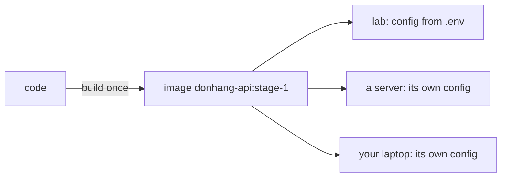

## Before you start

- [[devops.l1.the-jwt-secret-in-practice]] — you know the API's signing key, like its connection string, reaches it as an environment variable from `.env` through Compose, and that the API reads it at startup.

## The situation

Over this module, the lab has followed one habit without giving it a name. The API's image never contains the database address, password or signing key that the running API actually uses. Each of them arrives from outside when the container starts, and changing one means restarting the API, never rebuilding it. A teammate who joined from another company recognises the pattern at once and calls it "twelve-factor". Is that a rule you have to learn from scratch, or a name for what the lab already does, and what else does it ask for?

## Core concepts

- **twelve-factor app** — an app built to a published set of twelve principles for apps that run reliably in many environments; its third factor, Config, says config is kept in the environment, strictly separate from the code.
- build artifact — the result of building the code once, here the image `donhang-api:stage-1`, which then runs everywhere unchanged.
- environment — one place the app runs, such as a developer's laptop, the lab or a real server, each with its own config.

## How it works

The **twelve-factor app** is a list of practices for building apps that are deployed often and to many places. Each practice is called a factor. The one this module has been about is the third, Config: everything that varies between environments lives in the environment, usually as environment variables, and never in the code. The factor also offers a quick check: could you make the code public at any moment without giving away a single password or key?

The main result of following it is that one build serves every environment. The code is built once into an artifact, here a Docker image, and that same image runs on your laptop, in the lab and on a server. What differs between those places is only the set of environment variables around it. Moving the API to another database means changing a variable and restarting, not editing code and building again, so the thing you tested is the thing that runs.

The other eleven factors cover other parts of running an app. This module has taught only Config. The others will come up one at a time in later modules, where the lab needs them, not as a checklist to finish in one go.

## In the Đơn Hàng system

The lab passes the factor's quick check. The API's settings file, `appsettings.json`, holds only values that are the same everywhere, and the three values that differ, the connection string, the signing key and the environment's name (`ASPNETCORE_ENVIRONMENT`), arrive from `docker-compose.yml`. The database password inside the connection string and the signing key come from `.env`, which is never committed. The fake password that ends up in `.env` is written out in `scripts/dev-secrets.sh`, which is committed, so it is visible in the repository. That is deliberate: it protects only a local lab, and a real server would get its own.

The same image serves every configuration. In the last lesson you started the API with a different signing key and then with the original one again. Compose recreated the container each time, but from the same image, `donhang-api:stage-1`. Nothing was rebuilt; only the environment changed.

There is one connection string written in code, in `DonHang.Infrastructure/DesignTimeDbContextFactory.cs`. Its comment says it is used only by the `dotnet ef` migration tools on a developer's machine and never when the API starts, and its password is `design-time-only`. The running API takes its connection string from the environment alone.

## Beginners often think…

- **"Twelve-factor is a checklist every app must fully satisfy from day one, or it's being built wrong."** → Actually this course treats the factors as practices to adopt one at a time, as the app needs them. The lab follows Config fully today and meets others only as later modules need them. You notice this when a team argues about all twelve factors before its first deploy, while the one that mattered most for them, keeping config out of the image, could have been done first on its own.
- **"Config living in environment variables is the whole of twelve-factor, and the other eleven factors are about something else entirely unrelated."** → Actually Config is one factor among twelve; the others cover other parts of building and running an app, and later modules take them up. You notice this in later modules, when a problem that has nothing to do with config turns out to be what another factor is about.

## Try it (3 minutes)

With the lab running, from the repository root, in a bash terminal on your own machine:

1. Run `docker inspect donhang-api --format "{{.Image}}"` and note the first few characters after `sha256:`.
2. Run `JWT_SIGNING_KEY=$(openssl rand -base64 48) docker compose up -d api`, then repeat step 1.
3. Run `docker compose up -d api` to put the lab's key back, then run `git grep -n "Host=" -- DonHang.Api DonHang.Infrastructure DonHang.Domain`, which searches the API's three projects for `Host=`, the part of a connection string that names the database server.

Expected result: 1 — an id starting with `sha256:`. 2 — Compose recreates `donhang-api`, and the image id is exactly the same. 3 — one match, in `DonHang.Infrastructure/DesignTimeDbContextFactory.cs`.

The search in step 3 found a connection string in the code. Does that break the Config factor?

Suggested answer

No. That connection string is used only by the `dotnet ef` tools when a developer creates or applies migrations, and its comment says it never runs when the API starts. Its password, `design-time-only`, protects nothing. The running API, built into the image from step 1, reads its real connection string only from the environment that Compose provides, which is why step 2 could change the config without changing the image.

## Connections

- [[devops.l1.config-and-env]] — how ASP.NET Core reads config from environment variables.
- [[devops.l1.secrets-vs-config]] — the stricter rules for the config values that are secret.
- [[backend.l1.migrations]] — the migration tools that use the design-time connection string.

## Five-line summary

1. The **twelve-factor app** is a set of twelve practices for apps that run in many environments.
2. Its Config factor keeps everything that varies between environments in the environment, never in the code.
3. The code is built once into one image, and only the environment variables around it change.
4. The lab follows Config: the image holds none of the settings that differ between environments, and its secrets live in `.env`.
5. The other factors come up one at a time in later modules, not as a checklist to finish at once.
