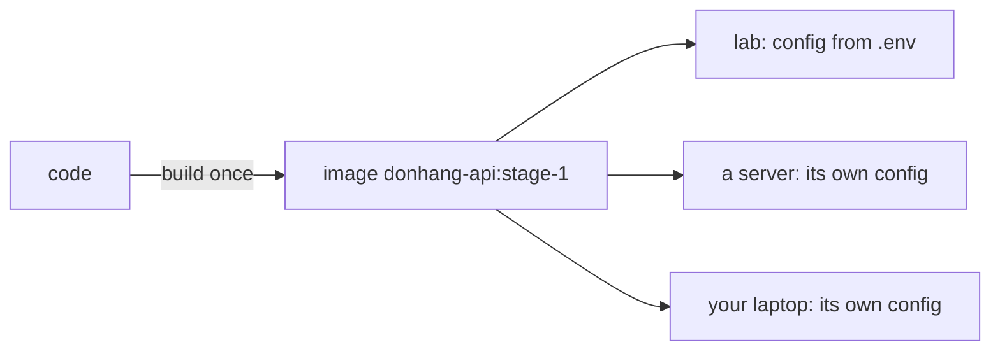

## Bạn cần biết trước

- [[devops.l1.the-jwt-secret-in-practice]] — bạn biết signing key của API, giống connection string của nó, tới API dưới dạng biến môi trường từ `.env` qua Compose, và API đọc nó lúc khởi động.

## Tình huống

Suốt module này, lab đã làm theo một thói quen mà chưa đặt tên cho nó. Image của API không bao giờ chứa địa chỉ database, mật khẩu hay signing key mà API đang chạy thực sự dùng. Mỗi thứ đều đến từ bên ngoài khi container khởi động, và đổi một thứ nghĩa là khởi động lại API, không bao giờ là build lại. Một đồng đội mới chuyển từ công ty khác sang nhận ra ngay khuôn mẫu này và gọi nó là "twelve-factor". Đó là một quy tắc bạn phải học lại từ đầu, hay chỉ là cái tên cho điều lab vốn đang làm, và nó còn yêu cầu gì nữa?

## Khái niệm cốt lõi

- **twelve-factor app** — một app được xây theo một bộ mười hai nguyên tắc đã công bố, dành cho các app chạy ổn định ở nhiều môi trường; factor thứ ba của nó, Config, nói config được giữ trong môi trường, tách hẳn khỏi code.
- sản phẩm build — kết quả của việc build code một lần, ở đây là image `donhang-api:stage-1`, sau đó chạy ở mọi nơi mà không đổi.
- môi trường — một nơi app chạy, như laptop của lập trình viên, lab hay một server thật, mỗi nơi có config riêng.

## Cơ chế hoạt động

**twelve-factor app** là một danh sách các thực hành để xây những app được deploy thường xuyên và tới nhiều nơi. Mỗi thực hành được gọi là một factor. Factor mà module này nói tới là factor thứ ba, Config: mọi thứ thay đổi giữa các môi trường nằm trong môi trường, thường là dưới dạng biến môi trường, và không bao giờ nằm trong code. Factor này còn đưa ra một phép kiểm tra nhanh: bạn có thể công khai code bất cứ lúc nào mà không để lộ một mật khẩu hay key nào không?

Kết quả chính của việc làm theo nó là một bản build phục vụ được mọi môi trường. Code được build một lần thành một sản phẩm, ở đây là một Docker image, và chính image đó chạy trên laptop của bạn, trong lab và trên server. Thứ khác nhau giữa những nơi đó chỉ là bộ biến môi trường xung quanh nó. Chuyển API sang một database khác nghĩa là đổi một biến rồi khởi động lại, không phải sửa code rồi build lại, nên thứ bạn đã test chính là thứ đang chạy.

Mười một factor còn lại bao quát những phần khác của việc chạy một app. Module này chỉ dạy Config. Các factor khác sẽ xuất hiện từng cái một ở các module sau, khi lab cần tới, không phải như một checklist phải làm xong một lượt.

## Trong hệ thống Đơn Hàng

Lab qua được phép kiểm tra nhanh của factor này. File thiết lập của API, `appsettings.json`, chỉ chứa những giá trị giống nhau ở mọi nơi, còn ba giá trị khác nhau, connection string, signing key và tên môi trường (`ASPNETCORE_ENVIRONMENT`), đến từ `docker-compose.yml`. Mật khẩu database bên trong connection string và signing key đến từ `.env`, file không bao giờ được commit. Mật khẩu giả cuối cùng nằm trong `.env` được viết sẵn trong `scripts/dev-secrets.sh`, file có được commit, nên nó hiện ra trong repository. Điều đó là cố ý: nó chỉ bảo vệ một lab trên máy, nên công khai code cũng chẳng để lộ gì bảo vệ một hệ thống thật, và một server thật sẽ có mật khẩu riêng.

Cùng một image phục vụ mọi cấu hình. Ở bài trước, bạn đã khởi động API với một signing key khác rồi lại với key gốc. Mỗi lần Compose tạo lại container, nhưng từ cùng một image, `donhang-api:stage-1`. Không có gì được build lại; chỉ môi trường thay đổi.

Có một connection string được viết trong code, ở `DonHang.Infrastructure/DesignTimeDbContextFactory.cs`. Comment của nó nói nó chỉ được các công cụ migration `dotnet ef` dùng trên máy lập trình viên và không bao giờ chạy khi API khởi động, và mật khẩu của nó là `design-time-only`. API đang chạy chỉ lấy connection string từ môi trường.

## Người mới hay nghĩ rằng…

- **"Twelve-factor là một checklist mà mọi app phải đáp ứng đầy đủ ngay từ ngày đầu, không thì là đang xây sai."** → Thực ra khóa học này coi các factor là những thực hành áp dụng từng cái một, khi app cần tới. Lab đã làm theo Config đầy đủ ngay hôm nay và chỉ gặp các factor khác khi các module sau cần. Bạn sẽ nhận ra khi một team tranh cãi về cả mười hai factor trước lần deploy đầu tiên, trong khi factor quan trọng nhất với họ, giữ config ngoài image, lẽ ra có thể làm riêng trước.
- **"Để config trong biến môi trường là toàn bộ twelve-factor, còn mười một factor kia nói về chuyện gì đó hoàn toàn không liên quan."** → Thực ra Config là một factor trong mười hai; các factor khác bao quát những phần khác của việc build và chạy app, cùng một mục tiêu là app chạy ổn định ở nhiều môi trường, và các module sau sẽ nói tới chúng. Bạn sẽ nhận ra ở các module sau, khi một vấn đề chẳng liên quan gì tới config hóa ra lại đúng là điều một factor khác nói tới.

## Thử ngay (3 phút)

Khi lab đang chạy, từ thư mục gốc của repository, trong một terminal bash trên chính máy bạn:

1. Chạy `docker inspect donhang-api --format "{{.Image}}"` và ghi lại vài ký tự đầu sau `sha256:`.
2. Chạy `JWT_SIGNING_KEY=$(openssl rand -base64 48) docker compose up -d api`, rồi lặp lại bước 1.
3. Chạy `docker compose up -d api` để đặt lại key của lab, rồi chạy `git grep -n "Host=" -- DonHang.Api DonHang.Infrastructure DonHang.Domain`, lệnh tìm `Host=` trong ba project của API (không tìm trong `docker-compose.yml`, vì đó là môi trường lab cung cấp, không phải code của API), phần của connection string ghi tên server database.

Kết quả mong đợi: 1 — một id bắt đầu bằng `sha256:`. 2 — Compose tạo lại `donhang-api`, và image id giống hệt. 3 — một kết quả, trong `DonHang.Infrastructure/DesignTimeDbContextFactory.cs`.

Lệnh tìm ở bước 3 thấy một connection string trong code. Điều đó có vi phạm factor Config không?

Gợi ý đáp án

Không. Connection string đó chỉ được các công cụ `dotnet ef` dùng khi lập trình viên tạo hay áp dụng migration, và comment của nó nói nó không bao giờ chạy khi API khởi động. Mật khẩu của nó, `design-time-only`, chẳng bảo vệ gì. API đang chạy, được build vào image ở bước 1, chỉ đọc connection string thật từ môi trường mà Compose cung cấp, đó là lý do bước 2 đổi được config mà không đổi image.

## Liên hệ

- [[devops.l1.config-and-env]] — ASP.NET Core đọc config từ biến môi trường ra sao.
- [[devops.l1.secrets-vs-config]] — các quy tắc chặt hơn cho những giá trị config là secret.
- [[backend.l1.migrations]] — các công cụ migration dùng connection string lúc thiết kế.

## Tóm tắt 5 dòng

1. **twelve-factor app** là một bộ mười hai thực hành cho các app chạy ở nhiều môi trường.
2. Factor Config của nó giữ mọi thứ thay đổi giữa các môi trường trong môi trường, không bao giờ trong code.
3. Code được build một lần thành một image, và chỉ các biến môi trường xung quanh nó thay đổi.
4. Lab làm theo Config: image không chứa thiết lập nào khác nhau giữa các môi trường, và các secret nằm trong `.env`.
5. Các factor khác xuất hiện từng cái một ở các module sau, không phải một checklist phải làm xong một lượt.
