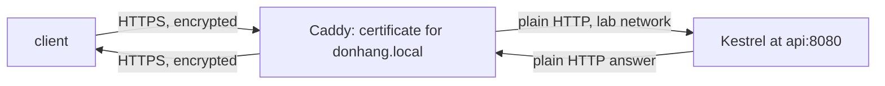

## Before you start

- [[devops.l1.reverse-proxy-basics]] — you know Caddy forwards `/api/v1/*` to Kestrel at `api:8080`, and that your laptop can reach the API only through Caddy.
- [[foundation.l1.tls-and-https]] — you know TLS checks the server's certificate and encrypts the connection, and that `tls internal` makes Caddy sign `donhang.local`'s certificate itself.

## The situation

In stage 0, `https://donhang.local:8443` served only the lab's static pages. In stage 1 the same address also answers `/api/v1/products` with real data from the API, over an encrypted connection with a certificate for `donhang.local`. Yet nothing in the API's code mentions a certificate, and Kestrel is set up to speak plain HTTP only. Somewhere between your `https://` request and Kestrel's plain answer, the encryption comes off and goes back on. Where does that happen, and is the part in between still safe?

## Core concepts

- **TLS termination** — decrypting HTTPS traffic at one point, usually the reverse proxy, so the applications behind it need no certificate of their own.
- the TLS side — the connection from the client to the proxy: encrypted, with the proxy holding the certificate.
- the plain side — the connection from the proxy to the upstream: ordinary HTTP, on a network outsiders cannot reach.

## How it works



A TLS connection has two ends, and whichever program sits at the far end is the one that needs the certificate and does the decrypting. With **TLS termination**, that program is the reverse proxy. The client's HTTPS connection ends at the proxy: the proxy shows its certificate, decrypts the request, reads it as ordinary HTTP, and decides where it goes, just as it does for plain requests. It then forwards the request to the upstream over a second connection, which can be plain HTTP. The upstream's answer comes back the same way, and the proxy encrypts it on the TLS side before it leaves.

This has a cost and a benefit. The cost is that the part between the proxy and the upstream is not encrypted, so it must run where no one else can listen: the same machine, or a private network. The benefit is that only one program deals with certificates. Adding, renewing or replacing a certificate is done in one place, and every application behind the proxy can stay a plain HTTP server that never loads a certificate or watches its expiry date. If the proxy forwards to five services, there is still one certificate to manage, not five.

## In the Đơn Hàng system

The HTTPS site in the stage-1 `Caddyfile`:

```caddyfile file=Caddyfile tag=stage-1 lines=62-76
# The same site over HTTPS, with a certificate Caddy signs itself.
# lesson: foundation.l1.tls-and-https
# lesson: devops.l1.reverse-proxy-and-tls
# TLS ends here; api only ever sees plain HTTP, on a network no other machine reaches.
donhang.local:8443 {
	tls internal
	root * /srv/www

	handle /api/v1/* {
		reverse_proxy api:8080
	}
	handle {
		file_server
	}
}
```

`donhang.local:8443` is the address this block answers for, and `tls internal` makes Caddy sign a certificate for `donhang.local` with an authority of its own, as in the TLS lesson. An authority is a signer that vouches for certificates; your laptop trusts only the authorities on its own list, and Caddy's is not on it. `root` and the last `handle` with `file_server` serve the lab's static files for every other path, as in stage 0. The new part in stage 1 is `handle /api/v1/*` with `reverse_proxy api:8080`, the same forwarding line the plain-HTTP site uses in the previous lesson. So a request to `https://donhang.local:8443/api/v1/products` is decrypted by Caddy and forwarded to Kestrel as plain HTTP. The comment says it directly: TLS ends at Caddy, and the API only ever sees plain HTTP, on the lab's private network.

On the other side, the API is set up for plain HTTP only. `DonHang.Api/Dockerfile`, the file listing the steps the lab uses to build and start the API, sets `ASPNETCORE_URLS=http://+:8080`, which tells Kestrel to listen for plain HTTP on port `8080`, and nothing in the API loads a certificate. So whichever site the client used, what reaches Kestrel is plain HTTP; the Try-it shows that Kestrel cannot even set up a TLS connection. An answer through the HTTPS site still carries `Via: 1.1 Caddy`, the header Caddy adds on the way back, just like one through the plain site.

## Beginners often think…

- **"If TLS is terminated at the proxy, the connection from the proxy to Kestrel is just as encrypted as the original one."** → Actually the encryption ends at Caddy; from there to Kestrel the request travels as plain HTTP. That is acceptable only because the lab's network between them is private. You notice this when you speak HTTPS straight to Kestrel and no TLS connection can be set up: Kestrel answers in plain HTTP, which a TLS client cannot read.
- **"Every application behind a reverse proxy needs its own TLS certificate, or the setup isn't really secure."** → Actually the certificate proves who answers the client, and the client only ever talks to the proxy. The applications behind it are never shown to the client, so a certificate on them would prove nothing to it. You notice this when a certificate expires: with termination at the proxy, one certificate is replaced in one place, and the API is not touched.

## Try it (3 minutes)

With the lab running, from the repository root:

1. Run `curl -sk -i --resolve donhang.local:8443:127.0.0.1 https://donhang.local:8443/api/v1/products/1`. `-i` (for `curl`) shows the answer's headers, `--resolve` points `donhang.local` at your own machine for this one command, and `-k` accepts the certificate Caddy signed with its own authority, which your laptop does not trust.
2. Run `ssh -p 2222 -i secrets/lab_key dev@localhost 'curl -sS https://api:8080/api/v1/products/1'`, which speaks HTTPS straight to Kestrel from the lab box.
3. Run `ssh -p 2222 -i secrets/lab_key dev@localhost 'curl -s http://api:8080/api/v1/products/1'`, the same request in plain HTTP.

Expected result: 1 — `200`, `Server: Kestrel`, `Via: 1.1 Caddy`, and product 1 as JSON. 2 — an error from `curl` about the TLS connection, such as "wrong version number", and no JSON. 3 — product 1 as JSON.

Step 1 used HTTPS and got Kestrel's answer; step 2 used HTTPS on Kestrel and got nothing. What does that tell you about where the TLS connection in step 1 ended?

<details><summary>Suggested answer</summary>

It ended at Caddy. In step 2, Kestrel received the start of a TLS conversation where it expected a plain HTTP request and answered in plain HTTP, so no TLS connection could be set up. In step 1, Caddy did the TLS part itself, decrypted the request, and forwarded it to Kestrel as plain HTTP, which is exactly what step 3 shows Kestrel can answer. The `Via: 1.1 Caddy` header in step 1 confirms the answer passed through Caddy on the way back.

</details>

## Connections

- [[foundation.l1.tls-and-https]] — what the certificate proves and what the encryption hides.
- [[devops.l1.reverse-proxy-basics]] — the forwarding that TLS termination adds encryption to.
- [[devops.l1.why-not-deploy-by-hand]] — why a setup like this should be written down and repeatable, not done by hand.

## Five-line summary

1. **TLS termination** decrypts HTTPS at one point, the reverse proxy, instead of in every application behind it.
2. In the lab, Caddy holds `donhang.local`'s certificate and forwards `/api/v1/*` to Kestrel as plain HTTP.
3. The API listens only for plain HTTP (`ASPNETCORE_URLS=http://+:8080`) and never loads a certificate.
4. The plain part between proxy and upstream is acceptable only on a private network no outsider can listen on.
5. With termination at the proxy, a certificate is added, renewed or replaced in one place.
