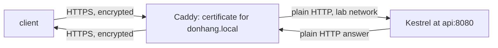

## Bạn cần biết trước

- [[devops.l1.reverse-proxy-basics]] — bạn biết Caddy chuyển `/api/v1/*` sang Kestrel tại `api:8080`, và laptop của bạn chỉ tới được API qua Caddy.
- [[foundation.l1.tls-and-https]] — bạn biết TLS kiểm tra chứng chỉ của server và mã hóa kết nối, và `tls internal` khiến Caddy tự ký chứng chỉ cho `donhang.local`.

## Tình huống

Ở stage 0, `https://donhang.local:8443` chỉ phục vụ các trang tĩnh của lab. Ở stage 1, cùng địa chỉ đó còn trả lời `/api/v1/products` bằng dữ liệu thật từ API, qua một kết nối đã mã hóa với chứng chỉ cho `donhang.local`. Vậy mà code của API không nhắc gì tới chứng chỉ, và Kestrel được thiết lập để chỉ nói HTTP thường. Ở đâu đó giữa request `https://` của bạn và câu trả lời thường của Kestrel, lớp mã hóa được gỡ ra rồi lại được gắn vào. Việc đó xảy ra ở đâu, và đoạn ở giữa có còn an toàn không?

## Khái niệm cốt lõi

- **TLS termination** — giải mã lưu lượng HTTPS tại một điểm, thường là reverse proxy, để các ứng dụng phía sau không cần chứng chỉ riêng.
- phía TLS — kết nối từ client tới proxy: đã mã hóa, và proxy giữ chứng chỉ.
- phía thường — kết nối từ proxy tới upstream: HTTP bình thường, trên một mạng mà người ngoài không tới được.

## Cơ chế hoạt động



Một kết nối TLS có hai đầu, và chương trình nào nằm ở đầu bên kia thì chương trình đó cần chứng chỉ và làm việc giải mã. Với **TLS termination**, chương trình đó là reverse proxy. Kết nối HTTPS của client kết thúc ở proxy: proxy đưa ra chứng chỉ của mình, giải mã request, đọc nó như HTTP bình thường, và quyết định nó đi đâu, y như với các request thường. Sau đó nó chuyển request tới upstream qua một kết nối thứ hai, có thể là HTTP thường. Câu trả lời của upstream quay về theo cùng đường đó, và proxy mã hóa nó ở phía TLS trước khi gửi đi.

Điều này có một cái giá và một cái lợi. Cái giá là đoạn giữa proxy và upstream không được mã hóa, nên nó phải chạy ở nơi không ai khác nghe lén được: cùng một máy, hoặc một mạng riêng. Cái lợi là chỉ một chương trình phải lo chuyện chứng chỉ. Thêm, gia hạn hay thay chứng chỉ đều làm ở một chỗ, và mọi ứng dụng phía sau proxy vẫn có thể là một HTTP server thường, không bao giờ nạp chứng chỉ hay phải canh ngày hết hạn của nó. Nếu proxy chuyển tiếp tới năm service, vẫn chỉ có một chứng chỉ phải quản lý, không phải năm.

## Trong hệ thống Đơn Hàng

Site HTTPS trong `Caddyfile` ở stage 1:

```caddyfile file=Caddyfile tag=stage-1 lines=62-76
# The same site over HTTPS, with a certificate Caddy signs itself.
# lesson: foundation.l1.tls-and-https
# lesson: devops.l1.reverse-proxy-and-tls
# TLS ends here; api only ever sees plain HTTP, on a network no other machine reaches.
donhang.local:8443 {
	tls internal
	root * /srv/www

	handle /api/v1/* {
		reverse_proxy api:8080
	}
	handle {
		file_server
	}
}
```

`donhang.local:8443` là địa chỉ mà khối này trả lời, và `tls internal` khiến Caddy ký chứng chỉ cho `donhang.local` bằng một authority của riêng nó, như trong bài TLS. Authority là bên ký đứng ra bảo đảm cho các chứng chỉ; laptop của bạn chỉ tin các authority nằm trong danh sách của nó, và authority của Caddy không có trong đó. `root` và khối `handle` cuối cùng với `file_server` phục vụ file tĩnh của lab cho mọi path còn lại, như ở stage 0. Phần mới ở stage 1 là `handle /api/v1/*` với `reverse_proxy api:8080`, đúng dòng chuyển tiếp mà site HTTP thường dùng ở bài trước. Vậy một request tới `https://donhang.local:8443/api/v1/products` được Caddy giải mã rồi chuyển sang Kestrel dưới dạng HTTP thường. Dòng comment nói thẳng điều đó: TLS kết thúc ở Caddy, và API chỉ bao giờ thấy HTTP thường, trên mạng riêng của lab.

Ở phía bên kia, API được thiết lập chỉ cho HTTP thường. `DonHang.Api/Dockerfile`, file liệt kê các bước lab dùng để build và khởi động API, đặt `ASPNETCORE_URLS=http://+:8080`, bảo Kestrel lắng nghe HTTP thường trên port `8080`, và không có gì trong API nạp chứng chỉ. Vậy dù client dùng site nào, thứ tới được Kestrel đều là HTTP thường; phần Thử ngay cho thấy Kestrel thậm chí không thiết lập được kết nối TLS. Một câu trả lời qua site HTTPS vẫn mang `Via: 1.1 Caddy`, header mà Caddy thêm vào trên đường về, y như câu trả lời qua site thường.

## Người mới hay nghĩ rằng…

- **"Nếu TLS kết thúc ở proxy, kết nối từ proxy tới Kestrel cũng được mã hóa y như kết nối ban đầu."** → Thực ra lớp mã hóa kết thúc ở Caddy; từ đó tới Kestrel, request đi dưới dạng HTTP thường. Điều đó chỉ chấp nhận được vì mạng của lab giữa hai bên là mạng riêng. Bạn sẽ nhận ra khi nói HTTPS thẳng với Kestrel và không thiết lập được kết nối TLS nào: Kestrel trả lời bằng HTTP thường, thứ mà một client TLS không đọc được.
- **"Mọi ứng dụng sau reverse proxy đều cần chứng chỉ TLS riêng, nếu không thì thiết lập đó không thật sự an toàn."** → Thực ra chứng chỉ chứng minh ai đang trả lời client, và client chỉ nói chuyện với proxy. Các ứng dụng phía sau không bao giờ lộ diện với client, nên chứng chỉ trên chúng chẳng chứng minh được gì với client. Bạn sẽ nhận ra khi một chứng chỉ hết hạn: với termination ở proxy, chỉ một chứng chỉ được thay ở một chỗ, và API không bị đụng tới.

## Thử ngay (3 phút)

Khi lab đang chạy, từ thư mục gốc của repository:

1. Chạy `curl -sk -i --resolve donhang.local:8443:127.0.0.1 https://donhang.local:8443/api/v1/products/1`. `-i` (của `curl`) hiện các header của câu trả lời, `--resolve` trỏ `donhang.local` về chính máy bạn cho riêng lệnh này, và `-k` chấp nhận chứng chỉ mà Caddy ký bằng authority của riêng nó, thứ laptop bạn không tin.
2. Chạy `ssh -p 2222 -i secrets/lab_key dev@localhost 'curl -sS https://api:8080/api/v1/products/1'`, lệnh này nói HTTPS thẳng với Kestrel từ lab box.
3. Chạy `ssh -p 2222 -i secrets/lab_key dev@localhost 'curl -s http://api:8080/api/v1/products/1'`, cùng request đó bằng HTTP thường.

Kết quả mong đợi: 1 — `200`, `Server: Kestrel`, `Via: 1.1 Caddy`, và product 1 dạng JSON. 2 — một lỗi từ `curl` về kết nối TLS, như "wrong version number", và không có JSON. 3 — product 1 dạng JSON.

Bước 1 dùng HTTPS và nhận được câu trả lời của Kestrel; bước 2 dùng HTTPS với Kestrel và không nhận được gì. Điều đó cho bạn biết kết nối TLS ở bước 1 đã kết thúc ở đâu?

<details><summary>Gợi ý đáp án</summary>

Nó kết thúc ở Caddy. Ở bước 2, Kestrel nhận phần mở đầu của một cuộc trao đổi TLS ở chỗ nó chờ một request HTTP thường, và trả lời bằng HTTP thường, nên không kết nối TLS nào được thiết lập. Ở bước 1, Caddy tự làm phần TLS, giải mã request, rồi chuyển nó sang Kestrel dưới dạng HTTP thường, đúng thứ mà bước 3 cho thấy Kestrel trả lời được. Header `Via: 1.1 Caddy` ở bước 1 xác nhận câu trả lời đã đi qua Caddy trên đường về.

</details>

## Liên hệ

- [[foundation.l1.tls-and-https]] — chứng chỉ chứng minh điều gì và lớp mã hóa che giấu điều gì.
- [[devops.l1.reverse-proxy-basics]] — việc chuyển tiếp mà TLS termination thêm lớp mã hóa vào.
- [[devops.l1.why-not-deploy-by-hand]] — vì sao một thiết lập như thế này nên được ghi lại và lặp lại được, không làm bằng tay.

## Tóm tắt 5 dòng

1. **TLS termination** giải mã HTTPS tại một điểm, reverse proxy, thay vì trong từng ứng dụng phía sau.
2. Trong lab, Caddy giữ chứng chỉ của `donhang.local` và chuyển `/api/v1/*` sang Kestrel dưới dạng HTTP thường.
3. API chỉ lắng nghe HTTP thường (`ASPNETCORE_URLS=http://+:8080`) và không bao giờ nạp chứng chỉ.
4. Đoạn không mã hóa giữa proxy và upstream chỉ chấp nhận được trên một mạng riêng mà người ngoài không nghe lén được.
5. Với termination ở proxy, chứng chỉ được thêm, gia hạn hay thay ở một chỗ.
