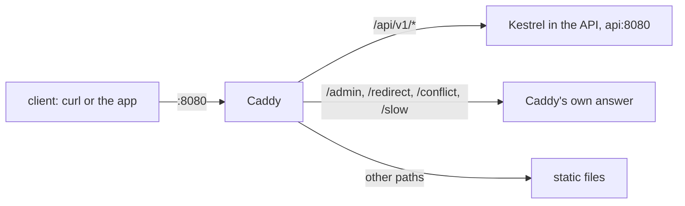

## Before you start

- [[devops.l1.what-is-deploy]] — you know the lab runs the API apart from your editor, reachable only through Caddy.
- [[backend.l1.what-kestrel-does]] — you know Kestrel is the web server inside the API, and that in stage 0 Caddy answered `/api/v1/*` with fixed strings.

## The situation

In stage 0, `curl http://localhost:8080/api/v1/orders/1` got its answer from a `respond` line typed into `Caddyfile`. Today the same address returns a real order from the database, worked out by the API's code and sent back by Kestrel. Yet the address has not changed: you still talk to port `8080`, the port Caddy listens on, and the lab gives the API no port of its own on your laptop. So your request reaches Kestrel, but you never connected to Kestrel. What sits between the two, and why would anyone put it there?

## Core concepts

- **reverse proxy** — a server that sits in front of the real application, accepts requests from outside and forwards them on; clients only ever talk to it.
- upstream — the application a reverse proxy forwards to; here, Kestrel inside the API, at `api:8080`.
- `reverse_proxy` — the `Caddyfile` line that tells Caddy to forward matching requests to an upstream and pass its answer back.

## How it works



A **reverse proxy** is the only server a client, such as `curl` or the Đơn Hàng app, can see. The client opens a connection to it and sends its request. The proxy reads the request, decides from its own rules where it should go, and opens a second connection of its own to the application behind it, the upstream. When the upstream answers, the proxy sends that answer back on the first connection. The client never learns the upstream's address and never connects to it.

That position lets the proxy do jobs the application does not have to know about. It routes: one address can serve an API, static files (files sent back exactly as they are stored, such as HTML pages) and fixed answers, each path sent to a different place. It can add or change headers on the way through. It decides what is reachable from outside at all: an application that nobody can connect to directly has one door, the proxy, instead of one door per program.

A reverse proxy is not a guard that only stops bad requests. Its main job is to pass good ones on. The client needs no setup to use it either: from the client's side, the proxy simply is the server.

## In the Đơn Hàng system

The part of `Caddyfile` that serves port `8080`, in stage 1:

```caddyfile file=Caddyfile tag=stage-1 lines=11-24
:8080 {
	root * /srv/www

	@guest header Cookie *role=guest*
	@signedIn header Cookie *sid=*

	route {
		# lesson: devops.l1.reverse-proxy-basics
		# lesson: backend.l1.what-kestrel-does
		# Caddy stays in front of Kestrel; DonHang.Api never faces the internet
		# directly (decided in backend.l1.what-kestrel-does, kept through devops).
		handle /api/v1/* {
			reverse_proxy api:8080
		}
```

`root` sets the folder that files are served from, `@guest` and `@signedIn` name request conditions used further down for `/admin`, and `route` makes Caddy try the `handle` blocks inside it in the order they are written. `handle /api/v1/*` catches every request whose path starts with `/api/v1/`, and `reverse_proxy api:8080` forwards it to port `8080` on `api`. That one line replaced all the `respond` blocks that faked `/api/v1/*` in stage 0. `/admin`, just below it in the same file, still answers with `respond` lines of its own.

The lab runs the API and the database as separate parts on a private network of its own, and Caddy shares the lab box's place on that network; `api` is the API's name there. The lab also decides which ports your laptop can reach: Caddy's `8080` is one of them, the API's is not. Because `api` is a different part from Caddy, its port `8080` is not the `8080` you type on your laptop. Caddy adds a `Via: 1.1 Caddy` header to the answers it passes back, and Kestrel's `Server: Kestrel` header comes through unchanged.

The same `route` still answers other paths itself, the way every path was answered in stage 0:

```caddyfile file=Caddyfile tag=stage-1 lines=45-58
		# lesson: foundation.l1.http-status-codes
		handle /redirect {
			redir * /index.html 302
		}
		handle /conflict {
			respond "Conflict: this order was already paid" 409
		}
		handle /slow {
			respond "Service Unavailable: the lab is pretending to be overloaded" 503
		}

		handle {
			file_server
		}
```

`/redirect`, `/conflict` and `/slow` never reach Kestrel: Caddy sends the redirect or the fixed text, with `Server: Caddy`. Anything no earlier `handle` caught falls through to the last one, `file_server`, which serves files from `/srv/www`. From outside, all of these are one server on one port; only the `Caddyfile` knows which answers came from where.

## Beginners often think…

- **"A reverse proxy is just a firewall that blocks bad requests, not something that forwards good ones."** → Actually a firewall, a guard that inspects traffic and blocks what it does not allow, is a different job; forwarding is the whole job here: every request to `/api/v1/*` in the lab goes through Caddy to Kestrel and back. Keeping the API out of direct reach is a side effect of it being the only door, not a check on each request. You notice this when a request with a broken JSON body, such as a login with `{bad`, still reaches the API and gets a `400` from it, with `Server: Kestrel`: Caddy passed it on without judging it.
- **"Kestrel could just as easily be reached directly, so the reverse proxy is only there for convenience."** → Actually in the lab you cannot reach it from your laptop: the lab gives the API no port of its own, and `api` is a name only the lab's network knows. Everything you send to the API has to go through Caddy. You notice this when you try `curl http://api:8080` from your laptop and the name does not even resolve.

## Try it (3 minutes)

With the lab running, from the repository root:

1. Run `curl -si http://localhost:8080/api/v1/products/1` and look at the headers.
2. Run `curl -si http://localhost:8080/conflict` and look at the headers.
3. Run `ssh -p 2222 -i secrets/lab_key dev@localhost 'curl -si http://api:8080/api/v1/products/1'` (answer `yes` if asked about the host key). This runs `curl` on the lab box, which is on the lab's network.

Expected result: 1 — `200`, `Server: Kestrel` and `Via: 1.1 Caddy`, then the keyboard as JSON. 2 — `409`, `Server: Caddy`, no `Via`, and the fixed text. 3 — the same JSON and `Server: Kestrel`, but no `Via` header.

Step 3 reached Kestrel without Caddy. Why could it, when your laptop cannot, and what does the missing `Via` header tell you?

<details><summary>Suggested answer</summary>

The lab box is on the lab's own network, where `api` is a known name and port `8080` on it is open to other members of that network. Your laptop is outside that network, and the lab publishes no port for the API to it, so from there Caddy is the only way in to the API. The missing `Via` header shows the answer came straight from Kestrel: `Via: 1.1 Caddy` is added by Caddy on the way through, and Kestrel never writes it.

</details>

## Connections

- [[backend.l1.what-kestrel-does]] — the web server this proxy forwards to.
- [[devops.l1.reverse-proxy-and-tls]] — the same proxy taking over HTTPS, so Kestrel never needs a certificate.
- [[devops.l1.what-is-deploy]] — why the API runs apart from your editor, reachable only through Caddy.

## Five-line summary

1. A **reverse proxy** accepts requests from outside and forwards them to the application behind it, the upstream.
2. The client only ever connects to the proxy; it never learns the upstream's address.
3. In stage 1, one `reverse_proxy api:8080` line sends `/api/v1/*` to Kestrel, replacing stage 0's fixed answers.
4. Caddy still answers `/admin`, `/redirect`, `/conflict` and `/slow` itself, on the same port as the API.
5. The API has no port of its own outside the lab, so Caddy is the only way in from your laptop.
