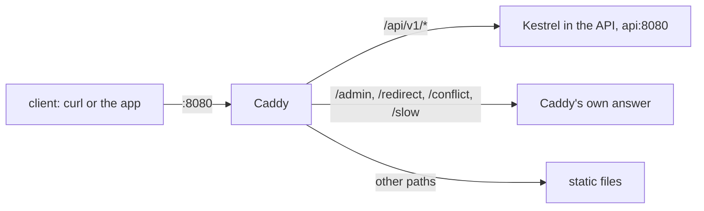

## Bạn cần biết trước

- [[devops.l1.what-is-deploy]] — bạn biết lab chạy API tách khỏi editor của bạn, chỉ tới được qua Caddy.
- [[backend.l1.what-kestrel-does]] — bạn biết Kestrel là web server bên trong API, và ở stage 0 Caddy trả lời `/api/v1/*` bằng các chuỗi cố định.

## Tình huống

Ở stage 0, `curl http://localhost:8080/api/v1/orders/1` nhận câu trả lời từ một dòng `respond` gõ sẵn trong `Caddyfile`. Hôm nay cùng địa chỉ đó trả về một đơn hàng thật từ database, do code của API tính ra và Kestrel gửi về. Vậy mà địa chỉ không đổi: bạn vẫn nói chuyện với port `8080`, port mà Caddy lắng nghe, và lab không cho API port riêng nào trên laptop của bạn. Vậy request của bạn tới được Kestrel, nhưng bạn chưa bao giờ kết nối tới Kestrel. Thứ gì đứng giữa hai bên, và vì sao người ta lại đặt nó ở đó?

## Khái niệm cốt lõi

- **reverse proxy** — một server đứng trước ứng dụng thật, nhận request từ bên ngoài rồi chuyển tiếp; client chỉ nói chuyện với nó.
- upstream — ứng dụng mà reverse proxy chuyển tiếp tới; ở đây là Kestrel bên trong API, tại `api:8080`.
- `reverse_proxy` — dòng trong `Caddyfile` bảo Caddy chuyển các request khớp tới một upstream và gửi câu trả lời của nó về.

## Cơ chế hoạt động



Một **reverse proxy** là server duy nhất mà client, như `curl` hay app Đơn Hàng, nhìn thấy. Client mở kết nối tới nó và gửi request. Proxy đọc request, tự quyết theo các luật của mình xem request nên đi đâu, rồi mở một kết nối thứ hai của riêng nó tới ứng dụng phía sau, tức upstream. Khi upstream trả lời, proxy gửi câu trả lời đó về trên kết nối thứ nhất. Client không bao giờ biết địa chỉ của upstream và không bao giờ kết nối tới nó.

Vị trí đó cho phép proxy làm những việc mà ứng dụng không cần biết tới. Nó định tuyến: một địa chỉ có thể phục vụ một API, các file tĩnh (file được gửi về đúng như khi lưu, như các trang HTML) và các câu trả lời cố định, mỗi path được gửi tới một nơi khác nhau. Nó có thể thêm hoặc đổi header trên đường đi. Nó quyết định thứ gì tới được từ bên ngoài: một ứng dụng không ai kết nối thẳng tới được chỉ có một cánh cửa là proxy, thay vì mỗi chương trình một cửa.

Reverse proxy không phải người gác chỉ để chặn request xấu. Việc chính của nó là chuyển các request tốt đi tiếp. Client cũng không cần thiết lập gì để dùng nó: từ phía client, proxy chính là server.

## Trong hệ thống Đơn Hàng

Phần của `Caddyfile` phục vụ port `8080`, ở stage 1:

```caddyfile file=Caddyfile tag=stage-1 lines=11-24
:8080 {
	root * /srv/www

	@guest header Cookie *role=guest*
	@signedIn header Cookie *sid=*

	route {
		# lesson: devops.l1.reverse-proxy-basics
		# lesson: backend.l1.what-kestrel-does
		# Caddy stays in front of Kestrel; DonHang.Api never faces the internet
		# directly (decided in backend.l1.what-kestrel-does, kept through devops).
		handle /api/v1/* {
			reverse_proxy api:8080
		}
```

`root` đặt thư mục chứa file để phục vụ, `@guest` và `@signedIn` đặt tên cho các điều kiện request dùng phía dưới cho `/admin`, và `route` bảo Caddy thử các khối `handle` bên trong nó theo đúng thứ tự viết. `handle /api/v1/*` bắt mọi request có path bắt đầu bằng `/api/v1/`, và `reverse_proxy api:8080` chuyển nó tới port `8080` trên `api`. Một dòng đó đã thay cho tất cả các khối `respond` giả lập `/api/v1/*` ở stage 0. `/admin`, ngay bên dưới trong cùng file (không hiện ở đây), vẫn trả lời bằng các dòng `respond` của riêng nó.

Lab chạy API và database thành những phần riêng trên một mạng riêng của nó, và Caddy dùng chung chỗ của lab box trên mạng đó; `api` là tên của API ở đó. Lab cũng quyết định laptop của bạn tới được những port nào: `8080` của Caddy là một trong số đó, port của API thì không. Vì `api` là một phần khác với Caddy, port `8080` của nó không phải port `8080` bạn gõ trên laptop.

Caddy thêm header `Via: 1.1 Caddy` vào các câu trả lời mà nó chuyển về, còn header `Server: Kestrel` của Kestrel đi qua nguyên vẹn.

Cùng `route` đó vẫn tự trả lời các path khác, như cách mọi path được trả lời ở stage 0:

```caddyfile file=Caddyfile tag=stage-1 lines=45-58
		# lesson: foundation.l1.http-status-codes
		handle /redirect {
			redir * /index.html 302
		}
		handle /conflict {
			respond "Conflict: this order was already paid" 409
		}
		handle /slow {
			respond "Service Unavailable: the lab is pretending to be overloaded" 503
		}

		handle {
			file_server
		}
```

`/redirect`, `/conflict` và `/slow` không bao giờ tới Kestrel: Caddy tự gửi lệnh chuyển hướng hoặc đoạn chữ cố định, kèm `Server: Caddy`. Mọi request chưa bị `handle` nào phía trên bắt sẽ rơi xuống khối cuối cùng, `file_server`, phục vụ file từ `/srv/www`. Từ bên ngoài, tất cả chỉ là một server trên một port; chỉ `Caddyfile` biết câu trả lời nào đến từ đâu.

## Người mới hay nghĩ rằng…

- **"Reverse proxy chỉ là một tường lửa chặn request xấu, không phải thứ chuyển tiếp request tốt."** → Thực ra tường lửa, người gác soi lưu lượng và chặn những gì nó không cho phép, là một việc khác; ở đây chuyển tiếp mới là toàn bộ công việc: mọi request tới `/api/v1/*` trong lab đều đi qua Caddy tới Kestrel rồi quay về. Việc API không bị tới thẳng được là hệ quả của việc proxy là cánh cửa duy nhất, không phải một phép kiểm tra trên từng request. Bạn sẽ nhận ra khi một request có body JSON hỏng, như một lần đăng nhập với `{bad`, vẫn tới được API và nhận `400` từ nó, kèm `Server: Kestrel`: Caddy đã chuyển nó đi mà không phán xét gì.
- **"Kestrel cũng có thể được tới thẳng dễ như vậy, nên reverse proxy chỉ để cho tiện."** → Thực ra trong lab bạn không tới được nó từ laptop: lab không cho API port riêng nào, và `api` là cái tên chỉ mạng của lab biết. Mọi thứ bạn gửi tới API đều phải đi qua Caddy. Bạn sẽ nhận ra khi thử `curl http://api:8080` từ laptop và cái tên đó thậm chí không phân giải được.

## Thử ngay (3 phút)

Khi lab đang chạy, từ thư mục gốc của repository:

1. Chạy `curl -si http://localhost:8080/api/v1/products/1` và xem các header.
2. Chạy `curl -si http://localhost:8080/conflict` và xem các header.
3. Chạy `ssh -p 2222 -i secrets/lab_key dev@localhost 'curl -si http://api:8080/api/v1/products/1'` (trả lời `yes` nếu được hỏi về host key). Lệnh này chạy `curl` trên lab box, vốn nằm trên mạng của lab.

Kết quả mong đợi: 1 — `200`, `Server: Kestrel` và `Via: 1.1 Caddy`, rồi bàn phím dưới dạng JSON. 2 — `409`, `Server: Caddy`, không có `Via`, và đoạn chữ cố định. 3 — cùng JSON đó và `Server: Kestrel`, nhưng không có header `Via`.

Bước 3 tới được Kestrel mà không qua Caddy. Vì sao nó làm được, trong khi laptop của bạn thì không, và việc thiếu header `Via` cho bạn biết điều gì?

<details><summary>Gợi ý đáp án</summary>

Lab box nằm trên mạng riêng của lab, nơi `api` là một cái tên được biết và port `8080` trên nó mở cho các thành viên khác của mạng đó. Laptop của bạn nằm ngoài mạng đó, và lab không mở port nào cho API ra laptop, nên từ đó Caddy là lối vào duy nhất tới API. Việc thiếu header `Via` cho thấy câu trả lời đến thẳng từ Kestrel: `Via: 1.1 Caddy` do Caddy thêm vào trên đường đi, và Kestrel không bao giờ ghi nó.

</details>

## Liên hệ

- [[backend.l1.what-kestrel-does]] — web server mà proxy này chuyển tiếp tới.
- [[devops.l1.reverse-proxy-and-tls]] — cùng proxy đó đảm nhận HTTPS, để Kestrel không bao giờ cần chứng chỉ.
- [[devops.l1.what-is-deploy]] — vì sao API chạy tách khỏi editor của bạn, chỉ tới được qua Caddy.

## Tóm tắt 5 dòng

1. Một **reverse proxy** nhận request từ bên ngoài và chuyển tiếp chúng tới ứng dụng phía sau, tức upstream.
2. Client chỉ kết nối tới proxy; nó không bao giờ biết địa chỉ của upstream.
3. Ở stage 1, một dòng `reverse_proxy api:8080` gửi `/api/v1/*` tới Kestrel, thay cho các câu trả lời cố định của stage 0.
4. Caddy vẫn tự trả lời `/admin`, `/redirect`, `/conflict` và `/slow`, trên cùng port với API.
5. API không có port riêng nào bên ngoài lab, nên Caddy là lối vào duy nhất từ laptop của bạn.
