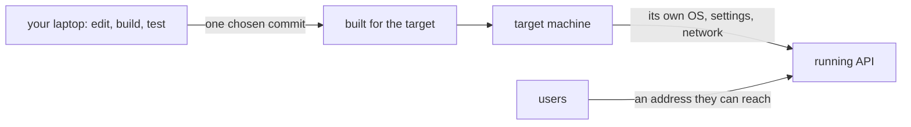

## Before you start

- [[foundation.l1.ssh-and-remote]] — you know how to get a shell on another machine, and that a command there sees that machine's paths, permissions and environment variables.
- [[management.l1.how-software-gets-made]] — you know releasing and operating are steps of their own, after building and testing.

## The situation

The Đơn Hàng API builds and its tests pass on your laptop. A teammate asks for an address the shop's staff can use to try placing orders tomorrow. Your laptop will be closed tonight, its `localhost` means nothing on anyone else's machine, and the staff will not install .NET to run your build. Something has to take this exact version of the code and keep it running on a machine they can reach. What does that step involve, and why is "it works on my machine" no proof that it will work there?

## Core concepts

- **deploy** — getting a specific, tested version of code running on a machine other than the one that wrote it, reachable by whoever needs to use it.
- target machine — the machine the code is deployed to, with its own operating system, installed programs, settings and network.
- version — one exact state of the code, usually one commit, so everyone can say which code is running.

## How it works

Writing code and running it for other people happen in different places. On your laptop, the code runs with whatever you happen to have there: your .NET version, your operating system, your files, and settings you made months ago and forgot about. A **deploy** takes one specific version, usually a commit that has passed its tests, and gets it running on a target machine that shares none of that history.

Three things differ on the target, and each can break code that ran fine at your desk. The operating system may differ: code that assumes Windows paths, or a file system that ignores upper and lower case, can fail on Linux. The installed software may differ: a runtime of another version, or a library that is simply not there. The settings and the network differ too: the database has another address, a key your laptop had set is missing, and users reach the program through addresses and ports you never used.

So "it works on my machine" answers a narrower question than it seems to. It says the code works with your laptop's operating system, software and settings. A deploy is about whether it works with the target's, and whether the people who need it can reach it there. It has succeeded when the chosen version is running on the target and answering its users, not when the files have arrived.

## In the Đơn Hàng system

The lab is a small version of this. When you run `scripts/up.sh`, it does not start the API from your editor. It builds the API from the repository's source, following the steps in `DonHang.Api/Dockerfile`, with the .NET 10 SDK on Linux, whatever your laptop runs; the built API then runs on Linux as well. It runs apart from your editor, next to Postgres, and nothing outside the lab can reach it directly. The only way in is Caddy on port `8080`, which passes `/api/v1/*` requests on to the API.

The API also takes its settings from the lab, not from your laptop. `docker-compose.yml` gives it a database address, `Host=db`, a name that means something only inside the lab, and a JWT signing key that `scripts/dev-secrets.sh` wrote into a `.env` file; both arrive as environment variables. `appsettings.json` holds neither. Start the API straight from your editor without them, and `Program.cs` stops at startup with "ConnectionStrings:Default is not set". The code is the same; the settings around it are not, and so the result is not either.

A real deploy is the same idea on a machine meant to keep running: a server that stays on when your laptop is closed, with an address the shop's staff can reach.

## Beginners often think…

- **"Deploy just means copying the built files to another folder; if they run there, deploy succeeded."** → Actually another folder on your own laptop still has your operating system, your installed runtime and your settings, so it tests almost nothing new. Even on another machine, files that start are not yet a deploy: the program must find its database, have its keys, and be reachable by its users. You notice this when a copy that "ran fine" answers nobody, because it listens on an address only that machine can reach, or stops at its first database call.
- **"A deploy that works once will keep working the same way every time after."** → Actually the target machine keeps changing after the deploy: updates install, disks fill up, settings get edited by hand, and the next version of the code needs something the last one did not. A deploy that worked proves the target was right at that moment. You notice this when the same steps that worked last month fail today, and nobody can say what changed on the machine in between.

## Try it (3 minutes)

With the lab running (`scripts/up.sh` from the repository root):

1. Open `docker-compose.yml` and find the `api` section. Read its `environment:` lines.
2. Open `DonHang.Api/appsettings.json` and look for the same settings.
3. Run `curl -s http://localhost:8080/api/v1/products` and note that it answers.

Expected result: 1 — three settings: a connection string with `Host=db`, `Jwt__SigningKey`, and `ASPNETCORE_ENVIRONMENT`. 2 — only logging settings, `AllowedHosts`, and the JWT issuer and audience; no connection string and no signing key. 3 — a JSON list of products, answered through Caddy.

The API answers in the lab, but would stop at startup if you ran it from your editor with no extra setup. Which two settings would you have to supply, and what would the database address have to be on your laptop?

Suggested answer

The connection string and the JWT signing key; `appsettings.json` has neither, and the lab supplies both as environment variables. On your laptop the address could not be `db`, because that name exists only inside the lab; it would have to be an address your laptop can reach, such as `localhost` with the database's port. The code would not change, only the settings around it, which is exactly what differs between one machine and another.

## Connections

- [[foundation.l1.ssh-and-remote]] — the way you would reach a target machine that is not your own.
- [[devops.l1.reverse-proxy-basics]] — why the lab's API is reachable only through Caddy.
- [[devops.l1.why-not-deploy-by-hand]] — what goes wrong when the steps of a deploy live only in someone's head.

## Five-line summary

1. A **deploy** gets one specific, tested version of code running on a machine other than the one that wrote it.
2. The target has its own operating system, installed software, settings and network, and each can break working code.
3. "It works on my machine" proves the code works with your laptop's setup, not with the target's.
4. The lab builds and runs the API on Linux, apart from your editor, reachable only through Caddy.
5. The lab also supplies the database address and signing key; without them, the same API stops at startup.
