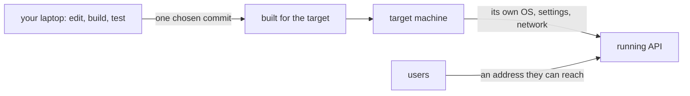

## Bạn cần biết trước

- [[foundation.l1.ssh-and-remote]] — bạn biết cách mở shell trên một máy khác, và một lệnh chạy ở đó thấy đường dẫn, quyền và biến môi trường của máy đó.
- [[management.l1.how-software-gets-made]] — bạn biết phát hành và vận hành là những bước riêng, đến sau build và test.

## Tình huống

API Đơn Hàng build được và test đều pass trên laptop của bạn. Một đồng đội xin một địa chỉ để nhân viên cửa hàng thử đặt đơn vào ngày mai. Tối nay laptop của bạn sẽ gập lại, `localhost` của nó chẳng có nghĩa gì trên máy người khác, và nhân viên sẽ không cài .NET để chạy bản build của bạn. Phải có gì đó lấy đúng phiên bản code này và giữ cho nó chạy trên một máy mà họ tới được. Bước đó gồm những gì, và vì sao "trên máy tôi chạy được" không chứng minh được rằng nó sẽ chạy ở đó?

## Khái niệm cốt lõi

- **deploy** — đưa một phiên bản code cụ thể, đã kiểm thử, chạy trên một máy khác máy đã viết ra nó, để người cần dùng tới được.
- máy đích — máy mà code được deploy lên, có hệ điều hành, chương trình đã cài, thiết lập và mạng của riêng nó.
- phiên bản — một trạng thái chính xác của code, thường là một commit, để ai cũng nói được code nào đang chạy.

## Cơ chế hoạt động

Viết code và chạy nó cho người khác dùng diễn ra ở những nơi khác nhau. Trên laptop, code chạy với bất cứ thứ gì tình cờ có ở đó: phiên bản .NET của bạn, hệ điều hành của bạn, các file của bạn, và những thiết lập bạn làm từ mấy tháng trước rồi quên mất. Một lần **deploy** lấy một phiên bản cụ thể, thường là một commit đã pass test, build nó cho một máy đích không hề có chút lịch sử nào như thế, rồi khởi động nó ở đó.

Ba thứ khác nhau trên máy đích, và thứ nào cũng có thể làm hỏng code vốn chạy ổn ở bàn bạn. Hệ điều hành có thể khác: code giả định đường dẫn kiểu Windows, hoặc một hệ thống file không phân biệt chữ hoa chữ thường, có thể hỏng trên Linux. Phần mềm đã cài có thể khác: một .NET phiên bản khác, hoặc một thư viện đơn giản là không có. Thiết lập và mạng cũng khác: database có địa chỉ khác, một key mà laptop bạn đã đặt thì bị thiếu, và người dùng tới chương trình qua những địa chỉ và port bạn chưa từng dùng.

Vậy nên "trên máy tôi chạy được" trả lời một câu hỏi hẹp hơn vẻ ngoài của nó. Nó nói code chạy được với hệ điều hành, phần mềm và thiết lập của laptop bạn. Deploy là chuyện code có chạy được với những thứ của máy đích không, và những người cần nó có tới được nó ở đó không. Deploy thành công khi phiên bản đã chọn đang chạy trên máy đích và trả lời người dùng, chứ không phải khi các file đã tới nơi.

## Trong hệ thống Đơn Hàng

Lab là một phiên bản nhỏ của điều này. Khi bạn chạy `scripts/up.sh`, nó không khởi động API từ editor của bạn. Nó build API từ source của repository, theo các bước trong `DonHang.Api/Dockerfile`, bằng bộ công cụ build .NET 10 trên Linux, bất kể laptop bạn chạy gì.

API đã build sau đó cũng chạy trên Linux, tách khỏi editor của bạn, cạnh database của lab là Postgres. Không gì bên ngoài lab tới thẳng được nó. Lối vào duy nhất là Caddy, thứ chuyển các request `/api/v1/*` sang API; trong bài này bạn dùng port HTTP thường của nó, `8080`.

API cũng lấy thiết lập từ lab, không phải từ laptop của bạn. `docker-compose.yml` đưa cho nó một connection string, thiết lập cho nó biết database ở đâu và đăng nhập thế nào, với địa chỉ `Host=db`; `db` là cái tên lab đặt cho database của nó, chỉ được biết đến trên mạng riêng của lab. Nó cũng đưa cho API một JWT signing key mà `scripts/dev-secrets.sh` đã ghi vào file `.env`; cả hai tới dưới dạng biến môi trường. `appsettings.json`, file thiết lập nằm trong code của API, không có cái nào. Khởi động API thẳng từ editor mà không có chúng, `Program.cs` sẽ dừng ngay lúc khởi động với "ConnectionStrings:Default is not set". Code vẫn thế; thiết lập xung quanh nó thì không, và vì vậy kết quả cũng không.

Một lần deploy thật là cùng ý tưởng đó trên một máy dành để chạy liên tục: một server vẫn bật khi laptop của bạn đã gập, với một địa chỉ mà nhân viên cửa hàng tới được.

## Người mới hay nghĩ rằng…

- **"Deploy chỉ là chép các file đã build sang một thư mục khác; nếu chúng chạy được ở đó thì deploy đã thành công."** → Thực ra một thư mục khác trên chính laptop của bạn vẫn có hệ điều hành, bản .NET đã cài và thiết lập của bạn, nên gần như chẳng kiểm tra được gì mới. Ngay cả trên một máy khác, file khởi động được vẫn chưa phải là deploy: chương trình phải tìm được database, có đủ các key, và người dùng phải tới được nó. Bạn sẽ nhận ra khi một bản chép "chạy ngon" lại chẳng trả lời ai, vì nó lắng nghe trên một địa chỉ chỉ máy đó tới được, hoặc dừng ngay ở lần gọi database đầu tiên.
- **"Một lần deploy chạy được thì những lần sau cũng sẽ chạy y như vậy."** → Thực ra máy đích vẫn tiếp tục thay đổi sau lần deploy: bản cập nhật được cài, đĩa đầy dần, thiết lập bị sửa tay, và phiên bản code tiếp theo cần một thứ mà bản trước không cần. Một lần deploy chạy được chỉ chứng minh máy đích đúng ở thời điểm đó. Bạn sẽ nhận ra khi đúng những bước đã chạy được tháng trước lại hỏng hôm nay, và không ai nói được trên máy đã đổi gì ở giữa.

## Thử ngay (3 phút)

Khi lab đang chạy (`scripts/up.sh` từ thư mục gốc của repository):

1. Mở `docker-compose.yml` và tìm phần `api`. Đọc các dòng `environment:` của nó.
2. Mở `DonHang.Api/appsettings.json` và tìm cùng các thiết lập đó.
3. Chạy `curl -s http://localhost:8080/api/v1/products` và để ý rằng nó trả lời.

Kết quả mong đợi: 1 — connection string với `Host=db`, `Jwt__SigningKey`, và một dòng thứ ba, `ASPNETCORE_ENVIRONMENT`, mà bài này không cần. 2 — các thiết lập khác, như logging và vài thiết lập JWT, nhưng không có connection string và không có signing key. 3 — một danh sách sản phẩm dạng JSON, được trả lời qua Caddy.

API trả lời được trong lab, nhưng sẽ dừng ngay lúc khởi động nếu bạn chạy nó từ editor mà không thiết lập thêm gì. Bạn sẽ phải cung cấp hai thiết lập nào, và vì sao trên laptop của bạn địa chỉ database không thể là `db`?

Gợi ý đáp án

Connection string và JWT signing key; `appsettings.json` không có cái nào, và lab cung cấp cả hai dưới dạng biến môi trường. Trên laptop của bạn địa chỉ không thể là `db`, vì cái tên đó chỉ được biết đến trên mạng riêng của lab; nó phải là một địa chỉ mà laptop bạn tới được. Code sẽ không đổi, chỉ thiết lập xung quanh nó đổi, và đó chính là thứ khác nhau giữa máy này với máy khác.

## Liên hệ

- [[foundation.l1.ssh-and-remote]] — cách bạn sẽ tới một máy đích không phải của mình.
- [[devops.l1.reverse-proxy-basics]] — vì sao API của lab chỉ tới được qua Caddy.
- [[devops.l1.why-not-deploy-by-hand]] — điều gì hỏng khi các bước deploy chỉ nằm trong đầu một người.

## Tóm tắt 5 dòng

1. Một lần **deploy** đưa một phiên bản code cụ thể, đã kiểm thử, chạy trên một máy khác máy đã viết ra nó.
2. Máy đích có hệ điều hành, phần mềm đã cài, thiết lập và mạng riêng, và thứ nào cũng có thể làm hỏng code đang chạy tốt.
3. "Trên máy tôi chạy được" chứng minh code chạy với cấu hình laptop của bạn, không phải với cấu hình của máy đích.
4. Lab build và chạy API trên Linux, tách khỏi editor của bạn, chỉ tới được qua Caddy.
5. Lab còn cung cấp địa chỉ database và signing key; thiếu chúng, cùng API đó dừng ngay lúc khởi động.
