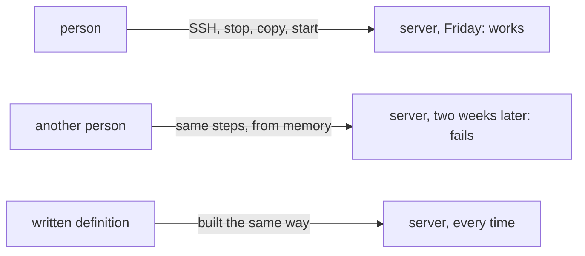

## Before you start

- [[devops.l1.reverse-proxy-and-tls]] — you know the lab runs the API behind Caddy, which holds the certificate and forwards `/api/v1/*` as plain HTTP, and that a deploy gets one tested version running on a target machine with its own software, settings and network.

## The situation

Your team's first real server is ready, and a teammate offers to deploy the API the quick way: open a remote shell on the server with SSH, as in the foundation lessons, stop the old program, copy the new build over, start it again. It works on Friday. Two weeks later a different teammate deploys the next version the same way, and the API stops at startup on a missing library that nobody remembers installing the first time. Nobody can say exactly what was done to the server on Friday, or in what order. If the code was not the problem, what was?

## Core concepts

- manual deploy — a deploy done by a person typing steps on the target machine, from memory or from notes.
- repeatable — done the same way every time, by following a written definition rather than a memory.
- definition of the target — a written list of everything the target machine needs: its operating system, installed software, files and settings.

## How it works

The diagram shows the same steps working on Friday and failing two weeks later, while a written definition gives the same result each time. A manual deploy has two weaknesses, and neither is about the code. The first is that the steps live in someone's head. Stop the old program, copy the files, start the new one: each time a person does it, it comes out slightly differently. A step is skipped, a command is typed with other options, a file is copied from the wrong folder. Nothing records what was actually done, so when something breaks, there is no list to compare against.

The second weakness is worse. A manual deploy has no fixed definition of what the target machine needs. Over months, people install a library here, change a setting there, and the server ends up in a state nobody wrote down. The deploy "works" because of that state, not because of anything written down. The next server, or the same server rebuilt, will not have it, and the same steps will fail there.

The fix is to write both down, in a form a program can follow: the list of everything the target needs, and the steps to build and start the code on it. Then the tenth deploy follows the same steps as the first, and a change to the target is a change to that written list, visible to everyone. The rest of this track closes the gap one piece at a time: Docker next, then how the API gets its settings, and in a later stage, deploys run by a program instead of a person.

## In the Đơn Hàng system

The lab already works this way. `scripts/up.sh` is its deploy, written down: it builds the Flutter app, then starts everything and waits until it is ready. You run the same script every time, so every learner's lab is built by the same steps.

The list of what the API's target needs is `DonHang.Api/Dockerfile`, the file you met earlier in this module. It names the .NET 10 build tools used to build the API. It also names the .NET 10 runtime that the API runs on: the part of .NET that runs a program after it has been built. It also installs one extra system library, `libgssapi-krb5-2`, with a comment explaining why: the comment says the database library probes for it at startup, and that without it the API logs an alarming but harmless error line. That is exactly the kind of detail a person deploying by hand would install once, on one server, and never write down.

The settings the API needs are written down too, in `docker-compose.yml`: the connection string, which tells the API where its database is, and the signing key it signs login tokens with, both arriving as environment variables. The next module, Docker, is about how the lab turns that `Dockerfile` into something that runs the same way on every machine. The lab still has one weakness from this lesson: you run `scripts/up.sh` by hand, from your own laptop. It fixes the missing steps and the missing list, but not the question of who runs it and from where; a later stage hands that to a program.

## Beginners often think…

- **"A manual deploy is fine as long as the same person always does it."** → Actually the same person does not do it the same way every time: they forget a step when tired, or skip one that "never mattered". And when that person is away, nobody else knows the steps. You notice this when the one person who knows how to deploy is on holiday, and a fix that is ready cannot go out.
- **"Once a deploy script exists, running it by hand is no different from an automated one."** → Actually a script run by hand still depends on who runs it, from which machine, with which files and settings around it. Two people running the same script from two laptops can deploy two different things. You notice this when a deploy includes a change that was never committed, because it was sitting on the laptop that ran the script.

## Try it (3 minutes)

From the repository root:

1. Open `scripts/up.sh` and list the steps it runs, in order.
2. Open `DonHang.Api/Dockerfile` and list what it says the API needs: which .NET build tools, which runtime, and which extra system library.
3. Imagine deploying the API to a fresh Linux server by hand, without these files. Write down the steps you would type.

Expected result: 1 — create the development settings file (`scripts/dev-secrets.sh`), build the Flutter app, start everything and wait, then print the addresses. 2 — the .NET 10 build tools, the .NET 10 runtime, and `libgssapi-krb5-2`. 3 — a list that has to name all of that and more, such as where the settings come from.

Which item from step 2 is most likely to be missing from your step 3 list, and what would the API do on a server without it?

Suggested answer

`libgssapi-krb5-2`. Nothing in the API's code mentions it; the lab installs it because the database library looks for it at startup. The `Dockerfile` comment says what happens without it: the API still runs, but logs a frightening "cannot open shared object" line that sends someone off to investigate a problem that is not there. A written definition keeps that detail; a memory of Friday's deploy does not.

## Connections

- [[devops.l1.what-is-deploy]] — why the target machine differs from your laptop in the first place.
- [[devops.l1.image-vs-container]] — how the lab turns the written definition into something that runs the same way everywhere.
- [[foundation.l1.ssh-and-remote]] — the SSH access that a manual deploy relies on.

## Five-line summary

1. A manual deploy keeps its steps in someone's head, so each deploy comes out slightly different, with no record of what was done.
2. It also has no written definition of what the target needs, so the target drifts into a state nobody wrote down.
3. Writing both the target's needs and the deploy steps down, for a program to follow, makes every deploy the same.
4. In the lab, `scripts/up.sh` is the written deploy, and `DonHang.Api/Dockerfile` lists what the API's target needs.
5. The Docker module shows how that `Dockerfile` becomes something that runs the same way on every machine.
