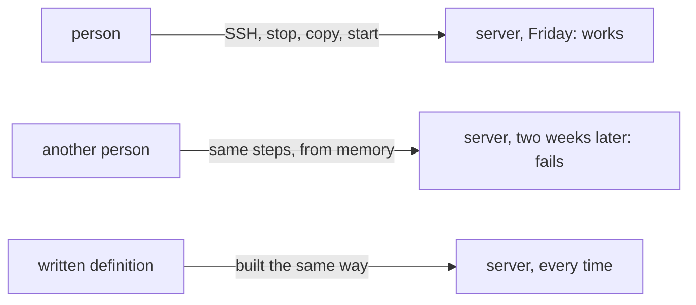

## Bạn cần biết trước

- [[devops.l1.reverse-proxy-and-tls]] — bạn biết lab chạy API sau Caddy, thứ giữ chứng chỉ và chuyển `/api/v1/*` dưới dạng HTTP thường, và một lần deploy đưa một phiên bản đã kiểm thử chạy trên máy đích có phần mềm, thiết lập và mạng riêng.

## Tình huống

Server thật đầu tiên của team đã sẵn sàng, và một đồng đội đề nghị deploy API theo cách nhanh: mở một shell từ xa trên server bằng SSH, như trong các bài nền tảng, dừng chương trình cũ, chép bản build mới lên, rồi khởi động lại. Thứ Sáu nó chạy được. Hai tuần sau, một đồng đội khác deploy phiên bản kế tiếp theo đúng cách đó, và API dừng ngay lúc khởi động vì thiếu một thư viện mà không ai nhớ đã cài ở lần đầu. Không ai nói được chính xác hôm thứ Sáu đã làm gì trên server, hay theo thứ tự nào. Nếu code không phải là vấn đề, thì vấn đề là gì?

## Khái niệm cốt lõi

- deploy bằng tay — một lần deploy do một người gõ các bước trên máy đích, theo trí nhớ hoặc theo ghi chú.
- lặp lại được — được làm y như nhau mỗi lần, bằng cách làm theo một định nghĩa viết ra thay vì trí nhớ.
- định nghĩa của máy đích — một danh sách viết ra mọi thứ máy đích cần: hệ điều hành, phần mềm đã cài, file và thiết lập.

## Cơ chế hoạt động

Sơ đồ cho thấy cùng các bước chạy được hôm thứ Sáu và hỏng hai tuần sau, trong khi một định nghĩa viết ra dựng server y như nhau mỗi lần. Deploy bằng tay có hai điểm yếu, và cả hai đều không nằm ở code. Điểm yếu thứ nhất là các bước nằm trong đầu một người. Dừng chương trình cũ, chép file, khởi động chương trình mới: mỗi lần một người làm, nó lại ra hơi khác. Một bước bị bỏ, một lệnh được gõ với tùy chọn khác, một file bị chép từ nhầm thư mục. Không có gì ghi lại việc thực sự đã làm, nên khi có gì đó hỏng, không có danh sách nào để so.

Điểm yếu thứ hai tệ hơn. Deploy bằng tay không có định nghĩa cố định về những gì máy đích cần. Qua nhiều tháng, người ta cài một thư viện chỗ này, đổi một thiết lập chỗ kia, và server rơi vào một trạng thái không ai ghi lại. Lần deploy "chạy được" là nhờ trạng thái đó, không phải nhờ bất cứ thứ gì được viết ra. Server tiếp theo, hoặc chính server đó khi dựng lại, sẽ không có trạng thái đó, và cùng các bước ấy sẽ hỏng ở đó.

Cách sửa là viết cả hai ra, ở dạng một chương trình làm theo được: danh sách mọi thứ máy đích cần, và các bước để build rồi khởi động code trên nó. Khi đó lần deploy thứ mười đi theo cùng các bước như lần đầu, và một thay đổi ở máy đích là một thay đổi trong danh sách viết ra đó, ai cũng thấy. Phần còn lại của track này lấp khoảng trống đó từng mảnh một: Docker trước, rồi cách API nhận thiết lập, và ở một giai đoạn sau, các lần deploy do một chương trình chạy thay vì một người.

## Trong hệ thống Đơn Hàng

Lab vốn đã làm theo cách này. `scripts/up.sh` là việc deploy của lab, được viết ra: nó build app Flutter, rồi khởi động mọi thứ và chờ tới khi sẵn sàng. Bạn chạy cùng một script mỗi lần, nên lab của mọi người học đều được dựng theo cùng các bước.

Danh sách những gì máy đích của API cần là `DonHang.Api/Dockerfile`, file bạn đã gặp trước đó trong module này. Nó ghi bộ công cụ build .NET 10 dùng để build API. Nó cũng ghi runtime .NET 10 mà API chạy trên đó: phần của .NET chạy một chương trình sau khi chương trình đã được build. Nó còn cài thêm một thư viện hệ thống, `libgssapi-krb5-2`, kèm một comment giải thích lý do: comment nói thư viện database dò tìm nó lúc khởi động, và thiếu nó thì API ghi ra một dòng lỗi đáng sợ nhưng vô hại. Đó đúng là kiểu chi tiết mà một người deploy bằng tay sẽ cài một lần, trên một server, rồi không bao giờ ghi lại.

Các thiết lập API cần cũng được viết ra, trong `docker-compose.yml`: connection string, cho API biết database của nó ở đâu, và signing key mà nó dùng để ký token đăng nhập, cả hai tới dưới dạng biến môi trường. Module tiếp theo, Docker, nói về cách lab biến `Dockerfile` đó thành thứ chạy y như nhau trên mọi máy. Lab vẫn còn một điểm yếu của bài này: bạn chạy `scripts/up.sh` bằng tay, từ laptop của mình. Nó sửa được chuyện thiếu các bước và thiếu danh sách, nhưng không sửa được câu hỏi ai chạy nó và chạy từ đâu; một giai đoạn sau sẽ giao việc đó cho một chương trình.

## Người mới hay nghĩ rằng…

- **"Deploy bằng tay cũng ổn miễn là luôn cùng một người làm."** → Thực ra cùng một người cũng không làm y như nhau mỗi lần: họ quên một bước khi mệt, hoặc bỏ qua một bước "chưa bao giờ quan trọng". Và khi người đó vắng mặt, không ai khác biết các bước. Bạn sẽ nhận ra khi người duy nhất biết cách deploy đang đi nghỉ, và một bản sửa đã sẵn sàng không thể đưa lên được.
- **"Khi đã có script deploy, chạy nó bằng tay cũng chẳng khác gì chạy tự động."** → Thực ra một script chạy bằng tay vẫn phụ thuộc vào ai chạy nó, từ máy nào, với những file và thiết lập nào xung quanh. Hai người chạy cùng một script từ hai laptop có thể deploy hai thứ khác nhau. Bạn sẽ nhận ra khi một lần deploy mang theo một thay đổi chưa bao giờ được commit, vì nó đang nằm trên chiếc laptop đã chạy script.

## Thử ngay (3 phút)

Từ thư mục gốc của repository:

1. Mở `scripts/up.sh` và liệt kê các bước nó chạy, theo thứ tự.
2. Mở `DonHang.Api/Dockerfile` và liệt kê những gì nó nói API cần: bộ công cụ build .NET nào, runtime nào, và thư viện hệ thống bổ sung nào.
3. Hình dung việc deploy API lên một server Linux mới tinh bằng tay, không có các file này. Viết ra các bước bạn sẽ gõ.

Kết quả mong đợi: 1 — tạo file thiết lập cho môi trường phát triển (`scripts/dev-secrets.sh`), build app Flutter, khởi động mọi thứ và chờ, rồi in ra các địa chỉ. 2 — bộ công cụ build .NET 10, runtime .NET 10, và `libgssapi-krb5-2`. 3 — một danh sách phải ghi đủ tất cả những thứ đó và hơn nữa, như thiết lập lấy từ đâu.

Mục nào ở bước 2 dễ bị thiếu nhất trong danh sách ở bước 3 của bạn, và trên một server thiếu nó thì API sẽ làm gì?

Gợi ý đáp án

`libgssapi-krb5-2`. Không có gì trong code của API nhắc tới nó; lab cài nó vì thư viện database tìm nó lúc khởi động. Comment trong `Dockerfile` nói điều gì xảy ra khi thiếu nó: API vẫn chạy, nhưng ghi ra một dòng "cannot open shared object" đáng sợ, khiến ai đó đi điều tra một vấn đề không hề tồn tại. Một định nghĩa viết ra giữ lại chi tiết đó; trí nhớ về lần deploy hôm thứ Sáu thì không.

## Liên hệ

- [[devops.l1.what-is-deploy]] — vì sao ngay từ đầu máy đích đã khác laptop của bạn.
- [[devops.l1.image-vs-container]] — cách lab biến định nghĩa viết ra thành thứ chạy y như nhau ở mọi nơi.
- [[foundation.l1.ssh-and-remote]] — quyền truy cập SSH mà deploy bằng tay dựa vào.

## Tóm tắt 5 dòng

1. Deploy bằng tay giữ các bước trong đầu một người, nên mỗi lần deploy ra hơi khác, và không có bản ghi nào về việc đã làm.
2. Nó cũng không có định nghĩa viết ra về những gì máy đích cần, nên máy đích trôi dần vào một trạng thái không ai ghi lại.
3. Viết cả nhu cầu của máy đích lẫn các bước deploy ra, cho một chương trình làm theo, khiến mọi lần deploy đều như nhau.
4. Trong lab, `scripts/up.sh` là việc deploy được viết ra, và `DonHang.Api/Dockerfile` liệt kê những gì máy đích của API cần.
5. Module Docker cho thấy `Dockerfile` đó trở thành thứ chạy y như nhau trên mọi máy ra sao.
