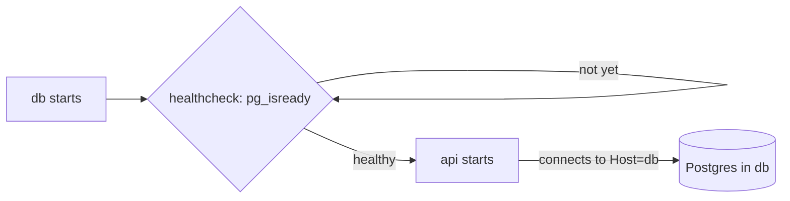

## Before you start

- [[devops.l1.multi-stage-builds]] — you know `DonHang.Api/Dockerfile` builds the API in one stage and runs it from the runtime image in another.
- [[devops.l1.docker-networks]] — you know containers on the `donhang` network reach each other by service name, and that `db` is `172.28.0.11` there.

## The situation

You have an image for the API and a `docker-compose.yml` that already runs the lab's own Linux container, the database and Caddy. The API needs Postgres the moment it starts: `Program.cs` applies the database migrations before it serves anything. If Compose starts the API while Postgres is still setting itself up, the API fails at its first step. And the connection string you use from your editor, `localhost:5432`, would point the API at itself, not at the database. How does the `api` service tell Compose what to build, which network to join, and what to wait for?

## Core concepts

- service — one entry under `services:` in `docker-compose.yml`, describing how to get an image and run a container from it.
- `depends_on` — a service's list of other services that Compose must start first; with `condition: service_healthy`, Compose waits until they report healthy.
- healthcheck — a command Docker runs inside a container at a set interval (every 3 seconds in the lab); while it succeeds, the container counts as healthy.

## How it works



A service in `docker-compose.yml` has the same few parts every time: where its image comes from, how the container is set up, which network it joins, and what it needs first. The `api` service reuses shapes the file already has for other services: a `build` section like the one for `lab`, the lab's own Linux container, the `donhang` network like the database's, and a `depends_on` naming what must run first.

A container can exist and still not be ready. When the `db` container starts, Postgres needs a few seconds before it accepts connections. A plain `depends_on` only makes Compose start `db` before `api`; it does not wait for Postgres to be ready. With `condition: service_healthy`, Compose waits until the `db` healthcheck succeeds, and only then starts `api`; in the lab, that healthcheck runs `pg_isready`, a Postgres tool that asks whether the server accepts connections.

Addresses work differently inside a container. `localhost` inside the API's container means that container itself, where nothing listens on port `5432`. The database is another container on the same network, so the API reaches it by its service name, `db`, which Docker's DNS server resolves.

## In the Đơn Hàng system

The `api` service:

```yaml file=docker-compose.yml tag=stage-1 lines=81-99
  # lesson: devops.l1.compose-for-the-api
  api:
    build:
      context: .
      dockerfile: DonHang.Api/Dockerfile
    image: donhang-api:stage-1
    container_name: donhang-api
    hostname: api
    environment:
      # lesson: devops.l1.config-and-env
      ConnectionStrings__Default: "Host=db;Database=donhang;Username=donhang;Password=${POSTGRES_PASSWORD}"
      Jwt__SigningKey: "${JWT_SIGNING_KEY}"
      ASPNETCORE_ENVIRONMENT: "Development"
    depends_on:
      db:
        condition: service_healthy
    networks:
      donhang:
        ipv4_address: 172.28.0.13
```

`build` tells Compose how to build the image from `DonHang.Api/Dockerfile`, with the repository root as the folder the `Dockerfile` copies from (`context: .`); Compose builds it when it does not have the image yet, or when asked to, as `scripts/up.sh` does with `--build`. `image` names the result `donhang-api:stage-1`, and `container_name` and `hostname` name the container. 

The connection string under `environment` says `Host=db`, the service name, not `localhost`; the next module looks at these settings in detail. `depends_on` waits for `db` to be healthy, and `networks` puts `api` on `donhang` at `172.28.0.13`.

The healthcheck it waits for belongs to the `db` service:

```yaml file=docker-compose.yml tag=stage-1 lines=75-79
    healthcheck:
      test: ["CMD-SHELL", "pg_isready -U donhang -d donhang"]
      interval: 3s
      timeout: 3s
      retries: 30
```

Every 3 seconds, Docker runs `pg_isready -U donhang -d donhang` inside the database container; `CMD-SHELL` means it runs the command through the container's shell. That command succeeds when the Postgres server accepts connections. Each check may take up to 3 seconds, and Docker allows up to 30 failures in a row before it marks the container unhealthy. Until the first success, `db` counts as starting, and `api` waits.

## Beginners often think…

- **"depends_on guarantees the dependency is fully ready, not just that its container has started."** → Actually a plain `depends_on` only orders the start; readiness needs a healthcheck on the dependency and `condition: service_healthy` on the dependent. The `api` service has no healthcheck of its own, so nothing waits for it to be ready. You notice this when a request sent a second after `api` starts gets `502` from Caddy, because Kestrel is not listening yet, and the same request a few seconds later succeeds.
- **"The API container should connect to the database using the same address a developer's own machine would use outside Docker."** → Actually `localhost:5432` works from your laptop only because the lab publishes that port there; inside the API's container, `localhost` is the container itself. On the `donhang` network, the database is `db`. You notice this when a connection string copied from your editor makes the API fail at startup with a connection refused error.

## Try it (3 minutes)

With the lab running, from the repository root, in a terminal on your own machine:

1. Run `docker compose ps` and find the `db` line.
2. Run `docker compose stop api db`, then `docker compose up -d api`, and read the lines Compose prints.
3. Right away, run `curl -s -o /dev/null -w "%{http_code}\n" http://localhost:8080/api/v1/products`; then wait five seconds and run it again.

Expected result: 1 — `donhang-db` shows `(healthy)` in its status. 2 — although you asked only for `api`, Compose starts `donhang-db` first, prints `Waiting` and then `Healthy` for it, and only then starts `donhang-api`. 3 — the first `curl` may print `502`; the second prints `200`.

In step 2, Compose waited for `db` before starting `api`. Why might the first request in step 3 still fail, and what would it take for Compose to wait for the API too?

<details><summary>Suggested answer</summary>

Compose waited for the database because `db` has a healthcheck and `api` depends on it with `condition: service_healthy`. Nothing waits for the API itself: `Started` only means the container is running, and Kestrel needs a moment, including the migration step, before it listens. For something to wait on the API, the `api` service would need its own healthcheck, and that something would need `condition: service_healthy` on `api`.

</details>

## Connections

- [[devops.l1.docker-networks]] — why `Host=db` resolves inside the network and `localhost` does not.
- [[devops.l1.config-and-env]] — the `environment` settings in the `api` service, and where their values come from.
- [[backend.l1.migrations]] — the migration step the API runs at startup, which needs the database ready.

## Five-line summary

1. The `api` service builds `DonHang.Api/Dockerfile`, joins the `donhang` network and depends on `db`.
2. A container can exist before the program inside it is ready to accept connections.
3. `condition: service_healthy` makes Compose wait for `db`'s healthcheck, `pg_isready`, to succeed before starting `api`.
4. Inside a container, `localhost` is that container itself, so the API reaches Postgres as `db`.
5. `api` has no healthcheck of its own, so a request right after it starts can still fail.
