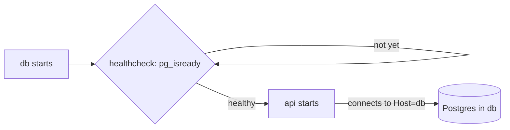

## Bạn cần biết trước

- [[devops.l1.multi-stage-builds]] — bạn biết `DonHang.Api/Dockerfile` build API ở một stage và chạy nó từ image runtime ở một stage khác.
- [[devops.l1.docker-networks]] — bạn biết các container trên mạng `donhang` tới được nhau bằng tên service, và `db` là `172.28.0.11` ở đó.

## Tình huống

Bạn đã có image cho API và một `docker-compose.yml` đang chạy container Linux riêng của lab, database và Caddy. API cần Postgres ngay khi khởi động: `Program.cs` áp dụng các migration của database trước khi phục vụ bất cứ gì. Nếu Compose khởi động API trong lúc Postgres vẫn đang tự chuẩn bị, API sẽ hỏng ngay ở bước đầu. Còn connection string bạn dùng từ editor, `localhost:5432`, sẽ trỏ API vào chính nó, không phải vào database. Service `api` nói cho Compose biết phải build gì, gia nhập mạng nào, và chờ gì bằng cách nào?

## Khái niệm cốt lõi

- service — một mục dưới `services:` trong `docker-compose.yml`, mô tả cách lấy một image và chạy một container từ nó.
- `depends_on` — danh sách các service khác mà Compose phải khởi động trước; với `condition: service_healthy`, Compose chờ tới khi chúng báo healthy.
- healthcheck — một lệnh Docker chạy bên trong container theo một khoảng thời gian định sẵn (mỗi 3 giây trong lab); khi lệnh còn thành công, container được tính là healthy.

## Cơ chế hoạt động



Một service trong `docker-compose.yml` lúc nào cũng có vài phần như nhau: image lấy từ đâu, container được thiết lập thế nào, gia nhập mạng nào, và cần gì trước. Service `api` dùng lại những khuôn mà file đã có cho các service khác: một phần `build` giống phần của `lab`, container Linux riêng của lab, mạng `donhang` giống database, và một `depends_on` ghi những gì phải chạy trước.

Một container có thể tồn tại mà vẫn chưa sẵn sàng. Khi container `db` khởi động, Postgres cần vài giây trước khi nhận kết nối. Một `depends_on` thông thường chỉ khiến Compose khởi động `db` trước `api`; nó không chờ Postgres sẵn sàng. Với `condition: service_healthy`, Compose chờ tới khi healthcheck của `db` thành công, rồi mới khởi động `api`; trong lab, healthcheck đó chạy `pg_isready`, một công cụ của Postgres hỏi xem server đã nhận kết nối chưa.

Địa chỉ bên trong container hoạt động khác. `localhost` bên trong container của API là chính container đó, nơi không có gì lắng nghe trên port `5432`. Database là một container khác trên cùng mạng, nên API tới nó bằng tên service, `db`, được DNS server của Docker phân giải.

## Trong hệ thống Đơn Hàng

Service `api`:

```yaml file=docker-compose.yml tag=stage-1 lines=81-99
  # lesson: devops.l1.compose-for-the-api
  api:
    build:
      context: .
      dockerfile: DonHang.Api/Dockerfile
    image: donhang-api:stage-1
    container_name: donhang-api
    hostname: api
    environment:
      # lesson: devops.l1.config-and-env
      ConnectionStrings__Default: "Host=db;Database=donhang;Username=donhang;Password=${POSTGRES_PASSWORD}"
      Jwt__SigningKey: "${JWT_SIGNING_KEY}"
      ASPNETCORE_ENVIRONMENT: "Development"
    depends_on:
      db:
        condition: service_healthy
    networks:
      donhang:
        ipv4_address: 172.28.0.13
```

`build` bảo Compose cách build image từ `DonHang.Api/Dockerfile`, với thư mục gốc của repository là thư mục mà `Dockerfile` chép file từ đó (`context: .`); Compose build nó khi chưa có image, hoặc khi được yêu cầu, như `scripts/up.sh` làm với `--build`. `image` đặt tên kết quả là `donhang-api:stage-1`, còn `container_name` và `hostname` đặt tên cho container.

Connection string dưới `environment` ghi `Host=db`, tên service, không phải `localhost`; module sau sẽ xem kỹ các thiết lập này. `depends_on` chờ `db` healthy, và `networks` đặt `api` lên `donhang` tại `172.28.0.13`.

Healthcheck mà nó chờ thuộc về service `db`:

```yaml file=docker-compose.yml tag=stage-1 lines=75-79
    healthcheck:
      test: ["CMD-SHELL", "pg_isready -U donhang -d donhang"]
      interval: 3s
      timeout: 3s
      retries: 30
```

Cứ mỗi 3 giây, Docker chạy `pg_isready -U donhang -d donhang` bên trong container database; `CMD-SHELL` nghĩa là lệnh được chạy qua shell của container. Lệnh đó thành công khi server Postgres nhận kết nối. Mỗi lần kiểm tra có thể mất tới 3 giây, và Docker cho phép tối đa 30 lần thất bại liên tiếp trước khi đánh dấu container là unhealthy. Cho tới lần thành công đầu tiên, `db` được tính là đang khởi động, và `api` chờ.

## Người mới hay nghĩ rằng…

- **"depends_on bảo đảm dependency đã sẵn sàng hoàn toàn, chứ không chỉ là container của nó đã khởi động."** → Thực ra một `depends_on` thông thường chỉ sắp thứ tự khởi động; muốn chờ sẵn sàng thì cần healthcheck ở dependency và `condition: service_healthy` ở bên phụ thuộc. Service `api` không có healthcheck riêng, nên không gì chờ nó sẵn sàng. Bạn sẽ nhận ra khi một request gửi một giây sau khi `api` khởi động nhận `502` từ Caddy, vì Kestrel chưa lắng nghe, còn cùng request đó vài giây sau thì thành công.
- **"Container của API nên kết nối database bằng đúng địa chỉ mà máy của lập trình viên dùng bên ngoài Docker."** → Thực ra `localhost:5432` chỉ dùng được từ laptop vì lab publish port đó ra đó; bên trong container của API, `localhost` là chính container đó. Trên mạng `donhang`, database là `db`. Bạn sẽ nhận ra khi một connection string chép từ editor khiến API hỏng ngay lúc khởi động với lỗi connection refused.

## Thử ngay (3 phút)

Khi lab đang chạy, từ thư mục gốc của repository, trong một terminal trên chính máy bạn:

1. Chạy `docker compose ps` và tìm dòng của `db`.
2. Chạy `docker compose stop api db`, rồi `docker compose up -d api`, và đọc các dòng Compose in ra.
3. Ngay lập tức, chạy `curl -s -o /dev/null -w "%{http_code}\n" http://localhost:8080/api/v1/products`; rồi chờ năm giây và chạy lại.

Kết quả mong đợi: 1 — `donhang-db` hiện `(healthy)` trong trạng thái. 2 — dù bạn chỉ yêu cầu `api`, Compose khởi động `donhang-db` trước, in `Waiting` rồi `Healthy` cho nó, và chỉ sau đó mới khởi động `donhang-api`. 3 — lần `curl` đầu có thể in `502`; lần thứ hai in `200`.

Ở bước 2, Compose đã chờ `db` trước khi khởi động `api`. Vì sao request đầu tiên ở bước 3 vẫn có thể thất bại, và cần gì để Compose chờ cả API?

<details><summary>Gợi ý đáp án</summary>

Compose chờ database vì `db` có healthcheck và `api` phụ thuộc nó với `condition: service_healthy`. Không gì chờ chính API: `Started` chỉ có nghĩa là container đang chạy, còn Kestrel cần một chút thời gian, kể cả bước migration, trước khi lắng nghe. Để một thứ gì đó chờ API, service `api` sẽ cần healthcheck riêng, và thứ đó cần `condition: service_healthy` trên `api`.

</details>

## Liên hệ

- [[devops.l1.docker-networks]] — vì sao `Host=db` phân giải được bên trong mạng còn `localhost` thì không.
- [[devops.l1.config-and-env]] — các thiết lập `environment` trong service `api`, và giá trị của chúng đến từ đâu.
- [[backend.l1.migrations]] — bước migration mà API chạy lúc khởi động, cần database sẵn sàng.

## Tóm tắt 5 dòng

1. Service `api` build `DonHang.Api/Dockerfile`, gia nhập mạng `donhang` và phụ thuộc `db`.
2. Một container có thể tồn tại trước khi chương trình bên trong nó sẵn sàng nhận kết nối.
3. `condition: service_healthy` khiến Compose chờ healthcheck của `db`, `pg_isready`, thành công rồi mới khởi động `api`.
4. Bên trong container, `localhost` là chính container đó, nên API tới Postgres qua `db`.
5. `api` không có healthcheck riêng, nên một request ngay sau khi nó khởi động vẫn có thể thất bại.
