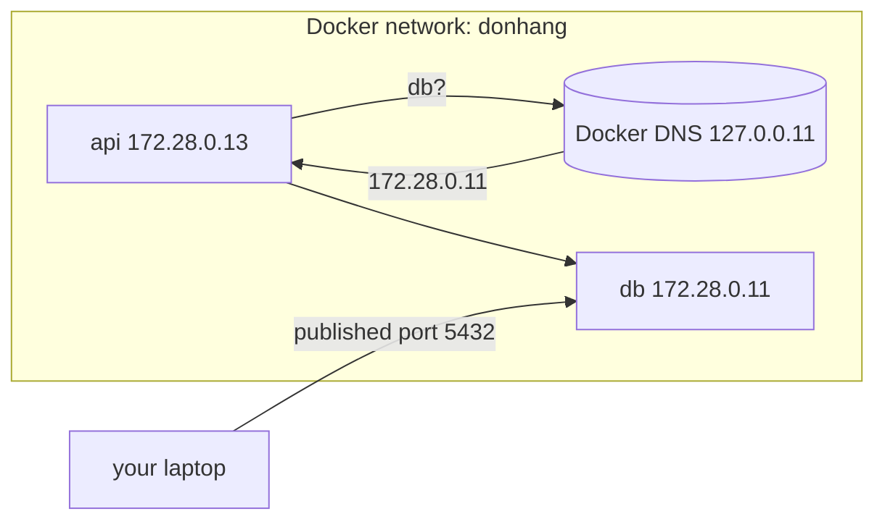

## Before you start

- [[devops.l1.volumes]] — you know how the lab's containers keep data, and that `docker-compose.yml` describes each service.
- [[foundation.l1.dns]] — you know a name is turned into an IP address by asking a DNS server, and that your machine is told which server to ask.

## The situation

The API's connection string says `Host=db`, and Caddy forwards to `api:8080`. Neither `db` nor `api` exists in any DNS server on the internet, and your own laptop cannot look them up either: `curl http://api:8080` from your machine fails. Yet inside the lab, those names work every time, and they always turn into the same addresses, `172.28.0.11` for `db` and `172.28.0.13` for `api`. Who answers those lookups, and why do they work only for the lab's own containers?

## Core concepts

- **Docker network** — a virtual network that Docker creates for containers; on a network you or Compose create, containers attached to it can reach each other by address and by service name.
- Docker's DNS server — a small DNS server Docker runs for each network you or Compose create, at `127.0.0.11` inside every container on it, answering with the addresses of the other containers.
- published port — a port on your own machine that Docker forwards into a container, such as `5432` for the database; the only way in from outside the network.

## How it works



A **Docker network** works like a small private network inside your machine. Docker gives each container attached to it an IP address from the network's range, and the containers can reach each other at those addresses, the same way machines on one office network can.

Addresses are hard to remember, so for a network you or Compose create, Docker also runs its own DNS server. Inside every container on such a network, the DNS server the container is told to ask is `127.0.0.11`, Docker's. When `api` looks up `db`, the question goes there, and Docker answers with the address of the container running the `db` service. This is the same lookup you saw in the DNS lesson; only the server answering it is different, and it knows only the containers on its own network.

Everything outside the network is left out. A container on another Docker network, such as the default one plain `docker run` uses, gets no answer for `db` and cannot reach its address either, just as two separate physical networks cannot talk without something connecting them. Your own machine is outside too: on Docker Desktop, the app that runs Docker on Windows and macOS and the one the lab uses, the addresses in the range are not reachable from it, and its DNS server has never heard of `db`. The way in from outside is a published port, which Docker forwards from a port on your machine into one container.

## In the Đơn Hàng system

The lab's network, declared at the bottom of `docker-compose.yml`:

```yaml file=docker-compose.yml tag=stage-1 lines=117-124
networks:
  donhang:
    name: donhang
    ipam:
      config:
        # Fixed addresses so that the DNS and networking lessons print the same
        # numbers on every machine.
        - subnet: 172.28.0.0/24
```

The network is called `donhang`. `ipam:` is where a network's address range is set, and this one is `172.28.0.0/24`: the addresses from `172.28.0.0` to `172.28.0.255` (the file calls such a range a subnet). Docker would normally pick each container's address from the range when the container starts, so the numbers could differ between runs and between machines. The lab fixes them instead, in each service, so that every lesson's networking output shows the same numbers on every machine. The `api` service, for example:

```yaml file=docker-compose.yml tag=stage-1 lines=97-99
    networks:
      donhang:
        ipv4_address: 172.28.0.13
```

`db` gets `172.28.0.11`, the lab box `172.28.0.12`, `api` `172.28.0.13` and `app-web`, the container serving the Flutter app, `172.28.0.14`. Caddy is started to share the lab box's place on the network, so it has no address of its own and listens on the lab box's ports. So when the API's connection string says `Host=db`, Docker's DNS server answers `172.28.0.11`, and when Caddy forwards to `api:8080`, it gets `172.28.0.13`. From your laptop, none of these names or addresses work; you reach the lab only through its published ports: `8080` and `8443` for Caddy, `8081` for the app, `5432` for the database, and `2222` for logging into the lab box.

## Beginners often think…

- **"Any two running containers on the same machine can always reach each other, network or not."** → Actually only containers attached to the same Docker network can reach each other directly, by address or by name; from anywhere else, the only way in is a published port. A container started on Docker's default network cannot even resolve `api`, let alone reach it. You notice this when a quick test container you started by hand fails with "Could not resolve host", while the lab's own containers use the same name without trouble.
- **"A container's IP address inside a Docker network is the same address other programs on the host machine would use to reach it."** → Actually `172.28.0.13` works only from inside the `donhang` network; programs on your machine reach the lab through published ports on `localhost`. You notice this when `curl http://172.28.0.13:8080` from your laptop just waits and times out, while `curl http://localhost:8080/api/v1/products` answers at once.

## Try it (3 minutes)

With the lab running, in a terminal on your own machine:

1. Run `docker exec donhang-lab getent hosts db api` to look up both names from inside the lab box.
2. Run `docker exec donhang-lab sh -c "cat /etc/resolv.conf"`, the file that tells programs in the container which DNS server to ask, and find the `nameserver` line.
3. Run `docker run --rm curlimages/curl -sS http://api:8080/api/v1/products/1`, which starts a throwaway container on Docker's default network. Then run the same command with `--network donhang` added right after `--rm`.

Expected result: 1 — a line starting `172.28.0.11` followed by `db`, and one starting `172.28.0.13` followed by `api` (each name may be printed twice, which is normal). 2 — `nameserver 127.0.0.11`. 3 — the first command fails, after a few seconds, with "Could not resolve host: api"; the second prints product 1 as JSON.

The two commands in step 3 ran the same image with the same address. Why did only the second one work?

<details><summary>Suggested answer</summary>

The first container was attached to Docker's default network, which has no Docker DNS server for the lab's service names, so the name `api` could not be looked up. `--network donhang` attached the second container to the lab's network, so its lookups went to that network's DNS server at `127.0.0.11`, which answered `172.28.0.13`, and the container could then reach the API at that address.

</details>

## Connections

- [[foundation.l1.dns]] — the lookup Docker's DNS server answers for the lab's names.
- [[devops.l1.reverse-proxy-basics]] — Caddy reaching `api:8080` over this network.
- [[devops.l1.compose-for-the-api]] — how the `api` service joins the network and waits for `db`.

## Five-line summary

1. Containers on the same **Docker network**, one you or Compose create, reach each other by address and service name.
2. Docker runs a DNS server at `127.0.0.11` inside each container, answering with the other containers' addresses.
3. The lab's `donhang` network fixes each service's address, so `db` is always `172.28.0.11` and `api` `172.28.0.13`.
4. A container on another network cannot resolve or reach them; neither can programs on your own machine.
5. From outside the network, you reach the lab only through published ports such as `8080` and `5432`.
