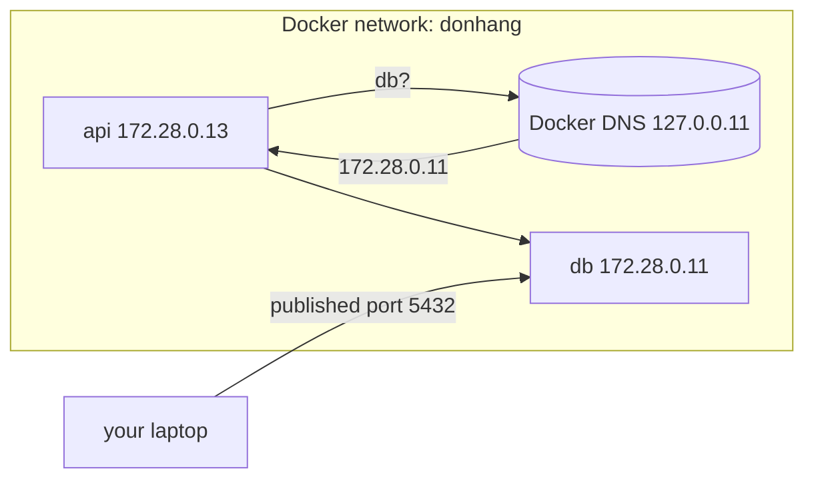

## Bạn cần biết trước

- [[devops.l1.volumes]] — bạn biết các container của lab giữ dữ liệu ra sao, và `docker-compose.yml` mô tả từng service.
- [[foundation.l1.dns]] — bạn biết một cái tên được biến thành địa chỉ IP bằng cách hỏi một DNS server, và máy bạn được cho biết phải hỏi server nào.

## Tình huống

Connection string của API ghi `Host=db`, và Caddy chuyển tiếp tới `api:8080`. Cả `db` lẫn `api` đều không tồn tại trong DNS server nào trên internet, và chính laptop của bạn cũng không tra được chúng: `curl http://api:8080` từ máy bạn thất bại. Vậy mà bên trong lab, những cái tên đó lần nào cũng chạy, và luôn ra cùng địa chỉ, `172.28.0.11` cho `db` và `172.28.0.13` cho `api`. Ai trả lời những lần tra cứu đó, và vì sao chúng chỉ chạy với các container của chính lab?

## Khái niệm cốt lõi

- **Docker network** — một mạng ảo Docker tạo ra cho các container; trên một mạng do bạn hoặc Compose tạo, các container gắn vào nó tới được nhau bằng địa chỉ và bằng tên service.
- DNS server của Docker — một DNS server nhỏ mà Docker chạy cho mỗi mạng do bạn hoặc Compose tạo, tại `127.0.0.11` bên trong mọi container trên mạng đó, trả lời bằng địa chỉ của các container khác.
- port đã publish — một port trên chính máy bạn mà Docker chuyển vào một container, như `5432` cho database; lối vào duy nhất từ bên ngoài mạng.

## Cơ chế hoạt động



Một **Docker network** hoạt động như một mạng riêng nhỏ bên trong máy bạn. Docker cấp cho mỗi container gắn vào nó một địa chỉ IP trong dải của mạng, và các container tới được nhau ở những địa chỉ đó, giống như các máy trên cùng một mạng văn phòng.

Địa chỉ thì khó nhớ, nên với một mạng do bạn hoặc Compose tạo, Docker còn chạy DNS server riêng. Bên trong mọi container trên mạng như vậy, DNS server mà container được bảo phải hỏi là `127.0.0.11`, của Docker. Khi `api` tra `db`, câu hỏi đi tới đó, và Docker trả lời bằng địa chỉ của container đang chạy service `db`. Đây cũng là việc tra cứu bạn đã thấy trong bài DNS; chỉ có server trả lời là khác, và nó chỉ biết các container trên mạng của chính nó.

Mọi thứ bên ngoài mạng đều bị để ngoài. Một container trên Docker network khác, như mạng mặc định mà `docker run` thông thường dùng, không nhận được câu trả lời nào cho `db` và cũng không tới được địa chỉ của nó, giống như hai mạng vật lý tách biệt không nói chuyện được nếu không có gì nối chúng. Chính máy bạn cũng ở ngoài: trên Docker Desktop, ứng dụng chạy Docker trên Windows và macOS và cũng là thứ lab dùng, các địa chỉ trong dải không tới được từ máy bạn, và DNS server của máy bạn chưa từng nghe tới `db`. Lối vào từ bên ngoài là một port đã publish, được Docker chuyển từ một port trên máy bạn vào một container.

## Trong hệ thống Đơn Hàng

Mạng của lab, khai báo ở cuối `docker-compose.yml`:

```yaml file=docker-compose.yml tag=stage-1 lines=117-124
networks:
  donhang:
    name: donhang
    ipam:
      config:
        # Fixed addresses so that the DNS and networking lessons print the same
        # numbers on every machine.
        - subnet: 172.28.0.0/24
```

Mạng tên là `donhang`. `ipam:` là nơi đặt dải địa chỉ của một mạng, và dải này là `172.28.0.0/24`: các địa chỉ từ `172.28.0.0` tới `172.28.0.255` (file gọi một dải như vậy là subnet). Bình thường Docker sẽ chọn địa chỉ cho mỗi container từ dải khi container khởi động, nên các con số có thể khác nhau giữa các lần chạy và giữa các máy. Lab thì cố định chúng, trong từng service, để output về mạng của mọi bài học hiện cùng con số trên mọi máy. Ví dụ service `api`:

```yaml file=docker-compose.yml tag=stage-1 lines=97-99
    networks:
      donhang:
        ipv4_address: 172.28.0.13
```

`db` nhận `172.28.0.11`, lab box `172.28.0.12`, `api` `172.28.0.13` và `app-web`, container phục vụ app Flutter, `172.28.0.14`. Caddy được khởi động để dùng chung chỗ của lab box trên mạng, nên nó không có địa chỉ riêng và lắng nghe trên các port của lab box. Vậy khi connection string của API ghi `Host=db`, DNS server của Docker trả lời `172.28.0.11`, và khi Caddy chuyển tiếp tới `api:8080`, nó nhận được `172.28.0.13`. Từ laptop của bạn, không cái tên hay địa chỉ nào trong số này dùng được; bạn chỉ tới được lab qua các port đã publish của nó: `8080` và `8443` cho Caddy, `8081` cho app, `5432` cho database, và `2222` để đăng nhập vào lab box.

## Người mới hay nghĩ rằng…

- **"Hai container bất kỳ đang chạy trên cùng một máy luôn tới được nhau, có mạng hay không cũng vậy."** → Thực ra chỉ các container gắn vào cùng một Docker network mới tới thẳng được nhau, bằng địa chỉ hay bằng tên; từ bất kỳ đâu khác, lối vào duy nhất là một port đã publish. Một container khởi động trên mạng mặc định của Docker thậm chí không phân giải được `api`, nói gì tới việc tới được nó. Bạn sẽ nhận ra khi một container thử nghiệm bạn tự khởi động báo lỗi "Could not resolve host", trong khi các container của lab dùng cùng cái tên đó mà không gặp vấn đề gì.
- **"Địa chỉ IP của một container bên trong Docker network cũng chính là địa chỉ mà các chương trình khác trên máy host dùng để tới nó."** → Thực ra `172.28.0.13` chỉ dùng được từ bên trong mạng `donhang`; các chương trình trên máy bạn tới lab qua các port đã publish trên `localhost`. Bạn sẽ nhận ra khi `curl http://172.28.0.13:8080` từ laptop cứ chờ rồi hết thời gian, trong khi `curl http://localhost:8080/api/v1/products` trả lời ngay.

## Thử ngay (3 phút)

Khi lab đang chạy, trong một terminal trên chính máy bạn:

1. Chạy `docker exec donhang-lab getent hosts db api` để tra cả hai cái tên từ bên trong lab box.
2. Chạy `docker exec donhang-lab sh -c "cat /etc/resolv.conf"`, file cho các chương trình trong container biết phải hỏi DNS server nào, và tìm dòng `nameserver`.
3. Chạy `docker run --rm curlimages/curl -sS http://api:8080/api/v1/products/1`, lệnh này khởi động một container dùng một lần trên mạng mặc định của Docker. Rồi chạy lại đúng lệnh đó nhưng thêm `--network donhang` ngay sau `--rm`.

Kết quả mong đợi: 1 — một dòng bắt đầu bằng `172.28.0.11` rồi tới `db`, và một dòng bắt đầu bằng `172.28.0.13` rồi tới `api` (mỗi cái tên có thể được in hai lần, điều đó là bình thường). 2 — `nameserver 127.0.0.11`. 3 — lệnh đầu thất bại sau vài giây với "Could not resolve host: api"; lệnh thứ hai in ra product 1 dạng JSON.

Hai lệnh ở bước 3 chạy cùng image với cùng địa chỉ. Vì sao chỉ lệnh thứ hai chạy được?

<details><summary>Gợi ý đáp án</summary>

Container đầu tiên được gắn vào mạng mặc định của Docker, nơi không có DNS server của Docker cho tên các service của lab, nên cái tên `api` không tra được. `--network donhang` gắn container thứ hai vào mạng của lab, nên các lần tra cứu của nó đi tới DNS server của mạng đó tại `127.0.0.11`, server trả lời `172.28.0.13`, và container khi đó tới được API ở địa chỉ ấy.

</details>

## Liên hệ

- [[foundation.l1.dns]] — việc tra cứu mà DNS server của Docker trả lời cho các cái tên của lab.
- [[devops.l1.reverse-proxy-basics]] — Caddy tới `api:8080` qua mạng này.
- [[devops.l1.compose-for-the-api]] — service `api` gia nhập mạng và chờ `db` ra sao.

## Tóm tắt 5 dòng

1. Các container trên cùng một **Docker network**, loại do bạn hoặc Compose tạo, tới được nhau bằng địa chỉ và tên service.
2. Trên một mạng như vậy, Docker chạy DNS server tại `127.0.0.11` bên trong mỗi container, trả lời bằng địa chỉ của các container khác.
3. Mạng `donhang` của lab cố định địa chỉ từng service, nên `db` luôn là `172.28.0.11` và `api` là `172.28.0.13`.
4. Một container trên mạng khác không phân giải hay tới được chúng; các chương trình trên máy bạn cũng vậy.
5. Từ bên ngoài mạng, bạn chỉ tới được lab qua các port đã publish như `8080` và `5432`.
