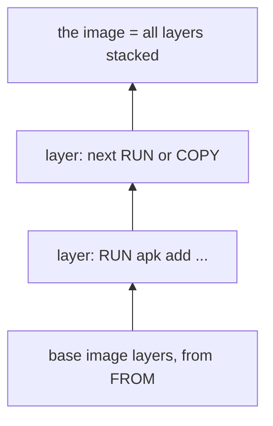

## Before you start

- [[devops.l1.image-vs-container]] — you know an image is a read-only template built from a `Dockerfile`, and that the lab box is a container running the image built from `lab/Dockerfile`.

## The situation

The first time you ran `scripts/up.sh`, building the lab box's image took a while: Docker fetched a base image and installed four tools. Every run since has finished that part in a moment, although the script asks for a build each time. Nothing was copied by hand, and the `Dockerfile` has not changed. Docker must be keeping the work somewhere and noticing when it can reuse it. What exactly does it keep, and how does it decide whether the work from last time is still good?

## Core concepts

- **image layer** — the set of file changes made by one `Dockerfile` instruction; an image is its layers stacked on top of each other, and Docker caches each layer separately.
- base image — the image named in `FROM`; its layers become the bottom of yours.
- build cache — the layers Docker kept from earlier builds, reused when the same step would produce the same result.

## How it works



A `Dockerfile` is a list of steps, and Docker runs them in order. `FROM` does not add anything of its own: it brings in the base image, which already is a stack of layers. Each `RUN` or `COPY` after it then adds one **image layer** on top: the files that step added, changed or removed, and nothing else. Some other instructions, such as `EXPOSE` or `ENV`, only record a setting in the image and add no files. The finished image is the whole stack, read from the bottom up, and a container sees it as one set of files.

Docker keeps each layer it builds. On the next build it walks the steps again, and for each one it asks whether it already has a layer made by exactly this instruction, on top of exactly the same layer below, with the same input files for a `COPY`. If so, it reuses that layer instead of running the step. At the first step where the answer is no, it runs the step for real, and from then on it runs every step after it too, because each of those now sits on a different layer below.

This is why the order of steps matters. Steps that rarely change belong near the top of the file, and steps that change often belong near the bottom, so a small change rebuilds only a little.

## In the Đơn Hàng system

`lab/Dockerfile`:

```dockerfile file=lab/Dockerfile tag=stage-0 lines=1-9
# The lab box: the LinuxServer OpenSSH server image plus the handful of
# command-line tools the stage-0 lessons use.
FROM lscr.io/linuxserver/openssh-server:version-10.3_p1-r1

RUN apk add --no-cache \
      openssl \
      git \
      postgresql17-client \
      procps
```

Two instructions build the lab box's image. `FROM lscr.io/linuxserver/openssh-server:version-10.3_p1-r1` brings in the base image's layers: a small Linux with an SSH server, already built and published. `RUN apk add --no-cache ...` then adds one layer on top, holding the four tools the lessons use. That is the only layer this file creates; everything below it came from the base image.

On a rebuild, the `FROM` line names the same base image, and the `RUN` line is the same text on top of the same layers, so Docker reuses the layer it already has and prints `CACHED` for that step. If you added `curl` to the `apk add` list, the `RUN` line would change: Docker would reuse the base image and run only that one step again. If you changed the version in `FROM`, every layer above it would be rebuilt, because the bottom of the stack would be different.

## Beginners often think…

- **"Every Dockerfile instruction runs again from scratch on every build, so layers don't actually save any time."** → Actually Docker reuses each layer whose instruction and inputs have not changed, and only runs the steps from the first real change onwards. You notice this when a rebuild of the lab box finishes in a moment and prints `CACHED` for the `apk add` step, instead of downloading the four tools again.
- **"A layer is just a comment describing what a Dockerfile does, with no effect on the built image."** → Actually a layer is real files: the `apk add` layer holds the installed tools and takes up space in the image. Remove the step and the tools are no longer in any container started from the new image. You notice this when `docker history` lists that step with a size of several megabytes.

## Try it (3 minutes)

With the lab running, from the repository root, in a terminal on your own machine:

1. Run `docker history donhang-lab:stage-0` and look at the top rows.
2. Run `docker compose build lab` and read the lines for the `apk add` step.

Expected result: 1 — the top row is the `RUN /bin/sh -c apk add --no-cache ...` step with a size of a little over 12 MB; the rows below it come from the base image, and some of them have a size of `0B`. 2 — the `[lab 2/2] RUN apk add ...` step is marked `CACHED` (in a terminal: `=> CACHED [lab 2/2] RUN apk add ...`), and the build finishes in a moment.

Suppose you added `curl` to the `apk add` list and built again. Which step would Docker reuse, which would it run, and why?

<details><summary>Suggested answer</summary>

It would reuse the base image from `FROM`, because that line and the image it names are unchanged. It would run the `RUN apk add ...` step again, because its text has changed, so no cached layer was made by exactly this instruction. The new layer would hold five tools instead of four. There are no steps after it, so nothing else would be rebuilt.

</details>

## Connections

- [[devops.l1.image-vs-container]] — the image these layers make up, and the containers started from it.
- [[devops.l1.dockerfile-for-dotnet]] — ordering the API's `Dockerfile` steps so that most rebuilds reuse the slow ones.
- [[devops.l1.volumes]] — data that lives outside the image's layers altogether.

## Five-line summary

1. `FROM` brings in a base image's layers, and each `RUN` or `COPY` adds one **image layer** on top.
2. An image is its layers stacked; a container sees them as one set of files.
3. Docker caches each layer and reuses it while the instruction, the layer below and any copied files are unchanged.
4. From the first changed step onwards, every step is run again, so rarely changing steps belong near the top.
5. `lab/Dockerfile` makes one layer of its own, `apk add`, on top of the base image's layers.
