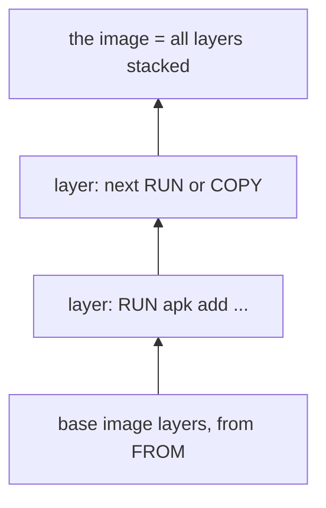

## Bạn cần biết trước

- [[devops.l1.image-vs-container]] — bạn biết image là khuôn mẫu chỉ đọc dựng từ một `Dockerfile`, và lab box là một container chạy image dựng từ `lab/Dockerfile`.

## Tình huống

Lần đầu bạn chạy `scripts/up.sh`, việc dựng image của lab box mất một lúc: Docker tải một base image về và cài bốn công cụ. Mọi lần chạy sau đó, phần này xong trong chớp mắt, dù lần nào script cũng yêu cầu build. Không có gì được chép bằng tay, và `Dockerfile` không hề thay đổi. Hẳn Docker đang giữ công sức đó ở đâu đó và nhận ra khi nào có thể dùng lại. Chính xác thì nó giữ cái gì, và làm sao nó quyết định công sức từ lần trước vẫn còn dùng được?

## Khái niệm cốt lõi

- **image layer** — tập các thay đổi file do một instruction trong `Dockerfile` tạo ra; một image là các layer của nó xếp chồng lên nhau, và Docker cache từng layer riêng.
- base image — image được ghi trong `FROM`; các layer của nó trở thành phần đáy của image bạn.
- build cache — các layer Docker giữ lại từ những lần build trước, được dùng lại khi cùng một bước sẽ cho ra cùng kết quả.

## Cơ chế hoạt động



Một `Dockerfile` là một danh sách các bước, và Docker chạy chúng theo thứ tự. `FROM` không tự thêm gì: nó mang vào base image, vốn đã là một chồng layer. Mỗi `RUN` (chạy một lệnh bên trong image đang được dựng) hay `COPY` (chép file từ repository của bạn vào đó) sau nó sẽ thêm một **image layer** lên trên: những file mà bước đó đã thêm, sửa hay xóa, và không gì khác. Vài instruction khác, như `EXPOSE` hay `ENV`, chỉ ghi lại một thiết lập trong image và không thêm file nào. Image hoàn chỉnh là cả chồng layer, đọc từ dưới lên, và một container thấy nó như một bộ file duy nhất.

Docker giữ lại mọi layer nó đã dựng. Ở lần build sau, nó đi lại các bước, và với mỗi bước nó hỏi xem mình đã có một layer tạo bởi đúng instruction này, nằm trên đúng layer bên dưới đó, với cùng các file đầu vào nếu là `COPY`, hay chưa. Nếu có, nó dùng lại layer đó thay vì chạy bước. Ở bước đầu tiên mà câu trả lời là không, nó chạy bước đó thật, và từ đó trở đi nó chạy mọi bước phía sau, vì mỗi bước giờ đều nằm trên một layer bên dưới khác đi.

Đó là lý do thứ tự các bước quan trọng. Các bước ít khi thay đổi nên nằm gần đầu file, còn các bước hay thay đổi nên nằm gần cuối, để một thay đổi nhỏ chỉ phải dựng lại ít.

## Trong hệ thống Đơn Hàng

`lab/Dockerfile`:

```dockerfile file=lab/Dockerfile tag=stage-0 lines=1-9
# The lab box: the LinuxServer OpenSSH server image plus the handful of
# command-line tools the stage-0 lessons use.
FROM lscr.io/linuxserver/openssh-server:version-10.3_p1-r1

RUN apk add --no-cache \
      openssl \
      git \
      postgresql17-client \
      procps
```

Hai instruction dựng nên image của lab box. `FROM lscr.io/linuxserver/openssh-server:version-10.3_p1-r1` mang vào các layer của base image: một Linux nhỏ được thiết lập để bạn đăng nhập vào từ máy mình, đã dựng và phát hành sẵn. `RUN apk add --no-cache ...` sau đó thêm một layer lên trên, chứa bốn công cụ mà các bài học dùng. `apk` là chương trình mà bản Linux này dùng để cài phần mềm; tùy chọn `--no-cache` của nó khiến `apk` không giữ lại các file nó đã tải về, như danh sách phần mềm nó có thể cài, trong image, và chẳng liên quan gì tới cache layer của Docker. Đó là layer duy nhất mà file này tạo ra; mọi thứ bên dưới đều đến từ base image.

Khi build lại, dòng `FROM` vẫn ghi cùng base image, và dòng `RUN` vẫn là cùng đoạn chữ nằm trên cùng các layer, nên Docker dùng lại layer nó đã có và in `CACHED` cho bước đó. Nếu bạn thêm `curl` vào danh sách `apk add`, dòng `RUN` sẽ thay đổi: Docker sẽ dùng lại base image và chỉ chạy lại đúng một bước đó. Nếu bạn đổi phiên bản trong `FROM`, mọi layer phía trên nó sẽ bị dựng lại, vì đáy của chồng layer đã khác.

## Người mới hay nghĩ rằng…

- **"Mọi instruction trong Dockerfile đều chạy lại từ đầu ở mỗi lần build, nên layer thật ra chẳng tiết kiệm được chút thời gian nào."** → Thực ra Docker dùng lại mọi layer có instruction và đầu vào không đổi, và chỉ chạy các bước từ chỗ thay đổi thật đầu tiên trở đi. Bạn sẽ nhận ra khi build lại lab box xong trong chớp mắt và in `CACHED` cho bước `apk add`, thay vì tải lại bốn công cụ.
- **"Layer chỉ là một dòng comment mô tả Dockerfile làm gì, chẳng ảnh hưởng gì tới image đã dựng."** → Thực ra layer là file thật: layer `apk add` chứa các công cụ đã cài và chiếm dung lượng trong image. Bỏ bước đó đi thì các công cụ không còn trong bất kỳ container nào khởi động từ image mới. Bạn sẽ nhận ra khi `docker history` liệt kê bước đó với kích thước hơn 12 MB một chút.

## Thử ngay (3 phút)

Khi lab đang chạy, từ thư mục gốc của repository, trong một terminal trên chính máy bạn:

1. Chạy `docker history donhang-lab:stage-0`, lệnh liệt kê các layer của image lab box từ trên xuống, và xem mấy dòng đầu.
2. Chạy `docker compose build lab`, lệnh dựng lại image của lab box, và đọc các dòng của bước `apk add`.

Kết quả mong đợi: 1 — dòng đầu tiên là bước `RUN /bin/sh -c apk add --no-cache ...` với kích thước hơn 12 MB một chút; các dòng bên dưới đến từ base image, và vài dòng có kích thước `0B`, vì chúng chỉ ghi lại một thiết lập, như `EXPOSE`. Docker hiện một bước `RUN` dưới dạng `/bin/sh -c` rồi tới lệnh, vì nó chạy lệnh qua shell của image (vài dòng từ base image có thêm chữ trước `/bin/sh -c`; bạn có thể bỏ qua). 2 — bước `[lab 2/2] RUN apk add ...` được đánh dấu `CACHED` (trong terminal: `=> CACHED [lab 2/2] RUN apk add ...`), và lần build xong trong chớp mắt.

Giả sử bạn thêm `curl` vào danh sách `apk add` rồi build lại. Docker sẽ dùng lại bước nào, chạy bước nào, và vì sao?

<details><summary>Gợi ý đáp án</summary>

Nó sẽ dùng lại base image từ `FROM`, vì dòng đó và image nó ghi không đổi. Nó sẽ chạy lại bước `RUN apk add ...`, vì đoạn chữ của bước đó đã thay đổi, nên không có layer đã cache nào được tạo bởi đúng instruction này. Layer mới sẽ chứa năm công cụ thay vì bốn. Không có bước nào sau nó, nên không gì khác bị dựng lại.

</details>

## Liên hệ

- [[devops.l1.image-vs-container]] — image mà các layer này tạo nên, và các container khởi động từ nó.
- [[devops.l1.dockerfile-for-dotnet]] — sắp xếp các bước trong `Dockerfile` của API để hầu hết các lần build lại dùng lại được những bước chậm.
- [[devops.l1.volumes]] — dữ liệu nằm hoàn toàn bên ngoài các layer của image.

## Tóm tắt 5 dòng

1. `FROM` mang vào các layer của một base image, và mỗi `RUN` hay `COPY` thêm một **image layer** lên trên.
2. Một image là các layer của nó xếp chồng; một container thấy chúng như một bộ file duy nhất.
3. Docker cache từng layer và dùng lại nó khi instruction, layer bên dưới và các file được chép không đổi.
4. Từ bước thay đổi đầu tiên trở đi, mọi bước đều chạy lại, nên các bước ít đổi nên nằm gần đầu.
5. `lab/Dockerfile` tự tạo một layer, `apk add`, trên các layer của base image.
