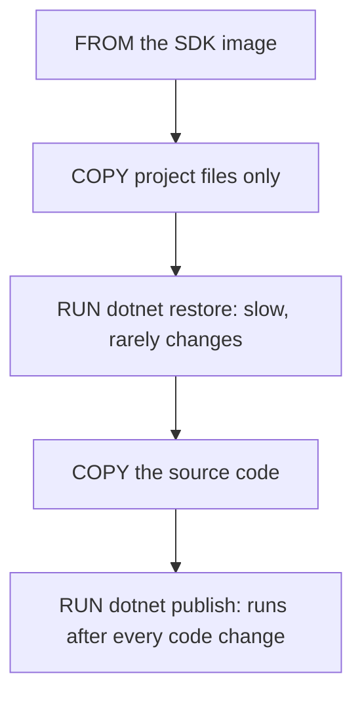

## Before you start

- [[devops.l1.docker-networks]] — you know how the lab's containers find each other, and that `scripts/up.sh` builds the API's image with Compose.
- [[backend.l1.hosting-and-program-cs]] — you know `DonHang.Api` is an ASP.NET Core app started from `Program.cs`, built from a `.csproj` project file.

## The situation

On your laptop the API builds because you installed the .NET SDK and ran `dotnet build` in your editor. The API's image is built somewhere else: inside Docker, on an empty Linux system where nothing is installed unless the `Dockerfile` brings it. You also change `Program.cs` or a controller many times a day, and each change needs a new image. If every rebuild had to download all of the API's libraries again, every one-line edit would wait for all of those downloads before the lab could restart. How does `DonHang.Api/Dockerfile` get the tools to build, and how does it avoid redoing the slow part?

## Core concepts

- .NET SDK — the tools that compile and publish .NET code; the image `mcr.microsoft.com/dotnet/sdk:10.0` contains them.
- `dotnet restore` — downloads the libraries, called packages, that the projects' `.csproj` files list, with versions taken from `Directory.Packages.props`.
- `dotnet publish` — compiles the projects and gathers the app and the packages it uses into one output folder, ready to run where the .NET runtime, the part of .NET that runs an already built program, is installed.

## How it works



Compiling .NET code needs the SDK, so a `Dockerfile` that builds the API starts `FROM` an image that has it. Microsoft publishes one for each .NET version. Running the finished app needs much less: only the runtime, the part of .NET that runs an already built program, not the compiler and the build tools. That difference matters, and the next lesson uses it; this one is about the building.

Inside the image, the `Dockerfile` runs the same commands a developer would type: `dotnet restore` to fetch the packages, then `dotnet publish` to compile and collect the output. Nothing about the result is special to Docker. Given the same SDK version and source files as on your own machine, the image runs the commands you would run there and builds the same app, and the output runs outside a container too. The difference is that the SDK comes from the image, not from whatever is installed on the machine, so every build that uses the same image uses the same SDK.

The order of the steps is chosen for Docker's build cache, from the layers lesson: Docker keeps each step's result and reuses it while that step and everything before it are unchanged, and once one step changes, every step after it runs again. Restoring packages is slow, but it depends only on the few files copied before it, which change rarely. Source code changes all the time. So the `Dockerfile` copies the project files first, restores, and only then copies the rest of the source. A change to `Program.cs` changes the later copy step, so the steps before it, including the slow restore, are reused from the cache.

## In the Đơn Hàng system

The build part of `DonHang.Api/Dockerfile`:

```dockerfile file=DonHang.Api/Dockerfile tag=stage-1 lines=5-17
FROM mcr.microsoft.com/dotnet/sdk:10.0 AS build
WORKDIR /src

COPY global.json Directory.Packages.props ./
COPY DonHang.Domain/DonHang.Domain.csproj DonHang.Domain/
COPY DonHang.Infrastructure/DonHang.Infrastructure.csproj DonHang.Infrastructure/
COPY DonHang.Api/DonHang.Api.csproj DonHang.Api/
RUN dotnet restore DonHang.Api/DonHang.Api.csproj

COPY DonHang.Domain/ DonHang.Domain/
COPY DonHang.Infrastructure/ DonHang.Infrastructure/
COPY DonHang.Api/ DonHang.Api/
RUN dotnet publish DonHang.Api/DonHang.Api.csproj -c Release -o /app --no-restore
```

The steps are the `FROM`, `COPY` and `RUN` instructions you met in the layers lesson. `FROM mcr.microsoft.com/dotnet/sdk:10.0 AS build` starts from the .NET 10 SDK image; `AS build` gives this part a name, which the rest of the file uses. `WORKDIR /src` makes `/src` the folder the next steps work in. The next four `COPY` lines bring in only what `dotnet restore` needs: `global.json`, which says which SDK versions the repository accepts, `Directory.Packages.props`, which holds every package version, and the three `.csproj` files. `RUN dotnet restore` then downloads the packages for the API and the two projects it uses.

Only after that do the three `COPY` lines bring in the source folders, and `RUN dotnet publish` compiles everything: `-c Release` builds the Release configuration, the optimised one meant for running rather than debugging, `-o /app` puts the output in `/app`, and `--no-restore` skips the restore that has already happened. The file continues below this with a second `FROM`, which the next lesson explains.

## Beginners often think…

- **"The same base image should run the app in production as compiled it, since that avoids extra steps."** → Actually the SDK image carries the compiler and build tools, which the running API never uses; the image to run it only needs the runtime and is much smaller. Building with one and running with another is a small change in the `Dockerfile`. You notice this when an image built and run on the SDK is several times the size it needs to be, and every new machine has to download all of it.
- **"Copying the whole source tree first, then restoring packages, is simpler and just as fast to rebuild."** → Actually any code change then changes the copy step, and every step after it, including the slow restore, runs again. Copying only the project files first keeps the restore cached until a package actually changes. You notice this when a one-line change to `Program.cs` makes the build download every package again.

## Try it (3 minutes)

With the lab running, from the repository root, in a terminal on your own machine:

1. Run `docker compose build api` and look at the `build` steps, numbered `1/11` to `11/11`.
2. Add an empty line at the end of `DonHang.Api/Program.cs` and run `docker compose build api` again.
3. Undo the change with `git checkout -- DonHang.Api/Program.cs` and run `docker compose build api` once more, so the lab's image matches the repository again.

Expected result: 1 — because `scripts/up.sh` already built this image when the lab started, steps `2/11` to `11/11` are marked `CACHED` (for example `=> CACHED [api build  7/11] RUN dotnet restore ...`); step 1, the `FROM` line, is reused but not marked `CACHED`. Steps of a second part, named `final`, also appear; the next lesson covers them. 2 — steps up to `9/11`, `COPY DonHang.Infrastructure/ ...`, are `CACHED`, including `dotnet restore`; step `10/11`, `COPY DonHang.Api/ DonHang.Api/`, and step `11/11`, `RUN dotnet publish ...`, run again. The last `final` step runs again too; the next lesson explains why. 3 — everything is `CACHED` again: Docker still keeps the results of the first build, and `Program.cs` now matches that build again, so they are reused.

Suppose that in step 2 you had added a package to `DonHang.Api/DonHang.Api.csproj` instead. Which steps would have run again, and why?

<details><summary>Suggested answer</summary>

Step `6/11`, `COPY DonHang.Api/DonHang.Api.csproj ...`, would copy a changed file, so it would miss the cache, and so would every step after it: `dotnet restore` would download packages again, the source would be copied again and `dotnet publish` would run. Steps 1 to 5 would still be reused. That is the price of a package change, and it is paid only when a project file really changes.

</details>

## Connections

- [[devops.l1.dockerfile-and-layers]] — the layer cache that this step order is designed for.
- [[devops.l1.multi-stage-builds]] — the second `FROM`, which runs the built API without the SDK.
- [[backend.l1.hosting-and-program-cs]] — the app that `dotnet publish` compiles.

## Five-line summary

1. Building the API needs the .NET SDK, so its `Dockerfile` starts `FROM mcr.microsoft.com/dotnet/sdk:10.0`.
2. Inside the image it runs what a developer would: `dotnet restore`, then `dotnet publish -c Release -o /app`.
3. The same SDK version and sources give the same app as on your own machine, and it runs outside a container too.
4. Project files are copied and restored before the source, so code changes reuse the slow restore from the cache.
5. A code-only change never makes `dotnet restore` run again; a change to a file copied before it does.
